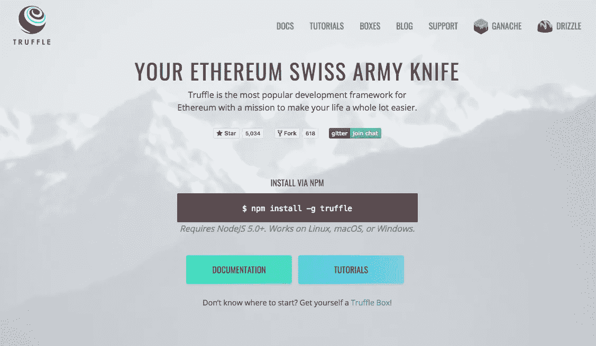
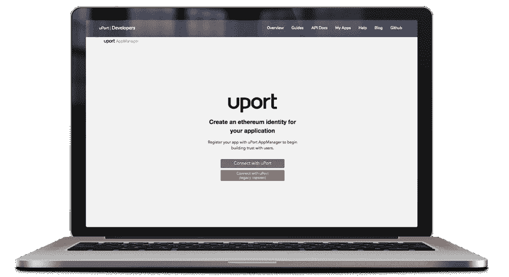

# 使用开发人员友好的 uPort/React Truffle Box 启动分散式身份应用程序

> 原文：<https://medium.com/hackernoon/launch-a-decentralized-identity-application-using-the-developer-friendly-uport-react-truffle-box-95d1ddf176ea>

## 完美的开发者区块链入口— uPort 和 Truffle。

那么…你听说过“区块链”这个东西，你想多学一点，是吗？我们不怪你——**这是有趣的东西！**

最近几个月，加密货币开始流行。分散式应用程序定期启动。Joe Lubin ( [ConsenSys](https://consensys.net/) )在美国消费者新闻与商业频道(*现在也经常*)谈论“区块链技术的前景”。

区块链…它有什么用？一切！

*好的……也许不是所有的事情*，但是任何需要**通用状态管理系统**的事情。这是相当多的事情。自从有记载的历史开始，人类就一直在记录历史。

人类是精明的国家守护者。我们正忙着给生命之树、人类基因组、甚至天空中的星星编目。

> 宇宙的“状态”无处不在，我们总是忙着试图以某种方式，用某种抽象来捕捉它。


今天我们将从最基本的开始。

测试区块链上分散身份验证的边界。

星际文件系统(IPFS)将在许多场合被提及。如果你不熟悉管理分散文件的新文件协议(如 HTTPS)，我们建议查看[该视频](https://www.youtube.com/watch?v=jONZtXMu03w)和[网站以获得简要概述](https://ipfs.io/#how)。

It’s Siraj Raval — introducing the interplanetary file system.

使用以太坊区块链和去中心化文件存储(IPFS)系统有什么可能？让我们来了解一下。我们现在要部署一个简单的分散式身份应用程序。

这怎么可能？区块链和分权制不是很难吗？

[松露以太坊瑞士军刀](http://truffleframework.com/)是一把***对以太坊开发者来说必须有***。 ***认识区块链。*成为区块链。**



无论你是初级的 Javascript 开发人员还是经验丰富的 Solidity 开发人员，Truffle 都增加了开发人员的工作流程。

从[便携式实度调试器](http://truffleframework.com/blog/announcing-full-portable-solidity-debugger)到现成的[样板代码“松露盒子”](http://truffleframework.com/boxes/)，松露套件包含一个美味的“好东西”盒子，适合各种以太坊情况。


A box of “goodies” — [http://truffleframework.com/boxes/](http://truffleframework.com/boxes/)

# 我们正在做的事情—启动一个演示应用程序

**首先，我们从基础开始**。

两者，即 **uPort** 和 **Truffle** ，都是 [**ConsenSys**](https://consensys.net/) 的代言人，坚定地致力于创建一个简单易用的分散式基础设施。

[Truffle](http://truffleframework.com/) 专注于为开发人员/工程师提供必要的工具(可移植的 solidity 调试器)和资源(样板文件),以 10 倍于构建者的快乐和生产力(*我们爱你们！*)。

[uPort](https://www.uport.me/) 是以太坊的去中心化身份平台，提供了一系列加密原语和随时可部署的 IdentityManager 和代理智能合约。

除了以太坊身份，uPort 还提供**分散身份文件(DIDs)** 功能使用行星间文件系统(IPFS)。

此外，我们还有一个非常漂亮的交易加油站，称为 **Sensui** ，可以增强您的区块链交易请求，但更多信息请见另一篇文章。

关注 [ConsenSys](https://twitter.com/consensys) 、 [Truffle](https://twitter.com/trufflesuite) 和 [uPort](https://twitter.com/uport_me) 获取最新开发者消息！

we like to get #meshy here at uPort — [check out our job postings](https://www.uport.me/about/).

> 是时候向世界释放“分散的一切”了！


# 释放您的区块链潜力

CLI 命令很神奇。

对于🖥️代码向导和🍄区块链德鲁伊，你会喜欢的！

Rect/uPort Truffle Box Tutorial

还有，人群中所有的 React 开发者，你可以想到'*松露拆箱*'有点像' [create-react-app](https://github.com/facebook/create-react-app) '，但 wayyy 更好，**因为……****。**

**

*[http://truffleframework.com/](http://truffleframework.com/)*

****为什么松露拆箱比创建-反应-app 好？****

*在…期间...而不是一个单一的样板(*和它甚至没有区块链....pfff* )我们可以轻松访问所有的松露盒子——只需一个简单的 CLI 命令。*

*`truffle unbox react-uport`*

**

> ***“搞定了。**我们可以回家了！”—区块链*

*哈哈，开个玩笑——我们有工作要做！*

*块菌盒仍处于早期阶段。*也就是说，他们目前有一堆很棒的盒子，尽管…**。但是 uPort 预测在接下来的几个月和几年里，块菌盒子将会变得丰富而美味。只需几个简单的 CLI 命令，您就可以获得越来越多的普通代码示例和演示应用程序。**

***甚至可能是 uPort 的一个新的松露盒……也许*🤔我们拭目以待！**

# **块菌/uPort 动力包**

**通过这一个简单的命令，我们节省了大量时间。最好把时间花在精心设计解决方案上，而不是摆弄配置。为松露鼓掌——赐予我们生命中最珍贵的东西...**时间到了！** *对于更多的区块链来说，那就是——拜占庭式的军营冲锋*！**

********

## **一个简单的演示。仅此而已。**

**`react-upport`框只是为了演示在一个分散的应用程序中管理数据的基础，使用 Redux 进行浏览器状态管理，使用 uPort 进行分散的身份验证。**

**对于像你一样的开发者来说，它应该会给你带来灵感。**

**如果您刚刚开始学习 React 或尝试分散式解决方案，这是一个机会，可以看到分散式应用程序的原始构造。**

**举个不平凡的例子，看看 [**胶子项目**](https://github.com/gluon-project) **。****

**Gluon 是 Simonas (uPort 首席开发人员)开发的一个应用程序，用于交换令牌、向 IPFS 发布媒体和管理分散的联系人列表(保存在浏览器中)。**

**本质上，胶子是建立在分散解决方案之上的许多不同用例的基础，如以太坊、uPort、IPFS 和 Infura。如果你想回顾非平凡的代码，uPort 建议从 Gluon 代码库开始。**

**胶子代码库的一个潜在的(*和有趣的*)用例是启动一个去中心化的社交网络。一个社交网络，其中的代币可以代表喜欢、投票、奖励等。“社交代币”可以存储在公共区块链上，从而减少对集中式服务的需求，以促进和维护在线身份关系。**

****

**[https://github.com/gluon-project/gluon-rxp](https://github.com/gluon-project/gluon-rxp)**

****

**“Use the Open Source code Luke! “ — Yoda**

**在我们开始建立**去中心化的社交网络之前，**让我们从一些更容易管理的事情开始**。****

****一个最小可行产品(MVP)仪表板**，分散登录以显示自主身份名称、电子邮件、电话和国家。**

**那是可信的和可实现的，对吧！**

****

# **从基础开始**

## **理解首要原则——分散解决方案**

**在尝试构建复杂的分散式应用程序之前，重要的是我们首先要理解基础知识。Truffle Boxes 非常棒，因为我们现在就可以快速开始使用区块链解决方案的构建模块……就像现在一样。就在此刻——不要等待。**

****少配置，多建设。****

## **管理复杂性**

**对于一个非平凡的分散应用程序，可能需要更多的解耦和模块化代码，但目前我们并不关心扩展`react-uport` Truffle Box 代码库。**

**我们只想将“状态”从智能手机/以太坊/IPFS 传递到浏览器。**

## **复杂的例子**

**对反应式 DApp 配置和高级智能合约部署集成感兴趣吗？请务必也检查以下其他松露盒样板代码列表。**

*   **[http://truffleframework.com/boxes/drizzle](http://truffleframework.com/boxes/drizzle)**
*   **[http://truffleframework.com/boxes/status](http://truffleframework.com/boxes/status)**
*   **[http://truffleframework.com/boxes/ens-bid-truffle-box](http://truffleframework.com/boxes/ens-bid-truffle-box)**

# **探索代码—重要的文件/文件夹**

**让我们打开我们最喜欢的代码编辑器，好吗？**

**我们将开始探索只被称为`react-uport`的[松露盒](http://truffleframework.com/boxes/)**

**样板代码演示了登录到一个分散的应用程序，在 Redux 中存储数据，最后将`props`传递回 DOM。**

**例如将数据传递到配置文件和仪表板组件中。**

****

**[http://truffleframework.com/boxes/react-uport](http://truffleframework.com/boxes/react-uport)**

> **除了 Webpack 和 React 之外，这个盒子还增加了:react-router、redux 和 redux-auth-wrapper，用于由 UPort 支持的认证。UPort 最简单的入门方式。**

**换句话说，我们正在部署简单的 React 应用程序，有几个基本组件、几个外部依赖项和 Webpack dev 服务器要处理🔥热重装🔥**

**像你这样的代码抛送人员需要开始做的一切。**

****yeehaw****

****

# **完美的开始样板**

## **模块化解决方案——借助 Truffle 拆箱**

**通过使用`truffle unbox react-uport` CLI 命令，一个现成的 uPort/React/Redux 样板代码库将会显现出来。**

****魔法！****

***这个“反应输出”松露盒到底是做什么的？***

# **身份分散的区块链应用**

**准备好开始构建 uPort 分散式应用程序了吗？**

*****uPort React 仪表盘演示*** 展示了一个仪表盘/个人资料登录系统。任何人(*拥有 uPort 注册身份*)只要通过 uPort 智能手机应用程序扫描二维码，就可以在我们插入 DApp 签名密钥后登录浏览器应用程序(*)。***

****

**让我们快速回顾一下我们将使用的技术。**

**当然，我们需要利用几个 uPort SDKs 和浏览器应用程序。但是，由于这是一个浏览器应用程序，我们还将在应用程序中使用 React、Redux 和 Redux Router 来帮助管理浏览器 DOM 状态。**

****应用****

1.  **[升级应用管理器](https://appmanager.uport.me/)**
2.  **[安卓智能手机应用](https://play.google.com/store/apps/details?id=com.uportMobile&hl=en) n**
3.  **[IOS 智能手机应用](https://itunes.apple.com/us/app/uport-id/id1123434510?mt=8)**

****Javascript 库****

1.  **[uport-connect](https://github.com/uport-project/uport-connect) |浏览器应用**
2.  **[uport-js](https://github.com/uport-project/uport-js) |服务器端应用**
3.  **[做出反应](https://reactjs.org/)**
4.  **[redux](https://redux.js.org/)**
5.  **[反应路由器](https://github.com/ReactTraining/react-router)**

# **创建新的分散式应用程序**

**要创建一个新的分散式应用程序，我们必须首先创建/注册一个分散式身份。**

**通过 uPort 的 Smartphone SDKs 或通过`uport-cli-client`使用智能手机应用程序，很容易创建一个新的分散身份。**

**简而言之，只需从[谷歌 Play 商店](https://play.google.com/store/apps/details?id=com.uportMobile&hl=en)或[苹果应用商店](https://itunes.apple.com/us/app/uport-id/id1123434510?mt=8)下载 uPort 智能手机应用程序，即可创建一个新的分散身份。**

**一旦您创建了一个新的分散身份，请访问 [uPort AppManager](https://appmanager.uport.me/) 来注册一个新的分散应用程序。**

****

**Registered Decentralized Application in the uPort AppManager**

**创建新的分散式应用程序的过程相对简单。大多数复杂的部分在部署过程中和区块链中被抽象出来。**

**你所要担心的就是扫描二维码和上传图片。**

1.  **使用 uPort 智能手机应用程序登录**
2.  **使用 uPort 的 AppManager 创建一个新的 DApp**
3.  **配置分散的应用程序设置**
4.  **通过签署私人事务保存 DApp 配置**
5.  **将样板代码复制/粘贴到 uPort 项目中**

# **登录到 AppManager 分散式应用程序**

**在我们开始创建新的应用程序之前，我们必须首先登录 uPort 的 AppManager，以便我们能够从负责管理我们今天创建的新应用程序的身份发送请求。**

****这一切都非常非常集中和超级元…****

**登录这里=> [uPort 应用管理器](https://appmanager.uport.me/)**

****

# **一个新的分散式应用程序**

**要创建一个新的**分散式应用程序**，我们必须首先在 uPort AppManager 中使用一个身份(*分散式以太身份*)来分派一个请求。**

**要开始派遣流程，请点击屏幕底部的“创建应用程序”，这是一个蓝色的按钮，你不会错过的。**

****

**Click Button. Create ÐApp. Decentralize all the things!**

**启动新应用程序的派单流程后，首先会在浏览器中显示一个二维码。**

**使用 uPort 智能手机应用程序扫描二维码。**

****

**使用注册的分散身份扫描 AppManager 二维码后，uPort smartphone 应用程序中将出现一个请求。**

**该请求要求您继续(或取消)使用您的个人身份创建新应用程序的交易。**

**我们建议按下**继续**按钮，但是你也可以选择*取消*按钮…但是那会让我们难过😞**

************

**Login. Create a DApp. Wait for Blockchain confirmations *ugghgh***

**点击确认，交易请求将被发送到以太坊区块链和 IPFS——谢谢 Infura！**

**在预期的 20-40 秒等待时间(*这是区块链，这很正常*)之后，一个新创建的分散式应用程序将在 uPort AppManager 中可用。**

****应用程序已创建！庆祝的时间到了🎉****

****

**⚠️🚨**警告**🚨⚠️**

> **您必须保存签名密钥以保留此身份的所有权**

**⚠️🚨**警告**🚨⚠️**

**保存 DApp 签名密钥— ***非常重要。*****

# **让我们开始构建**应用****

**你已经发出了`truffle-unbox`命令！显示出`react-uport`盒子的存在。**干得好！**您还推出了新的分散式身份和应用程序。那也很酷😊**

***虽然*……
我们必须继续探索`react-uport` 松露盒并插入我们新的**应用签名密钥****

**由于`react-uport` Truffle Box 是一个标准的 Javascript 堆栈:包括几个模块依赖项、一个 Webpack 构建过程(*和开发服务器*)加上 truffle-config.js 和 truffle.js 文件……该项目总共包含 5 个独立的配置文件。**

**每一个都控制着分散应用程序的各种构建过程。**

# **探索 React 应用程序**

****src** 文件夹包含 React/Redux 应用程序。**

**要使用 uPort 的分散式身份平台启动新的分散式应用程序，我们必须更改以下文件:**

## **重要文件位置**

*   **src/util/连接器. js**
*   **src/user/ui/log in button/log in button actions . js**
*   **src/用户/布局/概要文件/概要文件. js**
*   **src/layouts/dashboard/dashboard . js**

****

****让我们直接进入应用程序的核心。**我们将编辑上述文件，以便在样板文件中包含分散技术。
***我们开始吧？*****

1.  **添加 DApp 签名密钥和凭据**
2.  **请求特定的证明信息**
3.  **身份配置文件**
4.  **应用仪表板**

# **连接器— DApp 凭据**

## **src/util/connectors . js-添加 DApp 签名密钥和凭证**

**`connectors.js`要正常工作，需要将从 uPort AppManager 获得的凭证添加到 uPort Connect 模块对象中。**

## **原始文件**

```
**import { Connect } from 'uport-connect'
export let uport = new Connect('TruffleBox')
export const web3 = uport.getWeb3()**
```

## **更新档**

```
**import { Connect, SimpleSigner } from 'uport-connect'
export let uport = new Connect('React Uport Truffle Boilerplate', {
  clientId: '2ohdRCCeNpUpJdPNtggqmSEaxnYmBUuJVkB',
  network: 'rinkeby',
  signer: SimpleSigner('SIGNING KEY')
})
export const web3 = uport.getWeb3()**
```

****警告:**在浏览器中包含简单签名者(“签名密钥”)仅用于演示目的。不要在**生产**应用程序中包含签名密钥。**

*****你们所有的基地都是属于我们的，如果你们愿意的话！！！*****

****

**一个坏演员将会出现，偷走你的签名密钥，伪装成你并欺骗你的用户使用一个分散的应用程序，伪装成你！**

**然而，出于演示的目的，这一切都很好。**

****

# **登录按钮操作**

## **src/user/ui/log in button/log in button actions . js**

## **原始文件—第 16 行**

```
**uport.requestCredentials().then((credentials) => {
...
....uport.requestCredentials({
    requested: ['name', 'email', 'phone', 'country']
  }).then((credentials) => {
...
....**
```

****

# **轮廓**

## **src/用户/布局/概要文件/概要文件. js**

## **原始文件—第 17 行**

```
**<p>
  <strong>Name</strong><br />
  {this.props.authData.name}
</p>**
```

## **更新档**

```
**<p>
  <strong>Name</strong><br />
  {this.props.authData.name}
</p><p>
  <strong>Email</strong><br />
  {this.props.authData.email}
</p><p>
  <strong>Phone</strong><br />
  {this.props.authData.phone}
</p><p>
  <strong>Country</strong><br />
  {this.props.authData.country}
</p>**
```

****

# **仪表板道具**

## **src/layouts/dashboard/dashboard . js**

**仪表板路由( **Redux Router** )从浏览器状态管理( **Redux** )传递道具，其中包括来自通用状态管理(**以太坊/IPFS** )的身份数据。**

****你想挑战吗？****

**现在，您已经从分布式身份文档(DID)中获得了一个证明数据……您认为可以为分布式网络生成一个证明吗？**

 **[## 上传文件

### 与 uPort 进行前端交互的主要对象。ConnectCore 排除了 Connect for a…中的一些功能

developer.uport.me](https://developer.uport.me/apidocs.html#ConnectCore+attestCredentials)** 

****证明国书。**将用户的私人数据存储在手机中，并在未来某个时间或从另一个分散的应用程序请求信息。**

****

**这是一个国家的大网:*身份= >区块链= >浏览器= > DApp***

**换句话说，当一个身份(dapp 用户)向一个分散的应用程序进行身份验证(*发送私有数据*)时，该信息被临时存储在浏览器中。这只是暂时的。页面刷新清除仅存储在浏览器 DOM 中的认证信息。**

**要持久化一个经过身份验证的分散式会话，您可以使用 LocalStorage 或一个像 RxJS 这样的存储库(带有🤗流)来管理数据。**

**通过在浏览器的本地存储中保存状态和/或使用 ServiceWorkers 获取数据，即使在页面刷新后，仍然可以访问分散的认证验证信息。**

**例如，如果你有一个网站，它不是一个单页面应用程序，你可能一次从一个后端服务器获取一个页面(*或者使用异步魔法*)，并且需要保持将 DOM 状态从一个 HTML 文档传递到下一个文档的能力。**

**LocalStorage 是你的朋友。**

# **智能合同—只是一种选择**

**w 不要使用 Truffle 轻松编译和部署智能合约的能力，但是文件夹结构很到位。换句话说，如果您想尝试 uPort 和智能合约部署，您完全可以！**

**然而，对于这个项目，我们不必担心合同和迁移文件夹，因为它不在当前项目的**范围**内。**

**我们不建议删除这些文件(供将来参考)，但如果你觉得需要保持文件夹结构尽可能少，我们完全理解。**

*   **/src/contracts <= Solidity ready to be compiled**
*   **/src/migrations <= Smart Contract deployment settings**

**The truffle.js and truffle-config.js files control the build and deployment process of Ethereum Smart Contracts. However, since we’re not reviewing smart contract development in this tutorial, these files can be left unaltered (*还是为了细致起见删掉了*。**

# **Webpack 配置**

**最后， **config** 文件夹包含 Webpack 配置文件。`config`文件夹包含开发和生产 Webpack 配置文件。**

**如果您想要扩展样板文件(或者更新到 Webpack 4 以获得更快的编译速度),可以从查看现有的 Webpack 配置文件开始。**

*   **/src/config/web pack . config . dev . js<= Webpack Development Server**
*   **/src/config/webpack.config.prod.js <= Webpack Build Process**

# **The Package.json Settings**

**The standard package.json file contains both the production/development dependencies, plus the script commands (in case you forget ‘npm run start’).**

# **It’s Time To Celebrate!**

**You just launched a decentralized application — **恭喜！****

****

**give yourself a high five — you deserve it!**

**这并不容易(*好吧……有点儿难，但这才是重点*)但我们学到了很多！**

**我们学习了如何使用 Truffle Boxes，如何在 uPort 的 AppManager 中注册一个新的应用程序，以及如何直接从智能手机上使用经过验证的证明，而无需查询“集中式”数据库。**

**我们一起成功地将“状态”转移到各种技术堆栈、硬件和全球网络中…**

****紧！****

**最好的部分是能够包括使用公共以太坊区块链的分散技术解决方案和像星际文件系统(IPFS)这样的新兴解决方案。**