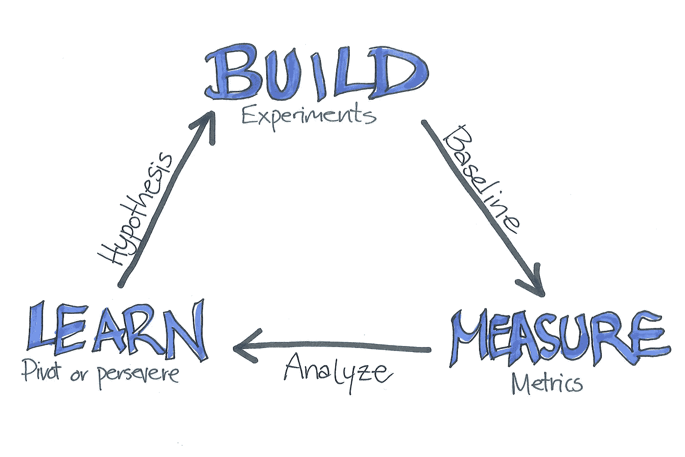
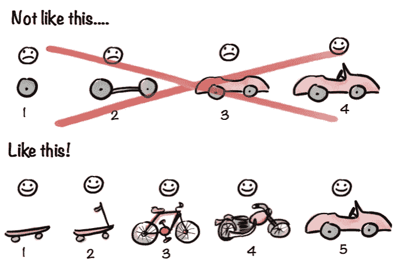
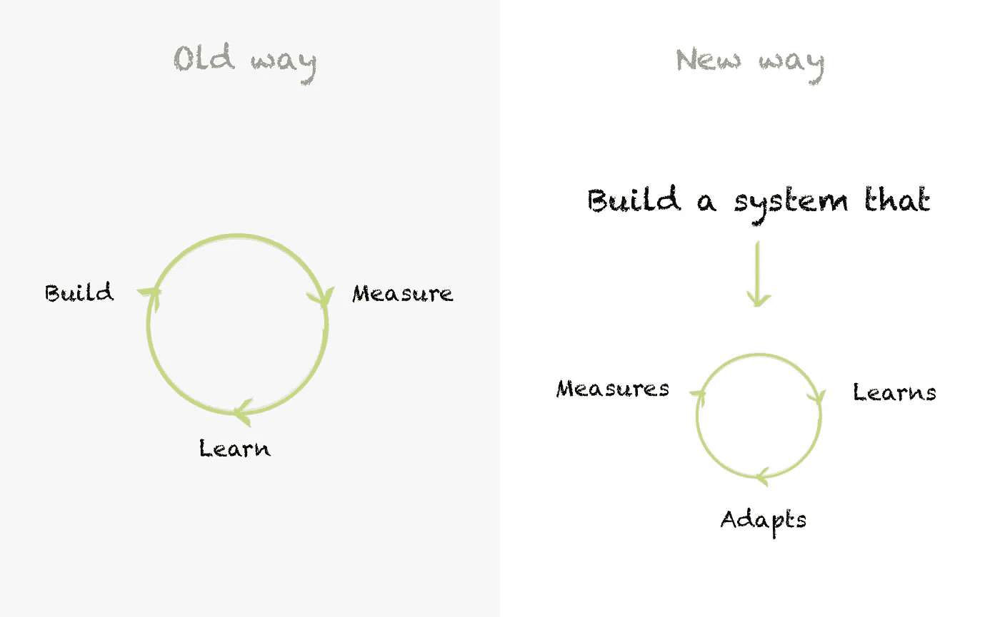
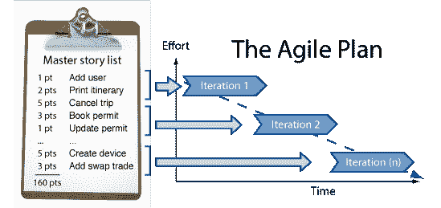
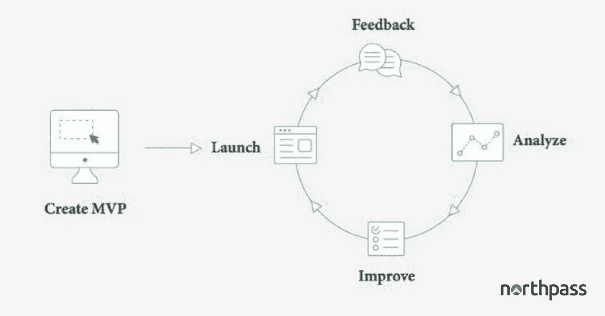

# 像精益创业一样开展产品培训

> 原文：<https://medium.com/hackernoon/launch-your-product-training-like-a-lean-startup-644a24143ce0>

> *“开始产品培训需要多少内容？”*

这是一个我们从那些对现代化他们的产品培训项目感兴趣的公司那里得到的很多的问题，但是仍然犹豫着是否开始。

创建[在线产品培训](https://www.northpass.com/beginners-guide-to-online-training)模块可能看起来是一个势不可挡的过程——但事实并非如此。正如今天一些最杰出的科技公司从几个朋友、一个产品创意和一块白板开始一样，公司培训部门和运营团队可以使用敏捷方法从头开始构建他们的在线培训。

这一切都是关于足智多谋，不害怕失败，测试各种解决方案，并不断迭代。不要让对完美的渴望阻止你开始！否则，你将永远无法向你的用户提供最好的产品培训。

# 从最简单可行的产品开始

Minimal Viable Product

需要多少内容才能入门？答案可能会让你大吃一惊——不会太多。

在初创公司的术语中，最小可行产品(MVP) [1]是一种具有足够可用的特性并从中收集反馈的产品，这些反馈有助于该产品的未来迭代。

出于我们的目的，企业可以用来起步的任何类型的数字内容都是一种[资源，您可以利用](https://www.northpass.com/beginners-guide-to-online-training/outline-your-first-course#step-content-2)获得最简单可行的培训产品。它几乎可以是任何东西:现有的培训文档、入门手册、录制的网络研讨会，甚至是录制的技术支持电话。在过程的开始，一个黑客的心态帮助很大。

企业不需要一个完整的库来构建他们的第一个在线培训模块。他们需要找到他们可以使用的工具和材料，以便向 MVP 迈出第一步。在此基础上，增强和扩展培训资源目录变得更加容易。

事实上，一旦公司开始运作，他们通常会惊讶于这有多简单。

那是因为…

# 1.你的内容比你想象的要多

那些认为自己还没有准备好开始建立在线课程的公司通常会觉得他们没有任何可以使用的数字内容。但是因为他们已经通过其他方式接受了[的训练](https://www.northpass.com/customer-training)，他们经常会对自己已经拥有的内容数量感到惊讶。在你的日常活动中，无论你是在使用 Dropbox、Drive、Asana、Trello、Basecamp、Hipmunk 还是 Snapchat，这些工作区都可能加载了文档、讨论和链接，你可以开始将它们组装成培训模块。

大多数公司只是还没有开始考虑这些内容在在线课程中是否有用。事实并非如此，因为事实上，你拥有的任何数字内容都可以促成一个 MVP——这只是一个上传或嵌入到你的[目标受众](https://www.northpass.com/beginners-guide-to-online-training/define-persona-and-goals#step-content-1)可以与之互动的培训体验中的问题。

假设你去年开发了一份 20 页的[培训手册](https://www.northpass.com/training-manual-template)。可以分成两页的活动，并组织成一个培训模块。或者，假设您有一些讲义和幻灯片，用于新员工的现场培训。您可以使用它们，也可以录制下一次训练，并将其用作视频内容。

如果您找到了合适的培训平台[来容纳音频、视频、富文本、文档、演示文稿、表格和各种其他内容，您将会惊讶于您的公司可能已经拥有的符合要求的文档数量。](https://elearningindustry.com/lms-buying-guide-find-perfect-learning-management-system)

# 2.衡量和适应

Measure and Adapt

初创公司经历的最重要的过程之一是收集对他们的 MVP 的反馈，以完善产品并使其更好。尽可能地，他们试图[使其可测量](https://www.northpass.com/beginners-guide-to-online-training/measure-the-success-of-your-program#step-content-5)。

在线培训自然是为提高 MVP 而建立的，因为它有调查、自我评估、测验、里程碑工具和内置于产品本身的书面反馈。(一个优秀的在线培训平台会有所有这些[功能供你使用](https://www.northpass.com/platform)。)一个小测验告诉你学生做得有多好，但它也是你的 MVP 质量的一个指标。

使用这些数据源来衡量、调整和迭代您的培训，提炼和改进每个版本，直到培训模块达到所需的健壮和成功。你最初的几个版本可能会很粗糙，但没关系。这都是过程的一部分。

# 3.保持持续改进

建立一个[在线培训项目](https://www.northpass.com/beginners-kit-to-online-training)是一个学习的过程——对于消费内容的用户和培训的开发者都是如此。不要担心在发布之前创建一个完美的培训模块，因为一旦用户开始使用，即使是最“完美”的培训计划仍然需要调整。

把培训发展过程想象成一次协作。通过倾听来自最终用户的反馈和数据，你将会更多地了解你的[目标受众的](https://www.northpass.com/beginners-guide-to-online-training/engage-your-target-learners#step-content-4)需要什么来打造更有价值的产品。这让你可以有机地构建产品，这样你所交付的东西才能真正迎合你的特定受众。

最终，重要的是要知道这是一个持续改进的持续过程——不管你开始的内容是多还是少。

# 结论

Lean Methodology

在一天结束的时候，你会知道适合你启动在线培训项目的[学习管理系统](https://www.northpass.com/learning-management-systems)——只要确保你先做了调查。

当涉及到为您的企业选择合适的 LMS 时，似乎很难知道从哪里开始。市场上有 500 多种 LMS，每种都有不同的功能集和价值主张，在购买软件之前做足功课是前所未有的重要。

为了帮助你，获得[完整的中小型企业 LMS 购买指南](https://elearningindustry.com/free-ebooks/the-complete-lms-buying-guide)。

**参考文献:**

1.  [精益启动方法](http://theleanstartup.com/principles)

Northpass 是一个现代化、易于使用的学习管理系统，用于快速创建和提供品牌培训模块，专为希望对用户进行产品培训的公司而设计。

*原载于 2018 年 4 月 29 日*[*【elearningindustry.com*](https://elearningindustry.com/launch-your-online-training-program-lean-startup)*。*