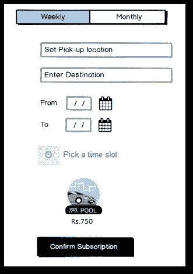
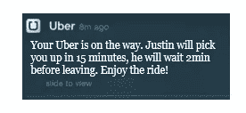

# 在拼车应用中推出订阅模式

> 原文：<https://medium.com/hackernoon/launching-a-subscription-model-in-ride-sharing-apps-105522dbf6ea>

**动机:**

每天早上，当我准备去办公室时，我会打开[优步](https://hackernoon.com/tagged/uber)和[奥拉](https://hackernoon.com/tagged/ola)应用，将目的地输入为“工作”，在这些平台上煞费苦心地比较不同通勤模式的价格，有时会关闭这两个应用，过一会儿再打开，以期待价格下降，记住最经济的应用，点击确认，耐心等待司机接受我的请求。在不那么幸运的一天，如果司机取消了请求，我将不得不再次经历整个事情。整个过程占用了我上午繁忙日程的 10 分钟。

我同意，这些平台今天提供了很大的便利，特别是与我们没有这些服务的史前时代相比，但是作为一个客户，我变得更加贪婪，要求更多的便利。我不想每天花哪怕几分钟的时间做这种比较。

**订阅模式:**

如果给我提供一个可以每周/每月更新的订阅服务，保证我每天早上在固定时间叫到出租车，而不必每天都预订，这样的选择会给我带来比我今天享受的更多的便利。

首先，可以在可共享的基础上(联营/共享)引入这种预订。提前了解预订请求有助于算法有效地匹配乘客，从而与当前请求以特别方式出现的模式相比，减少总的运输时间。与目前水平相比，运输时间的减少反过来会使用户受益。

**用户**:每天使用拼车应用上下班的上班族

现在让我们进一步探索这个想法，看看它对这些应用程序是否有商业意义

**该服务的市场规模:**

有多少人愿意选择这种服务？

如果我们假设印度的活跃骑手总数约为 1200 万(截至 2017 年 8 月，优步在印度有 500 万活跃骑手，所以我进行了推断)，为了简单起见，假设 10%来自本加鲁鲁，这将使其成为 120 万活跃骑手。比方说，在这 120 万人中，如果 30%的人每天都使用这些应用程序，那么每天就是 36 万。在 36 万人中，如果 50%的用户使用这些平台来预订去办公室的车，那么我们将有 18 万用户。在这些人中，如果有 30%的人注册了这项服务，那将会有 54，000 名顾客，仅在孟加拉鲁鲁。

比方说，在这 54，000 人中，如果 50%的客户每天在两个应用之间切换，通过引入订阅服务，这些应用每天可以锁定更多的客户，此外还可以提供收入可预测性。

**模型如何工作:**

提供每月固定时间从家到单位的通勤套餐(反之亦然)。

让我们假设到我的办公室有 10 公里的路程，为了节省一些钱，我只使用共享/合用。假设正常行程 100 卢比，价格上涨时预订的行程 150 卢比，假设我 1/3 的预订是基于价格上涨，我将在 20 天内花费 2250 卢比。任何低于这个价位的报价对我来说都是一笔划算的交易。定价可以通过距离、通勤时间、上车地点、乘坐公共交通的便利性、替代成本、购买力、以前的乘车价格等因素来确定。，纳入考虑。

如果有更多的人订购这项服务，就可以更好地预测上下车地点和人员，从而有效地减少总的运输时间。

应用程序会在预定的接车时间前 15 分钟发送一个通知，通知司机详细信息。

在每周订阅中，用户将获得 5 次乘坐，未使用的乘坐将失效。(或者可以给用户一个选项，其中如果他在预定时间之前至少一天通知，则一定数量的乘坐可以被结转，取车时间不能改变。应该对可以结转的乘车次数有上限)

UI Mock-up for subscription service

Example of a notification presented to the rider every day

**我发现了一些阻碍用户订阅服务的问题——**

一个月之久看不到日程表。有些日子，用户不会去办公室，因为他们利用在家工作的选择或休假，这通常不会超过 5 天。这可以通过引入每周/10 天计划来克服。

另一个问题是用户每天去办公室的时间可能不一样。如果他们有自己的车，他们就不会为每天同一时间去上班而烦恼。这个问题可以通过用户调查进行更详细的评估。

**给用户带来的好处**:乘坐经济实惠，运输时间最优，节省了他们每天处理预订和取消的工作量。

**拼车应用的好处**:稳定的收入流，客户锁定降低了转向竞争对手应用的可能性

这项功能可以通过与雇主合作来扩展，雇主可以向员工发放周/月乘车证。

我们如何衡量成功？此功能可跟踪的指标包括

展示该功能的乘客数量

点击该功能的乘客数量

订购服务的乘客数量

续订服务的乘客数量