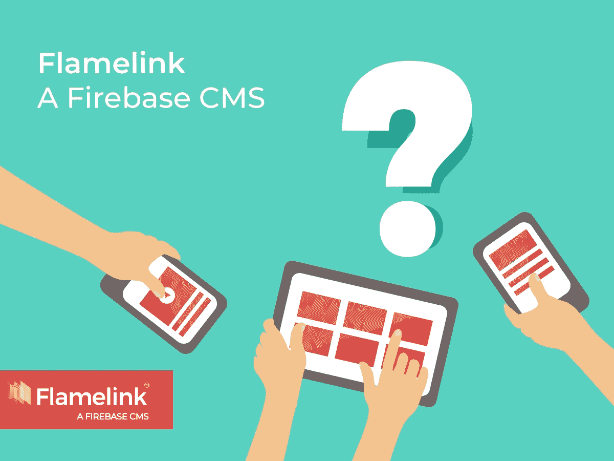
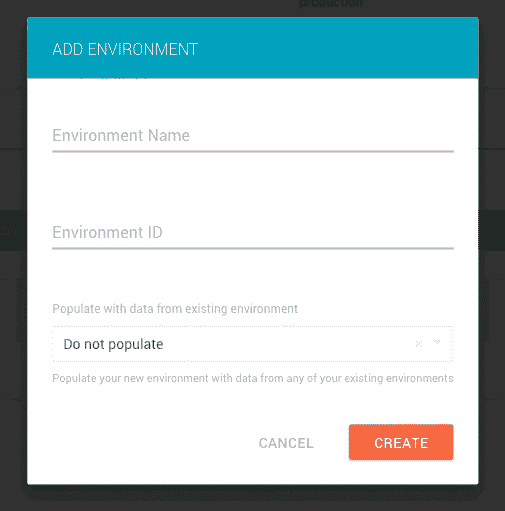
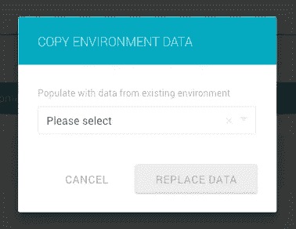
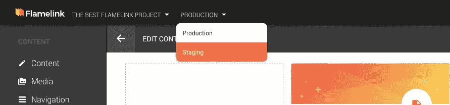

# 为 Flamelink，一个 Firebase CMS 启动多个环境…

> 原文：<https://medium.com/hackernoon/launching-multiple-environments-for-flamelink-io-a-firebase-cms-e52f17cf4014>

以及鲜为人知的“管理您的 Flamelink 用户”功能。

在 [Firebase](https://hackernoon.com/tagged/firebase) 开发峰会和 [Flamelink](https://hackernoon.com/tagged/flamelink) V1 发布之前，我们将发布一些很酷的新功能，帮助 Flamelink 成为管理您的 Firebase 项目内容时不可或缺的工具。

这些功能中的一些已经进行了很长时间的工作，并需要我们如何建立 Flamelink 的一些重要功能的基础，所以它并不总是我们愿意谈论的东西。其他功能只是一些很酷的东西，已经通过我们的各种反馈渠道向我们提及，其中之一是我们令人敬畏的 Flamelink Slack 社区。

***Pssst。如果你是 Flamelink 的新手，可以看看我们的*** [***讲解视频***](https://youtu.be/8Cw5ktNADBQ) ***。***

Any Device. Any Content. Thanks to Flamelink.

本周，我们很兴奋地宣布了多种环境。最初，作为一个非技术人员，我不确定设置 Flamelink 在海滩、雨林或活火山的腹部工作会对任何人有所帮助，但嘿，你选择使用 Firebase 和 Flamelink 做什么，坦率地说不关我的事。

JK:我以前在一家科技公司做过客户经理，我知道在一个不是你的实际项目的环境中测试新功能的价值——你只会犯一次(或两次)这样的错误。

我们热衷的事情之一是帮助 Flamelink 用户的生活变得更容易，虽然 Flamelink 本身的核心不是开源的，但我们的方法是用户驱动的体验和痛点解决方案。有时这很容易，因为我们的团队已经能够推出快速修复和变通办法——其他时候提供解决方案需要更长一点的时间。

Flamelink 的多环境支持就是一个例子。它允许您将所有内容保存在一个地方(因此非常容易跟踪),并提取特定项目所需的数据——这种设置也是 headless CMS 配置的一个巨大优势，它允许不同设备上的用户进行灵活的内容交付。

**在哪里工作？**

*   1)生产与沙盒

我们在 Flamelink 中设置了多环境功能，让您可以非常轻松地从不同的环境中提取/推送数据，只需点击一个按钮。嘣。

如果您已经建立了 live 站点，并且想要对您的内容或内容的显示方式进行一些更改，这将很有帮助。你可以将实时数据复制到你新设置的沙盒环境中，你的内容伙伴/客户/表亲可能会发疯。

*   2)不同的设备，例如你的应用程序、网站和智能手表

每台设备所需的内容确实不同，因此您可以复制每台设备的内容，添加或删除您需要或不需要的内容，而不是为每台设备创建一个新项目。因此，您可以优化每台设备的体验，在终端用户与您的产品互动的每个接触点为他们提供出色的用户体验。

这可能是不言而喻的，但是为了帮助跟踪什么数据去了哪里，您已经能够单独命名您的环境，这有助于从事同一项目的团队在同一页面上工作(哈！看到我做了什么吗？).

**开关(并锁定)它:**

不管出于什么原因，如果需要，在不同的环境之间切换真的很容易。我们还内置了一些安全措施，因此您可以将特定用户限制在特定环境中，这样您就不必担心用户会篡改生产中的内容。

**官方的 Flamelink SDK——用那个吧！**

Flamelink 的官方 JavaScript SDK 允许您指定您想要使用的环境，将您的所有请求放在上下文中，并使您在不同的环境中工作变得非常简单。潜入 [**Flamelink 的官方 JavaScript SDK**](https://flamelink.github.io/flamelink/#/) 。

**还有用户管理功能？**

用户管理功能允许项目所有者轻松管理您的所有 Flamelink cms 用户。这不同于现有的“用户”功能，用户可以使用您的应用程序/项目来管理最终用户。

用户管理功能可以让你发送邀请，删除待定的邀请，更改权限，甚至撤销某人的权限，如果他们是一个顽皮的小鬼。

那好吧。这就是我们现在的情况。在接下来的几天或几周内，我们会分享更多。祝您在 Firebase 和 Flamelink 项目上工作愉快。如果您需要任何帮助，请随时通过 Slack 与[联系，我们很乐意收到您的来信。](https://flamelink.io/slack)

伊阿宋

团队火焰链接

[在 Twitter 上关注我们](https://twitter.com/FlamelinkCMS)

[查看我们的网站](https://flamelink.io/)

[观看我们的 YouTube 视频](https://www.youtube.com/channel/UCPSOGjXxn2he52czV1XsW3g)