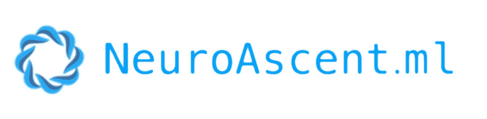
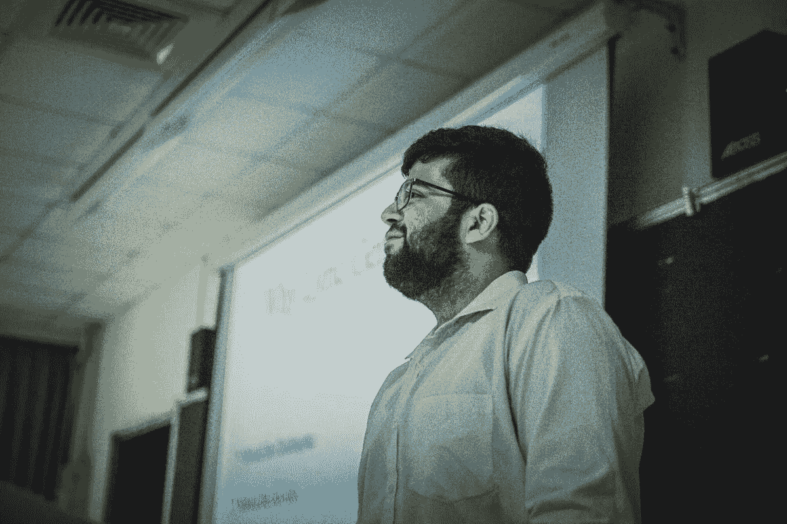
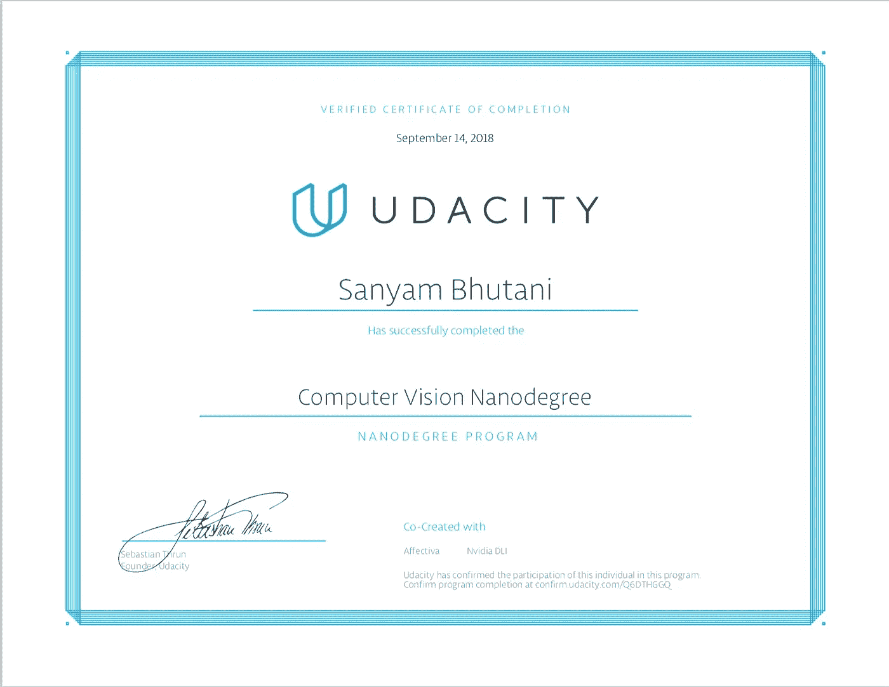

# 创办公司、奖学金和网络研讨会

> 原文：<https://medium.com/hackernoon/launching-my-company-a-scholarship-and-a-webinar-277e3b66e351>

## 我的机器学习之旅的 3 个月更新

自从[我公开宣布](https://hackernoon.com/my-machine-learning-path-cb6edab4630)“我发誓将机器学习作为我未来的职业道路”以来，已经有大约三个月了

我答应学习，做项目，定期写博客。这篇博文标志着我的一些巨大成就。

# 公开表示感谢

首先要做的是:

[我一直很感谢 Hackernoon](https://hackernoon.com/dear-hackernoon-e53f335085eb) 和 [David Smooke](https://medium.com/u/7f91547ce9c9?source=post_page-----277e3b66e351--------------------------------) 对我博客的支持。感谢 Hackernoon，甚至这篇文章，我得以分享我在机器学习方面的学习道路和职业道路。

感谢他们的支持，我的博客浏览量刚刚突破 12 万！考虑到我大约 6 个月前才开始写作，这简直是荒谬的疯狂。

真的希望继续带来[更好的教程](https://hackernoon.com/installing-ubuntu-18-04-along-with-windows-10-dual-boot-installation-for-deep-learning-f4cd91b58557?source=user_profile---------9------------------)和 [DL blogposts](/init27-labs/pytorch-basics-in-4-minutes-c7814fa5f03d?source=user_profile---------31------------------) 。这些观点并不是一个巨大的成就，但标志着我一直在朝着正确的方向前进。

谢谢你哈克农！

# 公司

今年年初，我开始作为一名 DL，CV 自由职业者工作。尽管我在成为最年轻的飞行汽车工程师(从飞行汽车纳米学位毕业)后才开始全职工作，但这个想法发展得如此之快，以至于我与 Rishi 共同创立了一家公司

它基本上是一个软件代理，可以让我们更好地扩展我们的项目。我们也在建立一些即将披露的 ML 服务平台。所有这些都将由 [Neuroascent.ml](http://neuroascent.ml) 提供动力

是的，我们做过一些工作。这不仅仅是一个漫无目的的想法。对我们来说，这是一种更好的扩展方式。

# 网络研讨会

PayPal India，Inc42 邀请我参加一个在线研讨会，讨论我的自由职业任务。

我很荣幸能与 PayPal 印度和 inc42 的高级主管交谈。这也是 Neuroascent.ml 的发现

如果您感兴趣，您可以在此处找到录制的网上研讨会:

> 仅在 14 天内，网上研讨会就被播放了 72000 次！

# 奖学金

在完成了[飞行汽车纳米学位](https://hackernoon.com/graduating-the-flying-car-nanodegree-term-e8fc9c722bc3)后，我获得了参加亚洲大学为期两周的人工智能训练营的奖学金。

我甚至因为我的最终项目演示获得了一个特别奖:“使用 DL (FastAI lib)生成歌词”。[你可以在这里找到幻灯片](https://drive.google.com/drive/folders/1HHdS1fjHLPz1XfauDgcQFF6aYmZMAAzM)

# 毕业计算机视觉纳米学位

我刚刚从 Udacity 的计算机视觉纳米学位毕业。一门伟大的课程，我一直是 Udacity 课件的粉丝，CVND 也不例外。

我会写一篇关于我的经历的详细的后续文章。

现在，我仍在学习如何经营一家公司，以及不同时区是如何工作的。

# 我的下一步是什么？

*   我想出去走走。
*   今年早些时候，我设定了两项比赛前 30%的目标，但我没能实现。我还有 3 个月的时间来完成它。
*   通过 Neuroascent.ml 继续我们的工作
*   在 Deep [NLP](https://hackernoon.com/tagged/nlp) 上写几个帖子。
*   在 OpenCV 上写几篇文章。
*   我还会发布一系列的采访，我会在博客中采访一些真正激励和帮助过我的人，那些已经成为 ML、DL 工程师的人。

这是一个机器[学习](https://hackernoon.com/tagged/learning)自由职业者的故事，[通过这个博客带给你未经过滤的](https://hackernoon.com/the-only-undergrad-and-indian-to-be-invited-to-present-at-anaconda-conference-my-deep-learning-d4bde583ffa4?source=user_profile---------27------------------)。

*如果你觉得这很有趣，想成为我学习道路的一部分，你可以在 Twitter 上找到我* [*这里*](http://twitter.com/bhutanisanyam1) *。*