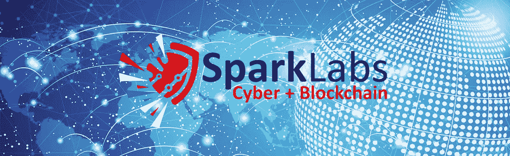
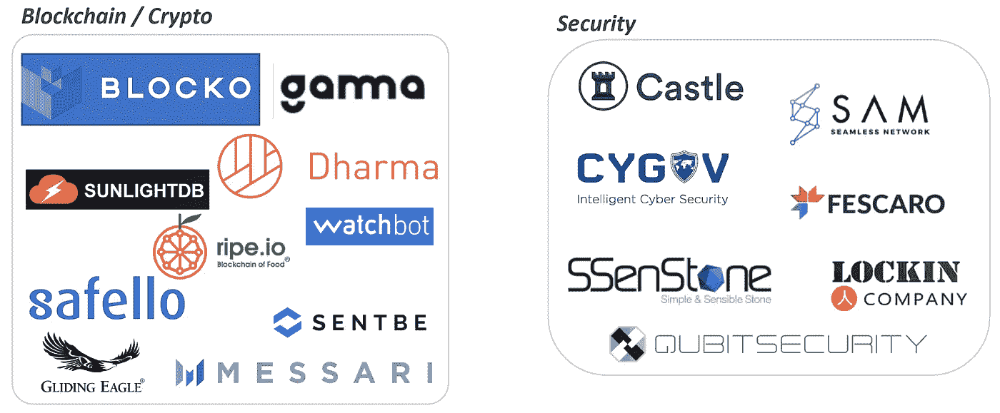
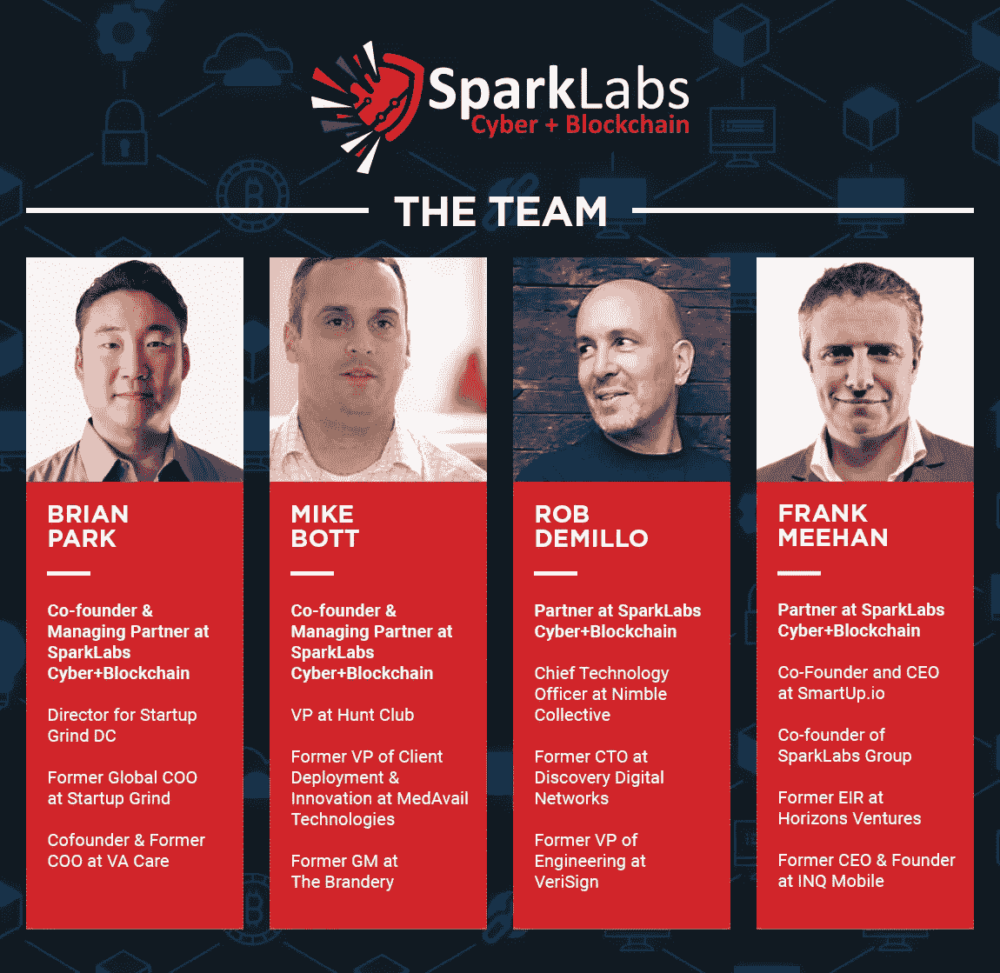
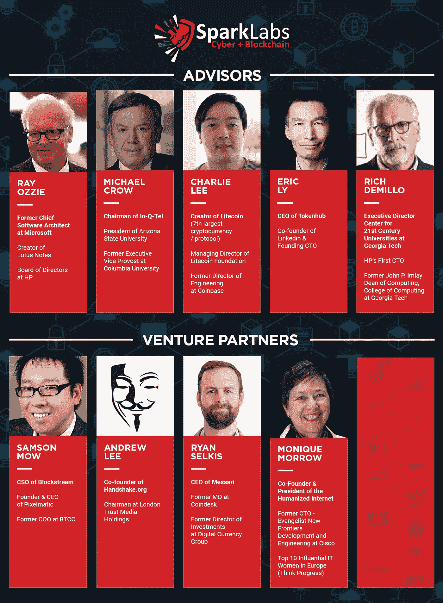
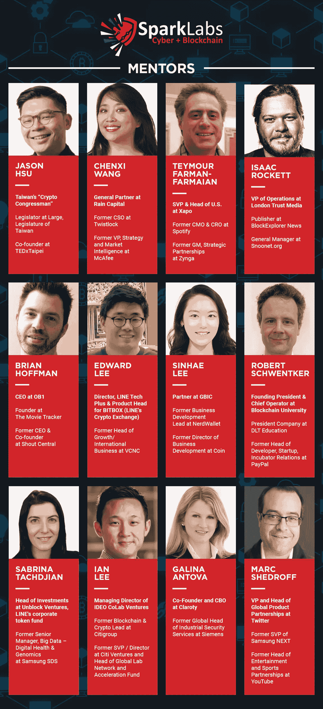
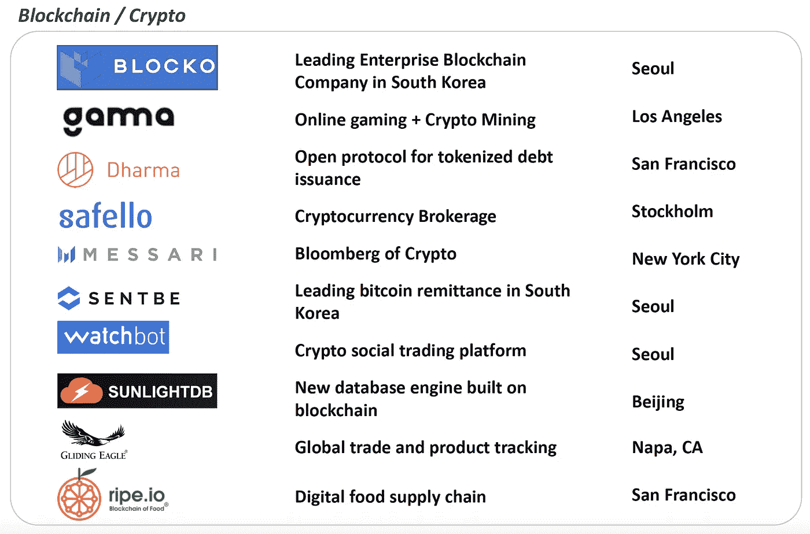
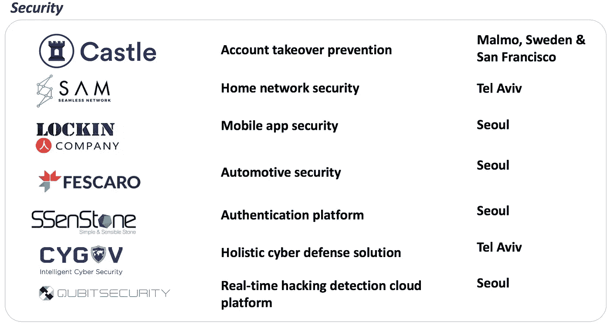

# 在我们国家的首都启动 SparkLabs 网络+区块链

> 原文：<https://medium.com/hackernoon/launching-sparklabs-cyber-blockchain-in-our-nations-capital-df5d40d2adc4>

SparkLabs Cyber + Blockchain is a global accelerator program, and will be located in Washington, D.C.

我们刚刚公布了[spark labs Cyber+block chain](http://www.sparklabscyber.com)有一些不错的报道[这里](https://techcrunch.com/2018/09/19/cybersecurity-and-blockchain-sparklabs/)、[这里](https://venturebeat.com/2018/09/19/sparklabs-launches-accelerator-in-d-c-for-cybersecurity-and-blockchain-startups/)、[这里](https://www.bizjournals.com/washington/news/2018/09/19/sparklabs-group-chooses-d-c-for-global.html)，我们的官方[新闻稿是她的](https://www.prweb.com/releases/sparklabs_group_launches_new_accelerator_in_washington_d_c_focused_on_cybersecurity_and_blockchain_startups/prweb15755023.htm#) e .现在提供进一步的细节和背景信息。

spark labs Group([www.sparklabsgroup.com](http://www.sparklabsgroup.com))已经通过我们的加速器和风险投资基金投资了 6 大洲的 200 多家公司。在我们的投资组合中，我们一直积极参与并将继续推进的两个领域是网络安全和分布式账本技术。

SparkLabs Group’s investments in blockchain and security related startups.

去年冬天，初创公司 Grind 的前首席运营官布莱恩·帕克(Brian Park)和我开始谈论他的想法，自从他获得权利并在华盛顿特区剥离出 AOL 的鱼缸实验室后，他开始启动一个新的创业加速器。他只是寻求友好的反馈，然后就进入了一起工作的对话。

我们的团队对 SparkLabs Cyber + Blockchain 的推出感到兴奋，原因有几个。我们很高兴能与 Brian 合作，我们热爱这两个行业，并期待与这些行业的创始人合作，这是 SparkLabs 在美国的第一个加速器！

Rob DeMillo 将与 Brian 一起加入投资委员会，他从我们开始(2012 年)以来一直是 SparkLabs 的导师，也是我们的全球种子期基金 [SparkLabs Global Ventures](http://www.sparklabsglobal.com) 的风险合伙人。他目前是 Nimble Collective 的首席技术官，在他的职业生涯中，曾在多家初创公司担任过首席技术官或首席执行官。作为 VeriSign 的工程副总裁，Rob 管理着一个 600 多名工程师的团队，但他更喜欢在创业世界中与小团队合作。 **Frank Meehan** ，我在 SparkLabs Global 的联合创始人，他在 Horizons Ventures(李嘉诚的风险投资公司)学会了交易，也将在这个投资团队中任职。在 Horizons 时，弗兰克领导了 DeepMind 的 A 轮融资，投资了 Siri，并加入了他们的董事会，还在 Spotify 的董事会以及李嘉诚的其他十几个董事会任职。

我们有一个鼓舞人心的顾问、风险投资伙伴、导师和其他致力于支持和帮助将通过这一新的加速器计划的企业家的人的名册。

传奇人物**雷·奥茨**，**Lotus Notes 的创始人，前微软首席软件架构师**加入了这个顾问委员会。他还在从事一个新的安全初创公司 Clear(阅读 [*【破解密码战】*](https://www.wired.com/story/crypto-war-clear-encryption/) **连线**)。 [**查理·李**](https://twitter.com/SatoshiLite) **，** [**莱特币**](https://litecoin.org/) (第七大加密货币&区块链协议)的创造者，大方加入，我个人对此感到兴奋。**迈克尔·克罗，**[**In-Q-Tel**](https://www.iqt.org/)**董事长、** [**亚利桑那州立大学**](https://asunow.asu.edu/20180909-asu-news-ranked-most-innovative-US-school-fourth-time) 校长，他是我在哥伦比亚大学研究生院的教授，也是我第一次创业的顾问。自从 2012 年我们在首尔推出 [SparkLabs 的第一台加速器](http://www.sparklabs.co.kr)以来，克罗主席一直是我们的首批支持者之一。**联合创始人&前 Linkedin 首席技术官**Eric Ly 也加入其中。他最近推出了一个基于区块链的新声誉系统，名为 [HubToken](https://hubtoken.org/) ，他告诉我，他从几年前开始就“全押”在区块链了。我们非常荣幸能够邀请到佐治亚理工学院 21 世纪大学中心的执行董事 **Rich DeMillo** 和惠普的第一任首席技术官。

在这个新的加速器中，我们的风险投资伙伴是创业公司的第二道支持线。很荣幸邀请到 **Samson Mow，他是** [**Blockstream**](https://blockstream.com/) 的首席执行官和 [Pixelmatic](https://www.pixelmatic.com/) 的首席执行官。**[**握手**](http://www.handshake.org) 联合创始人、伦敦信托媒体控股公司董事长安德鲁·李(Andrew Lee)是一位伟大的企业家，热衷于帮助他人。 **Ryan Selkis，** [**Messari**](https://messari.io/) 联合创始人兼首席执行官，曾任 [Coindesk](https://www.coindesk.com/) 董事总经理兼数字货币集团投资总监。我们认识 Ryan 是因为我们投资了他的初创公司 Messari，这家公司正寻求成为“加密领域的彭博”。莫尼克·莫罗是人性化互联网的联合创始人兼总裁，她得到了安·格林伯格的高度推荐，安·格林伯格是 SparkLabs 的长期导师和支持者。**

****

**左边显示的是一些我们邀请来帮助我们创业的导师。到目前为止，这大约是我们签约的令人印象深刻的导师的三分之一。**

**除了这个加速器之外，在更大的 [SparkLabs Group](http://www.sparklabsgroup.com) 生态系统中，我们还有来自网络安全和分布式账本技术的其他专家和领导者。**布莱恩·贝伦多夫，**[**Hyperledger**](https://www.hyperledger.org/)**的执行董事，自 2013 年**以来一直是 SparkLabs Global Ventures 的顾问，同时他还是 [Mithril Capital](http://www.mithril.com/) 的董事总经理。他还是 SparkLabs FinTech 的风险投资伙伴，也是我们与平安保险的加速器。SparkLabs FinTech 的另一位风险投资伙伴是 Spiros Margaris，他是 FinTech(排名第一)、AI(排名第一)和[的领先社交媒体影响者之一，在这里也被列为网络安全](https://blog.appknox.com/top-cybersecurity-influencers/) **的**【2】。Spiros** 曾是一名长期投资专业人士，现在积极为初创公司提供建议和帮助。****

**简单介绍一下背景，我们自 2014 年以来一直活跃在区块链领域。最终被 [Safello](http://www.safello.com) 收购的 Cryex 是我们全球种子基金[spark labs Global Ventures](http://www.sparklabsglobal.com)的第一笔投资。他们试图在斯德哥尔摩(最初在瑞典的马尔默)建立一个外汇加密货币交易所，但有点为时过早。2015 年，通过我们在首尔的加速器( [SparkLabs Korea](http://www.sparklabs.co.kr) )给我们介绍了一家企业区块链 play、 [Blocko](http://www.blocko.io) ，以及比特币汇款公司 [Sentbe](https://www.sentbe.com/en/) 。这两家公司都成为了各自在韩国的行业领导者。从那以后，我们在这一领域进行了其他投资:**

****

**我们在网络安全方面的第一笔投资是在 [Castle](http://www.castle.io) ，它专注于防止账户被盗。通过 Frank Meehan 在瑞典的网络，我们投资了 Castle 的第一轮种子基金，一年后，他们被 Y Combinator 接受。因此，SparkLabs 集团不仅对瑞典初创公司进行了第一笔安全和区块链相关的投资，而且这两笔投资都位于瑞典马尔默！**加油马尔默！****

****

**在 SparkLabs Group，无论我们向一家初创公司投资 25，000 美元还是 100 万美元，我们都不会对我们的投资组合进行区分和分级。我们致力于每一个创业项目，所以有些人可能会质疑我们在资源分配方面的智慧，但这是我们的经营理念。此外，无论是筹资、产品指导、营销、招聘、公关，还是一般的咨询委员会，我们都寻求以大大小小的方式支持我们的投资组合公司。在 SparkLabs，没有任何任务或工作低于任何合作伙伴或个人。**

**我们的数字证明了这一点，超过 95 家初创公司已经通过了 [SparkLabs Seoul](http://www.sparklabs.co.kr) ，我们的第一个加速器**，在加入该计划之前，平均融资额超过 45 万美元，毕业后超过 350 万美元**(T8，我们的第一笔资金增长了 1300%)。 [SparkLabs Cultiv8 的](https://www.sparklabscultiv8.com/2018)第一批有 **8 家公司，在**加入之前平均融资 110 万美元(*刚毕业* [*第一批于 9 月 18 日在悉尼！*](https://www.youtube.com/watch?v=zePzXNTwA_Q) )，由 SparkLabs(我们的第一个企业加速器)支持的平安云加速器已经**有 10 家公司预先筹集了 320 万美元** ( *第一次 DemoDay 是 10 月 17 日在深圳！*)。这些项目对每个初创企业投资约 5 万美元，因此我可以自信地说，我们在帮助创始人方面已经建立了良好的声誉。我们所有的合伙人都经历过创业生活，大多数都是创始人，所以我们知道创办、启动和建立公司有多难。**

**如果你是网络安全公司或区块链创业公司的创始人，并且正在寻找优秀的加速器或早期投资者，**欢迎联系布莱恩·帕克·(brian@sparklabscyber.com)**。如果你是有兴趣与[spark labs Cyber+block chain](http://www.sparklabscyber.com)合作的公司或组织，请联系 Brian。当然你也可以联系我，但是最好联系他们:)**