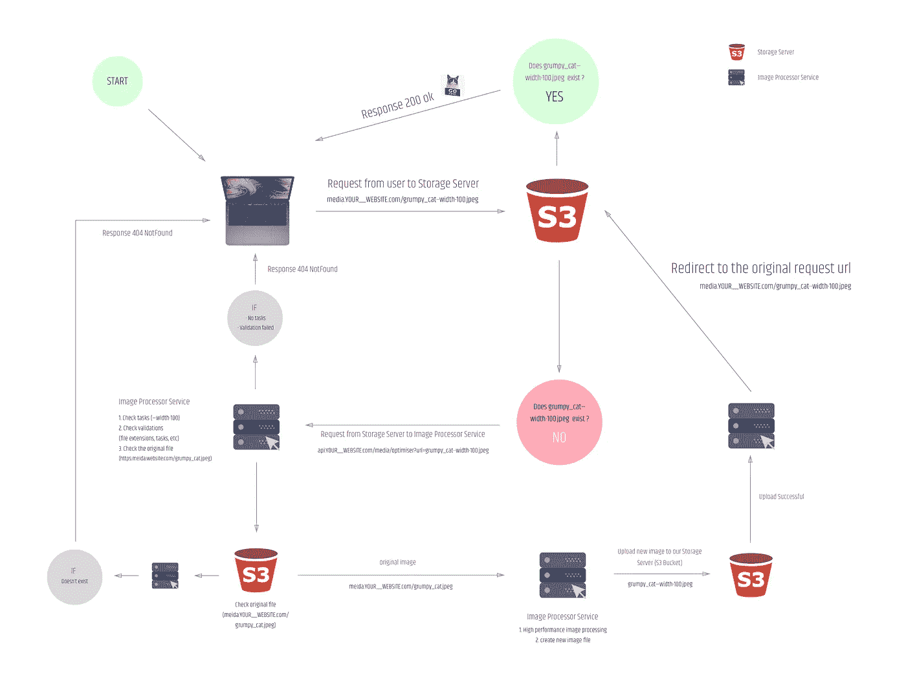
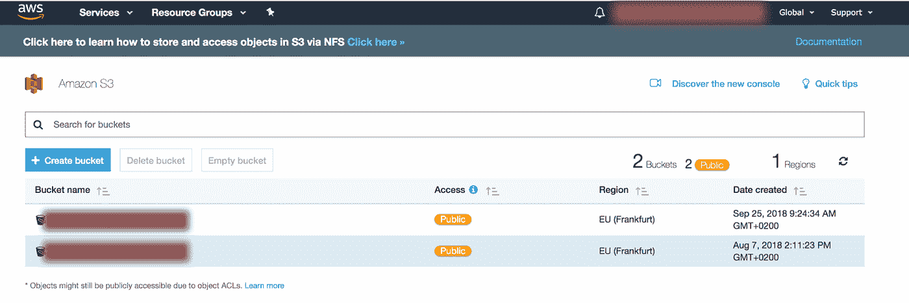
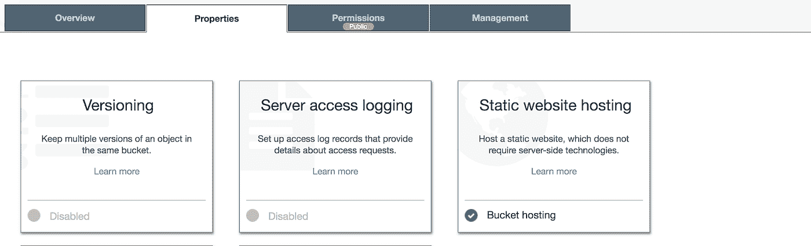
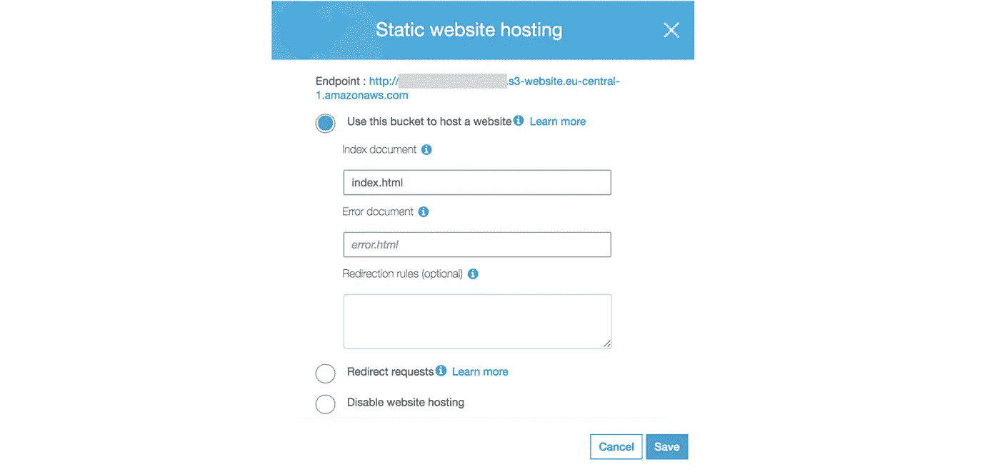

# 使用 AWS S3 和 NodeJs 的懒惰图像优化器

> 原文：<https://medium.com/hackernoon/lazy-image-optimiser-using-aws-s3-and-nodejs-80fb38338987>

下面我将向你展示我们如何简单地优化和编辑我们的媒体库中的图像，从而大大减少我们网站加载所需的时间。我们的图像优化版本只会在用户第一次请求时创建。

# 情况

想象一下，在我们的媒体库中有一张图片。

```
name: grumpy_cat.jpg
url: media.YOUR__WEBSITE.com/grumpy_cat.jpg
width: 2500px
size: 2mb
```

我们希望在以下地方使用我们的照片:

*   *作为博客列表项(推荐图片宽度 150px)*
*   *作为博文页面的特色图片(推荐图片宽度 760px)*
*   *作为移动版博文页面的一部分(推荐图片宽度 200px)*

下面我将描述处理这项任务的两种最常见的方法:

**CSS 方式**

*   我们可以使用 css 很容易地实现图像修改，但它不能解决加载时间的问题，因为即使我们的图像显示很小，但文件仍然是相同的大小。

**硬编码方式**

*   我们为什么不创建三个不同大小的图像并上传到媒体库？这个解决方案更好，但是想想当我们不是一个帖子而是几千个帖子的时候会发生什么？

**解决方案—让它更简单**

*   我们可以在图像修改过程中实现 css 功能(裁剪、覆盖等)。)，我们可以创建更小、更优化的图片，并以我们希望的实际宽度显示。(在我们的例子中，三个新图像:150 像素、760 像素、200 像素)
*   我们可以自动将图像上传到媒体库
*   只有在用户第一次请求时，才会创建图像的优化版本

听起来不错吧？

# 定义

**存储服务器**

*   我们的媒体库，在这里我们可以处理我们的图像(在我们的例子中，它是一个 [AWS](https://hackernoon.com/tagged/aws) S3 桶)
*   在本教程中，我们使用以下 url 作为媒体库域:media。您的 __WEBSITE.com

**图像处理器服务**

*   我们的 API 的端点，在我们的例子中，它执行所有的资源密集型文件操作
*   API url 是 API。您的 __WEBSITE.com

**客户端**

*   向我们的媒体库发送请求的用户

**任务**

```
--key-value
```

原始图像路径和文件扩展名之间的键值模式

```
media.YOUR__WEBSITE.com/grumpy_cat--width-100.jpg
```

在本教程中，我们使用 AWS S3 作为存储服务器，使用 NodeJs express 应用程序作为图像处理器服务。这些都可以根据你的个人喜好来替换。你可以使用你的本地文件服务器或者其他文件存储提供商(Azure，Google Cloud 等。)而不是 S3。您还可以用用不同编程语言编写的图像处理器替换 NodeJs，或者您可以使用无服务器的函数提供者，例如 AWS LAMBDA。

# **流程**



# 第一部分—设置 AWS S3 存储桶

我们要做的第一件事是设置并配置我们的存储桶。

*   将所有 404 请求重定向到我们的图像处理器服务
*   使用 AWS SDK 添加上传和获取对象的权限

***1。在 AWS 上注册并创建一个新的 bucket***

在本教程中，我不会给你所有的细节，如果你需要更多的信息，我推荐以下文章

[*https://docs . AWS . Amazon . com/quick starts/latest/S3 backup/step-1-create-bucket . html*](https://docs.aws.amazon.com/quickstarts/latest/s3backup/step-1-create-bucket.html)

***2。选择您的存储桶***



***3。配置桶权限和 CORS 参数*和**


为了能够使用 AWS SDK 从我们的图像处理器服务上传优化的图像，存储桶权限和 CORS 设置非常有用。

I .创建 GetObject 桶策略权限(公开 s3 桶)

```
 “Version”: “2012–10–17”,
 “Statement”: [
   {
     “Effect”: “Allow”,
     “Principal”: “*”,
     “Action”: “s3:GetObject”,
     “Resource”: “arn:aws:s3:::YOUR__BUCKET__NAME/*”
   }
 ]
}
```

如果您需要有关存储桶策略的更多信息:

[*https://AWS . Amazon . com/blogs/security/writing-iam-policies-how-to-grant-access-an-Amazon-S3-bucket/*](https://aws.amazon.com/blogs/security/writing-iam-policies-how-to-grant-access-to-an-amazon-s3-bucket/)

二。配置 CORS

```
<?xml version="1.0" encoding="UTF-8"?>
<CORSConfiguration >
<CORSRule>
    <AllowedOrigin>*</AllowedOrigin>
    <AllowedMethod>GET</AllowedMethod>
    <MaxAgeSeconds>3000</MaxAgeSeconds>
    <AllowedHeader>Authorization</AllowedHeader>
</CORSRule>
<CORSRule>
    <AllowedOrigin>https://api.YOUR__WEBSITE.com</AllowedOrigin>
    <AllowedMethod>PUT</AllowedMethod>
    <MaxAgeSeconds>3000</MaxAgeSeconds>
    <AllowedHeader>*</AllowedHeader>
</CORSRule>
</CORSConfiguration>
```

此设置使图像处理器服务能够使用 AWS SDK 在我们的存储服务器中进行修改，并将我们的媒体库设置为公共。

***4。启用并配置静态网站托管模式***

为了处理对我们的图像处理器服务的 404 请求，必须将我们的桶设置为网站托管模式。



*重定向规则:*

```
<RoutingRules>
  <RoutingRule>
    <Condition>
      <HttpErrorCodeReturnedEquals>
        404
      </HttpErrorCodeReturnedEquals>
    </Condition>
    <Redirect>
      <Protocol>
        https
      </Protocol>
      <HostName>
        api.YOUR__WEBSITE.com
      </HostName>
      <ReplaceKeyPrefixWith>
        media/optimiser?url=
      </ReplaceKeyPrefixWith>
      <HttpRedirectCode>
        302
      </HttpRedirectCode>
    </Redirect>
  </RoutingRule>
</RoutingRules>
```

***5。如何在网站托管模式下使用您的 S3***

当您的 bucket 在网站托管模式下运行时，您需要使用不同的端点 url。

AWS S3 有两种不同的用法:

1.  将其作为 API 使用(https 和. s3.)
    *https://s3。REGION.amazonaws.com/YOUR_BUCET_NAME/grumpy_cat.jpg
    https://YOUR _ BUCET _ name . S3 . region . Amazon AWS . com/grumpy _ cat . jpg*
2.  用它做网站(http 和. S3-网站。)
    *http://YOUR _ BUCET _ name . S3-网址。REGION.amazonaws.com/grumpy_cat.jpg*

在本教程中，我们需要在网站模式下使用我们的 Bucket，否则重定向将不起作用。

***⑥。使用我们的桶在网站托管模式与 https 协议(可选)***

遗憾的是，网站模式下的 S3 不支持 HTTPS 协议。如果您在您的网站中使用 https 协议，您需要使用代理服务器来访问您的 bucket url。(AWS cloudfront、nginx、express-proxy 等…)

Nginx 示例:

```
server_name www.media.YOUR__WEBSITE.com media.YOUR__WEBSITE.com;
        return 301 https://$host$request_uri;
}

server {
        listen 443 ssl;
        listen [::]:443 ssl;

        ssl_certificate CERTIFICATE__PATH;
        ssl_certificate_key CERTIFICATE__PATH;

        server_name www.media.YOUR__WEBSITE.com media.YOUR__WEBSITE.com;

        location / {
                proxy_pass [http://YOUR_BUCET_NAME.s3-website.REGIO.amazonaws.com
](https://s3.eu-central-1.amazonaws.com/unleash-image-resizer-test/grumpy_cat.jpg)        }
}
```

您现在可以将您的存储桶与您的 [https://media 一起使用。您的 __WEBSITE.com](https://media.your__website.com) 地址

**7*。测试我们的 s3 设置*** 现在，当有人导航到我们的 S3 存储桶 url 并且媒体资产不存在时，我们的存储桶将自动导航到重定向 url。(api。你的 __WEBSITE.com/media/optimiser？url=)

请查看(上面的)过程，以了解它是如何工作的。

当然，在这个阶段，您会收到一条错误消息，因为我们的图像处理器服务尚未完成。

示例:

```
fetched image url:
http://YOUR_BUCET_NAME.s3-website.REGIO.amazonaws.com/grumpy_cat--width-100.jpgorfetched image url with using https protocol and proxy server: https://media.YOUR__WEBSITE.com/grumpy_cat--width-100.jpg---------redirect endpoint = https://api.YOUR__WEBSITE.com/media/optimiser?url=grumpy_cat--width-100.jpg
```

现在我们可以开始编写我们的图像处理器服务了
第一部分结束…

# 第二部分——用 Express 和 Sharp 在 NodeJs 中编写图像处理器服务

定义:

```
url:
ORIGINAL_IMAGE--key-Value--key-value.FILE_EXTENSIONoriginal url:
ORIGINAL_IMAGE.FILE_EXTENSIONbucketUrl:
media.YOUR__WEBSITE.com or
YOUR_BUCET_NAME.s3-website.REGION.amazonaws.com
```

***1。安装并配置 Express***

在本教程中，我们将使用带有 ES6 导入语法的[http://expressjs.com/en/starter/hello-world.html](http://expressjs.com/en/starter/hello-world.html)启动器示例

```
import express from 'express'const app = express()
const port = 3000app.get('/', (req, res) => res.send('Hello World!'))app.listen(port, () => console.log(`Example app listening on port ${port}!`))
```

**②*。*创建功能(简体)**

警告！这个代码片段不是一个生产就绪的脚本，如果你想使用它，你需要用验证器、错误处理程序、更多的任务等来扩展它…

*index.js*

```
import Boom from 'boom' // Super useful error handler library
import { putObject, getObject } from './aws.helper'
import { sharpImageConverter } from './sharp.helper'const bucketUrl = process.env.bucketUrlapp.get('/media/optimise', async (req, res) => {
  try {
    const { query } = req
    const { url } = query
    const acceptedFileExtensions = /\.(jpg|jpeg|png)$/i
    const acceptedTasks = ['width'] // check the original request url
    if (!url) throw Boom.notFound() // check the file extension
    if (!acceptedFileExtensions.test(url)) throw Boom.notFound() // check the tasks
    const [rawFilename, fileExtension] = url.split('.')
    const splittedFilenameByTasks = rawFilename.split('--') // if we don't have tasks
    if (splittedFilenameByTasks.length === 1) throw Boom.notFound() // checking tasks
    const tasks = {}
    splittedFilenameByTasks.splice(1)
      .forEach((task) => {
        const [key, value] = task.split('-') // if we have unknown tasks
        if (!acceptedTasks.includes(key)) throw Boom.notFound(); tasks[key] = value
        return
      }); // download the original image
    const originalFilename = `${splittedFilenameByTasks[0]}.${fileExtension}`
    const fetchedFileDataFromAWS = await getObject(originalFilename) // create buffer
    const { Body, ContentType } = fetchedFileDataFromAWS
    const image = new Buffer.from(Body) // filesystem tasks
    const convertedImageBuffer = await sharpImageConverter(image, tasks) // upload to the s3
    await putObject(url, convertedImageBuffer, ContentType); // redirect to the new image url
    return res.redirect(`${bucketUrl}/${url}`);
  } catch (_err) {
    ...handle errors
  }
})
```

AWS . helper . js
[https://docs . AWS . Amazon . com/AWSJavaScriptSDK/latest/AWS/S3 . html](https://docs.aws.amazon.com/AWSJavaScriptSDK/latest/AWS/S3.html)

```
import AWS from 'aws-sdk'
import Boom from 'boom'const s3Service = new AWS.S3({
  accessKeyId: process.env.AWS_ACCESS_KEY_ID,
  secretAccessKey: process.env.AWS_SECRET_ACCESS_KEY,
  region: process.env.AWS_REGION,
})export const getObject = key =>
  new Promise((resolve, reject) => {
    const params = { Bucket: bucketName, Key: key } if (!key) reject(Boom.notFound()) s3Service.getObject(params, (err, data) => {
      if (err) reject(err)
      resolve(data)
    })
  })export const putObject = (key, body, ContentType) =>
  new Promise((resolve, reject) => {
    const params = {
      Bucket: bucketName,
      ContentType,
      Key: key,
      Body: body,
    } if (!key) reject(Boom.notFound()) s3Service.putObject(params, (err, data) => {
      if (err) reject(err)
      resolve(data)
    })
  })
```

sharp . helper . js
[*https://github.com/lovell/sharp*](https://github.com/lovell/sharp)

```
import sharp from 'sharp'export const sharpImageConverter = async (_image, params) => {
  const { width } = params const modifiedImage = await sharp(_image)
    .resize(width ? parseInt(width, 10) : undefined)
    .crop()
    .toBuffer() return modifiedImage
}
```

***3。部署脚本***

我们现在可以部署我们的系统，这将使我们能够加快我们的网站加载速度。我们可以保证你的搜索引擎优化结果将会改善。

我希望这篇教程对你有用，如果你有任何问题，欢迎在下面评论。