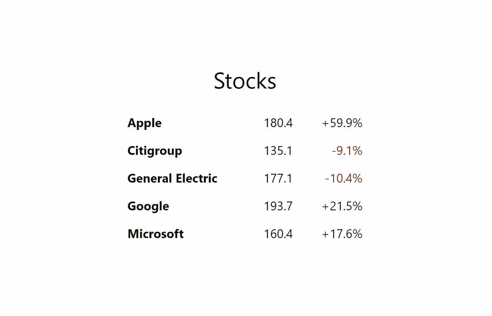
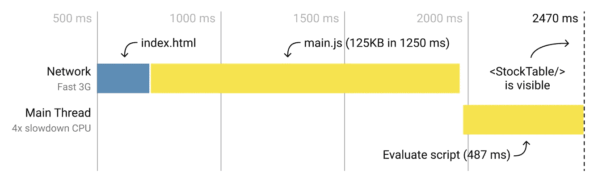
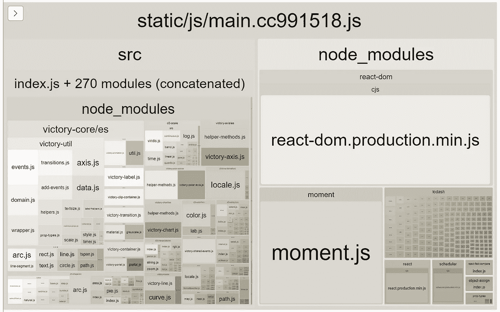
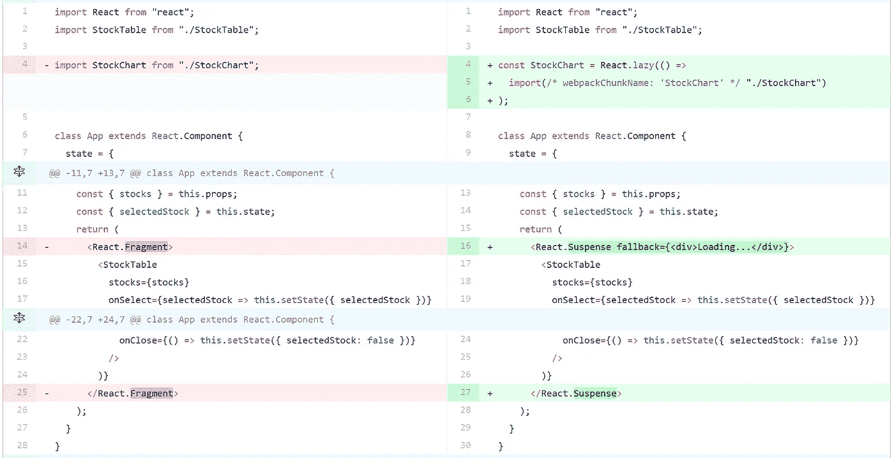
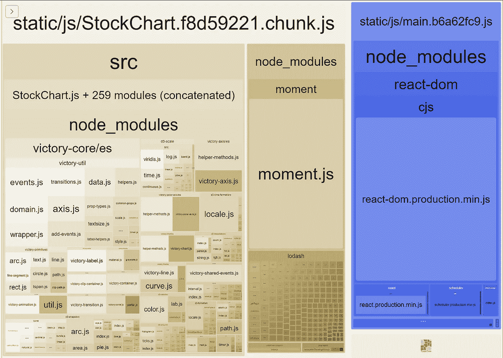
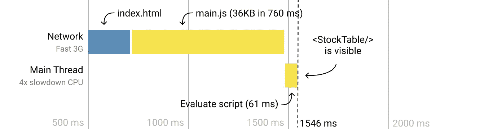
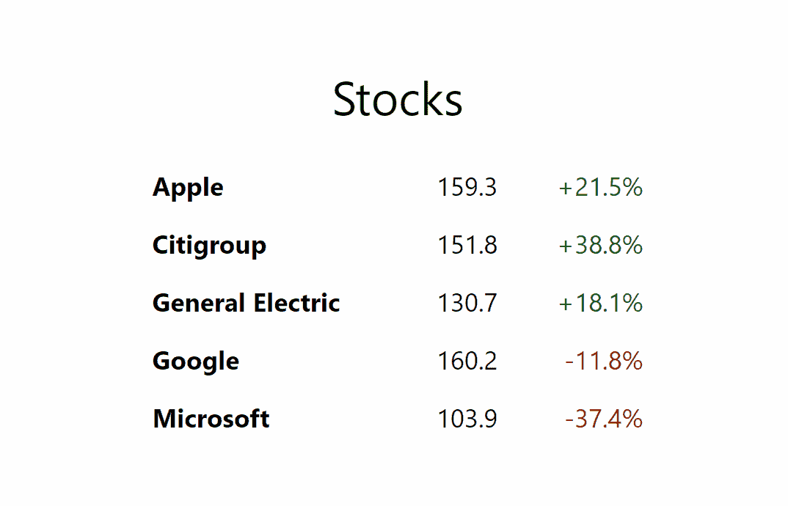
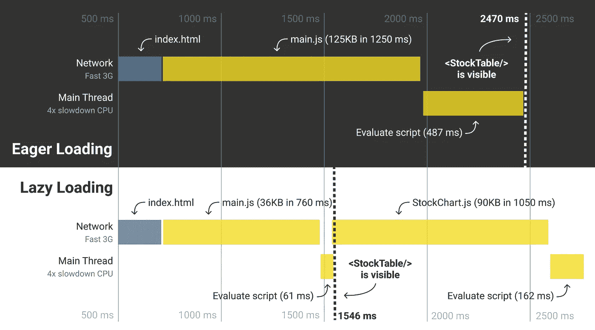

# React 16.6 中的延迟加载(和预加载)组件

> 原文：<https://medium.com/hackernoon/lazy-loading-and-preloading-components-in-react-16-6-804de091c82d>

React 16.6 增加了一个新特性，让代码拆分变得更加容易:`React.lazy()`。

让我们通过一个小演示来看看如何以及为什么使用这个特性。

我们有一个显示股票列表的应用程序。当你点击一只股票时，它会显示一个图表:

[Try it](https://react-lazy.netlify.com/)

这就是它的全部功能。你可以在 [github repo](https://github.com/pomber/react-lazy-preload-demo) 中阅读完整代码(也可以查看 [pull requests](https://github.com/pomber/react-lazy-preload-demo/pulls) 以了解我们将要做的每个更改的差异和应用程序的运行版本)。

对于这篇文章，我们只关心`App.js`文件中的内容:

我们有一个`App`组件，它接收股票列表并显示一个`<StockTable/>`。当从表中选择一只股票时，`App`组件显示该股票的`<StockChart/>`。

有什么问题？嗯，我们希望我们的应用程序能像*一样快*，尽可能快地显示`<StockTable/>`，但是我们让它等到浏览器下载(解压缩、解析、编译和运行)`<StockChart/>`的代码。

让我们看看显示`<StockTable/>`需要多长时间:

Trace without lazy loading

显示可盘点表需要 2470 ms(使用模拟的快速 3G 网络和 4x 减速 CPU)。

我们运送到浏览器的那些(压缩的)125KB 是什么？

Webpack Budle Analyzer [Report](https://react-lazy.netlify.com/report)

正如所料，我们有 react、react-dom 和一些 react 依赖项。但是我们也有 moment，lodash 和 victory，这些我们只在`<StockChart/>`需要，在`<StockTable/>`不需要。

我们可以做些什么来避免`<StockChart/>`的依赖性，从而降低`<StockTable/>`的加载速度？我们延迟加载组件。

## 延迟加载组件

使用[动态导入](https://developer.mozilla.org/en-US/docs/Web/JavaScript/Reference/Statements/import#Dynamic_Imports)我们可以将捆绑的 javascript 分成两部分，一个主文件包含显示`<StockTable/>`所需的代码，另一个文件包含`<StockChart/>`所需的代码和依赖项。

这项技术非常有用，以至于 React 16.6 增加了一个 API，使其更容易与 React 组件一起使用:`React.lazy()`。

为了在我们的`App.js`中使用`React.lazy()`,我们做了两处修改:

[Diff](https://github.com/pomber/react-lazy-preload-demo/pull/2/files)

首先，我们用一个对`React.lazy()`的调用替换静态导入，并传递给它一个返回动态导入的函数。现在浏览器不会下载`./StockChart.js`(及其依赖项)，直到我们第一次渲染它。

但是当 React 想要渲染`<StockChart/>`而它还没有代码的时候会发生什么呢？所以我们才加了`<React.Suspense/>`。它将呈现`fallback`道具，而不是它的孩子，直到它的所有孩子的所有代码都被加载。

现在，我们的应用程序将捆绑在两个文件中:

Webpack Budle Analyzer [Report](https://deploy-preview-2--react-lazy.netlify.com/report.html)

主 js 文件是 36KB。另一个文件 89KB，包含来自`./StockChart`的代码及其所有依赖项。

让我们再次看看浏览器显示这些变化的`<StockTable/>`需要多少时间:

Trace with lazy loading

浏览器下载主 js 文件需要 760 毫秒(而不是 1250 毫秒)，评估脚本需要 61 毫秒(而不是 487 毫秒)。`<StockTable/>`显示为 1546 毫秒(而不是 2470 毫秒)。

## 预加载惰性组件

我们加快了应用程序的加载速度。但是现在我们有了另一个问题:

Notice the “Loading…” before showing the chart ([try it](https://deploy-preview-2--react-lazy.netlify.com/))

用户第一次点击一个项目时，会显示“正在加载…”回退。那是因为我们需要等到浏览器加载了`<StockChart/>`的代码。

如果我们想摆脱“加载…”的回退，我们必须在用户点击股票之前加载代码。

预加载代码的一个简单方法是在调用`React.lazy()`之前启动动态导入:

[Diff](https://github.com/pomber/react-lazy-preload-demo/pull/8/commits/126c1bf6e2a23b3e3f7eb0ffb1b4db260516643f)

当我们调用动态导入时，组件将开始加载，不会阻塞`<StockTable/>`的渲染。

让我们来看看这个跟踪是如何从最初的急切加载应用程序改变过来的:

Eager Loading vs Lazy Loading

现在，如果用户在表格显示后不到 1 秒钟内点击股票，他们将只能看到“正在加载…”回退。[试试看](https://deploy-preview-8--react-lazy.netlify.com/)。

> 您还可以增强`lazy`功能，以便在需要时更容易预加载组件:

## 预渲染组件

对于我们的小演示应用程序，这就是我们所需要的。对于较大的应用程序，惰性组件在呈现之前可能有其他惰性代码或数据要加载。所以用户仍然需要等待。

另一种预加载组件的方法是在我们需要它之前实际呈现它。我们想渲染它，但不想显示它，所以我们将其隐藏:

[Diff](https://github.com/pomber/react-lazy-preload-demo/pull/4/commits/065adf856c334b9e614d6e5d20afbc3042a099a4)

React 将在第一次呈现应用程序时开始加载`<StockChart/>`，但这一次它将实际尝试呈现`<StockChart/>`，因此如果任何其他依赖项(代码或数据)需要加载，它将被加载。

我们将惰性组件包装在一个`hidden` `div`中，这样它在加载后不会显示任何内容。我们用一个`null`回退将那个`div`包装在另一个`<React.Suspense/>`中，这样它在被加载时不会显示任何东西。

> 注意:`*hidden*`是 [HTML 属性](https://developer.mozilla.org/en-US/docs/Web/HTML/Global_attributes/hidden)，用于表示元素还不相关。浏览器不会呈现具有此属性的元素。React 对该属性不做任何特殊处理(但在未来的版本中，它可能会降低隐藏元素的优先级)。

## 少了什么？

这最后一种方法在许多情况下是有用的，但是它有一些问题。

首先，用于隐藏渲染惰性组件的`hidden`属性并不可靠。例如，lazy 组件可以使用一个不会被隐藏的[门户](https://reactjs.org/docs/portals.html)(有一个不需要额外 div 的黑客[也可以使用门户，但是它是一个黑客，它会崩溃)。](https://github.com/pomber/react-lazy-preload-demo/pull/5/commits/dd968db4a2d41b1a607bc4aabfbf6c726ed9a94a)

第二，即使组件是隐藏的，我们仍然向 DOM 添加未使用的节点，这可能会成为性能问题。

一个更好的方法是告诉 react 呈现惰性组件，但在加载后不将其提交给 DOM。但是，据我所知，在 React 的当前版本中是不可能的。

我们可以做的另一个改进是在预加载图表组件时重用我们正在呈现的元素，这样当我们想要实际显示图表时，React 就不需要再次创建它们。如果我们知道用户将点击什么股票，我们甚至可以在用户点击它之前用正确的数据呈现它。

仅此而已。感谢阅读。

更多类似的东西**在 twitter 上关注**[**@ pomber**](https://twitter.com/pomber)**。**