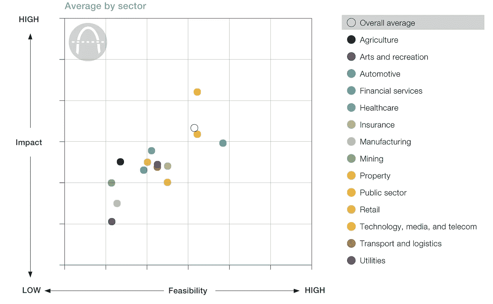
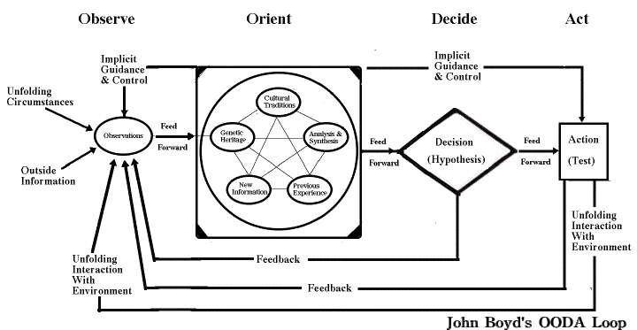

# 面向 Web 3.0 的精益策略

> 原文：<https://medium.com/hackernoon/lean-strategy-for-web-3-0-2a4dd2a62398>

我最近看到了这份新的麦肯锡报告，它衡量了 T2、区块链和分布式账本技术的“战略价值”。

我不讨厌它。该报告充分地解释了区块链，揭穿了一些常见的神话，并为区块链用例提出了一个并非无效的[框架](https://hackernoon.com/tagged/framework)。作为贝恩公司的前顾问，我喜欢这类报道。

但后来我找到了 2x2 矩阵——一种典型的咨询工具，通常用于帮助公司在战略机遇的海洋中航行。该矩阵通过对区块链的潜在影响以及实现这种潜力的可行性进行评分，对行业和行业特定的用例进行评级。虽然这样的工具看起来很舒服，但我怀疑它远不准确。

McKinsey prioritization framework for blockchain

# “传统”战略在前沿不起作用

为什么我这么自信上面的矩阵是错的？只要回顾一下管理咨询公司徒劳地试图将技术和商业的其他重大转变联系起来。典型的例子是麦肯锡预测手机销量将达到 90 万部……哎呀！几年前，我曾就主要的互联网趋势咨询过硅谷的科技巨头，我可以第一手保证，手机的失误不是一次性的。

这篇文章并不是对管理咨询的抨击——关于这一点，请看[这篇文章](https://dealbook.nytimes.com/2013/09/02/in-a-new-book-mckinsey-co-isnt-all-roses/)和[这篇文章](https://www.cbinsights.com/research/disrupting-management-consulting/?utm_source=CB+Insights+Newsletter&utm_campaign=ca9eb4b2e9-Top_Research_Briefs_06_02_2018&utm_medium=email&utm_term=0_9dc0513989-ca9eb4b2e9-90790325)；)作为一名前顾问，我尊重这一行业，并相信工具、框架以及通常出色的人才会在更稳定的市场中创造价值。但 100 年前商学院开发、顶级咨询公司提炼的战略工具包，根本不适合高度不确定和快速变化的现代科技时代。

# “传统”战略太慢，太死板

开始了解一个新行业的策略师通常会开发一个全面而详细的 100 多张幻灯片的事实库，包括市场规模、价值链、框架、专家访谈、预测和各种形式的分析。一旦完成，顾问们就可以获得报酬，以“真理的唯一来源”的热情捍卫他们的工作。

虽然这些努力看起来令人印象深刻，但在新兴和快速变化的行业中，这些努力往往会被误导。两个主要原因是:

*   这项工作需要太长时间才能完成。
*   大部分输出都没那么有用。

## ***传统的战略分析对于高增长行业来说太慢***

等到战略家得出结论时，提出的观点往往已经过时。战略分析的“瀑布”方法很难反映市场条件的实时变化。

## ***这样的工作产出没那么有用***

在高度不确定的环境中——比如互联网或区块链的诞生——未来状态预测的误差很大:

*   市场可能会增长 10 倍或 1000 倍(如 crypto，2017)
*   领先的竞争者可能会退出或消失(还记得 Sidecar 吗？)
*   有前途的用例可能是无用的，或者被杀手级应用取代(例如门户网站= >搜索)
*   价值池迅速转移，新的商业模式不断涌现。例如，艺术家和唱片公司失去了对音乐行业价值池的控制，先是 iTunes 的曲目级“交易”购买模式，然后是基于订阅的流媒体服务。

在 ConsenSys，我们毫不羞愧地承认我们无法预测 Web 3.0 的发展方向。在“[区块链和我们](https://itunes.apple.com/us/podcast/blockchain-us-conversations-about-brave-new-world-blockchains/id1390618088?mt=2)”播客中，我们 ConsenSys 的首席厨师——[Joseph Lubin](https://medium.com/u/6a370863659c?source=post_page-----2a4dd2a62398--------------------------------)——加倍强调了这个想法:

> 我们真的不知道从现在起十年左右，有创造力的人会建造出什么...如果你看看网络技术在 1989 年发明和 1999 年普通人使用电子邮件之间是如何分支的，我猜你可以从那里推断出来，但你不能推断出人们发送 140 个字符的消息，网上约会，进入陌生人的汽车，或睡在陌生人的家里，这些在几十年内将成为社会的常见机制。

即使对于有前瞻性思维的策略师来说，未来状态预测的误差也往往很大。因此，市场“事实”的声明往往充其量只是昙花一现。

## ***两个缺点加在一起，产生非最优解***

坚持上述方法，老派战略家出了名的求解局部极大值。充分理解且可立即操作的机会可能被标记为高优先级，而更模糊、技术复杂的机会将被降低优先级。例如，咨询公司在预测搜索、移动、社交媒体、视频流和云计算的崛起方面就严重不足。

**现在让我们明确一点**:为了做出坚定的战略决策，建立坚实的行业知识基础绝对至关重要。但我的观察是，在初创企业的背景下，最成功的战略家们摒弃了传统企业战略功能缓慢、有条理和静态的本质。相反，精益方法——与敏捷工作方式和 Sprint 方法相结合——为高增长技术环境中的战略决策提供了一种卓越的方法。

# 简而言之，“精益战略”

尽管精益创业是由埃里克·赖斯(Eric Reis)为产品开发提出的，但这些原则广泛适用于塑造企业和制定战略。精益战略的步骤:

*   **确定可检验的假设:**快速形成对市场和潜在机会的初步看法。尽管花一天时间根据你所掌握的事实对机会进行优先排序是值得的，但更重要的是阐明潜在的假设:为了让机会充分发挥潜力，什么是真的？
*   尽早并经常将假设推向市场:与专家、潜在客户、其他企业家和风险投资界分享假设。征求反馈并对关键假设进行压力测试。请注意，必然会有输出中的错误、思考中的空白和分析中的错误。然而，早期和频繁的反馈循环将比替代方案更有价值(即，保守但可能错误的输出。)
*   发展反馈循环:反馈是很好的，但是将它融入观点会在智力和情感上具有挑战性。利用每一个新的数据点重新审视核心假设，并“粉碎偶像”。
*   **快速迭代:**尽可能频繁地冲洗和重复上述步骤。

我听雷德·霍夫曼把这个过程称为 OODA 循环。

OODA 代表观察、定位、决定和行动。里德还应该为反馈加上一个“F”，因为这是系统的一个关键部分。技术领导者越频繁、越快速地进行 OODA 循环，他们就越有可能成功。

这种方法很艰难，也很可怕。精益策略要求其参与者避免确认偏差、分析麻痹和智力防御。精益需要更多的工作，但更少的浪费。精益意味着在早期阶段经常失败，这都是为了避免瀑布模型下更严重的失败。这也意味着减少对产出的关注，更多地关注自己努力实现的结果。

# 权衡取舍

精益方法显然伴随着一系列的权衡。我们的知识基础会有缺口，假设会被证明是错误的，快速行动会产生一些错误。但是“快速行动，打破常规”是精益战略过程中固有的一部分。接受它需要所有利益相关者理解这种方法并致力于这一过程。

此外，精益策略团队产生的工作将是一个起点，而不是一个结束状态的观点。如上所述，我相信在高度不确定、快速变化的环境中，这种方法比传统策略更有效，在这种环境中，成功是通过对反馈的响应性、敏捷性和创造性来衡量的。

# 结论

精益战略在硅谷很管用，但就像任何一套工具一样，它的部署必须根据环境背景和团队个性量身定制。

在尚未定义的市场中取胜需要不同的思维。在 ConsenSys 实验室，我们每天都在挑战我们孵化的项目、企业合作伙伴和行业利益相关者以不同的方式思考。

你自己试试，让我知道什么有效，什么无效。

*点击* [*Twitter*](https://twitter.com/ryanscotlechner) *了解精益如何为*[*ConsenSys Labs*](https://new.consensys.net/labs/)工作