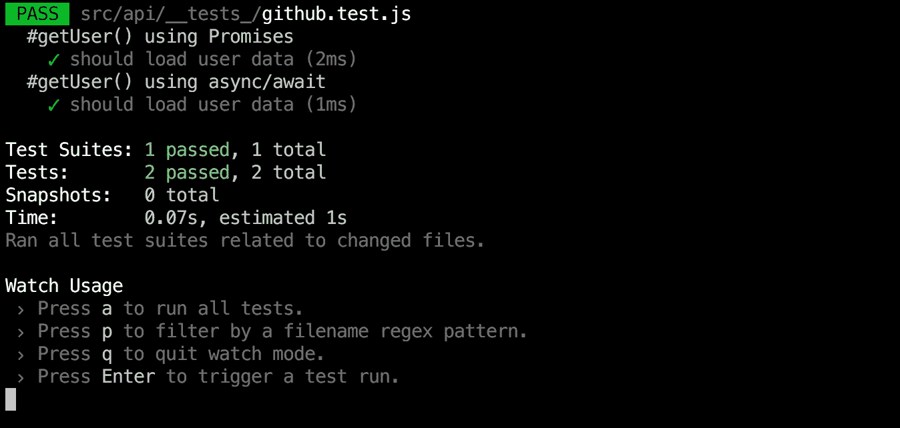

# 通过构建 javascript 测试库来学习 Assert

> 原文：<https://medium.com/hackernoon/learn-assert-by-building-a-javascript-testing-library-370b34634182>

## 用 nodejs 标准库构建有趣的项目。

了解 node js 的一个方法是构建东西。很多开发人员说他们知道 nodejs，因为它只是服务器端的 [javascript](https://hackernoon.com/tagged/javascript) ，但是他们中的很多人不知道如何使用 Nodejs 标准库。让我们从使用`assert`库开始，构建一个简单的测试库。

测试库是一个软件，它帮助我们测试我们的代码，以确保它按照预期正确运行。测试库的一个例子是[脸书](https://hackernoon.com/tagged/facebook)的 [Jest](https://facebook.github.io/jest/) 。我们将借用 jest 测试如何编写的结构。

从最简单的例子开始。假设我们有一段将两个数相加的代码。

预期的测试代码将会如何。

## 设计测试库的结构。

从结构上可以看出，没有什么特别的，只有功能。我们将在 expect 函数中使用 assert。`Assert`用于断言。

我们希望能够做出像`expect(4).toEqual(10)`这样的断言，我们将利用 node js 标准库中可用的`assert`库。

让我们看看我们在 expect 函数中使用的断言功能

**assert.ok** :-断言传递给`ok`的任何表达式的计算结果为真值失败，将抛出一个错误。

**assert.equal** :-断言两个值相等，否则抛出错误

断言两个对象或它们的子对象相等，如果相等则抛出错误

我们需要一种方法来显示测试通过或失败时的错误和成功状态。我们将在`it`函数中使用一个简单的`try catch`模块。

这里是完整的源代码。

我坚信你可以通过实践来学习。我遗漏了一些你可以用来练习的东西。有很多事情你可以做得更好，这里有两件事可以帮助你开始。

*   给测试结果着色(通过-绿色，失败-红色)
*   如果测试失败，显示通过的预期值和实际值。

慢慢来实现这两个功能，当你完成后，打我在 twitter 上审查。如果你有困难，可以联系我，我很乐意帮忙。

如果你觉得这篇文章有帮助，请鼓掌并分享给其他人。可以关注我的 [*GitHub*](https://github.com/sadick254) *和*[*LinkedIn*](https://www.linkedin.com/in/isaac-odhiambo-678b1547/)*。如果你有任何想法或改进，请随时与我分享。*