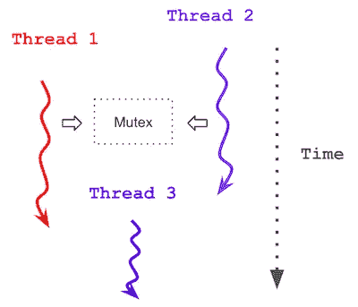

# 5 分钟学会 C++多线程

> 原文：<https://medium.com/hackernoon/learn-c-multi-threading-in-5-minutes-8b881c92941f>

## **摘要**:一个非常简洁的关于 C++14 多线程结构的速成班

Multi Threading in C++

新的 C++多线程结构非常容易学习。如果你熟悉 C 或 C++并且想开始编写多线程程序，那么这篇文章就是为你准备的！

我使用 C++14 作为参考，但是我描述的内容在 C++17 中也是受支持的。我只介绍常见的构造。看完这篇文章，你应该能够编写自己的多线程程序了。

# 更新(2020 年 6 月):

我制作了几个关于 C++多线程的视频。请点击此处查看:

C++ Multi Threading (Part 1) Creating Threads and Tasks

Multi Threading (Part 2): Mutex and Conditional Variables in C++

# 创建线程

可以通过多种方式创建线程:

1.  使用函数指针
2.  使用函子
3.  使用[λ函数](https://en.cppreference.com/w/cpp/language/lambda)

这些方法非常相似，只有细微的差别。接下来我将解释每种方法及其区别。

## 使用函数指针

考虑下面的函数，它有一个向量引用`v`，一个对结果的引用`acm`，以及向量中的两个索引`v`。该功能添加了`beginIndex`和`endIndex`之间的所有元素。

A function calculating the sum of all elements between `beginIndex and endIndex in a vector v`

现在，假设您想将向量分成两个部分，并在单独的线程`t1`和`t2`中计算每个部分的总和:

Creating threads using function pointers

## 你需要带走什么？

1.  `std::thread`创建一个新线程。第一个参数是函数指针的名字`accumulator_function2`。因此，每个线程都会执行这个函数。
2.  传递给`std::thread`构造函数的其余参数是我们需要传递给`accumulator_function2`的参数。
3.  **重要提示:**所有传递给`accumulator_function2`的参数都是按值传递的，除非你把它们包装在`std::ref`里。这就是为什么我们把`v`、`acm1`和`acm2`包在了`std::ref`里。
4.  由`std::thread`创建的线程没有返回值。如果你想返回某个东西，你应该把它存储在一个通过引用传递的参数中，也就是`acm`。
5.  每个线程一创建就启动。
6.  我们使用`join()`函数来等待一个线程完成

## 使用函子

你可以用仿函数做同样的事情。以下是使用仿函数的代码:

Functor Definition

创建线程的代码是:

Creating threads using functors

## 你需要带走什么？

一切都与函数指针非常相似，除了:

1.  第一个参数是仿函数对象。
2.  我们可以将它的返回值存储在仿函数内部的一个成员变量中，也就是存储在`_acm`中，而不是将一个引用传递给仿函数来存储结果。

## 使用 Lambda 函数

作为第三种选择，我们可以在 lambda 函数中定义每个线程，如下所示:

Creating threads using lambda functions

同样，一切都非常类似于函数指针，除了:

1.  作为传递参数的替代方法，我们可以使用 lambda capture 传递对 lambda 函数的引用。

# 任务、未来和承诺

作为`std::thread`的替代，你可以使用`tasks`。

任务的工作方式与线程非常相似，但主要区别在于它们可以返回值。因此，你可以把它们作为定义线程的一种更抽象的方式来记忆，并在线程返回值时使用它们。

下面是使用任务编写的相同示例:

## 你需要带走什么？

1.  使用`std::async`定义和创建任务(而不是使用`std::thread)`创建线程)
2.  从`std::async`返回的值称为`std::future`。不要被它的名字吓到。它只是意味着`t1`和`t2`是变量，它们的值将在未来被赋值。我们通过调用`t1.get()`和`t2.get()`获得它们的值
3.  如果未来值未准备好，在调用`get()`时，主线程阻塞，直到未来值准备好(类似于`join()`)。
4.  注意，我们传递给`std::async`的函数返回值。这个值通过一个名为`std::promise`的类型传递。同样，不要被它的名字吓到。在很大程度上，你不需要知道`std::promise`的细节或者定义任何`std::promise.`类型的变量——c++库在幕后完成这些工作。
5.  默认情况下，每个任务一创建就开始(有一种方法可以改变这一点，但我不介绍)。

# 创建线程摘要

这就是了。创建线程就像我上面解释的那样简单。您可以使用`std::thread`:

1.  使用函数指针
2.  使用函子
3.  使用λ函数

或者您可以使用`std::async`创建一个任务，并在`std::future`中获得返回值。任务也可以使用函数指针、仿函数或 lambda 函数。

# 共享内存和共享资源

简而言之，线程在读取/写入共享内存和资源(如文件)时应该小心，以避免竞争情况。

C++14 提供了几个结构来同步线程，以避免这种竞争情况。

## 使用互斥、lock、()和 unlock()(不推荐)

下面的代码显示了我们如何创建一个临界区，使得每个线程独占访问`std::cout`:

## 你需要带走什么？

1.  互斥体被创建`std::mutex`
2.  使用`lock()`创建一个临界区(即保证每次只由一个线程运行)
3.  临界区在调用`unlock()`时结束
4.  每个线程在`lock()`等待，只有当临界区内没有其他线程时，才进入临界区。

虽然上述方法可行，但不推荐使用，因为:

1.  它不是异常安全的:如果 lock 之前的代码产生异常，`unlock()`将不会被执行，我们也不会释放可能导致死锁的互斥体
2.  我们必须时刻小心不要忘记打电话给`unlock()`

## 使用 std::lock_guard(推荐)

不要被它的名字`lock_guard`吓到。这只是创建临界区的一种更抽象的方式。

下面是使用`lock_guard`的相同临界区。

critical section using `lock_guard`

## 你需要带走什么？

1.  在`std::lock_guard`创建后出现的代码被自动锁定。不需要显式的`lock()`和`unlock()`函数调用。
2.  当`std::lock_guard`超出范围时，临界段自动结束。这使得它异常安全，而且我们也不需要记得调用`unlock()`
3.  `lock_guard`仍然需要在其构造函数中使用`std::mutex`类型的变量。

# 我们应该创建多少线程？

您可以创建任意数量的线程，但是如果活动线程的数量超过了可用 CPU 内核的数量，那么创建线程可能就没有意义了。

为了获得最大数量的内核，您可以调用:`std::thread::hardware_concurrency()`如下所示:

# 我没有提到的是

我介绍了创建线程所需的大部分内容。还有几个不太常见的细节，我没有在这里列出，但你可以自己研究一下:

1.  标准::移动
2.  标准::承诺的详细信息
3.  标准::打包任务
4.  条件变量

希望这能帮助你快速学习 C++多线程。

如果你喜欢这篇文章，请点击拍手并给我反馈。

查看我的[其他视频](https://youtu.be/335zQkHDWRY)关于回溯算法及其在 C++中的实现:

另外，查看我的视频“使用 Google Test (GTest)和 Google Mock (GMock)的 C++单元测试教程”:

