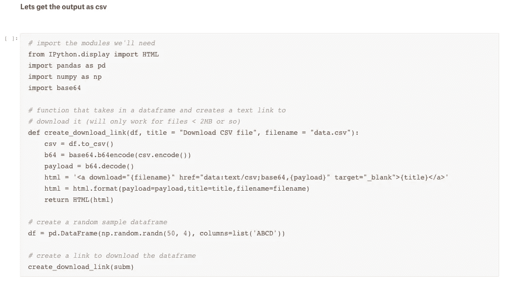

# 借助支持 GPU 的 kaggle 内核和 fastai MOOC 学习深度学习

> 原文：<https://medium.com/hackernoon/learn-deep-learning-with-gpu-enabled-kaggle-kernels-and-fastai-mooc-72fee41bb4b5>

深度学习民主化的最大障碍之一是需要一个 T2 图形处理器加速环境。如果我们想花时间有效地测试和学习问题陈述，我们需要一个基于 GPU 的服务器。但是这些跨平台的基于 GPU 的环境(GCP、AWS、Azure、Paper-space、floydhub)可能会让你花费大约 0.60 美元到 1.5 美元之间的任何东西。这一成本与存储成本结合在一起，如果我们使用持久的实例，可能会增加我们钱袋的负担。

picked up from slav’s blog [https://blog.slavv.com/learning-machine-learning-on-the-cheap-persistent-aws-spot-instances-668e7294b6d8](https://blog.slavv.com/learning-machine-learning-on-the-cheap-persistent-aws-spot-instances-668e7294b6d8)

客观地看，根据最近的估计，2013 年，10.7%的世界人口每天的生活费不到 1.9 美元(http://www.worldbank.org/en/topic/poverty/overvie，T6，T7)。现在，对于属于这一范围的学习者来说，使用支持 GPU 的实例几乎是不可能的，因为它的成本几乎是他们一天收入的一半。

但是当 kaggle 推出支持 GPU 的内核时，一些令人惊讶的消息传来，这些内核现在可以用来学习和解决问题语句中的深度学习问题，而无需雇用 GPU。

对于所有热衷于简化学习和实践深度学习的 fastai 的学习者来说，这是最大的礼物之一。

让我们快速看一下使用 kaggle 内核实现 fastai 课程所需的步骤。

**学习 fastai 如何使用 kaggle 内核**

**步骤 1** 转到 kaggle 并启动一个新内核

**步骤 2** 启用内核 GPU(您会在屏幕右下角看到选项)

**步骤 3**ka ggle 内核没有安装 fastai repo，所以我们需要自己安装。转到添加自定义包并在 git hub repo 中粘贴[**github.com/fastai/fastai**](https://github.com/fastai/fastai)

**第 4 步导入我们继续工作所需的所有 fastai 工具**

在这种情况下，我使用**猫与狗的 redux 竞赛**作为基线竞赛，来测试 fastai 是否可以在 kaggle 内核上使用。我们还计划使用 **Resnet34** 进行迁移学习，因此我们的下一步是获取比赛数据和 **Resnet34** 的预训练权重

**第 5 步获取内核数据，并添加预先训练好的权重供您使用**

在你内核的右控制面板的中央，你会发现一个名为**“添加数据集”的选项。**这是您获取比赛数据和我们决定继续进行的网络预训练权重所需的信息。

Data for cat vs Dogs Redux(get from add datasets →competitions)

Get weights of Resnet-34(Add datasets->datasets)

我们现在已经设置好了 GPU 环境，加载了 fastai 库，加载了比赛图像，并且我们已经添加了 Resnet34 的预训练权重。让我们继续前进，使用 fastai 库开发一个快速的深度学习模型。

**第五步装载所有需要的重要 fastai 工具包**

**步骤 6 在数据输入库中，我们有两个文件夹，分别是训练和测试用的猫和狗的图片。创建用于训练深度学习模型的图像数据的方法之一是，我们在 csv 中获取训练数据的细节和标签，并将其用作参考。我们会这样做的。**

**步骤 7 现在，在上述步骤之后，我们将以 csv 格式存储培训数据的详细信息。现在让我们创建验证索引，并继续创建模型数据对象。**

**Step-8 Fastai 训练代码期望我们在开发环境的特定文件夹中使用的网络的预训练权重。下面的步骤就是这样做的。**

**步骤 9 让我们预先计算模型的权重，并使用学习率查找器**查找学习率

**步骤 10——我们现在已经完成了快速基线训练，但是如果我们现在想要在 csv 中获得预测，并且我们想要在不提交整个内核的情况下这样做呢？下面的代码完成了这项工作。**

Get predictions for the test data

Get a download link straight from the data-frame of test predictions

# 结论

我能够使用我最喜欢的库之一(fastai)零成本地为计算机视觉(对象识别)中最流行的问题语句之一开发深度学习模型。Google 以前有 google colab，它也有支持 GPU 的基础设施，但不知何故，我发现它太慢太不稳定，无法完成具体的学习。但是 Kaggle 内核以其目前的形式应该被用作学习环境和开发环境。

**致谢**

我在下面引用了 Anshul Rai 和 [Rachael Tatman](https://medium.com/u/703b09baff4e?source=post_page-----72fee41bb4b5--------------------------------) 的两个内核，同时试图解决我试图解决的问题中的一些古怪之处。

 [## 在 Kaggle 内核中使用 fastai

### 编辑描述

www.kaggle.com](https://www.kaggle.com/anshulrai/using-fastai-in-kaggle-kernel)  [## 从内核下载一个. csv 文件

### 编辑描述

www.kaggle.com](https://www.kaggle.com/rtatman/download-a-csv-file-from-a-kernel)