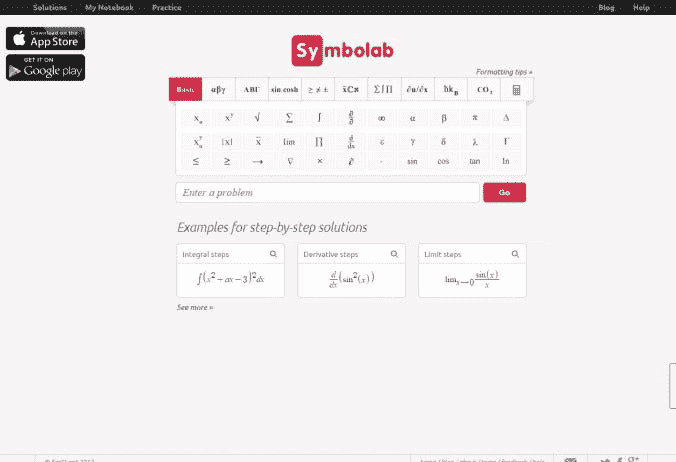

# 使用 Symbolab 免费学习数学问题解决方案的每一步

> 原文：<https://medium.com/hackernoon/learn-each-step-of-the-solutions-for-math-problems-for-free-using-symbolab-9da24cff9057>

如果你试图解决数学问题，而它们看起来很容易，也许你做错了。至少，这可能是你的第一印象，因为它们已经被广泛地宣传来挑战你，让你感到有压力，甚至很多次，迫使你放弃，只是回去看看解决方案。原因可能是你可能不知道如果你想达到预期的结果，需要遵循的所有步骤。幸运的是，解决数学问题可以通过一个非常酷的网络应用程序来简化，它会向你展示解决问题的步骤。

我的一个朋友最近告诉我关于 [SymboLab](https://www.symbolab.com) 的事情，它可以帮助你解决数学问题，不仅仅是给你最终结果，它还会告诉你如何到达那里的步骤。你甚至不需要支付任何费用，你可以免费使用它。

通过使用这个工具，你实际上可以学习解决问题的新方法，甚至可以调试你的解决方案，看看你在哪里犯了一个导致错误结果的错误。

有时候，你可能只想看到解决方案并与你的进行比较，或者学习如何解决一个你以前可能没有学过的特定问题。

除了一步一步的计算器，它还有其他功能，如图形，小抄，你可以快速参考刷新你在高中学到的东西，自我测试部分等等。

如果这听起来对你有吸引力，我建议你试一试。

快乐学习！