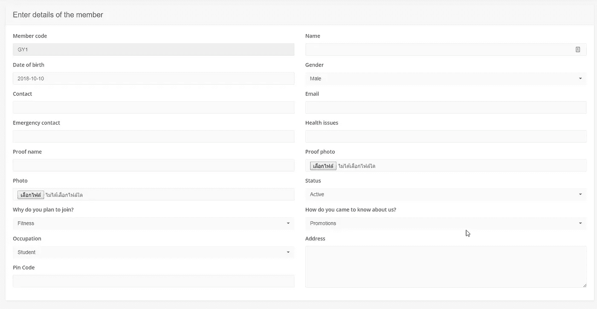

# 从开源中学习:用 Laravel 5.7 创建健身房管理

> 原文：<https://medium.com/hackernoon/learn-from-open-source-create-gym-management-with-laravel-5-7-87e33ada6ed9>

## 旅程赞助商

[**使用 Laravel 和 Vue.js 进行 Fullstack Web 开发**](https://click.linksynergy.com/link?id=qt/jYwyHv8A&offerid=507388.1608944&type=2&murl=https%3A%2F%2Fwww.udemy.com%2Flaravel-vuejs-fullstack-web-development%2F)了解如何使用 Laravel 5、Laravel Mix、Vue js、Bootstrap 4 & Sass 构建 fullstack web 应用

[**带推送器的实时单页论坛 App&vuejs**](https://click.linksynergy.com/link?id=qt/jYwyHv8A&offerid=507388.1587178&type=2&murl=https%3A%2F%2Fwww.udemy.com%2Freal-time-single-page-forum-app-with-pusher-laravel-vuejs%2F)在单页 App 中用推送器实时制作东西

在这个系列中，我们将学习如何创建 CRUD 和一些额外的特性，比如 Laravel 中的权限

健身房管理就像一个普通会员系统，

**销售&营销**
自动化你的询问和跟进。创建、编辑和安排跟进，以满足您的业务目标。

**短信&电子邮件提醒**
一键发送会员续费、付款提醒、生日祝福和促销短信提醒。

**访问控制**
知道谁做什么吗？在系统设置中定义和限制健身房中各种角色的访问权限。

**客户端管理**
搜索、添加、编辑&只需点击几下鼠标即可管理。轻松管理会员升级和将查询转给会员。

**发票**
摆脱维护手册和烦人的 excel 表格。在几秒钟内创建发票和收据。

**计划&服务**
创建你的健身房提供的各种计划和服务。根据需要定期编辑/删除相同内容。

**跟踪费用**
创建费用类别并添加您的每日、每月、每周或每年费用。轻松设置提醒。

在这篇文章中，我解释了我们如何开始结束这一切

灵感项目从 [**变成了【Gymie】**](https://github.com/lubusIN/laravel-gymie)

 [## Gymie -健身房和健身管理软件

### 是的，目前我们的团队正在着手开发一款 Android 应用。我们对吉米的主要设想是让你…

吉米.因](https://gymie.in) 

如果你对 laravel 有所了解，从 Github 上有许多明星和贡献者的项目中学习，使你的技能快速增长，想象一下你从许多专业开发人员那里免费学习

但是对于最初的版本，我们把它做成简单的母狗

**记住**我们不会复制粘贴一切。我们需要了解有多少专业开发人员编写代码，并选择我们在新手角色中理解的东西

然后，我们使小的不同，从演示只是一个版本，但核心代码相同

说真的，我们要向现实生活中的程序员学习

他们不怎么看 Udemy 或 Tut 网站上的教程，而是一头扎进代码森林，试图理解如何使用调试器来拦截代码流，并观察当跳过函数时变量是如何变化的

**他们从 Github 上的一千名专业开发者那里学习最佳实践**

**这个帖子的意图是制作详细帖子后来添加的目录帖子**

# 在开始的第 0 部分，我们为开发准备了环境

我是 [cloud9](http://c9.io) 的超级粉丝，但他们在 2017 年被 AWS 收购，集成到 AWS 服务中，使之成为完整的云开发环境

我们将学习如何使用 Cloud9 和设置必要的工具

**要求**

亚马逊账户和信用卡(如果不使用本地替代)

**你要学习**

*   基于 CentOS 基本 linux 命令
*   云元素 9
*   如何更改 php 版本

# 第 1 部分我们安装并设置 Laravel 5.7 和 Github 库，并部署到 Heroku

因为在 EC2 上保持项目的实时性会收取一些免费的费用，所以我选择 Heroku 进行实时演示

**你要学会**

*   如何在基于 CentOS 的 AWS linux 上安装 Laravel 5.7 和 Mysql
*   安装 AdminLTE，让您的前端生活更轻松
*   基本 git 命令
*   简单的 Github 存储库
*   如何向 Heroku 部署任何承诺，使您的应用程序保持活跃
*   为您的应用奠定基础
*   还有更多..

# 第 2 部分我们将创建简单的 CRUD 系列

许多基本数据，如会员，查询，付款，订阅，短信，发票，费用，计划，用户，网站设置

## 询问

有兴趣购买健身服务但现在不购买的人。我们保留这些数据以备后续

**这一节你要学的**

*   如何在 Laravel 上创建简单的 CRUD
*   如何生成带迁移的脚手架
*   如何用 Bootstrap 4 制作表格

## **成员**

**这一节你要学的**

*   如何在 Laravel 上创建简单的 CRUD
*   如何生成带迁移的脚手架
*   如何用 Bootstrap 4 制作表格
*   如何在 Laravel 中处理文件上传

## 支付

**这一节你要学的**

*   如何在 Laravel 上创建简单的 CRUD
*   如何生成带迁移的脚手架
*   如何用 Bootstrap 4 制作表格
*   如何在 Laravel 中处理文件上传

## 签署

**你将要学习的这一部分**

*   如何在 Laravel 上创建简单的 CRUD
*   如何生成带迁移的脚手架
*   如何用 Bootstrap 4 制作表格
*   如何在 Laravel 中处理文件上传
*   如何处理多种业务情况
*   如何使用数据库事务

## 短信

**这一节你要学的**

*   如何在 Laravel 上创建简单的 CRUD
*   如何生成带迁移的脚手架
*   如何用 Bootstrap 4 制作表格
*   如何在 Laravel 中发送短信
*   如何创建短信模板

## 发票

**你要学的这一节**

*   如何在 Laravel 上创建简单的 CRUD
*   如何生成带迁移的脚手架
*   如何用 Bootstrap 4 制作表格
*   如何创建简单的报告
*   如何使用作用域处理可重用查询

## 费用

*   **你将要学习的这一节**
*   如何在 Laravel 上创建简单的 CRUD
*   如何生成带迁移的脚手架
*   如何用 Bootstrap 4 制作表格

## 费用类别

**这一节你要学的**

*   如何在 Laravel 上创建简单的 CRUD
*   如何生成带迁移的脚手架
*   如何用 Bootstrap 4 制作表格

## 计划

**这一节你要学的**

*   如何在 Laravel 上创建简单的 CRUD
*   如何生成带迁移的脚手架
*   如何用 Bootstrap 4 制作表格

## 服务

**这一节你要学的**

*   如何在 Laravel 上创建简单的 CRUD
*   如何生成带迁移的脚手架
*   如何用 Bootstrap 4 制作表格

## 用户

**这一节你要学的**

*   如何在 Laravel 上创建简单的 CRUD
*   如何生成带迁移的脚手架
*   如何用 Bootstrap 4 制作表格
*   如何处理文件上传

## **权限和组**

**这一节你要学的**

*   如何在 Laravel 上创建简单的 CRUD
*   如何生成带迁移的脚手架
*   如何用 Bootstrap 4 制作表格
*   如何理解 Laravel 中授权的简易方式

## 闭幕赞助商

## [终极高级 Laravel Pro 课程(包括 Vuejs)](https://click.linksynergy.com/link?id=qt/jYwyHv8A&offerid=507388.1382640&type=2&murl=https%3A%2F%2Fwww.udemy.com%2Fthe-ultimate-advanced-laravel-pro-course-incl-vuejs-2%2F)

## [Laravel 5.7 电子商务商店](https://click.linksynergy.com/link?id=qt/jYwyHv8A&offerid=507388.1510962&type=2&murl=https%3A%2F%2Fwww.udemy.com%2Flaravel-ecommerce-shop%2F)

[**了解更多。**](https://click.linksynergy.com/link?id=qt/jYwyHv8A&offerid=507388.1510962&type=2&murl=https%3A%2F%2Fwww.udemy.com%2Flaravel-ecommerce-shop%2F)

## 结束语:

如果你需要和我一起探索海洋，普通海盗可以登上黑珍珠号

也许我们可以找到一些代码宝藏

## 如果您旅途中需要资金筹集

