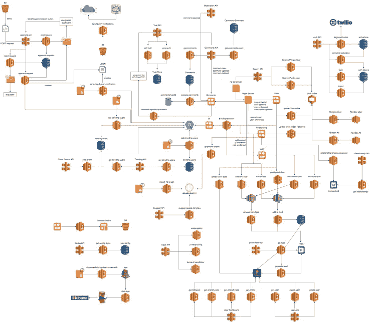

# 跟我一起了解如何使用 AWS Lambda 做好生产准备

> 原文：<https://medium.com/hackernoon/learn-how-to-be-production-ready-with-aws-lambda-with-me-1925528c6510>

嗨，那些在 Twitter 或 Medium 上关注我的人可能已经听到我提到过这一点，在过去的两个月里，我一直在与 [Manning Publishing](https://www.manning.com/) 合作制作一个名为 [**生产就绪无服务器**](https://bit.ly/prod-ready-serverless) 的视频课程。

我发现互联网上有很多资料可以帮助你开始使用 AWS Lambda，但是很少有内容可以带你在生产中运行一个扩展的无服务器架构。这归因于这样一个事实，即许多模式和实践仍在发展，尽管围绕该技术有许多激动人心的事情和大肆宣传，但大多数公司仍处于向这一令人敬畏的新范式迈进的旅程的开端。

我很幸运地参与了一个社交网络初创公司，在那里我不仅能够介绍 AWS Lambda，而且能够将我们的采用范围扩大到各种不同的工作负载。

this is a simplified version of our Serverless architecture at Yubl.

有了 [**生产就绪无服务器**](https://bit.ly/prod-ready-serverless) ，我将涵盖您需要知道的关于 AWS Lambda 生产就绪的所有事情，包括:

*   认证和授权
*   CI/CD
*   测试策略
*   本地开发和调试
*   如何将功能组织到项目/仓库中
*   金丝雀部署
*   日志聚合
*   监视
*   分布式跟踪
*   跟踪相关 id
*   性能和成本优化
*   配置管理
*   错误处理
*   管理 VPC 访问
*   安全

目前，该课程在曼宁的早期访问计划(或 MEAP)中，前 3 个单元已经可用，另外 3 个单元将很快上线(总共约 3.5 小时的内容)。更多的内容将推出，因为我完成了他们，他们通过了技术审查。

当我们在 MEAP 时，您可以用代码 **ytcui** 享受 MEAP 价格的 40%优惠。我们目前正在播放总共大约 8 小时的内容。

最后，感谢 Manning，课程的第一单元可以在 youtube 上免费获得，它涵盖了 AWS Lambda 的基本概念以及我将在演示中使用的无服务器框架。

嗨，我的名字是**崔琰**。我是一个 [**AWS 无服务器英雄**](https://aws.amazon.com/developer/community/heroes/yan-cui/) 和 [**量产无服务器**](https://bit.ly/production-ready-serverless) 的作者。我已经在 AWS 中运行了近 10 年的大规模生产工作负载，我是一名架构师或首席工程师，涉足从银行、电子商务、体育流媒体到移动游戏等多个行业。我目前是一名专注于 AWS 和无服务器的独立顾问。

你可以通过[邮箱](mailto:theburningmonk.com)、 [Twitter](https://twitter.com/theburningmonk) 和 [LinkedIn](https://www.linkedin.com/in/theburningmonk/) 联系我。

查看我的新课程，[**AWS 步骤功能完整指南**](https://theburningmonk.thinkific.com/courses/complete-guide-to-aws-step-functions) 。

在本课程中，我们将介绍有效使用 AWS Step Functions 服务所需了解的一切。包括基本概念、HTTP 和事件触发器、活动、设计模式和最佳实践。

在这里拿到你的副本。

来了解 AWS Lambda: CI/CD 的操作性**最佳实践**，本地测试&调试功能、日志记录、监控、分布式跟踪、canary 部署、配置管理、认证&授权、VPC、安全性、错误处理等等。

还可以用代码 **ytcui** 获得**票面价格 6 折**。

点击获取您的副本[。](https://bit.ly/production-ready-serverless)