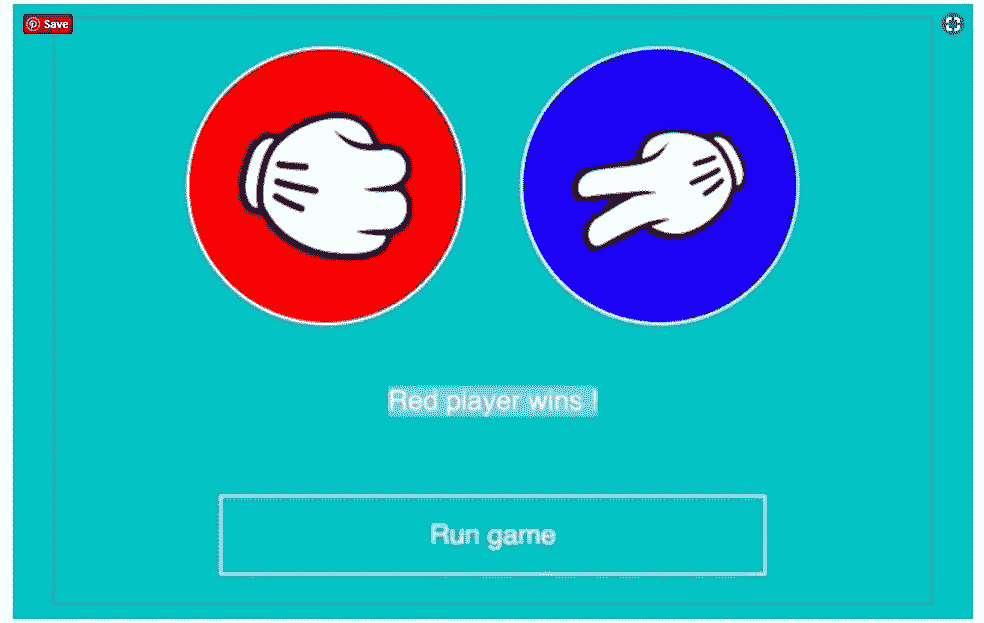

# 视频课程:学习 React——如何构建一个简单的石头剪刀布游戏

> 原文：<https://medium.com/hackernoon/learn-react-js-how-to-build-a-simple-rock-paper-scissors-game-b57ca663ec02>

我决定制作一个视频教程，看看 React 的基本概念如何一起工作，从头开始构建一个简单的 React JS 应用程序。为了好玩，我们将构建一个简单的游戏，如下所示:

React Js — Simple Game tutorial

当开始使用 React 或任何其他新的框架或技术时，我总是喜欢边做边学。通过制作一些可以展示给朋友看的小应用。比如游戏、联系人列表、计算器或交互式地图。

并且总是试图把一个大问题分成小部分。如果你是一个初学者，想想完整的应用程序是令人害怕的。我们的 React JS 游戏将需要显示一些基本的布局，对用户输入作出反应，绘制随机元素，做动画，决定谁赢了…等等。

但是如果，一开始，我们只需要展示一个红圈和一个蓝圈。这似乎更可行。在此之后，只需添加一个简单的按钮，什么也不做。添加了按钮后，让我们只让它在我们按下时显示一个基本的警告。诸如此类。

想一想……如果我们被要求建造一个非常简单的单间小房子。至少我们知道如何组装一些砖块。这听起来肯定比要求建造一座完整的摩天大楼更容易实现。编程也是一样。在本教程的每一部分，我们都将为我们的项目添加更多的砖块。

本 React 教程使用 create-react-app，由 3 个视频截屏组成:

# 第 1 部分:项目设置、基本 React 组件和使用 React 内联样式

我们将从起始 Javascript 文件的基本描述开始。在第一部分结束时，我们的应用程序将拥有一个基本的玩家卡 React 组件，并将使用 React 内联样式将蓝色和红色分配给玩家卡。

# 第 2 部分:在 React 中生成随机数，添加背景图像并使用 setState

我们将添加到 React 示例中的下一个构建块是选择一些随机元素，并使用 setState 更新组件状态。最后，我们将再次使用 React 的内嵌样式来添加背景图片。

# 第 3 部分:使用 setInterval 和 React 制作动画并决定游戏赢家

最后一部分也是最复杂的一部分。我们将看到如何使用 Javascript 中的旧 setInterval 函数来构建洗牌动画，以及如何设置 React 状态以显示谁赢了游戏。

如果你想下载教程每个部分的完整代码，你可以从[这里](http://www.js-craft.io/course/game-with-react-tutorial/?utm_source=medium-rps)下载。本教程使用的是[创建-反应-应用](https://github.com/facebook/create-react-app)。如果你需要它，你可以在这里找到[一个关于如何设置它的简短教程](http://www.js-craft.io/blog/06-Geting-started-with-the-code-samples-and-create-react-app/)。

# 附加练习

所以如果你想在这个教程上展开？您可以尝试添加新功能，如:

*   为玩家设置名字
*   使得一个玩家能够由人类用户控制，并且能够从键盘选择玩什么符号
*   为玩家添加头像图片

*有兴趣了解 React 和 Javascript 的更多信息吗？* [*注册我的邮箱列表*](http://www.js-craft.io/newsletter/) *这样我就可以和你分享接下来的截屏和教程了！
欢呼快乐编码！*