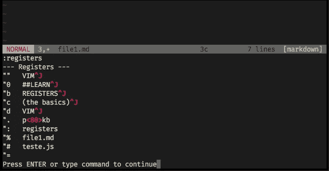
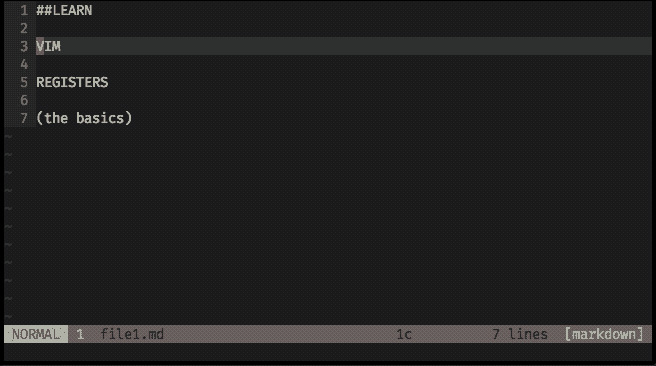
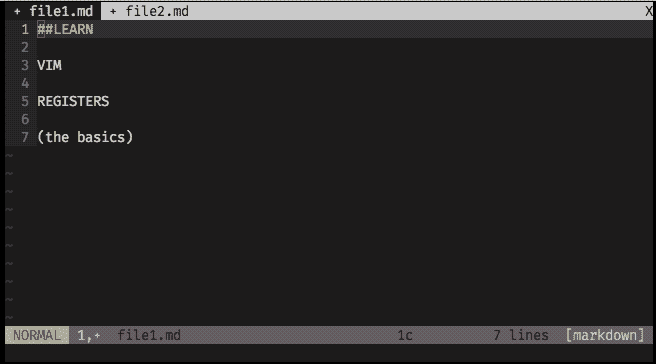
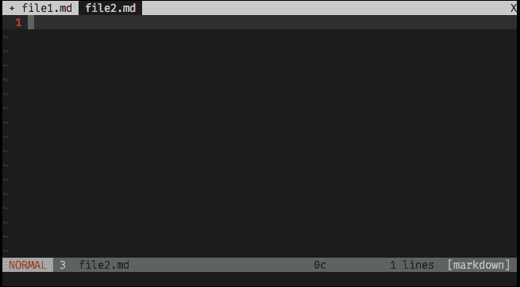
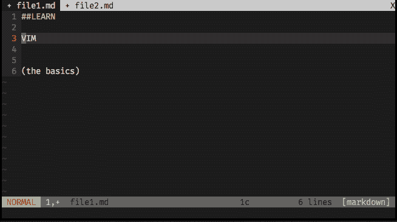

# 学习 Vim 寄存器的基础知识，您信任的本地剪贴板！

> 原文：<https://medium.com/hackernoon/learn-the-basics-of-vim-registers-your-trusted-native-clipboard-7d79d097f6a2>

## Plus:一次清除所有寄存器的命令！

the command :registers lists the registers that are being used

您可能非常自信地在 vim 上剪切(`x`)、复制(`y`)和粘贴(`p`)，现在是时候使用寄存器将这些操作提升到另一个层次了！

事实上，当您执行前面提到的操作时，寄存器已经在使用了。vim 上到处都有 Registers！当你拉、删除、粘贴、剪切，当你编辑文本，当你在正常模式下输入命令，这些都被记录下来。

Vim 有 9 种具有不同特征的寄存器(*你可以检查输入* ' **:帮助寄存器**')，但是我们不会太深入，我们将把重点放在基本寄存器上，即**命名寄存器。**

# 什么是 Vim 寄存器？

您可以将寄存器视为 vim 上的一个[功能](https://hackernoon.com/tagged/functionality)，它的存在是为了存储信息。Vim 用它[记录你输入的](https://hackernoon.com/tagged/registering)命令、你打开的文件、你输入的文本等等。vim 所做的是在您工作时将所有这些数据保存在一个`.viminfo`文件中(*放松，您永远不需要碰这个文件*)。

Vim 允许您使用这个功能，这个**强大的剪贴板**，在不同的地址存储不同的文本，比如:

`"a — Hello,`

`"b — World`

`"c — Again!`

…甚至允许您在已经填满的寄存器上添加更多文本:

`"a — Hello,` + `to all the people` = `"a — Hello, to all the people`

…然后它就在那里，保存在您的剪贴板上，您可以随时随地粘贴它。

# 如何使用它:

在所有不同类型的寄存器中，我们将集中使用名为的**寄存器，从`a`到`z`。你可以用这 26 个字母作为地址来保存剪贴板上的文本，以后调用你想要粘贴的特定地址。**

## 你习惯做的事:

*   复制(猛拉)一行:`yy`
*   删除一行:`dd`
*   粘贴复制的行:`p`

关于寄存器的事情几乎是一样的，你只需要在输入命令之前设置你将要使用的寄存器。

## 如何保存物品:

你只需要键入`"` +你选择作为你将要保存的特定文本的地址的字母，然后键入你将要使用的命令。

假设你想复制第一行并把它存储在寄存器`d`中，你可以在这一行输入:`"dyy`

the line 1 was saved at register d

现在，您希望将第 3 行保存在寄存器`a`中，删除第 5 行，但将其保存在寄存器`g`中:

*   转到第 3 行，键入`"byy`
*   转到第 5 行，键入`"gdd`

line 3 was stored on register b, and line 5 was deleted but saved on register g

*(你可以随时使用* `*:registers*` *命令预览你的剪贴板)*

## 如何粘贴东西:

录制注册表的方式与粘贴注册表的方式相同。如果要粘贴第 1 行(存储在`d`上)，然后粘贴删除的第 5 行(存储在`g`上)，键入`"dp`和`"gp`。

you can paste it to other files / buffers too

## 将文本追加到已填充的寄存器:

很容易将更多的文本添加到已经有文本的命名寄存器中。要做到这一点，你需要在执行操作时使用大写字母。

假设您想要删除第 6 行，但是在已经有文本的寄存器`b`上追加文本，然后，您想要将这个新的`b`寄存器粘贴到另一个文件。

*   转到第 6 行，键入`"Bdd`
*   转到另一个文件并键入`"bp`

> 搞定了。你已经学习了寄存器的基本用法。这足以给你更多的灵活性，提高你的生产力，你已经打开了新的大门。现在您可以点击“`:help registers` ”了解更多信息！

## 特殊技巧:清除所有寄存器！

Vim 将寄存器传送到其他会话，它将所有寄存器保存在`.viminfo`文件中，如前所述。

如果你不想得到一个凌乱的剪贴板，或者你只是想在一些会话中重新开始，有一个脚本你可以添加到你的`.vimrc`文件中来创建这个命令`:WipeReg`，它将总是在你想要清除所有寄存器的时候。

*   打开您的`.vimrc`文件，将该命令粘贴到一行中:

`command! WipeReg for i in range(34,122) | silent! call setreg(nr2char(i), []) | endfor`

*   每当你想收拾桌子的时候，就打字！

*(此招被贴在栈溢出，* [*【谢拉克】*](https://stackoverflow.com/a/41003241) *)*

## 有用的链接和参考:

*   堆栈溢出:如何有效清除 Vim 寄存器？
*   [Vim 文档](http://vimdoc.sourceforge.net/htmldoc/help.html) ( `:help`)
*   [“快速掌握 Vim”](https://gumroad.com/a/3282035)Jovi ca Ilic 的书(和截屏)。这是一本很棒的书，确保你订阅了时事通讯，在你的电子邮件中获得免费的 Vim 技巧和书籍摘录。

*(👆这是一个附属链接。如果你从这篇文章中获得了任何价值，并且也有兴趣购买 MVQ 书籍/截屏，请考虑访问会员链接，你会送我一杯☕咖啡或啤酒🍺。)*

## 脚注:

*   如果你对这篇文章有任何疑问或建议，我很乐意知道并在评论区讨论。
*   *你还有其他 vim 小技巧吗？你愿意在这个博客上发表吗？请发送电子邮件。*
*   *由于英语不是我的母语，我为这些错误道歉。欢迎指正。*
*   *联系人:****vim*******@*******all drops*******。*******信息*** *。*****

***最初发布于*[*Vim Drops*](/vim-drops/vim-registers-the-powerful-native-clipboard-19b1c97891bd)*2018 年 4 月 16 日。***