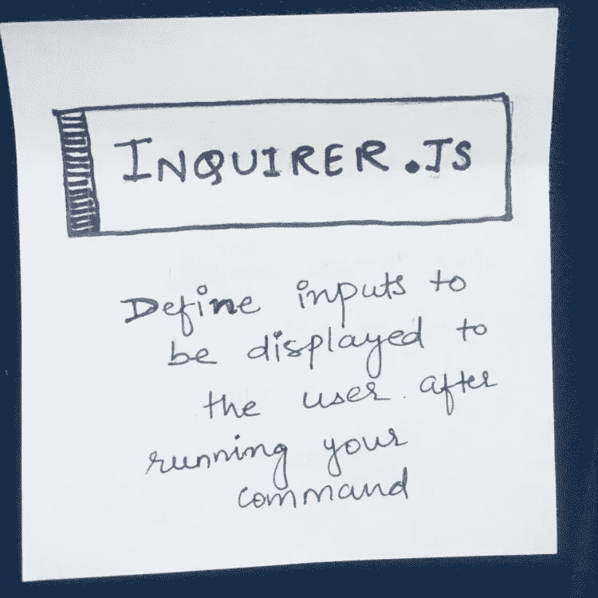
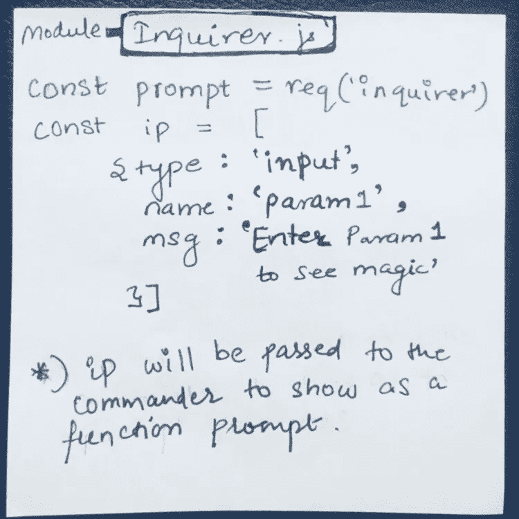
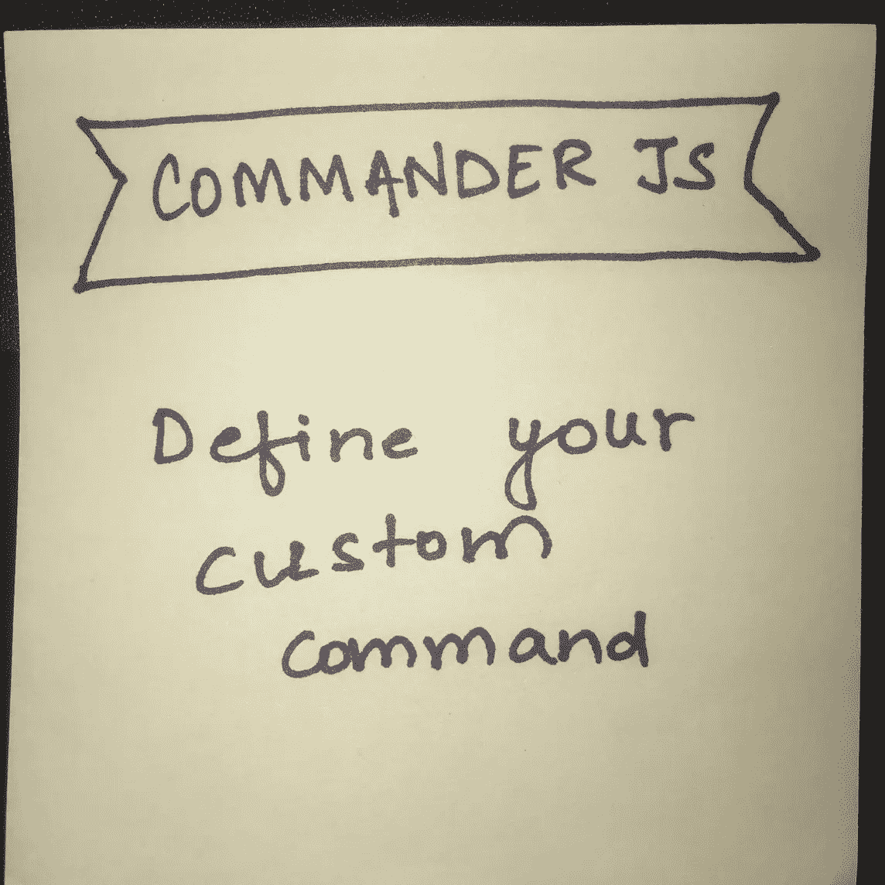
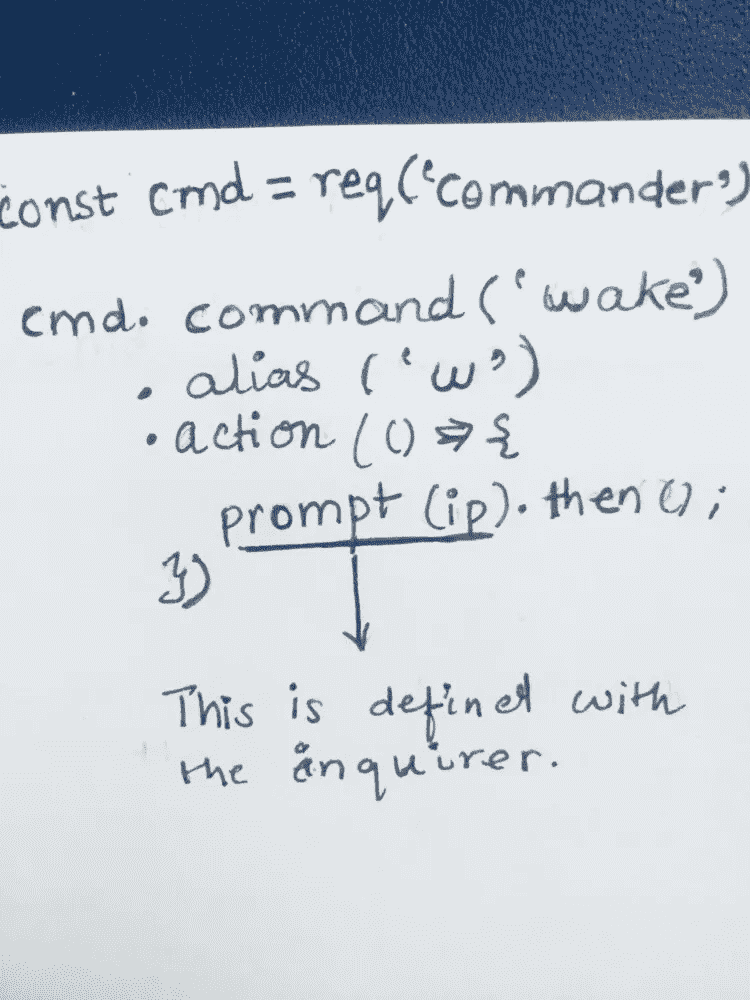
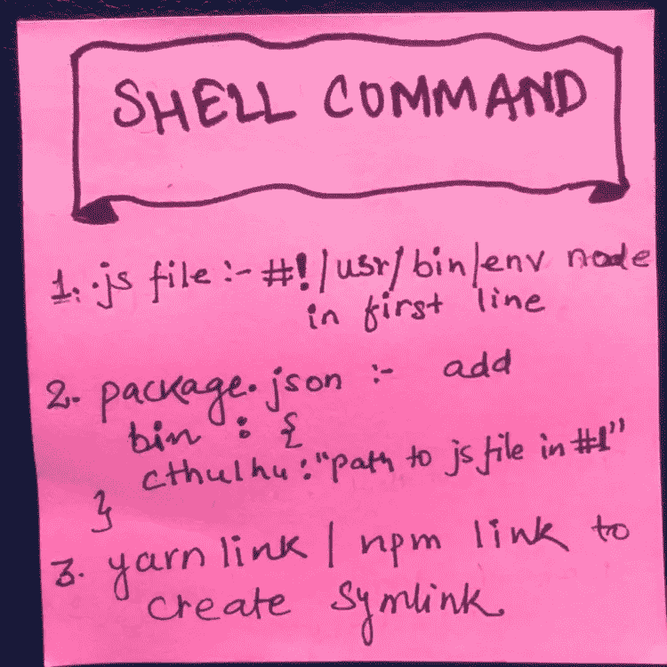

# 学习使用节点和 5 个便笺创建自定义 CLI 工具。

> 原文：<https://medium.com/hackernoon/learn-to-create-custom-cli-tool-with-node-and-5-sticky-notes-c80f044c6b2a>


It’s easy!

我正在浏览一些 React 文章，看到了 create-react-app 命令。这让我意识到我从来没有费心去检查如何创建你自己的 [CLI 工具](https://hackernoon.com/tagged/cli-tools)，比如 [Vue-Cli](https://github.com/vuejs/vue-cli/) 、 [create-react-app](https://hackernoon.com/tagged/create-react-app) 。所以我查了一下，给自己创建一个基本的 CLI 工具是非常容易的。

您可以在 package.json 中创建一个只有一个配置的最小工具，但是我想要一个基本的工具，有来自用户的输入以及多个自定义命令。所以我遇到了 [inquirer-js](https://github.com/SBoudrias/Inquirer.js) 和 [commander-js](https://github.com/tj/commander.js) 来做这件事。

**我们会创建我们的魔法命令“** [**克苏鲁**](https://en.wikipedia.org/wiki/Cthulhu) **”，然后我们会“唤醒”他。**

下面是询问器，它将用户的输入传递给命令。这里我在的**【提示】** **函数中创建了查询者，用户的输入提示在**“IP”数组**中。**



Take input from the user

一旦我们知道我们要通过 inquirer 问用户什么问题，我们就定义我们的定制命令。在这里我们创建命令**“唤醒”来唤醒我们的克苏鲁。**

********

**Define your own commands**

**现在是最后也是最重要的步骤:**

****

**Convert your own commands to shell commands**

**1.我们加上 **'** [**#！/usr/bin/env node**](https://stackoverflow.com/questions/33509816/what-exactly-does-usr-bin-env-node-do-at-the-beginning-of-node-files)**'**添加到 js 文件的顶部，在那里我们使用 commander-js 定义了我们的命令。
2。将下面一行添加到我们的 package.json 文件。**

```
"bin": {"cthulhu" : "path to file in point 1"}
```

**3.运行以下命令来构建符号链接:**

```
yarn link / npm link
```

**就是这样！这就是创建你自己的可能唤醒克苏鲁的命令所需要的。来吧，试一试。如下运行您自己的命令:**

```
cthulhu wake 1200
```

**[Vue-CLI](https://github.com/vuejs/vue-cli/) 在这里使用相同的模式[，在这里](https://github.com/vuejs/vue-cli/blob/dev/packages/%40vue/cli/bin/vue.js#L36-L48)定义主`vue`命令[。](https://github.com/vuejs/vue-cli/blob/dev/packages/%40vue/cli/package.json#L6)**

**我乐于学习并寻求建设性的反馈。如果你喜欢这篇文章，请提供反馈！**

**附注:感谢雷伊·达里奥原则为我的便利贴提供背景。下一步是学会拍出更好的照片。**