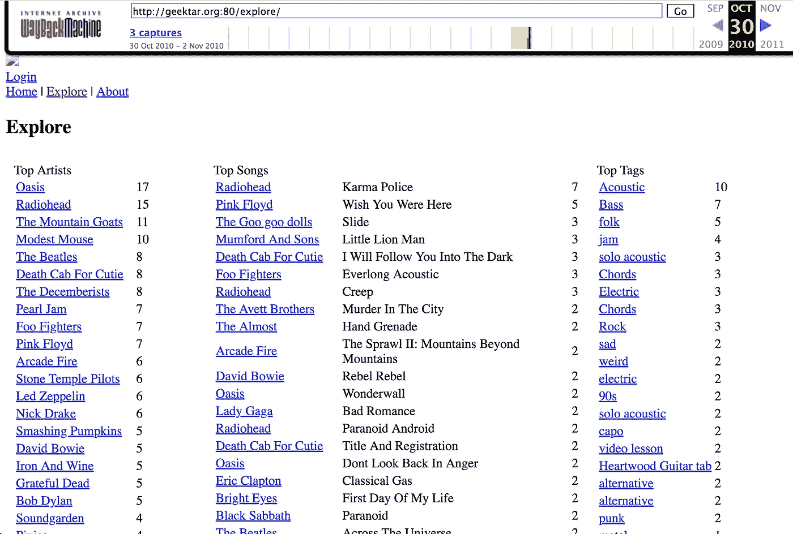

# 即使你们没有结对编程，也要在导航之前学会驾驶

> 原文：<https://medium.com/hackernoon/learn-to-drive-before-you-navigate-even-if-youre-not-pair-programming-9796c5c35b69>

十八岁那年的一天，我和另外二十九个男孩坐在一个小演讲厅里。这是我们在墨尔本大学获得计算机科学学位的第一天早上。一个男人——憔悴的，有点憔悴的——走进来，站在讲台上，扫视我们的脸，长长地叹了口气，说“[学](https://hackernoon.com/tagged/learn)打字。学 vim。”他开始说些别的，但随后只是摇摇头，走出了房间。我们很久以后才发现他是这个部门的负责人。

我记得当时想“我*会*打字，难道你*敢*告诉我用什么文本编辑器。”我打字和编辑文字的能力足够让我度过接下来的三年。我甚至从来没有想过要积极地做得更好。

自从我参加了有史以来最短的讲座以来，已经过去了十多年，我想我现在对他的动机有了更多的了解。这是我试图做得更好的尝试。

# 第一部分:我是如何差点丢掉第一份编程工作的

期末考试后几天，我订了一张去伦敦的单程票，并开始寄出我的简历，简历上列出了我在一个呼叫中心码书架、做数据录入和打电话的经历。我还链接了这个我做的叫做 [Geektar](https://web.archive.org/web/20101028082638/http://geektar.org/) 的小网络应用。它有大约 50 个用户。其中一个页面至少需要五秒钟才能加载，因为它不支持如此庞大的用户群。

在伦敦，开发人员的就业市场很好，几周之后，我就成了一名工薪族。运气好的时候，我喜欢我的工作，所有相关的人似乎都很高兴雇佣了我。但是我有糟糕的睡眠习惯。我会通宵玩电脑游戏。当你在堆积书架时，如果你是一个不睡觉的僵尸，这没什么大不了的，但出于某种原因，对我这个程序员来说，这绝对是地狱——不是指我被斥责的那种感觉，而是这种*的感觉*。

部分原因是 pair [编程](https://hackernoon.com/tagged/programming)，这在 2011 年的伦敦风靡一时，希望现在仍然如此。一个人“驾驶”电脑，另一个人“导航”。驱动程序的手放在键盘上，运行命令，编辑代码，刷新浏览器等等。导航员的工作定义不太明确，有点像“软件开发中的其他一切”，这是很多的。我工作过的所有地方的神圣仪式，以及每个人在聚会上谈论的事情(我结识新朋友的糟糕策略是去科技聚会，这可能是我这么长时间以来很少做爱的部分原因)是每半小时或 45 分钟交换一次角色。

当导航时，你必须说很多，向司机解释你想让他们做什么，并证明这一点——特别是当你是新手，几乎不知道自己在做什么的时候。大多数高级开发人员将会有一段极其艰难的时间来默默地服从一个 21 岁的人的指令，这是有充分理由的。

不睡觉的时候，说话能力一落千丈，思维似乎也慢了下来。在那些日子里，当轮到我导航时，我感到非常焦虑。当时我并没有从那个角度考虑，更多的是我有一种强烈的冲动想让*逃走*。很多时候，我会告诉同事我生病了，然后回家。我试过独自编码。但是现在我不得不在自己的大脑中导航*和*驱动器，没有任何有经验的开发者的帮助或建议。这是超级低效的。很快，如果我睡不好，我就根本不会去办公室。我想让每个人都认为我是一个神童，以我能力的一小部分进入会粉碎这种幻想。

但这不是一个可持续的策略。我独自一人在一个陌生、艰苦的城市，没有朋友，只有昂贵的定期租约。如果你不再出现，最终他们会停止给你钱，至少我是这么听说的。

这花了一段时间，但最终我意识到，在那些糟糕的日子里，当我驾驶*时，我没有那么焦虑。少说话，少抽象理论，多肌肉记忆。所以我问我的搭档是否介意我开车。我也改变了我的做法。我喜欢争论，我喜欢思考软件是如何编写的，所以在最初的几个月里，当导航员说“让我们这样做吧”时，我会说“哦，但是*为什么是*？”让我们偏离轨道五分钟，部分是出于好奇，但可能更多是因为 a)我想展示我很聪明，b)我想更多地参与到创作过程中，在代码库上打上我的印记。*

当我停止这样做时，我们会完成更多的事情，而不会明显降低我们的输出质量。我也是白天出来的，少交了很多税。不要误解我的意思:操作电脑并不是一件简单的事情(我马上会详细说明)，但这肯定比一边打字一边和聪明人辩论要轻松得多。当我们停下来喝杯茶时，有很多机会进行辩论。

我用节省下来的额外精力和意志力开始去健身房，这有助于我的睡眠，而且我在晚上不太担心让我的团队失望或失去工作，因为我每天都出现，让自己变得有用。

# 第 2 部分:早期对驾驶的关注如何帮助我的职业生涯

我在伦敦的几个不同的地方工作过，和一群不同的开发人员一起，但谢天谢地，我从来没有在一个地方强迫你和一个特定的人配对。我喜欢选择和谁一起工作。许多年长的人喜欢独处，因为这是他们习惯的，在他们被迫指导初级开发人员的工作中，这是一种负担，他们通常喜欢快速完成工作，这样他们就可以回家陪妻子和孩子。(顺便说一句，如果我谈论所有这些男性开发人员的方式让你感到奇怪，那是因为我在伦敦的整个时间里没有和一个女性程序员一起工作过。)

所以，许多最优秀的程序员都很粗暴，不希望一个朋克大学毕业生整天坐在他们旁边，更别说一个还没有学会正确的英国礼仪的澳大利亚人了。但是我对他们很着迷，灰胡子。似乎所有这些积累的智慧要么是从早期的计算工匠传下来的，要么是通过几十年的痛苦教训获得的。

“给我一些吧”，现在 22 岁的我想。我得到了一些。但是先说一句:

# 称之为“驾驶”听起来很容易

编程包括与计算机交流。但是你见过[雨人](https://en.wikipedia.org/wiki/Rain_Man)吗？还记得汤姆·克鲁斯是如何给达斯汀·霍夫曼下达基本指令的吗？他会过于认真地执行指令，或者无视指令，然后跑去做不方便的事情。汤姆·克鲁斯会大发雷霆，追着达斯汀，收拾残局，然后对他大喊大叫，这似乎只会让他蜷缩成一团，反复说些奇怪的话。这就像和电脑说话一样，只不过汤姆·克鲁斯轻松搞定了。

因为在现实中，你不是在与“计算机”对话，你实际上是在与无数不同的工具互动，这些小雨人，每个人都有自己独特的方式来解释你，制造混乱，有时做他们的工作。它们对同样的事物都有不同的名称，或者对细微或完全不同的事物有相同的名称。随着开发人员发布新版本，这些程序会随着时间发生显著变化。他们不只是在和你说话，他们都在你的电脑上互相交流，甚至在地球另一边的电脑上。

现在，假设你叫 Matt，已经做了三十年的开发人员。你在一个典型的早晨起床，开始煮咖啡(你已经喝了几杯了，只是想激发通勤的动力)。你的经理(出于某种原因，他现在被称为“scrum master ”)告诉你，有几个不同的用户报告了你帮助运行的网站上的奇怪错误。这是一个问题，因为你花了你的通勤时间来思考你昨天正在处理的问题，将整个事情加载到你的大脑中，现在你必须卸载它并加载其他东西，并且任何被描述为“奇怪”的事情通常至少需要一整天来解决。

一旦你开始收集信息。这些用户到底说了什么？他们在哪个时区，是在手机上还是笔记本电脑上？可能涉及的任何计算机的日志文件中是否报告了错误？你能让问题再次发生吗，用一种不影响用户的可控方式？代码的哪些部分会与这个问题相关，当你观察它们时，会发现有什么明显的问题吗？以前发生过这样的事情吗？

这些只是你可以直接问的一些问题，每个问题的答案本身都会引出更多的问题。

在一个理想的世界里，你可以问一个人工智能这些问题，并立即得到答案。我们还没有到达那个理想的世界，所以你需要*在你的电脑上做*各种事情来自己找到答案。你需要*做的事情*包括通过打字，有时点击，与许多前述的小雨人“交谈”。大家最熟悉的 Dustins 是浏览器，让我们强调一下复数，因为如果你认为 Firefox 和 Chrome(等。等。)用同样的方式告诉你事情，你会陷入痛苦的世界，而这还是在你考虑到你 Mac 上自称为 Safari 的东西根本不是你 iPhone 上的那个霍夫曼之前。

这还只是浏览器。到一天结束时，如果这是一个棘手的 bug，Matt 将与不同的操作系统、shells、HTTP APIs、文件系统、“活动监视器”(没有更好的术语)、窗口管理器、身份验证系统、bug 跟踪器等等进行讨论。如果你不知道这些东西是什么，请不要停止阅读，只要知道它们只是 Matt 需要知道如何回答问题的一些工具，这样他就可以停止用户的抱怨。这需要大量的点击和输入，并且准确地知道*该点击和输入什么。*

而这只是为了调试！当你谈论设计和编写新软件时，需要知道的事情会发生变化。

现在，在奇怪的错误的一天，区分几十年经验的马特(如果他值得他的盐)的真正技能是他整理来自他脑海中各种雨人的信息的能力，并开始制定假设，并逐一推翻它们，直到他到达可以暂时称为真相的地方。这是科学方法的一种最纯粹的应用形式，当你很容易获得你需要的数据时，这可能是一种令人着迷的活动，那种你到了午餐时间，你很饿，但你实际上*希望*继续工作，因为你*好奇，*并且你正在使用你大脑中最好的部分。你进入心流，这比最好的电脑游戏要好，然后人们拍拍你的背，给你钱。

但是前面那句话的关键部分是“当你可以轻松访问数据的时候”。因为大多数时候它不在你的脑海中，而是在达斯汀·霍夫曼的各种化身之间共享，很难准确地记住如何让他们每个人平静下来，你必须在写得很差的手册中查找神奇的单词或检查他们的代码，这些代码可能是用你从未使用过的语言编写的。它破坏了你的流动。你就要找到这个难题的答案了，但是你不得不把所有的东西从你的脑海中卸下来，为一个你几乎从来没有用过的工具加载文档。

# 成为我们希望拥有的人工智能编程助手

在上面的场景中，设身处地为 Matt 着想。如果你旁边有一个求知欲很强的年轻毕业生，他知道一堆这些工具，并愿意为你打字和点击，会怎么样？当您遇到需要重新阅读其手册的工具时，谁会在您泡一杯茶并仔细思考您目前所知的内容时阅读手册并提取相关信息？是谁解除了达斯汀·霍夫曼强加的认知开销，让你可以很好地利用那些来之不易的抽象问题解决技能？一个似乎能让你加速而不是减速的孩子。

对于你和那些遇到奇怪错误的用户来说，这可能会造成好的一天和坏的一天的区别。

在那个假设的场景中，我并不是理想的渴望的毕业生，但我最终变得更像他，这意味着优秀的开发人员积极地想和我结对，教我东西，并在酒吧里和我分享战争故事。在喝茶休息的时候，我会问一些关于这份工作更高层次的问题。我把这些都存了起来“但是为什么要这样呢？”我在开车时的想法，在不影响我们交流的时候问他们。

每当与我配对的人给我一个我不理解的指令(“ssh 进入服务器”)并且必须用更明确的术语解释它(“去终端。键入宋承宪 185.199.109.153。按回车键。)它给了我关于我驾驶技术差距的信息。我不需要问这个问题“为了变得更好，我下一步应该学什么？”因为我每天都在面对这个问题的答案。

我可以明显地看到我在放慢我们的速度，因为我的配对伙伴不会“嗯嗯”一声，抬头看着天花板想——他会耐心地等待(或者烦躁地敲着手指，取决于是谁)。这是我以后花一些时间练习的暗示，比如说，我的键盘技能(顺便说一句，传统的打字老师不是在技术世界中更好地使用键盘的最好方法，但这是另一个话题)，或者了解更多关于我的文本编辑器，或者平铺窗口管理器，或者键盘快捷键……一切，或者所有其他可以大大加快我与雨人互动的方法。

众所周知，很难知道你在软件设计的高层次部分是否越来越好。这需要几十年的时间，反馈循环很长，没有人真正知道如何有效地教授它。但是潜移默化似乎有所帮助。您希望通过构建有价值的、维护良好的复杂系统，向那些已经证明了自己技能的人提供大量高带宽的机会。

你可以通过驯服你的自我(我仍在努力)和为这些人做一些不那么迷人的工作来达到这个目的，这样他们才会真心希望你在他们身边。花时间学习在终端按 ctrl-a 将把你移动到起点，这并不性感、不酷也不高贵，但是如果你仍然是一个相当初级的开发人员，这比阅读另一场关于动态与静态类型的辩论，或者进行另一场关于深度学习的 Coursera 课程，甚至阅读关于软件设计的经典书籍更有可能帮助你。

这不仅仅是为了获得更多的经验来更快地升级，这是一个赚更多钱的好方法。当你不在的时候，你想让他们感觉失去了一条肢体。截肢者愿意花很多钱买假肢。

# 您可能对上述内容有所顾虑

## 没有人在我的工作场所结对，或者至少没有人和我结对

说服某人。提高你的驾驶技术，礼貌地问他们你是否能试着为他们开车(或者他们是否介意过来帮你编码)，并向他们展示你真的能让他们加速。如果你不加快它们的速度，你会很快找到原因，那会给你工作的动力。好起来，再问。

如果他们甚至不愿意给你一个和他们一起工作的机会，考虑试着找一个不同的地方工作。

## 我是一个单独的程序员。我周围几乎没有可以配对的人。这个建议对我没用。

试着想象你脑子里有两个人:司机和领航员。导航员很有可能感到厌烦，因为你花了很长时间来回答他们的问题(可能是，例如，“如果我把这个函数的一部分拆分成一个单独的函数，它看起来怎么样？”).他们可能会开始忽略或开始考虑其他事情(例如，我想知道黑客新闻上是否有有趣的东西？)，或者他们可能会放弃，甚至懒得回答这个问题，从而让您的代码库变得更糟。