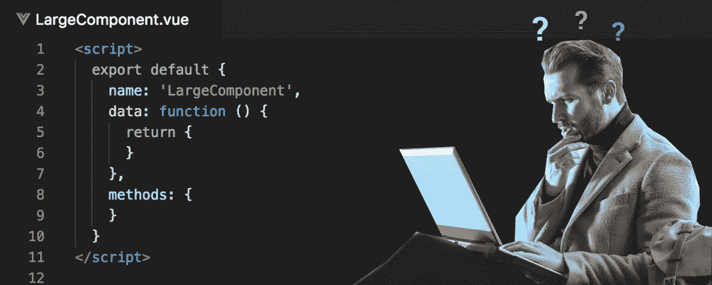

# 在 4 分钟内学会管理大型 Vue.js 组件

> 原文：<https://medium.com/hackernoon/learn-to-manage-large-vue-js-components-in-4-min-64fc2b9b2ef9>

在我看来，Vue.js 是目前最好的 js 框架。我最喜欢的特性之一是`.vue`单文件组件。管理较大的组件会变得非常困难，尤其是当您开始创建定制的子组件并添加静态资产时。这里有一些我试过的东西，你可能也会喜欢。



Figure 1: You when handling large components before reading this post.

## 一些快速基础知识

这可能是你的常识，但以防万一:

*   使用 PascalCase 文件命名。
    *举例:* `ComponentName.vue`
    [单据引用](https://vuejs.org/v2/style-guide/#Single-file-component-filename-casing-strongly-recommended)
*   为基础组件添加默认单词，如 App、base 或 V.
    *示例:* `AppTable.vue`
    [文档引用](https://vuejs.org/v2/style-guide/#Base-component-names-strongly-recommended)
*   用`The`给组件加上最多一个活动实例。
    *举例:* `TheLargeComponent.vue`
    [doc 引用](https://vuejs.org/v2/style-guide/#Single-instance-component-names-strongly-recommended)
*   总是为你的组件使用多词名称。前缀`App`或`The`简化了这一点，但对所有组件都这样做。这是为了避免与总是一个单词的标准 HTML 标签冲突。
    *举例:* `MainModal.vue` *代替* `Modal.vue`
    [doc 引用](https://vuejs.org/v2/style-guide/#Multi-word-component-names-essential)

## 通常是怎么做的。

这种情况我见得太多了，对于大型项目来说，这简直就是一场噩梦。所有组件都在`components`文件夹中，所有资产都在一个中心资产文件夹中，单实例子组件仅通过其父组件的名称作为前缀来表示(这在 2 层之后变得非常有趣)。通常看起来有点像这样:

```
components
|--LargeComponent.vue
|--LargeComponentModal.vue
|--LargeComponentModalTextSection.vue
|--LargeComponentModalTextSectionTitle.vue
|--LargeComponentModalButton.vue
|--LargeComponentModalButtonText.vue
assets
|--img
|  |--large-component-banner.png
|  |--large-component-button-bg.png
```

好了，这显然变得很混乱，我们如何解决这个问题？让我们进入第一个选项！

## 1.将组件放在它自己的文件夹中。

我尝试的第一个选择。将文件夹命名为`LargeComponent`，并将原始组件放入其中。这里你可以做两件事。

首先，您可以命名组件`index.vue`，其中*可能*在您的构建系统中工作，并且具有不改变您的导入语句的巨大好处。这真的很方便，但非常粗糙，不是最稳定的解决方案。**注意:如果您在导入中指定文件扩展名，如** `**LargeComponent.vue**`，这不起作用

```
components
|--LargeComponent
|  |--index.vue
|  |--components
|  |  |--LargeComponentModal.vue
|  |--assets
|  |  |--img
|  |  |  |--banner.png
```

其次，你可以用它的父文件夹来命名它，这样就可以保留它`LargeComponent.vue`，这可能是最明智的选择。这确实改变了从`./components/LargeComponent`到`./components/LargeComponent/LargeComponent`的输入，这并不理想。

**职业选手的**

*   “组件”文件夹中的所有项目都指示并代表一个组件。
*   其他开发人员很容易理解。
*   子组件和资产可以用干净的相对导入来导入:`./assets/img/banner.png`

第二种方法看起来很像这个，可能也是最简单的方法:

## 2.将文件夹放在 vue 组件旁边。

此解决方案在指定文件扩展名方面没有问题，并且不会更改导入。

```
components
|--LargeComponent.vue
|--LargeComponent
|  |--components
|  |  |--LargeComponentModal.vue
|  |--assets
|  |  |--img
|  |  |  |--banner.png
```

文件本身的导入看起来有点复杂，但也非常清楚:`./LargeComponent/assets/img/banner.png`。这也使得主组件文件夹看起来更杂乱，但不一定更不清楚。

**职业选手的**

*   适用于所有构建系统，非常简单。
*   其他开发人员很容易理解。
*   为组件创建文件夹时不更改导入。

最后，如果您使用没有指定文件扩展名的导入，还有一个我非常喜欢的不常见的例子:

## 3.将一个`index.json`放到你的组件文件夹中

非常简单，您只需将这个`index.json`文件放入您的组件文件夹:

```
{
"name": "MY_COMPONENT_NAME",
"private": true,
"main": "./MY_COMPONENT_NAME.vue"
}
```

这负责正确解析导入。您可以在 components 文件夹中保持一个整洁的结构，每个元素代表一个组件。您将得到这样的文件夹结构:

```
components
|--LargeComponent
|  |--index.json
|  |--LargeComponent.vue
|  |--components
|  |  |--LargeComponentModal.vue
|  |--assets
|  |  |--img
|  |  |  |--banner.png
```

这具有上述方法的所有优点，但是当使用指定文件扩展名的导入时，它有点模糊，并且失去了它最大的优点之一。

**职业选手的**

*   为组件创建文件夹时不更改导入。
*   所有组件数据都包含在一个文件夹中。
*   相对进口更干净。

## 奖励回合:给 Vue 路由器用户的提示

在构建 SPA 时，我非常喜欢将单实例组件放在对应于它们所属页面的文件夹中，就像这样:

```
views
|--SubscribeView.vue
|--SubscribeView
|  |--components
|  |  |--TheHeader.vue
|  |--assets
|  |  |--header-image.png
components
|--AppButton.vue
|--AppButton
|  |--components
|  |  |--AppButtonText.vue
|  |--assets
|  |  |--img
|  |  |  |--button-background.png
```

## 就是这样！

感谢阅读，真的希望这有所帮助，如果你有建议和改进，请在评论中留下！

**建筑材料？我也喜欢制作东西，如果你想知道我在做什么，在 twitter 上关注我**[](https://twitter.com/will_rut)****！****

## **额外可选奖金回合:更多关于为什么！**

**我在 [Kasp](https://medium.com/u/6217774c82c9?source=post_page-----64fc2b9b2ef9--------------------------------) 的评论中得到一个问题，我认为这个问题解决了帖子中可能遗漏的一点信息。答案有点长，所以我决定把它放在帖子里。问题如下:**

> **为什么要根据实例的数量来分离组件？
> 我们目前开发 Vue 应用程序的方式(还没有变得那么大)是拥有一个组件文件夹和一个视图文件夹。每个视图本质上是具有一个或多个组件的页面。Components 文件夹严格地包含了应用程序的基本构建块。你能告诉我什么时候会变坏吗？我在想，当页面太多时，视图文件夹可能会被淹没。**

**首先，您可能想将单实例组件(SIC)与其他组件分开。这些 SIC 只是用来使构建你的页面更方便和分离逻辑。我真的很喜欢将它们包含在与视图耦合的组件文件夹中。没有其他组件会或者应该使用这些单实例组件，所以没有必要让其他视图/组件访问它们。除此之外，还有一个很大的优势，就是让视图本身更容易访问它们*和*，更清楚地表明正在发生的事情。**

**这开始使你能够使用组件文件夹，就像它听起来的那样:一个充满可重用组件的文件夹，你可以在你的应用程序中的任何地方使用，而不是一个充满以“”结尾的所有内容的文件夹。vue”并且不是顶级视图。**

**但你可能需要资产。当然是为了你更大的组件。把这些放在一般资产文件夹里很不方便。你*可以*把它们都放在主`/static`文件夹中，但是我个人认为为每个组件都有一个专用的文件夹是很好的，也更容易操作。**

**您可能已经猜到了这将会发生什么，但是您刚刚创建的用于保存该资产文件夹的文件夹是放置您正在为其创建该文件夹的组件的单实例子组件的最佳位置(最好是在一个…您猜到了`components`文件夹中！).同样，就像视图一样，没有其他组件会使用或应该使用这些视图，对于要使用视图的组件来说，应该尽可能简单明了。**

**谢谢你问这个问题，希望我的回答能澄清一些事情！**

**干杯！**