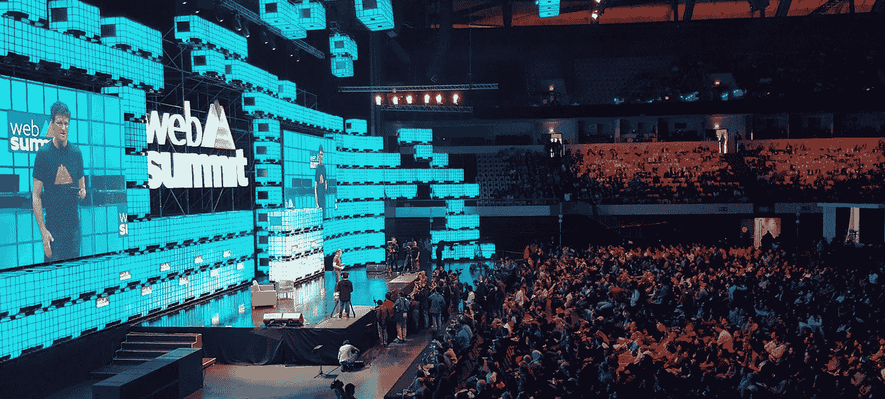
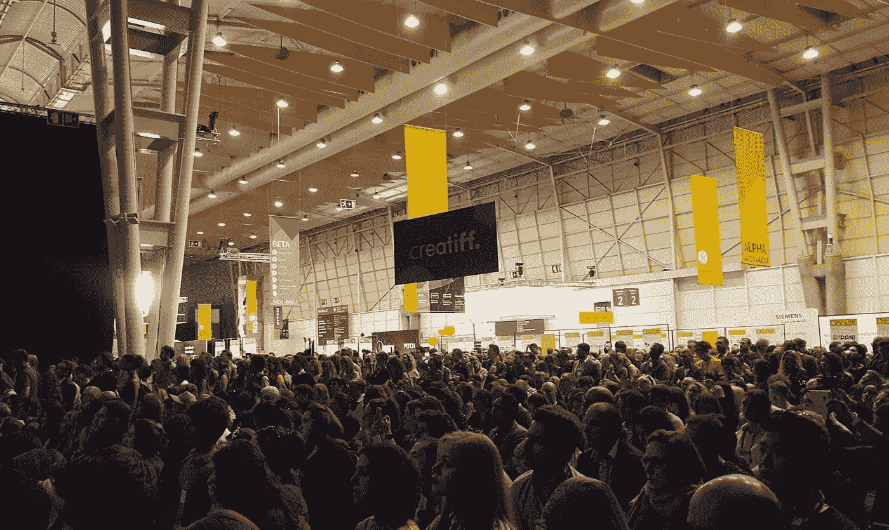

# 学会驾驭 2018 年网络峰会——选择闪光、樱桃或深潜

> 原文：<https://medium.com/hackernoon/learn-to-navigate-web-summit-2018-choose-glitter-cherries-or-deep-diving-1436b441f3f7>

Yes, you will be one of those dots too…

这是一年中的这个时候。Web Summit 发布了日程安排，和往常一样，对于许多人来说，在对排队感到兴奋之前，会感到不知所措。有太多的讲座，发生在太多的地方，对于第一次看时间表的人来说，很快就能抓住那些更有趣的。

事实上即使是第二次，第三次，第四次。除非有办法打破日程安排，设计出一个参加会议的计划，否则你就有可能从一个舞台跑到另一个舞台，而不能按时(或者根本不能)到达你真正应该观看的会议。

如果你到达时没有计划，你会筋疲力尽，带着模糊的想法和潜在的伤痕离开——这个区域很大，穿过几百米向四面八方走去的人，有可能进行不太愉快的互动。

The areas surrounding the stages will look like this, pick where you want to be wisely

这篇文章是为了帮助你(而作者是在帮助她自己)，在 Web Summit 的蜿蜒曲折中导航。去年，我分享了我为自己做的计划的电子表格，人们为此感谢我。所以让我们看看今年这是否也是有益的。

## 浏览网络峰会的三个策略:跟随闪光、摘樱桃、深潜

在我试图驯服时间表的过程中，我发现了 3 个策略，可以帮助我在这三天里稍微放松和专注一点，而不必经常查看应用程序来知道接下来是什么。

这三个策略在[电子表格](https://docs.google.com/spreadsheets/d/1FEouCTwfGXvozdfPCE2tHEz_kzaFbHL33yebPhac5hk/edit?usp=sharing)中被强调:黄色的跟随闪光，粉色的采摘樱桃，蓝色的深潜。

**1。跟随闪光** ✨ **是所有关于离开网络峰会的感觉，你听了你最想听的人的话**

这就是从一开始就选择你想见到的名人(或不太出名的人)演讲者，并知道他们将在何时何地出现。

对于这个策略，你确实可以利用 2018 年的应用程序。安装它，打开它，向下滚动扬声器列表。选择最能激励你的。在我的案例中，我选择了:

Medium 的 Ev Williams，《我的世界》的 Helen Chiang，网飞的 Greg Peters，Twitch 的 Emmett Shear，Mozilla 的 Mitchell Baker，Web Foundation 的蒂姆·伯纳斯·李，Google 的 Jacquelline Fuller。org，UFC 的 Paige VanZant 等等。

对于每一个人，我点击个人资料，选择他们将要做的演讲，并把它们添加到我在应用程序上的日程表中。

跟随闪光的轨迹完成了。如果我选择这种策略，并且我知道我想听的演讲者在哪里，我就不会因为错过了其中一位而感到难过。

**2。摘樱桃**🍒**就是提前挑选你最感兴趣的讲座(真的！)**

这可能看起来是最明显的，但是请相信我，当我说很多人会把它留给机会。选择离美食街最近的地方，如果他们刚吃过午饭的话。

我必须说，仅仅看标题很难理解演讲的内容。他们努力让它们听起来有趣，但有时它们太模糊，以至于无法基于此进行选择。

就像前面的策略一样，这是非常主观的，对你来说可能有趣的东西对我来说可能不有趣。但这里有一些标题引起了我的注意(虽然不一定是最有趣的)，我正在考虑在樱桃采摘轨道的时间表。

“在内部销售品牌”，“超越你的体重:多样性和小经济学”，“这是邻居；[科技](https://hackernoon.com/tagged/tech)中心的未来》、《算法世界中的创造力》、《我们需要数字人权宣言吗、“没有情感的科技，只是功能吗？”，不一而足。

我找不到会议的总体主题，会谈的主题看起来很分散，所以节省时间看看时间表，突出那些让你兴奋的主题，这将确保你不会带着机会决定给你的东西离开会议。

**3。深潜**🐡**在整个上午/下午，你是否在选择一个专业领域来加深对**的了解

这种方式有一个很大的好处，那就是你不必从一个阶段跑到另一个阶段，因为你会看到这个主题的所有演讲。

如果我选择这个策略，我现在的选择是:

*   11 月 6 日:上午在 PandaConf，下午在中心舞台
*   11 月 7 日:上午是内容制造者，下午是中心舞台
*   11 月 8 日:上午是论坛，下午是内容制作者

在你的脑海中，对于一天中的每一部分，有一个你可以去并停留更长时间的参考区域总是一个好的选择。万一你挑选的或跟随闪光的谈话结果不太好，你可以去你的参考区，等待一些给你更多灵感的谈话。

这就是了。花些时间自己弄清楚什么是你真正感兴趣的演讲者、演讲和专业领域，你会觉得不那么不知所措，更有时间享受那个时代特有的令人兴奋和充满活力的氛围。去过那里的人知道我在说什么😉

打印出[时间表](https://docs.google.com/spreadsheets/d/1FEouCTwfGXvozdfPCE2tHEz_kzaFbHL33yebPhac5hk/edit#gid=0)然后自己动手做，也许飞机或火车旅行会是做这件事的好时机。Web Summit 表示，它仍在不断变化，发言人仍在增加，因此电子表格可能需要在未来几天进行一些更新。如果你发现有什么地方需要改变，但还没有反映出来，请告诉我。

我留下了每个街区的开始和结束时间(上午和下午)，而不是每个特定街区的时间，因为它们都需要大约 20 分钟，并且按照比例精确表示所有街区，这将显示出赫库莱恩的努力，而没有多少额外的好处。有时，块之间有中断，但也没有显示，而是选择显示特定位置的主题的连续列表。

当然，还会有夜间峰会，这是在网络峰会期间由多个当地组织举办的一系列活动，包括晚宴、鸡尾酒会和聚会。我相信观众们已经很了解如何优先处理这个问题，这样就不需要电子表格了…🌙

一路平安，到时见！

PS:如果你对过去几届葡萄牙网络峰会感兴趣，你可能会发现这一届很有趣[我从 2017 年网络峰会上带回家的想法，即使是索菲亚也不能从我这里带走](/@AndreiaDomz/the-ideas-i-am-taking-home-from-web-summit-2017-that-not-even-sophia-can-take-away-from-me-82a00371323b)