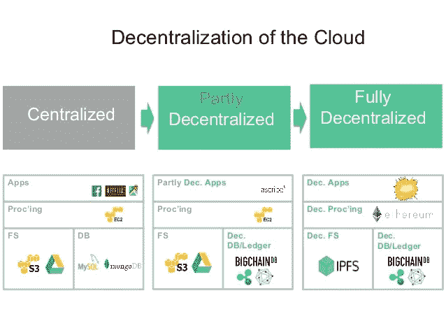

# 通过在 Web 3.0 上实际部署应用程序来学习 Web 3.0:实践方法(IPFS +以太坊)

> 原文：<https://medium.com/hackernoon/learn-web-3-0-by-actually-deploying-an-application-on-it-hands-on-approach-9141ad88588f>


“去中心化网络”或“网络 3.0”现在已经成为热门词汇，因为它们将给当今行业带来革命性的变化。但是我们当中有多少人真正了解 Web 3.0 呢？

在这篇文章中，我介绍了 Web 3.0 的显著特征。在对 Web 3.0 有了基本的了解之后，我们将一起在[](https://hackernoon.com/tagged/ipfs)**上部署一个应用。该应用具有运行在* [*以太坊*](https://hackernoon.com/tagged/ethereum) *虚拟机上的 Solidity 智能合约。以太坊+ IPFS 的结合使得应用程序真正去中心化。**

**

# *我们开始吧！*

## *为什么 Web 3.0 对我们很重要？*

*Web 1.0 是互联网的诞生，互联网上的大多数事情都是静态的。没有任何互动。一个人保持完全匿名，隐私保持完整，因为没有任何关键交易发生。互联网静得要命！完全不像我们今天所能想象的。然后在 20 世纪 90 年代出现了 Web 2.0。Web 2.0 催生了 Alphabet、亚马逊、微软等巨头。互联网上出现了数量惊人的互动，但个人隐私却被抛之脑后。*

> *在互联网上没有什么是受保护的和私人的。没什么。*

*Web 3.0 通过给予用户对他/她的数据的完全控制权来敦促恢复用户的隐私。Web 3.0 支持民主，而不是少数巨头的垄断。Web 3.0 的核心是去中心化，而不是集中化。从 Web 2.0 → Web 3.0 的转变将是渐进的。这不会一蹴而就。但是，最好的方法是提高人们的意识。当用户需求改变时，当前的业务需求也会改变。用户需要意识到他们是数据的主人！如果有人从他们的数据中赚钱，那应该是他们。*

> *如果你免费使用该产品；你就是产品。*

**

*Source: BigChainDB*

**

## *Web 3.0 的特性*

****→没有中心控制点:*** *像谷歌、微软、亚马逊这样的公司将不再拥有对你数据的控制权。任何政府机构都不能屏蔽网站和限制服务。区块链喜欢以太坊威尔黑尔。简而言之，中间商将完全被排除在外。**

****→数据所有权*** *:最终用户将重新获得对数据的完全控制权，并拥有加密的安全性。目前，像亚马逊和脸书这样的大公司拥有巨大的数据仓库，存储价值数十亿美元的信息，以改善他们的服务。**

****→黑客攻击和数据泄露大幅减少*** *:由于数据将被分散和分布，黑客很难找到进入系统的单一入口。**

****→互操作性*** *:应用程序将易于定制且与设备无关，能够在智能手机、电视、汽车、微波炉和智能传感器上运行。目前，应用程序是特定于操作系统的，并且通常局限于单个操作系统。例如，许多 Android 加密货币钱包在 iOs 上不可用，导致使用多种设备的消费者感到沮丧。它增加了负责发布软件多次迭代和更新的开发人员的费用。**

****→无许可区块链*** *:财富和其他数字资产可以在世界任何地方快速高效地跨境转移。**

****→不间断服务*** *:账户暂停和分布式拒绝服务大幅减少。因为没有单点故障，所以服务中断的可能性极小。数据将存储在分布式节点上，以确保冗余，多个备份将防止服务器故障或瘫痪。**

*查看区块链基金会的精彩[互联网了解更多！](https://iobf.co/)*

## *是时候动手学习了！*

*为了节省时间和文章的篇幅，我已经准备好了基本代码。首先，git 从我的 Github 页面克隆存储库。*

*[](https://github.com/niharrs/Blockchain-Voting) [## ni harrs/区块链投票

### 区块链-投票-由以太坊提供动力

github.com](https://github.com/niharrs/Blockchain-Voting) 

这是一个基本的投票应用程序，它在朋友之间举行一个投票竞赛，以及我是如何遇见你母亲的。(这两个都是非常有名的美剧。)我个人是喜欢朋友的！

要顺利运行应用程序，请确保您安装了以下软件:

1.  NodeJS
2.  块菌框架
3.  加纳切
4.  Metamask Chrome 扩展

确保 GANACHE 一直在运行。

要运行该应用程序，请打开控制台并输入以下命令:

```
$ npm install$ truffle migrate --reset$ npm run dev
```

第一个命令将从 package.json 文件安装必要的包。

第二个命令在 EVM 部署智能合同。

第三个命令启动本地主机服务器。

您应该会在屏幕上看到类似这样的内容:


让我们看看`Contracts`文件夹中的`Election.sol`智能合同:

当前应用程序的问题是它托管在集中式的本地主机上。

我们的想法是把它搬到 IPFS。

为此，首先你需要安装 IPFS。

然后在您的终端上运行以下命令:

```
$ ipfs init$ ipfs daemon
```


现在我们需要将 JSON 契约文件和`Src`文件夹放在一个名为`Dist`的单独文件夹中。创造它。

要做到这一点，运行以下命令(如果你在 MacOS 上将会工作)，否则可能手动完成。

```
$ mkdir dist
$ rsync -r src/ dist/
$ rsync -r build/contracts/ dist/
```

现在我们需要为 IPFS 同行蜂拥而至

```
$ ipfs swarm peers
```

现在我们终于把`Dist`文件夹添加到 IPFS 了。

```
$ ipfs add -r dist/
```


复制列表中最后一个`dist`的散列。现在我们需要发布散列

```
$ ipfs name publish QmaikVh9TuP3QCZwi4efAgHxRUniQzhNz5yN7b3KggALsc
$ ipfs name publish {hash}
```

此命令可能需要几分钟时间。

现在让我们访问我们在 IPFS 上的应用程序！

将你的网络浏览器指向:gateway.ipfs.io/ipfs/{hash}

对我来说，是:

**gateway . ipfs . io/ipfs/qmaikwh 9 tu P3 qczwi 4 efaghxruniqzhnz 5 yn 7 B3 kggalsc**

你应该看到这一点(有耐心):


The irony!

现在让我们投票吧！


I VOTED FOR FRIENDS and it works perfectly fine for me!

如果您想使用我的应用程序，请访问并投票。

[https://gateway . ipfs . io/ipfs/qmaikwh 9 tup 3 qczwi 4 efaghxruniqzhnz 5 yn 7 B3 kggalsc/](https://gateway.ipfs.io/ipfs/QmaikVh9TuP3QCZwi4efAgHxRUniQzhNz5yN7b3KggALsc/):链接投票！

您可以使用 MetaMask 和 Ganache 使用不同的帐户进行投票。

这是一个成熟的分散式应用程序。

如果你喜欢这个教程，请分享。

如果你有任何问题，请在评论中提问或发邮件给我，地址是**niharika.3297@gmail.com***