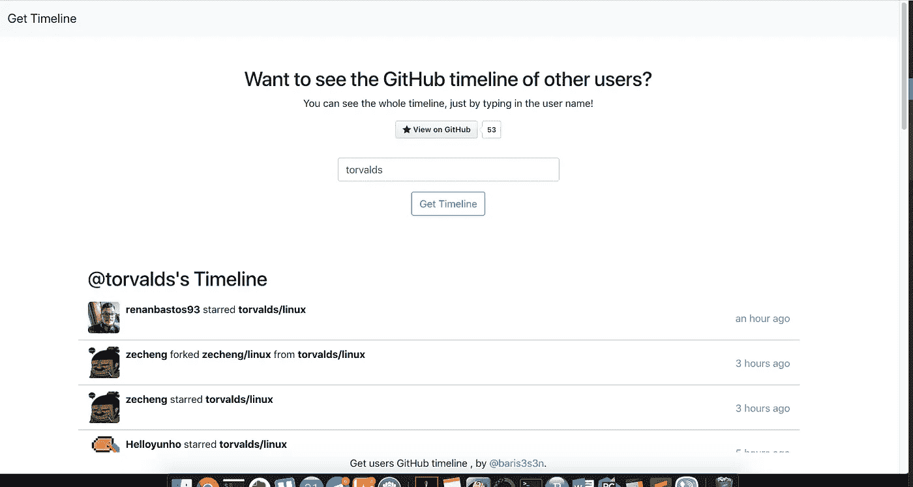

# 了解任何 Github 用户访问 Github 时看到的内容

> 原文：<https://medium.com/hackernoon/learn-what-any-github-user-sees-when-they-visit-github-c037bc379523>

你是否曾经想知道 Github 的某个特定用户是如何看待自己的时间线的？他追随谁，他主演的项目有哪些？你可以使用一个非常酷的网络应用程序找到这些问题的答案。

你所要做的就是访问 [*获取时间线*](https://githubtimeline.xyz/) 并写下 Github 用户的用户名，然后将在几秒钟内看到他们访问 Github 时实际看到的内容。你不必注册一个帐户就有这个机会。当然，这仅包括公共项目以及您可以看到的项目，而不是用户可以访问的每个项目。您无法看到它们属于哪个私有存储库，以及它们在那里提交了什么。

这可能是一个小工具，但它可能会对某人的好奇心有用。

我认为最好的学习方法之一是向最优秀的人学习，看到他们的提交以及他们所关注的项目和用户，这是一种很好的方式来抓住用户和吸引他们注意力的活动。

例如，如果你想看 Linux 内核的主要开发者 Linus Torvalds 的 Github 时间轴，你只需要在那里写下他的[用户名](https://githubtimeline.xyz/?username=torvalds)。

这是一个开源应用程序，你也可以看到它的[源代码](https://github.com/barisesen/github-timeline)。