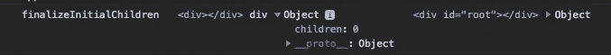
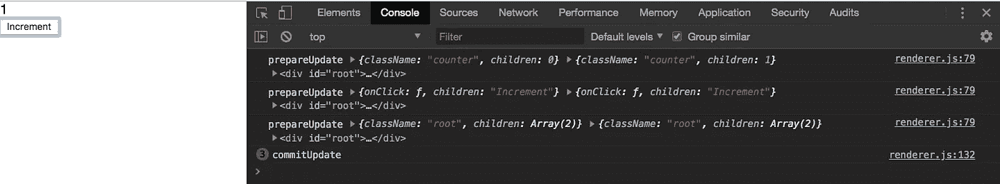
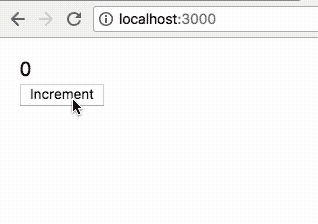

# 通过构建自己的轻量级 React DOM，了解 React Reconciler 包的工作原理

> 原文：<https://medium.com/hackernoon/learn-you-some-custom-react-renderers-aed7164a4199>


自从 [React](https://hackernoon.com/tagged/react) 被引入前端社区已经五年了。自从它发布以来，它已经为表达 UI 代码开辟了新的途径。通过 React 及其相关的生态系统，社区一直致力于解决客户端脚本的缺点，其中一项工作是 React Fiber，它使我们的应用程序开发人员能够简单地声明我们的代码看起来像什么，以及它应该如何应对数据的变化，同时它会在幕后计算对 UI 的必要更改。在这个过程中，它实际上会在很短的时间片内计算它们，而不是在 JS 线程中一次完成。

显然，很少有人知道(【https://twitter.com/dan_abramov/status/1009246589473390592】)将计算与更新调度本身分开的包——让我们编写自己的定制呈现器。事实上，react-reconciler，这个有问题的包，已经打开了全新的可能性。已经尝试确保 React 代码可以在基于 [firmata 的硬件](https://github.com/iamdustan/react-hardware)、[pdf、](https://www.npmjs.com/package/@react-pdf/core)、 [QML、](https://www.npmjs.com/package/react-qml-renderer)、 [Regl、](https://www.npmjs.com/package/react-regl)、[成帧器动画](https://www.npmjs.com/package/react-framer)中运行。

今天，让我们以 DOM 本身为目标，编写我们自己的微型 react-dom 呈现器。如果你足够认真地对待它，也许你可以在你的应用中用它代替 react-dom，并看到包大小和性能的提高。让我们开始吧。

首先，让我们使用 [Create React App](https://github.com/facebook/create-react-app) 引导 React 项目

```
npx create-react-app my-react-dom-project# Or if you use yarn
yarn create react-app my-react-dom-project
```

让我们将根应用程序组件修改得更简单一些，原因将很快变得显而易见。

运行的磨坊反应代码对吗？如果你对这里的任何东西都不熟悉，建议[让我们的 React 基础更强](https://reactjs.org/docs/hello-world.html)。此外，为了清晰起见，请暂时忽略 perf 问题。

接下来，为我们的自定义 dom 渲染器创建一个空文件，并将其命名为 renderer.js。(请忽略 gist 文件的名称)

并导入它而不是 index.js 中的 react-dom

错误，对吗？


那么，我们从渲染器——一个渲染方法——那里确切地知道我们需要什么呢？一个接受我们的 React 元素、容器 DOM 节点和回调的方法，对吗？我们手动反应我们的元素，容器节点，一个回调函数，然后 React 变魔术般地运行回调函数来表示它已经完成了它的工作。有了`react-reconciler`，我们可以控制一些魔法。

好消息是官方 ReactDOM 本身使用 react-reconciler 包。我们可以从那里得到暗示。

我们找到了 ReactReconciler(由包导出函数)

1.  需要一个配置。
2.  需要一个内部容器数据[结构](https://hackernoon.com/tagged/structure)来呈现
3.  使用我们的元素、容器的内部形式和渲染后要运行的回调函数运行`updateContainer`。

所以让我们试一试。

我们有以下错误。


毕竟我们的“hostConfig”是一个空对象！

请注意，在代码和散文中，所有对“主机”的引用都是指 React 代码将运行的环境。React 运行在移动端(Android/iOS)已经不是什么秘密了——React 只需要一个可以渲染 UI 更新的 JS 环境。在我们的项目中，宿主是 DOM 本身。

首先，什么是`now`？Internally React 需要一种方法来跟踪时间，例如计算是否已经“过期”或超出了分配的时间。请查看[林·克拉克关于 React 光纤的演讲](https://www.youtube.com/watch?v=ZCuYPiUIONs)以深入了解该主题。但是，有人会问“不能用类似`Date.now`的东西来反应吗？”可以的！但是主机环境可以提供更好的跟踪时间的方法。比如`Performance.now`？在这方面，所有的宿主环境可能不尽相同。无论如何，让我们现在使用`Date.now`并继续前进。

弄清楚`hostConfig`中发生了什么的一个好方法是查看 [ReactDOMHostConfig.js](https://github.com/facebook/react/blob/master/packages/react-dom/src/client/ReactDOMHostConfig.js#L87-L389) (在编写时)。我们会发现我们需要以下内容。

只需在其中添加一个日志语句，然后再次运行应用程序，就会得到以下结果。


`**getRootHostContext**` **和** `**getChildHostContext**`

这需要一点阅读和探索。比较官方 repo 上的渲染器，我们可以安全地得出这样的结论:React Reconciler 提供了`getRootHostContext`和`getChildHostContext`作为在其他配置函数之间共享一些上下文的方式。希望在后续的帖子中能有更多的相关内容。现在，让我们返回空对象。

`**shouldSetTextContent**`

有些宿主允许您在宿主元素上设置文本内容，而其他宿主可能要求创建新元素。现在我们简单地返回 false。

`**createTextInstance**`

让我们记录函数中接收到的所有参数。


这是他们的情况，

`0`=>`this.state.count`的初始值

`<div id="root"></div>`=>DOM 容器

{tag: 6，key: null，type: null，stateNode: null，return: FiberNode，…}` = >关联的纤程。我们不必担心这个。大多数时候，我们只需要将它传递给 reconciler。它被认为是不透明的。在我们简单的渲染器中，我们甚至不需要这样做。React 调用`createTextInstance`在主机环境中创建文本节点。所以干脆返回`document.createTextNode(text)`

```
createTextInstance(
    text,
    rootContainerInstance,
    hostContext,
    internalInstanceHandle
) {

    return document.createTextNode(text);
}
```

`**createInstance**`

再次记录我们看到的所有论点

1.  `type`=>DOM 节点的类型。如 div、span、p 等。
2.  道具= >道具通过。由于我们从未向应用程序中的 div 传递任何东西，所以只传递子元素。
3.  `<div id="root"></div>` = >根容器
4.  {…} = >纤维节点

类似于`createTextNode`，我们只返回一个 div 节点，即= > `document.createElement(type)`

```
createInstance(
    type,
    props,
    rootContainerInstance,
    hostContext,
    internalInstanceHandle
) {
    return document.createElement(type);
},
```

`**appendInitialChild**`


我们看到了没有设置属性的父 DOM 节点及其相应的子节点。在我们的例子中`.appendChild()`，使用我们主机的 api 将子元素附加到父元素是有意义的

```
appendInitialChild(parentInstance, child) {
    parentInstance.appendChild(child)
}
```

`**finalizeInitialChildren**`

这是争论

1.  `domElement` : `<div></div>`来自我们 App.js 中的`<div>{this.state.count}</div>`
2.  `type` : div
3.  `props`从`{this.state.count}`到`{ children: 0 }`它的初始值为 0
4.  `rootContainerInstance`
5.  `hostContext`

如果我们仔细查看日志，我们会发现`shouldSetTextContent`=>`createTextInstance`=>`createInstance`=>`finalizeInitialChildren` 发生在 App.js 中声明的每个元素上—

1.  {this.state.count}

3.  父 div:…

协调器试图在宿主环境中创建节点，在我们的例子中是 DOM！

`**finalizeInitializeChildren**`

它接收宿主中的 DOM 节点、类型、props 和根容器。如果我们从这个函数的名字中得到提示(当然也咨询了其他的协调器:P)，我们就可以在 React 将它推送到 DOM 之前创建它的子树。举个例子，



这代表`<div>{this.state.count}</div>`


还有这个，`<button onClick={onClickHandler}>Increment</button`


注意元素上没有类。`finalizeInitialChildren`可用于应用类、事件处理程序和其他属性和特性。因为在我们简单的应用程序中，我们真正需要的是类(html 类)和事件处理程序，所以让我们应用它们。如果您想处理其他属性和特性，这将是一个好地方。

`prepareForCommit`和`resetAfterCommit`

让我们暂时把这些放在一边。但是，如果您认为在协调器进入提交阶段之前，您需要完成任何事情，请在 prepareForCommit 中完成。同样，此后的清洁可以在`resetAfterCommit`中进行

`appendChildToContainer`

顾名思义，只需添加我们准备好的 DOM 树。

```
 appendChildToContainer(container, child) {         container.appendChild(child)
},
```

瞧啊。


我们第一次使用`react-reconciler` API 渲染！

点击增量几次。


UI 不更新。调用了协调器配置中的一些方法。

我们已经看到了 resetAfterCommit。我们追求的是`prepareUpdate`和`commitTextUpdate`。尽管我们没有看到`commitUpdate`，但我们最好现在就看它，因为它与`prepareUpdate`非常接近，就像`commitTextUpdate.`

还记得 React 最初是如何用这个叫做“区分算法”的东西风靡全球的吗？嗯，我们现在可以自己写了！

在此之前，让我们记住——React，核心库，现在只是一个 UI 更新调度器。作为自定义渲染器的作者，是我们决定了差异实际上意味着什么。对于 DOM，我们寻找元素属性和特性。对于不同的宿主，它可能是任何东西。让我们玩一会儿。

由于我们定义了协调(差异)，我们还可以选择什么数据结构来保存不同的更改，并且正是这个数据结构被传递——由我们从 prepareUpdate 返回，传递给`commitUpdate`。`commitTextUpdate`非常简单——不需要传递任何数据结构。我们真正需要的是旧文本和更新的新文本，看看需要如何处理差异。在大多数简单的情况下，您可以简单地将新文本分配给 DOM 元素。

```
commitTextUpdate(textInstance, oldText, newText) {        textInstance.nodeValue = newText;
},
```

让我们的应用程序暂时发挥作用(尤其是对我们这些寻求成就感的人来说)，稍后再来看看`commitUpdate`和`prepareUpdate`。

让我们回到`prepareUpdate`和`commitUpdate`。

我们需要修改一下我们的应用程序——目前触发`prepareUpdate`和`commitUpdate.`太简单了

假设我们想在计数器超过阈值(比如 10)时用红色显示它。我们的 App.js 必须用下面一行更新

```
<div className={ this.state.count > 5 ? "counter red": "counter" }>{this.state.count}</div>
```

假设 css 文件(App.css)有一些改变文本颜色的样式。

```
.red {
  color: red;
}
```

保存、重新加载并开始递增计数器。


注意`prepareUpdate`和`commitUpdate`是如何分别被调用三次的。`div.root`、内`div`和按钮各一个。您可以通过临时添加类似`<p><span>some text</span></p>`的随机标记来快速验证这一点

让我们试着改变我们的世界！让我们研究它的所有论点。

```
prepareUpdate(
    domElement,
    type,
    oldProps,
    newProps,
    rootContainerInstance,
    hostContext
) {
    console.log('prepareUpdate', oldProps, newProps, rootContainerInstance);
    return [ null ];
},
```



prepareUpdate being run for each react element on incrementing

当增量被点击时，子节点从 0 更新到 1。点击增量超过 5 次，我们会看到，


在第 6 次点击时，className 从“counter”变成了“counter red”。又一个道具变了。

在理想的情况下，如果 JS land 中的 DOM 数据结构可以简单地直接映射到 C++数据结构，我们可以盲目地对这些属性中的每一个进行更新操作。但是我们在约束下工作！DOM 必然会来回封送结构。[差异是必要的，而不是编写功能性声明式 UI 组件的特性](https://youtu.be/Zemce4Y1Y-A?t=438)。因此，让我们计算一下需要对 DOM 进行的最少的必要更新。

并在`commitUpdate`中应用这些更新

请注意，我们正在以不同的方式处理事件侦听器(也作为道具传递)。为了简单起见，我们确保任何时候都只有一个事件监听器。

我们走吧！



完整的 renderer.js

希望你喜欢这篇文章，并将继续修改 react-reconciler！

Github 回购:[https://github.com/prometheansacrifice/my-react-dom](https://github.com/prometheansacrifice/my-react-dom)