# 从图像中学习艺术风格

> 原文：<https://medium.com/hackernoon/learning-artistic-styles-from-images-e30207f985ba>

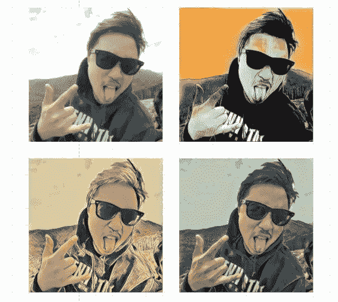

Neural Style Transfer with my face and various other styles.

目前科技领域正在进行一场军备竞赛，深度学习和人工智能已经成为下一个行业级术语。每个人都希望通过人工智能的成功和创新应用，取得下一个巨大的商业成功。

一个这样的突破是使用深度学习神经网络以数学方式分离[图像](https://hackernoon.com/tagged/images)的内容和风格。很自然地，我们会想到将一幅图像的内容和另一幅图像的风格融合到一幅图像中。这个想法在 2015 年被 Gatys 成功实施。等人在他们的论文《[一种艺术风格的神经算法》](https://arxiv.org/abs/1508.06576)。

从那以后，对基本思想有了许多见解和改进。该算法的现代迭代现在被称为神经风格转移，自 2015 年问世以来取得了很大进展。你可以在本文[这里](https://nurture.ai/p/fc15202b-e538-4cd0-9afb-73775151b740)阅读更多关于改进的内容。

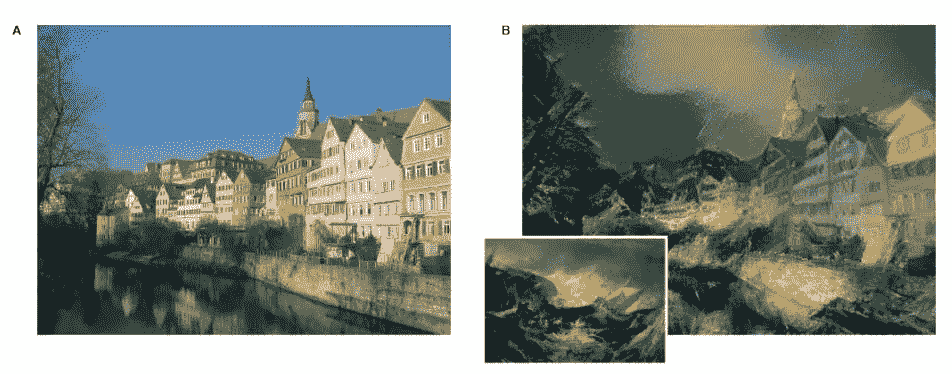

Image A provides the content. Image B is the final result, taking the semantic contents from Image A and the style from the smaller image.

> 转换风格背后的核心思想是拍摄两个图像，比如一个人的照片和一幅画，并合成一个同时匹配照片的**语义内容** **表示**和相应艺术作品的**风格表示**的图像。

如上所述——我们将对图像的风格和内容表示进行数学量化。使用一个空白的或者随机生成的图像(也称为模仿品)，我们逐步地将它与期望的样式和内容表示相匹配。

那么深度学习到底是如何在这里发挥作用的呢？能够将风格和内容从图像中分离出来是怎么回事——这是人们有时很难辨别的。

显然，用于深度学习的神经网络真的很擅长提出图像特征的高级和低级表示。为了形象化，让我们看看 CNN 的图片。

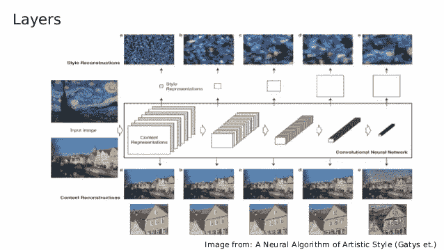

Style and content representations taken at each layer of a Neural Network.

研究网络每一层的要素表示，您将看到每一层都逐渐产生一个抽象概念，即**样式**(顶部一行图像)和**语义内容**(底部一行图像)。

在卷积神经网络(CNN)中，每一层都用来进一步抽象我们提供给它的图像的像素表示。最初，我们将向 CNN 提供一幅图像。但是 CNN 并不像我们人类那样将这张图像视为图像，而是将图像视为值的矩阵(更准确地说是张量)。

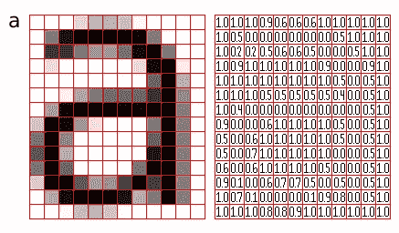

A matrix representation of the image of the letter a. Pixel values closer to 1 correspond to colors closer to black white values closer to 0 correspond to a lighter hue. Image taken from [http://pippin.gimp.org/image_processing/chap_dir.html](http://pippin.gimp.org/image_processing/chap_dir.html)

在每一层，将内核应用于图像的一个小块，在整个图像上移动，最终生成图像的中间矢量表示。虽然这些生成的向量可能实际上没有任何意义，但它们允许我们捕捉图像的特征。你可以看看这篇文章，深入了解 CNN 是如何做到这一点的。

自然，这些图像绝不是风格和内容的确切定义，但这是神经网络如何感知它的。

现在我们已经大致了解了图像的抽象特征在哪里(图层之间的矢量表示)。但是我们如何让他们离开 CNN 呢？

这就是我们前面提到的论文的关键贡献发挥作用的地方。

该论文的工作基于一个流行且强大的架构(当时)，被称为 [VGG](https://arxiv.org/abs/1409.1556) ，它赢得了 2014 年 ImageNet 分类挑战赛。

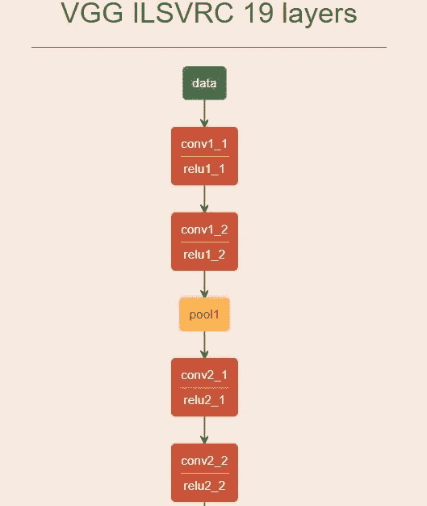

Layers of the VGG19 neural network, taken from [https://ethereon.github.io/netscope/#/gist/3785162f95cd2d5fee77](https://ethereon.github.io/netscope/#/gist/3785162f95cd2d5fee77)

在这种架构中，特别是在“conv4_2”层的中间向量最好地代表了图像的语义内容。而 style 最好由以下层的特征组合来表示:“conv1_1”、“conv2_1”、“conv3_1”、“conv4_1”和“conv5_1”。你会问，我们是如何选择特定的层的？真的只是试错。

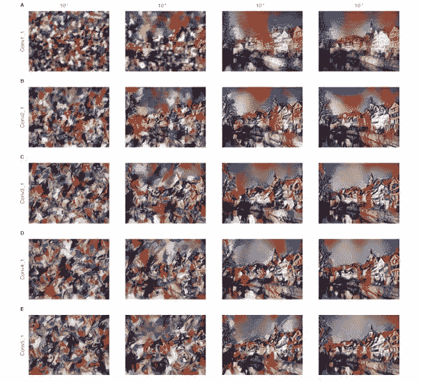

Image taken from [A Neural Algorithm for Artistic Style](https://arxiv.org/abs/1508.06576). The image structures captured by the style representations increase in size and complexity when including style features from higher layers of the network. This can be explained by the increasing receptive field sizes and feature complexity along the network’s processing hierarchy.

这个想法是，你在神经网络中的位置越低(越接近对物体进行分类)，特征向量就越能代表图像的语义内容。而网络中的高层能够更好地捕捉图像的风格。

既然我们已经弄清楚了样式和内容表示，我们需要一种方法来迭代地匹配随机生成的白噪声图像(我们的仿作)和表示。

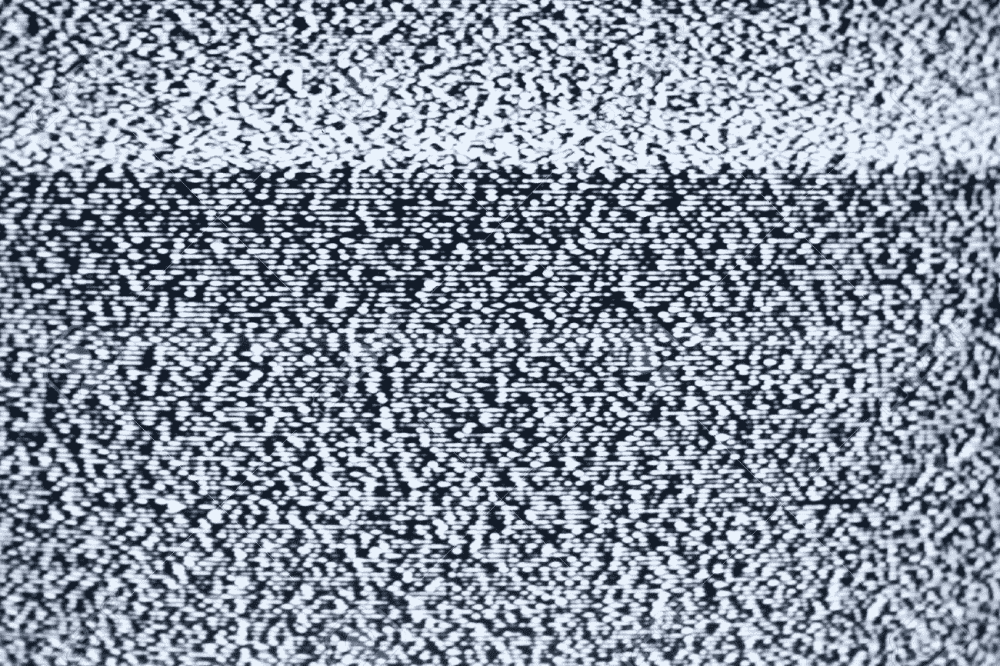

A randomly generated white noise image, which we will iteratively match to the style and content representations.

> 为了可视化在层级的不同层编码的图像信息，我们在白噪声图像上执行梯度下降，以找到与原始图像的特征响应相匹配的另一个图像。

因此，我们定义了内容表示和我们的仿作之间的平方误差损失:

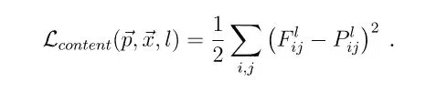

The content loss

其中向量 P 是原始图像，向量 x 是生成的图像，并且 *P_l* 和 *F_l* 在层 *l* 中它们各自的特征表示。

由此可以使用标准误差反向传播来计算生成图像的梯度 w.r.t.。因此，我们可以逐步更新随机白噪声图像，直到它在“conv4_2”层中给出与我们想要从中获取语义内容的图像相同的响应。

然而，风格并不直截了当。我们首先构建一个样式表示
,它计算不同滤波器响应之间的相关性。这是通过[克矩阵](https://en.wikipedia.org/wiki/Gramian_matrix)完成的:

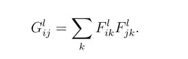

其中 *G^l_ij* 是层 *l* 中矢量化特征 *i* 和 *j* 的内积。关于为什么 Gram 矩阵可以捕捉样式信息的更多信息可以在[本文](https://arxiv.org/abs/1701.01036)中找到。

通过最小化来自原始图像的 Gram 矩阵和要生成的图像的 Gram 矩阵的条目之间的均方距离，我们可以使用来自白噪声图像的梯度下降来找到与原始图像的风格表示相匹配的另一个图像。

风格的损失定义为:

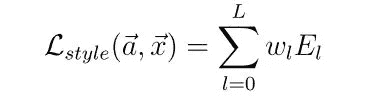

其中 *E_l* 为:

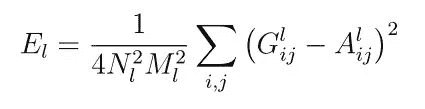

*G* 和 *A* 分别是 *l* 层中原始图像和生成图像的风格的 Gram 矩阵表示。然后，可以使用类似于上述内容表示的标准误差反向传播来计算梯度。

现在，我们已经拥有了生成图像所需的所有要素，给定了一个我们想要从中学习风格的图像和一个我们想要从中学习内容的图像。

> 为了生成将照片的内容与绘画风格混合的图像，我们共同最小化白噪声图像与网络的一层中的照片的内容表示和 CNN 的多层中的绘画风格表示的距离。

我们最小化以下损失函数:

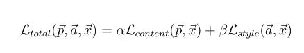

其中*α*和*β*是用于在新图像的构建期间确定总体贡献的权重。

尽管这篇文章是在 2018 年写的，但所描述的技术并不新，而且已经存在多年了。

事实上，已经对现有模型进行了大量的改进和修改，极大地提升了其性能的许多方面，比如[提高风格转换的速度](https://arxiv.org/abs/1612.04337)、[减少损失以生成更好的图像](https://arxiv.org/abs/1701.01036)、[制作艺术](https://deepart.io/)(这是由本文的原始作者制作的)等等。

我最感兴趣的是这样一个事实，我曾经认为是抽象和不可量化的东西——即图像的抽象风格和内容——现在可以用数学来表示了。很自然，这让人怀疑是否同样的事情也可以用于其他抽象的品质。不仅仅是图像，还有各种形式的媒体，无论是视频还是文本。

如果像情感、动机和情节这样的抽象概念也可以量化呢？那么，我们将如何处理这些呢？我们生活在一个激动人心的时代，我迫不及待想看看更多的技术和人工智能能给我们的文化带来什么。

*觉得有用吗？请随意击碎掌声，看看我的其他作品。*😄

*李中清为* [*培土人工智能研究员。*](https://nurture.ai/)*AI。他刚从莫纳什大学计算机科学专业毕业，写过关于人工智能和深度学习的文章。在推特上关注他@*[*jamsawamsa*](https://twitter.com/JamsaWamsa)*。*