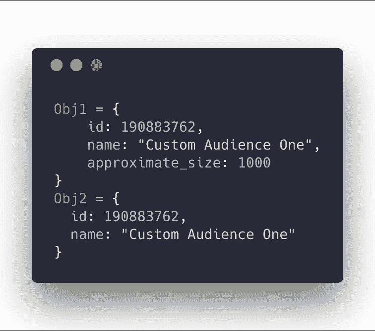
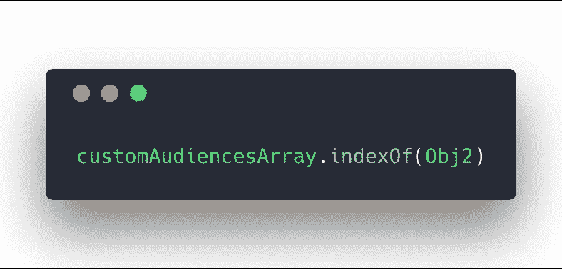

# 通过兼职项目学习更好的 JavaScript

> 原文：<https://medium.com/hackernoon/learning-better-javascript-while-working-on-side-projects-aebd84aef667>

如今，学习 JavaScript 的方法有很多，但对我来说最有效的方法一直是兼职项目。 [React](https://hackernoon.com/tagged/react) 、Yarn、ES6……这些是我在做我的副业项目 NewClick 时学到的一些技能，new click 是一个 [Etsy 广告平台](https://getnovelty.com/)。

今天我学到了一些很酷的东西，我想和大家分享一下。JavaScript 中的 [findIndex()方法](https://developer.mozilla.org/en-US/docs/Web/JavaScript/Reference/Global_Objects/Array/findIndex)！这是我一直需要的工具…它终于出现了。

# 问题是

对于我的用例，我需要搜索一组对象并比较两个(相似但不匹配)对象:

如您所见，一个对象有一个 **approximate_size** 键/值，而另一个没有。现在想象使用一行代码来匹配这两个…我会让你头疼的，这很难做到。在这个特殊的例子中，是 findIndex()救了我一命。

# 在 findIndex()之前

引导我使用 **findIndex()** 方法的是尝试(并最终失败)使用它的弟弟: **indexOf()。**

**indexOf()** 可以给你一个数组中一个对象的索引，但是这些对象需要有完全相同的键/值。如果一个特定的键/值存在于一个中，而不存在于另一个中，那么它就不会工作。这是有道理的，因为它们在技术上并不匹配。

# 在 findIndex()之后

我所寻找的是一种方法来匹配我知道存在于两者中的对象的值…这一行代码将搜索我们的自定义受众数组，并根据 ID 进行匹配，我们知道存在一个值。这里的好处是我们可以使用 findIndex 来匹配**相似的对象**，而不是**精确的**。

所以，你走吧…我通过搞搞副业和使用最新技术学到了不少东西。

# 是啊，但是为什么呢？

哦…“但是为什么？”，你问。所以我们当然可以过滤数组！哦，还有我的 react 应用程序。我正在建立一个[市场研究工具](https://getnovelty.com)，允许用户创建和保存脸书受众定位广告设置。我使用 findIndex 方法动态过滤一组自定义受众，找到匹配项并“选中”复选框。请看下面的截图！

*原载于 2018 年 8 月 20 日*[*【www.alexdaro.com】*](https://www.alexdaro.com/writing/learning-better-javascript-while-working-on-side-projects)*。*