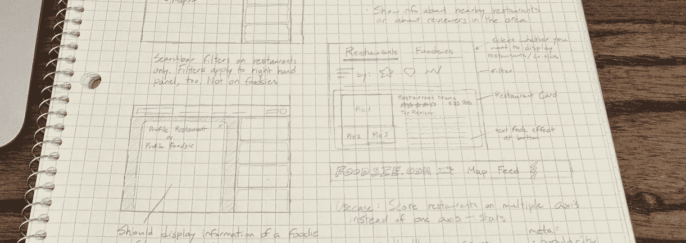
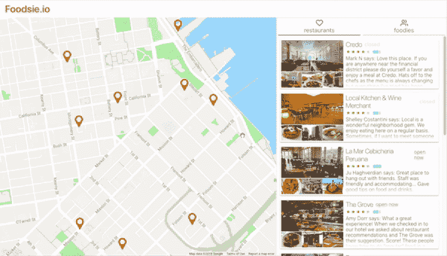
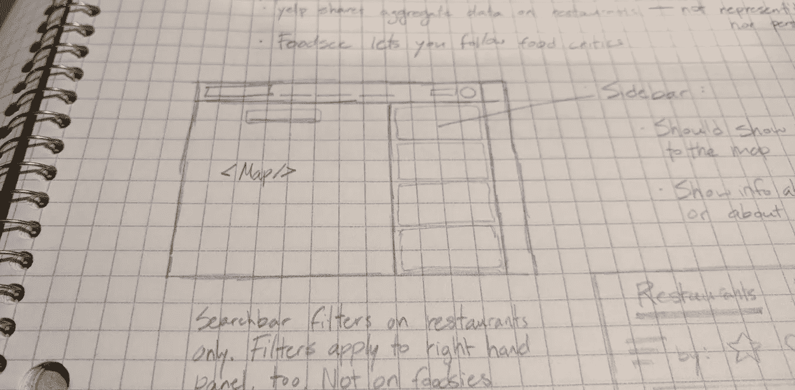
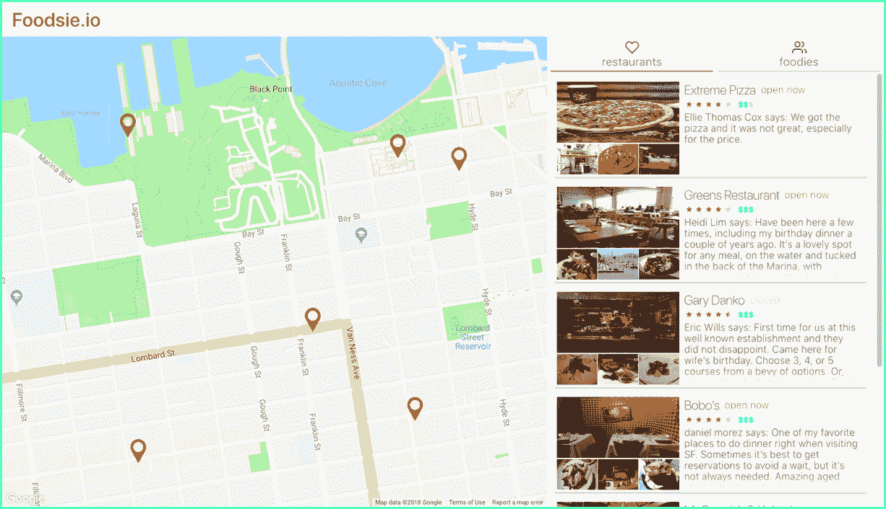
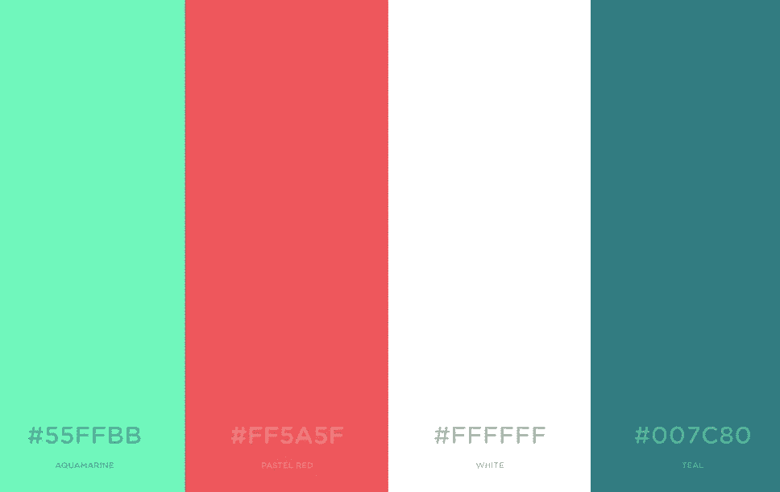
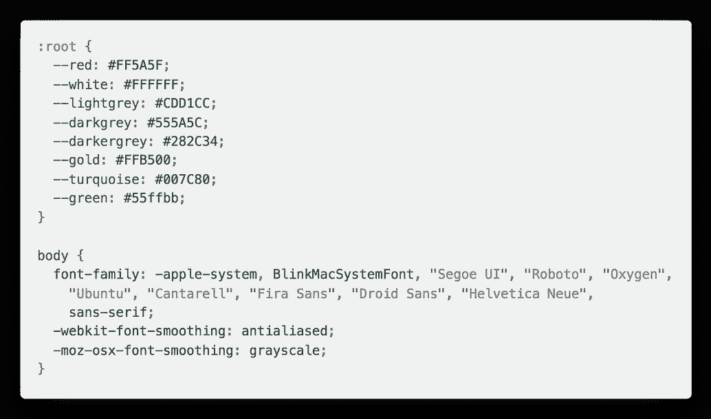
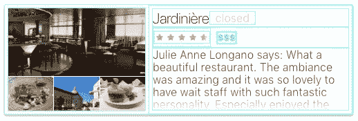
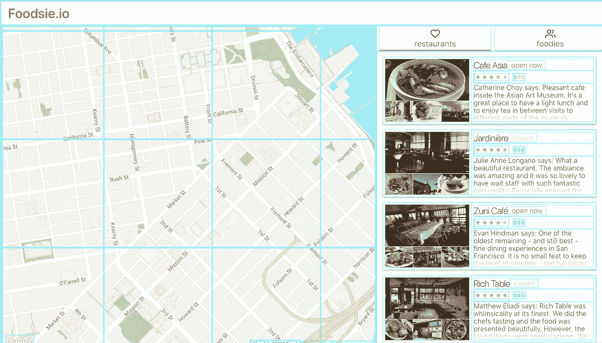
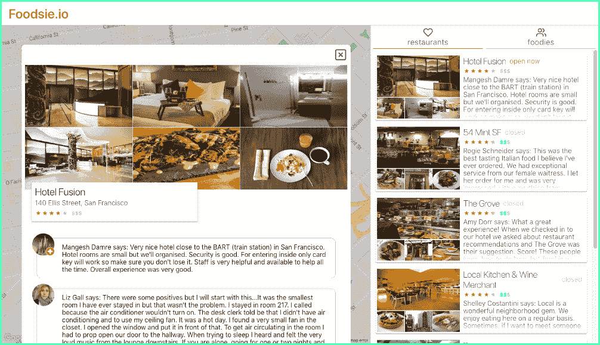

# 在实践中学习:Foodsie.io 的设计和构建

> 原文：<https://medium.com/hackernoon/learning-by-doing-the-designing-and-building-of-foodsie-io-9c05103c3370>

## 从头到尾构建一个 web 应用程序的经验和教训

作为一名开发人员，有时很容易陷入对获得新技术、工具和最佳实践的狂热中，而忘记软件最终是构建造福人类的服务和应用程序的手段。

在这篇文章中，我将通过讨论[设计](https://hackernoon.com/tagged/design)决策和我在制作 *Foodsie* 时学到的经验来谈论我构建应用程序的整体方法，这是一个餐馆评论应用程序，你可以在这里查看。我想分享我从 Foodsie 中学到的东西，因为我相信从头到尾从构建和部署 web 应用程序中学到的东西给了我巨大的智慧。

我在建立 Foodsie 的过程中所学到的经验:

# 承诺一个计划并坚持下去

> 失败是一种选择。如果你没有失败，你就没有足够的创新

当我开始在 Foodsie 上工作时，在编写一行代码之前，我已经画了至少 5 页的草图，并写了许多关于功能、用户流和研发的列表和文本块。这被证明是无价的，因为它让我可以快速迭代我的想法，并获得反馈，而不必在代码中实现任何东西。

original ideation sketches

用笔和纸迭代比用代码迭代要便宜很多。仅仅通过写出想法和绘制用户故事，我就能够充实我对 Foodsie 的愿景，并为观众量身定制——从一开始我就知道 Foodsie 会是某种餐馆评论聚合器。在用笔和纸做了原型之后，我意识到 Foodsie 作为一个平台会非常好，餐馆评论者(又名 *Foodsies* )可以在这个平台上撰写和分享餐馆评论。

When thoroughly thought out, mock ups translate to code seamlessly.

在开始建造之前，我发现为我的产品建立一个品牌和身份是很重要的。关于 Foodsie.io，我最引以为豪的一点是它看起来一致且有凝聚力。一个应用程序的身份很重要，因为它反映了开发者对产品的信心和应用程序其他部分的健康状况。

Foodsie.io’s color scheme (using coolors.io) on the left and app’s index.css on the right

选择一个配色方案，一个设计原则(材料/平面/引导)，最好是一到两种字体。这些会随着时间的推移而改变，但重要的是，如果它们真的改变了，就要持续不断地改变。所有这些的目的是确保你有某种你正在遵循的计划，这样当你感到失落的时候你就有东西可以参考。这是一条很长的路，也是 Foodsie.io 成功的一个支柱。

# 对你的架构要有主见和果断

> 基础混乱的创业公司是无法修复的
> ——彼得·泰尔

在我失败的项目中，我意识到我的一个常见缺陷是在架构决策上犹豫不决。随着软件开发生态系统发展得如此之快，开始使用某一套技术是非常容易的，只需阅读一两篇中等文章，就会意识到您实际上想要尝试一套不同的技术。

如果使用一种更好的技术对项目和你的工作流程有好处，这没有什么不对。事实上，建设过程的很大一部分是走出你的舒适区，尝试新事物。然而，这是一个问题，如果这样做阻碍了你在项目上的进展和动力。

有一个策略帮助我没有落入*技术嫉妒*的陷阱，那就是在开始编码之前花时间彻底研究和完善我的堆栈。对于 Foodsie，我决定采用的技术是 React、Redux 和 CSS 模块。我已经知道我想使用 React 和 Redux，因为我绝对喜欢 React + Redux，但我不确定我想使用什么样的造型技术。在决定我的堆栈的这一部分之前，我实际上用时尚的 css 块和 CSS 模块引导了一个应用程序，然后决定 CSS 模块是我将采用的技术。

A good architecture will empower you to build quickly and modularly 💯

如果你想查看我的技术堆栈和项目布局，Foodsie 是完全开源的。你可以从这里在 Github 上查看并分叉项目[。](https://github.com/fermidirak/foodsie)

# 打造让你从内到外都引以为豪的东西

> 我们创造的美好事物最终造就了我们
> ——吉米·罗恩

在每一个有趣的应用程序中，总会有一些技术决策需要做出。必须做出的决策通常是快速完成工作和正确完成工作之间的权衡决策。在专业环境中，由于时间表和严格的项目限制，正确的决策不一定是显而易见的。但是在单人项目中，花时间找出最佳解决方案几乎总是更好的主意。

原因是，如果你喜欢建造一个项目，它将会是最成功的，而技术债务将会剥夺建造的乐趣。如果你不喜欢构建过程，时间开始变得艰难，那就很难建立继续你的项目的动力。

在创建 Foodsie 的过程中，我已经习惯于早上重构代码，晚上构建功能。这极大地帮助了我将技术债务保持在最低水平，因为这意味着我可以在下午天真地实施一个技术解决方案，在晚上思考问题，然后在早上通过找到最佳解决方案来清理我的石板。

我发现的一个成功进行高级设计重构的方法是使用 CSS 为每个 div 添加青色边框:`div { border: 1px solid cyan; }`。这有助于在视觉上验证你的布局是干净的，并且在应用程序的样式中没有任何黑客或快捷方式。

border: 1px solid cyan is a great way to identify visually any hacks or short-cuts being made with CSS

我偶尔做的另一件事是使用 chrome 开发工具导航 DOM 树，并手动检查任何 div-soup。确保 DOM 树尽可能语义化和轻量级是很重要的。这样做有利于使用屏幕阅读器导航网页的用户，并全面减少页面加载时间。最重要的是，轻量级 DOM 树也将减少遇到的错误和与 html 和样式相关的副作用。

最终，你要确保你的应用程序从里到外都非常漂亮。糟糕的代码库很容易让你感到沮丧，耗尽你的项目。从长远来看，一个干净的代码库会很好地服务于你的项目，让你成为更好的开发者。

A clean UI reflects a clean codebase and a well executed product

# 头脑中要有学习的心态

我在 Github 上创建了超过 64 个项目。其中，我只能说我只看到了最多 6 个部署阶段。有时你在一个副业项目上无休止地锤打，只是为了一些其他闪亮的想法出现并偷走你的兴趣。你可能会对自己留下的越来越多的未完成项目感到内疚。

我想说的是，伟大的开发者就是这样诞生的。每次你接手一个新项目，你都在尝试新技术，获得对新模式的直觉，并挑战自己的极限。你不断地建立联想和直觉。这些直觉会延续到你的下一个项目和下一个项目。

失败无关紧要——它甚至值得尊重。不管你是否完成了一个项目，你都会通过尝试成为一个更好的开发者。

所以，请不要害怕开始一个项目，也不要害怕尝试，因为最坏的情况是你在学习。

非常感谢您的阅读！如果你想联系，我在 [Linkedin](https://www.linkedin.com/in/bryanmanuele) 和 [Github](https://github.com/FermiDirak) 上。你也可以在任何社交媒体上把我喊出来:@费米迪拉克。

干杯！