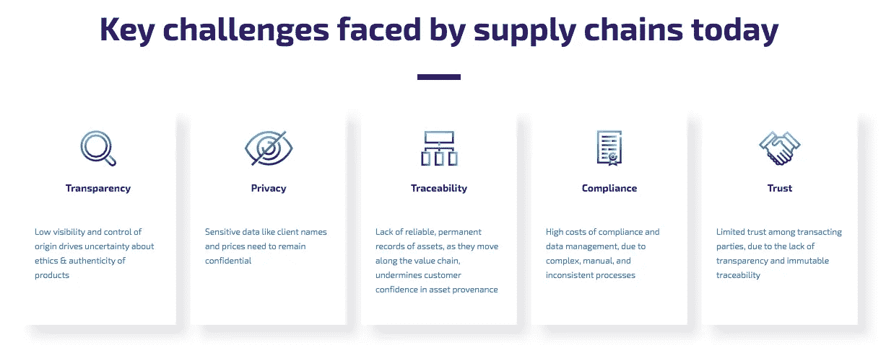

# 向区块链试点学习

> 原文：<https://medium.com/hackernoon/learning-from-blockchain-pilots-190689bac8ab>

## 如果我们都要学，那就一起学吧。不要重复别人的错误。不要多此一举。

Source: WFP

# 今天的议程

1.  **签证** — B2B 连接
2.  **世界粮食计划—** 积木
3.  **德比尔** — Tracr

# 1.VISA B2B 连接

Source: Visa

## **1.1 待解决的问题**

*   应对传统跨境和跨货币无卡支付的挑战

## **1.2 承诺**

*   **可预测且透明:**参与银行及其企业客户收到近乎实时的交易通知和支付终结
*   **安全:**经过签名和加密链接的交易，旨在确保记录系统的不可更改性
*   **可信:**网络中的所有参与方都是许可的私有区块链的已知参与者

## 1.3 其工作原理

*   **区块链类型:**许可的私有区块链
*   **交互界面:**参与银行可以选择集成到 Visa B2B Connect APIs 套件中，以开发端到端 B2B 支付解决方案，允许他们与客户沟通、设置供应商、检查 Visa B2B Connect 外汇汇率并提交支付。或者，他们可以选择集成到 API 的一个子集来满足更具体的需求，比如检查支付状态

Source: VISA

## **1.4 试点伙伴**

*   **关键技术:** [**链条**](https://medium.com/u/7b84c87e9045?source=post_page-----190689bac8ab--------------------------------) (账本即服务)
*   **发卡行:**商业银行(美国)、新韩银行(韩国)、联合银行(菲律宾)和大华银行(新加坡)

## 1.5 如何进入

*   **沙盒:**Visa B2B Connect API 可以由沙盒中的任何开发者使用，只要注册并接受条款和条件
*   **批准:**但是，只有参与试点的银行及其技术合作伙伴才能在生产中使用这些原料药。银行参与试点项目取决于签证批准和试点项目参与协议的执行

## **1.6 路线图**

*   **2018 年初:**测试开始。
*   **2018 年年中:**商业发布

## 1.7 结果

*   *“记住，区块链实际上不太擅长促成低价值大规模交易，而这正是我们所做的核心工作。所以，你不会看到我们宣布区块链——我们正在以任何方式、形状或形式将区块链转移到，以推动我们的核心业务。”*—2018 年 7 月 VISA 首席执行官阿尔弗雷德·凯利

# 2.世界粮食计划署——积木

Source: WFP

## 2.1 需要解决的问题

*   **背景:**每年，WFP 向 80 个国家的 8000 多万人提供援助，是世界上最大的人道主义组织。
*   **现在:**当难民从当地杂货店购买食物时，银行会验证这些交易，然后在每个月底与零售商结算。收取费用后，银行会向 WFP 提供账户余额摘要
*   这将解决任何人道主义危机中的一个核心问题:如何让没有政府身份证件或银行账户的人进入一个金融和法律系统，在这个系统中，这些东西是找到工作和过上安全生活的先决条件？

## 2.2 承诺

*   一个钱包，里面装满了营地交易记录、政府 ID 和金融账户的访问权限，所有这些都通过一个基于区块链的身份系统连接在一起。有了这样的钱包，你可以更容易地融入世界经济

## 2.3 工作原理

*   **区块链类型:**由[奇偶技术](https://medium.com/u/433b0bc6fa9e?source=post_page-----190689bac8ab--------------------------------)运行的许可以太坊支付
*   **交互界面:**新系统为 WFP 区块链的每一个受益人提供账户。交易得到即时验证和持续监控，而无需银行在月末分批进行总结和报告，从而让构建模块无需等待一秒钟即可监控资金。每个月底，WFP 直接与每个商家结算，节省了交易费用，保证了难民数据的安全
*   **其他技术:**由于许多难民可能没有智能手机或稳定的互联网连接，他们通过虹膜扫描获得身份识别服务，这反过来为他们提供了一种便捷的方式来购买他们需要的食物。另一个验证选项包括基于 SMS 的服务，该服务允许受益人使用双因素验证 PIN 码来验证交易

Source: WFP

## 2.4 试点合作伙伴

*   **关键技术:**奇偶校验技术
*   **主要合作伙伴:**约旦政府、联合国

## 2.5 如何进入

*   PoA 不依赖于节点解决任意困难的数学问题，而是使用一组“权威”——明确允许节点创建新块并保护区块链。该链必须由大多数机构签署，在这种情况下，它将成为永久记录的一部分
*   这使得维护私有链和让大宗交易发行者承担责任变得更加容易。这也意味着只有 WFP 有权任命“当局”

## 2.6 路线图

*   【2017 年 1 月:世界粮食计划署启动了一项概念验证，使用区块链认证&在巴基斯坦注册的交易。接下来，一个更强大的试点项目在约旦启动
*   【2018 年 1 月:试点扩大到包括超过 100，000 人
*   **下一阶段:**扩大到在约旦的所有 50 万叙利亚难民(估计年底)

## 2.7 结果

*   **节约成本:**将每月向银行支付 10，000 笔预付款的现金交易减少到向当地零售商支付 200 笔结算交易。这为 WFP 节省了大量的前期成本，以及每笔交易 1.5%到 3%的成本
*   **打击腐败:**据说仅约旦的试点项目每月就为该机构节省了 15 万美元，同时免除了高达 98%的银行相关转账费用。这是一件大事，因为超过 30%的联合国援助因腐败而流失
*   **挑战 1:** 最终，构建模块或任何类似系统的问题是，它是否会将数字身份证的所有权放在被代表的人手中，或者只是成为公司和国家控制人们的数字存在的一种更容易的方式
*   **挑战 2:** 使用区块链的真正承诺可能无法实现，除非像 WFP 和联合国这样的组织有勇气向其他机构开放至少部分系统，然后采取最勇敢的步骤，交出数据受益人的所有权，他们目前在这件事上几乎没有发言权——如果你想吃饭，你必须在系统中

# 3.de beers-Tracr

## 3.1 需要解决的问题

*   清除供应链中的冒牌货和冲突矿物

Source: Tracr

## 3.2 承诺

*   Tracr 是首个以行业为中心的协作式数字平台，可在整个价值链中安全地跟踪钻石，为消费者提供信心，提高交易效率和降低成本，为行业贷方提供更高的透明度

## 3.3 工作原理

*   **区块链类型:**以太坊
*   **交互界面:** *隐私控制*限制对敏感数据的访问，同时保持可追溯性。个人和组织身份以及 KYC(了解你的客户)被数字化管理，以确保*责任*。上传的数据受*非对称加密*保护。*数据科学*和*物理身份识别技术*可以放心地追踪钻石从毛坯到抛光的过程
*   **其他技术 1:** Tracr 与现有的 ERP(记录保存)和股票跟踪系统兼容，如 AX 和 Fantasy 等。虽然该团队的目标是继续与更广泛的系统集成，但一些简单的基于文件上传的方法应该使业内任何人都可以轻松参与。该团队正在开发一个集成层，允许更直接和实时的数据更新
*   **其他技术 2:** 除了简单的基于条形码的唯一 ID，Tracr 还融入了复杂的数据科学模型，为毛坯钻石和抛光钻石打造独一无二的签名。一旦这个签名被创建，钻石可以永远验证它，以防止任何形式的欺诈

Source: Tracr

## 3.4 试点合作伙伴

*   **关键技术:**与 [BCG Digital Ventures](https://medium.com/u/e282b6579c57?source=post_page-----190689bac8ab--------------------------------) 合作开发
*   **主要合作伙伴:**生产商、银行、目击证人、钻石办公室、贸易商、物流商、分级商、零售商(DeBeers、Diacore、Diarough、KGK 集团、Rosy Blue NV 和 Venus Jewel、Signet 珠宝商)

## 3.5 如何进入

*   KYC 完成后进入。治理机制未定
*   上传的数据将有助于创建一个不可改变的、防篡改的钻石价值链旅行轨迹，为所有参与者带来好处，但在任何时候，拥有数据的组织之外的任何人都不会看到这些数据(除非数据所有者选择分享这些数据)。

## 3.6 路线图

*   **2018 年 1 月:**戴比尔斯调查区块链，以提高钻石价值链的透明度。

## 3.7 结果

*   **资产可追溯性:**5 月初，戴比尔斯宣布成功在 Tracr 上追踪到 100 颗高价值钻石，标志着钻石从开采到零售的全程首次被数字化追踪
*   **挑战:**考虑到大量试点参与者，采用一个尚待决定的治理机制可能会有问题。Tracr 声明:*Tracr 旨在成为钻石行业的一个包容和开放的平台，这将在其治理结构中得到体现*

# 4.观察

1.  **大多数企业主导的试点都有高度的集权**，使用 PoA 共识机制(WFP)、许可的私人区块链(VISA)或 KYC (DeBeers)。由于 WFP 可以控制谁加入它的网络，它也有权力改写交易历史。它没有将银行排除在等式之外，而是在本质上成为了一个等式
2.  **集权化&分权化位于光谱的两端**。向分权阵营的轻微转变已经产生了效果。以 Tracr 为例，如果没有全行业的合作，就不可能在整个价值链中安全地跟踪钻石
3.  **对联盟、学习以及分担风险的偏好。** DeBeers 和 VISA 都与一个广泛的联盟合作，以加速学习(数据接触点越多，学习可能就越全面)，同时也为计划提供合法性
4.  **区块链实施对遗留流程越友好，采用的可能性就越大。集中的组织不会在一夜之间变得分散**
5.  **区块链项目的成本不仅仅与区块链相关。**如果记录了错误的数据，区块链是没有用的。要存储您从未存储过的数据，您需要使用从未使用过的工具。除了简单的基于条形码的唯一 ID 之外，Tracr 还整合了复杂的数据科学模型，为毛坯钻石和抛光钻石创建独特的签名。一旦这个签名被创建，钻石可以永远验证它，以防止任何形式的欺诈
6.  企业乐于尝试区块链。秘密资产就没那么重要了。普遍的观点是，区块链有利于合规，而代币会使合规复杂化
7.  也就是说，**第一家破解令牌化的财富 500 强公司将拥有显著的先发优势。**思考蓝海战略
8.  **未来几年,《财富》500 强公司将大规模应用初创企业的知识。**2015 年 5 月:Leanne Wood 创立了 Everledger，这是一家全球数字注册机构，旨在解决“血钻”问题。2018 年 1 月:戴比尔斯调查区块链，以提高钻石价值链的透明度
9.  **业务目标超越了新的收入来源**，从更传统的收费服务(VISA)到节省成本(WFP 每月节省 15 万美元，同时消除了 98%的银行相关转账费用)，再到增强消费者信心以扩大整体目标市场(DeBeers)
10.  使用外部开发团队有好处也有坏处。为了进行试点，大型企业通常使用外部开发团队，例如，Tracr 是与 BCG Digital Ventures 合作开发的。好处:开发人员接触多个项目。不利方面:区块链人才供不应求。要点:在内部引入区块链试点比你想象的要花更长的时间，可能会延迟路线图

**——**

*你觉得这些飞行员怎么样，你希望我们接下来报道哪些飞行员？应该有的信息丢失了吗？在评论里告诉我们吧！*

***阿尔温·斯密特****(*[*@ arwensmit*](https://twitter.com/ArwenSmit)*)是 MintBit 的 CEO(*[*www . mint bit . io*](http://www.mintbit.io)*)。想要更多见解？订阅每月* ***区块链字节*** *简讯* [*此处*](http://eepurl.com/ge9jNX) *或关注我们 Twitter 上的*[*@ mint bit _*](https://twitter.com/mintbit_)*。*