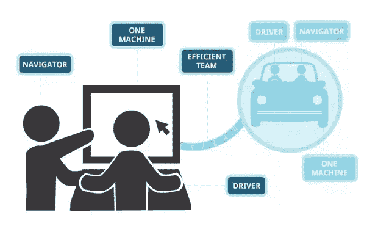

# 在 Microverse 学习如何使用结对编程进行编码

> 原文：<https://medium.com/hackernoon/learning-how-to-code-using-pair-programming-at-microverse-562d5d49f2f1>

It helps a lot when another pair of eyes is auditing your work in real-time

到目前为止，几乎每个软件开发者都听说过/知道 [*结对编程*](/@weblab_tech/pair-programming-guide-a76ca43ff389) 。12 个月前，我不知道这意味着什么。当然，我完全知道如何使用 git 来保存你的代码版本，但是我没有想到如何让多个人使用同一个代码库。

我花了几个月的时间从开源平台和教程中学习，但我发现有时几周后我会失去继续学习的动力。然而，几个月后，我收到了一封电子邮件。进入[微秒](http://www.microverse.org) …

Microverse 是一所在线软件开发学校，接受来自世界各地的学生，并教他们如何编码，以及如何作为分布式开发人员网络的一部分工作。除非你找到工作，否则你不会付钱。

# 你必须合作

结对编程是这个项目的原则之一，你和另一个学生结对，你们两个一起做任何事情(有点像[伙伴系统](https://en.wikipedia.org/wiki/Buddy_system))。你们一起编码，一起调试，一起部署(就像他们在服务中说的，你不要丢下你的伙伴)。

> 我必须每天起床并被驱使，因为我知道我的伴侣需要我。

Two heads are better than one

除了和伙伴一起写代码更有趣之外，我发现我犯的错误比加入这个项目之前少了。此外，我学习和理解新概念的速度更快，当出现错误时，很容易发现并纠正它们。

这是我参加这个项目的头几周，我相信事情会继续变得更好。

因此，如果你和我处境相同，并且你正在寻找一种途径来提高你的编程水平，那么我有几个理由认为你应该加入这个项目。

*   我找到了一个新朋友。
*   我被一个互相帮助的新家庭接纳了。
*   我在 4 天内学会了 Ruby(从上下文来看，我花了几个星期才学会我的第一语言)。
*   我每天工作 8 小时而不感到过度劳累。

每当我回想起几个星期以来我写代码的方式发生的变化，我总是很高兴我打开了那封邮件。