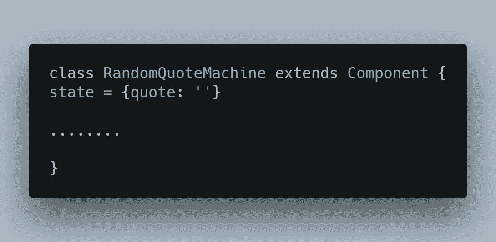

# 通过构建我的第一个项目并尝试重构我的代码来学习 React。

> 原文：<https://medium.com/hackernoon/learning-react-by-building-my-first-project-and-trying-to-refactor-my-code-acf649902be3>

当你阅读第一份代码草案时，你有没有想过你的实验空间有多小？这通常是因为你在学习一项新技术的同时正在建立一个新的项目。这就是为什么花时间，享受喘息的空间，并在项目结束时重构你的工作代码是一个好的实践。它允许你更深入地理解概念，让你的代码和你自己更加清晰。在本文中，我想向您展示我在更深层次上通过关注重构而学会了 React。

这个项目来自 FreeCodeCamp 课程的前端库部分。让我们直接进入代码，看看我是如何构建它的。

## 一台随机报价机在反应过来:

这是随机报价机的视图:

My random quote machine.

代码:

当我第一次让随机报价机工作时，这个快照就是我的代码的结构。擅长自己工作的开发人员知道，第一个“有效”的代码结构并不是最好的。可以用更好的方式重写。我想指出的一个主要原因是，让你的代码保持和你的应用或功能工作时一样的方式不是一个好主意。

> 第一次尝试写的东西，你可能都没看懂。

让你的应用程序像开发者一样工作主要是从 stackoverflow 和博客帖子中产生的，这没有错(我的意思是每个开发者都会这样做)，但这主要是一种复制和粘贴的练习。重构你的代码帮助你质疑这些帮助，反过来帮助你更好地理解你的代码库。

## 重构代码:

Refactored code

看起来更好对吗？太棒了。

我想向你介绍一下我所做的改变，以及我为什么要做这些改变。

## 解释是:

1.  `constructor`:在我的第一个快照中，在我的类声明后面有一个`constructor`来初始化我的`state`并绑定类方法。根据[的类属性提议](https://github.com/tc39/proposal-class-fields)，公共类字段允许我们实例化类属性，而无需编写构造函数。

所发生的是 [Babel](https://babeljs.io/docs/en) 传输代码并在幕后添加`constructor`。所以它就在那里，但你看不见。整洁对吗？

为了更详细的理解，请查看 Donavon West 关于这个的文章。

2.构造函数绑定:第一个代码快照在`constructor`中有`this.handleRandomQuotes`和`this.getRandomQuote`。为了让方法在有`this`的类中工作良好，我们必须在`constructor`中`bind`它。但是既然我们已经从代码中删除了`constructor`，就必须有一种方法来处理`this`。

箭头函数解决了这个问题。除了它给我们带来的清晰之美，箭头函数帮助我们将`this`指向类，就像我们对`.bind(this)`所做的那样，因此移除了`this`。

到目前为止，我利用了最新的 Javascript 特性，并对我们的代码做了一些小的修改，使其更易于阅读。

你看到我在第一个代码快照中是如何无知地同时使用了`.bind(this)`和`=>`的吗？当你重构时，这是你需要注意和学习的事情之一。

当涉及到构造函数绑定(`.bind(this)` ) vs 类属性(`=>`)时，还有一个很大的好处就是减少内存使用。这个从[这里](/dailyjs/demystifying-memory-usage-using-es6-react-classes-d9d904bc4557)就可以很好的理解了。

3.命名和重构:重构代码时，命名是需要注意的事情之一。当方法被正确命名时，就不需要注释了。我将我的`handleRandomQuotes`方法重命名为`changeQuote`，这样可以更好地描述它的功能。

在`getRandomQuote`方法中，我把我的`QUOTES`数组放在里面。这是一种气味，所以我决定把它从那里移除，并正常访问它，使事情看起来更好。

## 结论:

开始时的这种反应既令人沮丧又有趣，但我很感激我这样做了。这一经历帮助我通过构建一个项目开始使用 React。有更多的东西需要学习和构建。

下次见，继续黑。

你可以在我的 [github repo](https://github.com/oyin-k/random-quote-machine) 上查看代码。