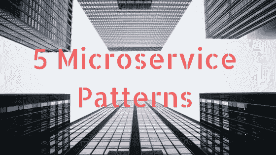

# 学习这 5 种微服务模式会让你成为更好的工程师

> 原文：<https://medium.com/hackernoon/learning-these-5-microservice-patterns-will-make-you-a-better-engineer-52fc779c470a>

对于许多工程师来说，进入微服务可能很难，因为很难决定应该在哪里划线。对我来说，80%的服务属于五个类别中的一个，以这种方式划分职责允许你考虑如何通过管道将服务连接在一起来设计功能，就像你在 Unix shell 脚本中所做的那样。

让我们来讨论一下所有微服务的共同点。领域驱动设计之父 Eric Evans 将它们定义如下:“(服务)可以消费和产生消息。”(【https://www.youtube.com/watch?v=yPvef9R3k-M】T4)

记住这一点，对于每种服务模式，我将讨论产生或消费的消息类型。

这些消息又可以细分为两类:事件和命令。

不过在我们开始之前，因为上下文很重要，我第一次听说这些微服务模式是从库 [servicebus](https://github.com/mateodelnorte/servicebus) 的创建者
<blockquote class=)

[如果你想联系我，你可以在 LinkedIn 或 Twitter 上给我发消息。](https://medium.com/u/79e3e76c6223#HODL 下面的鼓掌按钮；)
<blockquote class=)

<blockquote class=)