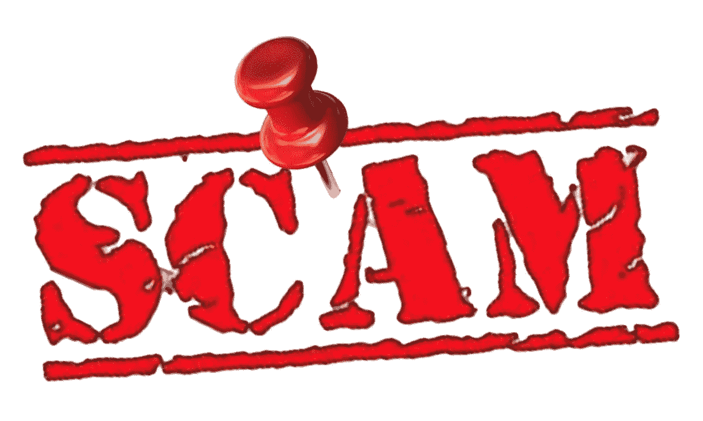
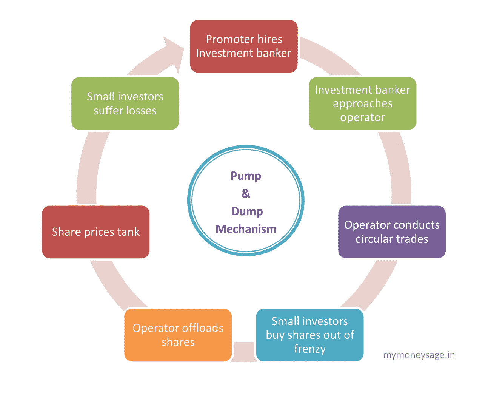
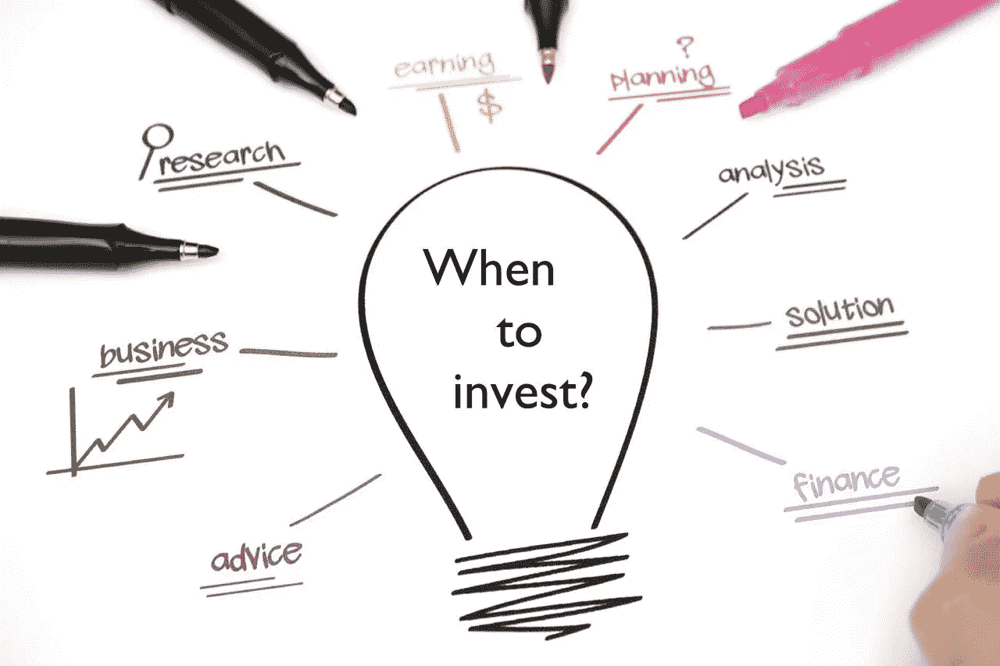

# 从 4700 万美元的 ICO 骗局中吸取教训

> 原文：<https://medium.com/hackernoon/learnings-from-a-47-million-ico-scam-e9592b7a76bf>

Source: Twitter

最近，一个向投资者提供某种茶叶销售所有权的 ICO 被证明是一个骗局。ICO 没有他们宣传的股票，并定期编造和提供数据。他们称之为普洱茶代币，以他们声称要代币化的茶叶品牌命名。

> 普洱团队一共诈骗了 3000 名中国投资者，诈骗金额总和大致为**4700 万美元。**

*这个骗局的关键要点是:*

1.  ***无风不起浪** —中国国家市场监管局，一个确保健康市场竞争的政府机构，曾多次警告普洱团队的营销策略，但没有收到任何回应。*
2.  ***除了传销还有更多值得担心的事情**——受到 2016 年几个 ico 的成功鼓舞，这些 ico 仅在白皮书的基础上就筹集了巨额资金，一些欺诈者抓住了这一想法，并提出了异想天开的说法。中国当局对普洱团队处以 2000 万美元的罚款，但他们没有让步。当中国无法让违约者付出代价时，你应该开始担心 ICO 提出的索赔*
3.  ***二级市场中的操纵是真实的**——一旦 ICO 完成，代币将在交易所上市，根据*自由放任市场的原则进行交易*。由于令牌所有权充其量是有限的，因此令牌被操纵的可能性是巨大的。*

> *由于多达 50-60%的代币以这样或那样的名义锁定在公司储备中，另外 10-20%的代币分配给私人投资者，一般加密公众持有的代币的实际数量约为 10-15%。*

*这就有可能改变市场价格。例如，当一枚硬币上市时，赏金猎人倾向于通过出售他们的代币来套现。为了应对这种情况，ICO 公司投入自己的资金购买代币，制造人为的稀缺。此外，这还将另外 2–5%的代币所有权转移给了公司。接下来，他们沉迷于循环交易，通过剥新手交易员的头皮赚钱。*

**

***4。总有一些新手交易者会和他们的钱分开**——这就是为什么 FOMO 是秘密世界中的一个词。我阿姨 2017 年 11 月买的比特币。12 月 9 日那天，她可能是世界上最幸福的女人。今天，她只有 33%的快乐。她从未兑现。显然，她不知道如何在交易所买卖。她是从当地的一个经销商那里买的。当然，我的阿姨不会投资替代硬币，但有人的阿姨会，而且这个世界上有很多阿姨和叔叔。*

***5。阿尔法、贝塔和概念验证不能防止骗局**——随着支持斯托的浪潮高涨，这是一种将被象征化的资产。这种资产令牌化和资产邻近令牌化对创建 alpha/beta 版本以安抚投资者的要求很低。*

*总之，普洱骗局是 ICO 顾问和 ICO 投资者的又一次学习机会。*

> *没有硬性的规则可以确定一个项目是否可信。缺乏明确的政府监管造成了损失，也助长了骗子的气焰。*

*只有一种方法可以确定你考虑的任何投资的可信度，那就是从投资开始就存在的——做好你的尽职调查。与其找投资的理由，不如找不应该投资的理由。*

**

*Source: kayf.ga*

> *如果这个列表不超过 3 个理由，你应该没问题，因为没有人是完美的。*

> *我正在分享我的投资小指南，它是与几个密码池管理员共同开发的(密码池是一组电报用户，他们一起投资的金额高于 500 ETH)。它只有五个要点，这就是验证 ICO 可信度所需的全部内容:*

1.  ***社区参与** —查看 ICO 的电报组，浏览其聊天记录。人民热情吗？会员人数是否超过 2000 人？民众问的是相关问题吗？最重要的是，会员们是否得到了礼貌的回答？*
2.  ***白皮书** —白皮书没有错误吗？商业模式有意义吗？是否提供了行业概述？令牌组学和令牌分发是否透明？*
3.  *网站安全吗？有点击率吗？是否定期更新？是否与白皮书保持一致？*
4.  ***项目路线图** —投资者的兴趣必须与产品的开发需求成反比。MVP 准备好了吗？如果大部分产品开发计划在筹集资金后开始，这对私人投资者来说是一个危险信号，对你来说也是如此。*
5.  ***团队简介—** 团队是否在他们所颠覆的行业中有过经验？这个团队是否有合法的顾问，他们不仅仅是“密码顾问”，实际上还是银行顾问/金融科技顾问等等。*

*只要问自己这些问题，你就可以节省 100 美元，这相当于在 [udemy](https://goo.gl/DwN6D8?originalUrl=https://medium.com/r/?url=https%3A%2F%2Fwww.udemy.com%2Fa-z-ico-investing-token-metrics-strategies-to-profit%2Flearn%2Fv4%2F) 上教你同样内容的一堂课的费用。*