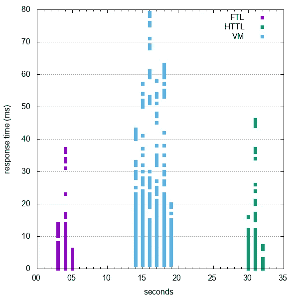
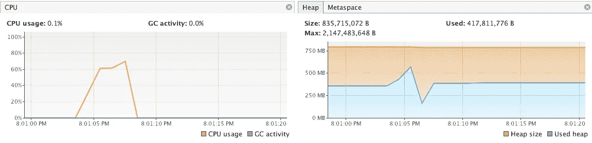
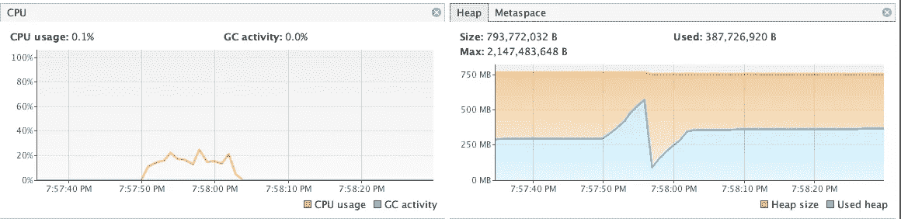
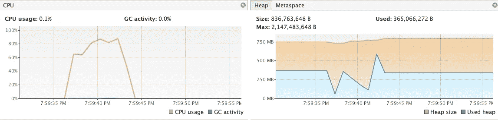
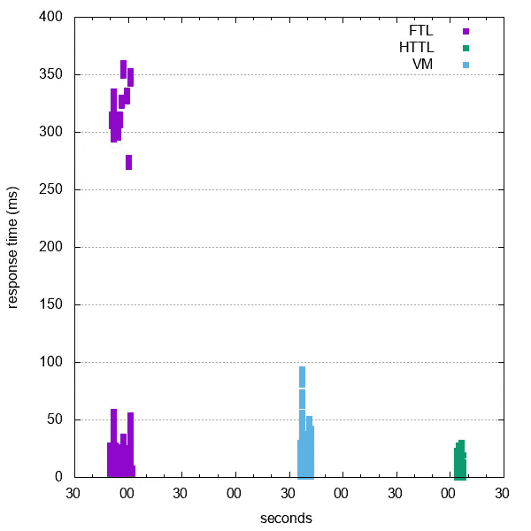
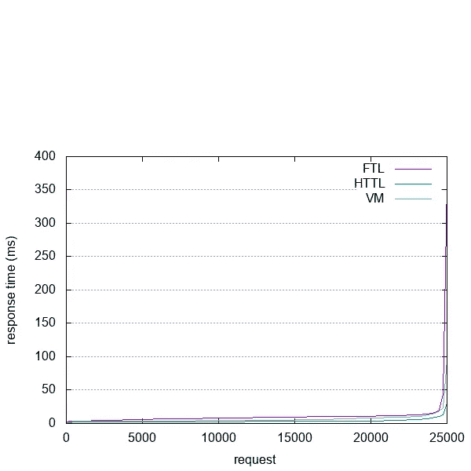
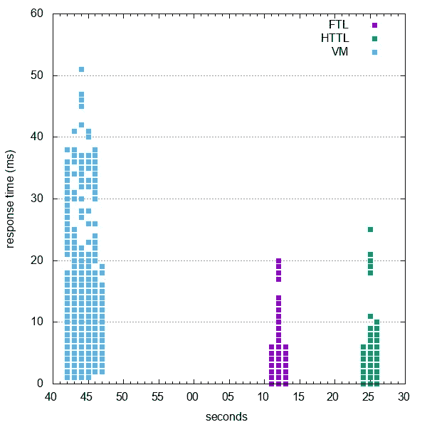
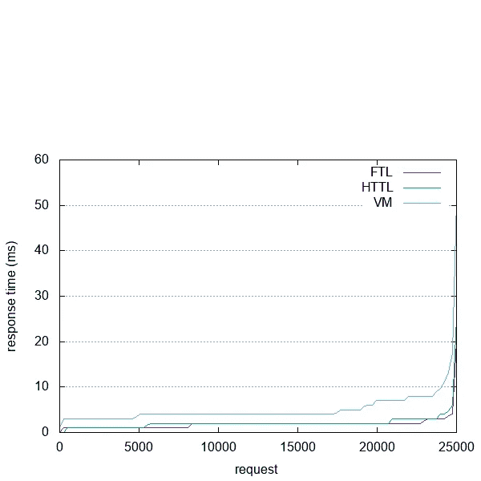
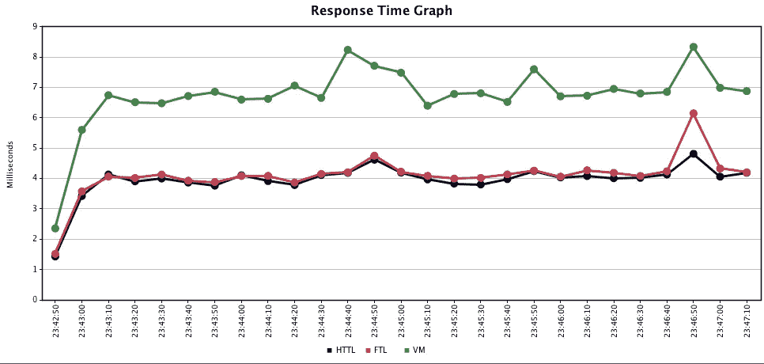

# Spring Boot 2018 年 Java 模板引擎性能指标评测的收获

> 原文：<https://medium.com/hackernoon/learnings-while-benchmarking-java-template-engine-with-spring-boot-2018-41ff2a7d6314>

## 使用 java 模板引擎+ Spring Boot 的服务器端渲染性能测试和一些正在进行的学习

这篇文章是关于服务器端渲染工具的基准测试，即最常用的基于 [java](https://hackernoon.com/tagged/java) 的模板引擎，即 [Velocity](http://velocity.apache.org/) 、 [Freemarker](https://freemarker.apache.org/) 和 [HTTL](http://httl.github.io/) (对我来说是新的)以及我在这样做时学到的经验。我已经使用过 Velocity 和 Freemarker 作为我的服务器端渲染工具，但是在阅读了关于 HTTL 的内容后，我想真正了解这三个软件在 Spring Boot 项目中的表现。

下面是 java 服务器端渲染/模板基准测试将发生的系统信息:

1.  操作系统:MacOS Sierra
2.  处理器:1.6 GHz 英特尔酷睿 i5 处理器
3.  Java: Java(TM) SE 运行时环境(内部版本 1.8.0_121-b13)
4.  Java HotSpot(TM) 64 位服务器虚拟机(内部版本 25.121-b13，混合模式)

对于基准测试，我们使用的是 [**Apache bench**](https://httpd.apache.org/docs/2.4/programs/ab.html) 。代码是一个简单的 spring boot 应用程序，公开了三个端点和三个基于 spring 的视图解析器，如下所示。

你可以从这个 [github repo](https://github.com/apuravchauhan/java-serversiderender-performance) 下载完整的代码

> @ springboot application
> @ Controller
> public class template benchmark {
> 
> @ Bean
> public httlviewrolver httlviewrolver(){
> httlviewrolver resolver = new httlviewrolver()；
> ……
> 返回解析器；
> }
> @ Bean
> public view resolver vmviewrolver(){
> velocitylayoutviewrolver Bean = new velocitylayoutviewrolver()；
> …。
> 返豆；
> }
> 
> @ request mapping("/check out-httl ")
> 公共字符串 check out(Model Model){
> Model . add attribute(" name "，" Apurav Chauhan ")；
> 返回“check out-httl”；
> }
> }

# 第 1 轮—简单键值+ HTML 呈现

## 用于服务器端渲染的 HTTL 模板引擎

我们用总共 5000 个请求预热服务器，并发数为 5。

最后，我们使用以下命令将工作台设置为达到 25K 个请求，并发数为 25

> *a b-n 25000-c 25-g httl . tsv-k*[*http://localhost:9090/check out-httl*](http://localhost:9090/checkout-httl)

*-n 用于总请求的标志| -c 用于并发| -g 用于将工作台统计信息保存到制表符分隔的文件| -k 用于启用保持活动连接*

## 学习 1

在进行基准测试时，如果看到这个错误***" apr _ socket _ recv:Operation timed out(60)"***其原因是负载已经消耗了 MacOS 上所有可用的 16，383 个端口。

[*当每个端口被使用时，它被放入一个队列，在那里等待 tcp“最大段寿命”，在 osx 上被配置为 15 秒。因此，如果您在 15 秒钟内使用超过 16，383 个端口，您将有效地被操作系统限制进一步的连接。根据哪个进程先用完端口，会从服务器得到连接错误，或者从*](https://stackoverflow.com/a/30357879/949912) `[*ab*](https://stackoverflow.com/a/30357879/949912)` [*挂起。*](https://stackoverflow.com/a/30357879/949912)

要解决这个问题，使用下面的命令检查 macos 终端的默认等待时间。

> `sysctl net.inet.tcp.msl`

并使用以下命令将其更新为较低的值，如 1000 毫秒

> `sudo sysctl -w net.inet.tcp.msl=1000`

## 下面是统计数据:

HTTL VisualVM Stats

**总共有 25K 个请求在大约 3 秒内完成**。CPU 使用率飙升至 70%。单个请求的平均处理时间为 0.134 毫秒

## 用于 java 服务器端渲染的 Freemarker 模板引擎

重复相同的步骤来获取下面的统计数据

FTL JVM Stats

**总共有 25K 个请求在大约 12 秒**内完成。CPU 使用率飙升至 30%。单个请求的平均处理时间为 0.476 毫秒

## 用于 java 服务器端渲染的 Velocity 模板引擎

VM JVM Stats

**总共 25K 个请求在大约 6 秒内完成**。CPU 使用率飙升至 90%。单个请求的平均处理时间为 0.253 毫秒

# 基准数据的 GNUPLOT

使用通过-g 标志生成的 tsv 文件，我们现在将生成一个图表来实际查看这些引擎彼此之间的性能比较。您可以查看用于创建下图的 [this](https://github.com/apuravchauhan/java-serversiderender-performance/blob/master/gnuplots-templates/template.p) 和 [this](https://github.com/apuravchauhan/java-serversiderender-performance/blob/master/gnuplots-templates/template2.p) github 链接中的模板文件。运行以下命令:

> gnuplot 模板. p
> 
> gnuplot 模板 2.p

Benchmarks HTTL vs Freemarker vs Velocity

> HTTL 无疑大放异彩，但 Freemarker 显示出巨大的劣势。让我们深入挖掘。在分析 ab 结果时，我们可以看到 freemarker 没有使用任何导致扭曲行为的 keep alive 请求，而是在结果中包含了连接创建延迟。但是为什么呢？

## 学习 2

经过一些研究，发现 ab 工具工作在 Http/1.0 协议上，该协议定义了服务器发送一个 Content-Length 报头以尊重保持活动连接。Freemarker 使用分块编码响应进行响应，因此不允许使用 Connection: KeepAlive 头进行连接重用。

让我们更新代码，为我们的简单用例设置内容长度头，看看我们得到了什么:

看起来 Freemarker 又回来了！:)

还不满意？现在让我们尝试使用 **jmeter** 对这三个进行基准测试。我使用了 25 个用户，上升周期为 20 秒，循环次数为 25k，结果如下:

Jmeter stats for response time

对于带有键值对象的简单模板渲染，HTTL 和 Freemarker 的性能似乎不相上下。然而，速度是完全不相干的！

这里是用于测试上面讨论的 java 服务器端模板的 [Jmeter 测试计划](https://github.com/apuravchauhan/java-serversiderender-performance/blob/master/jmeter-testplan/SSR-Jmeter-Testplan.jmx)。

# 第 2 轮—复杂对象+ HTML 渲染

*即将推出*