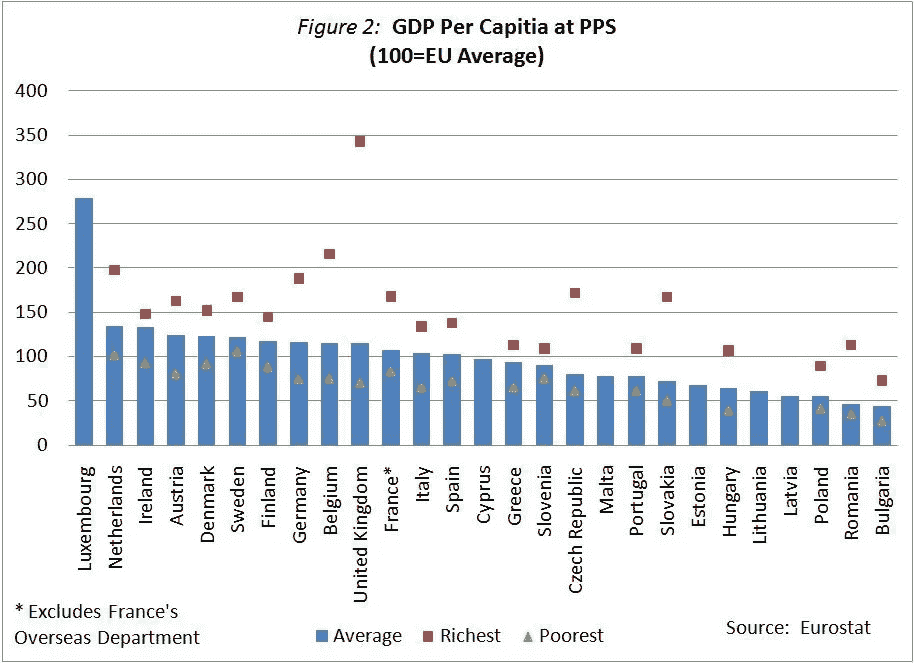
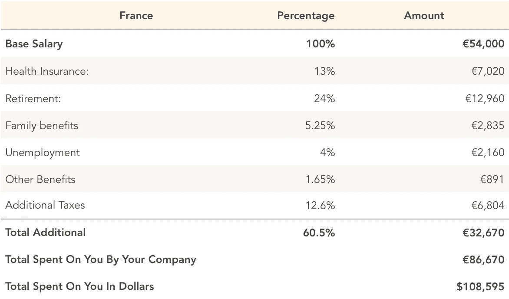
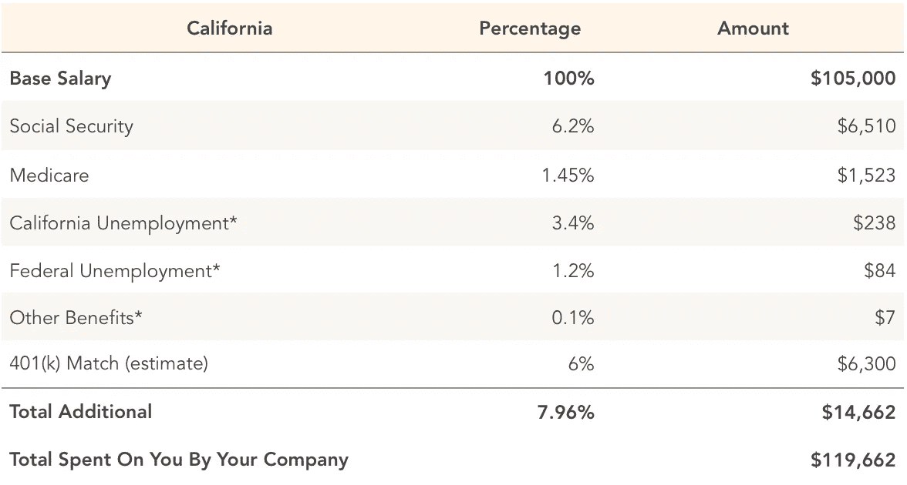
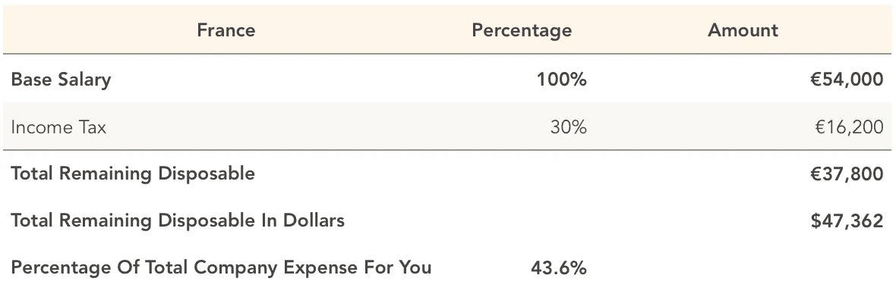
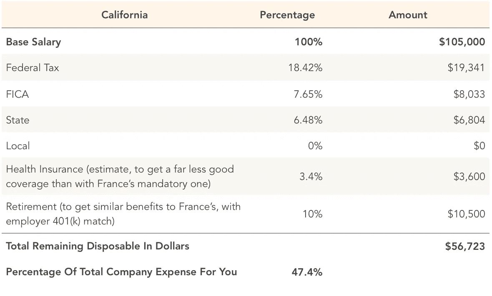
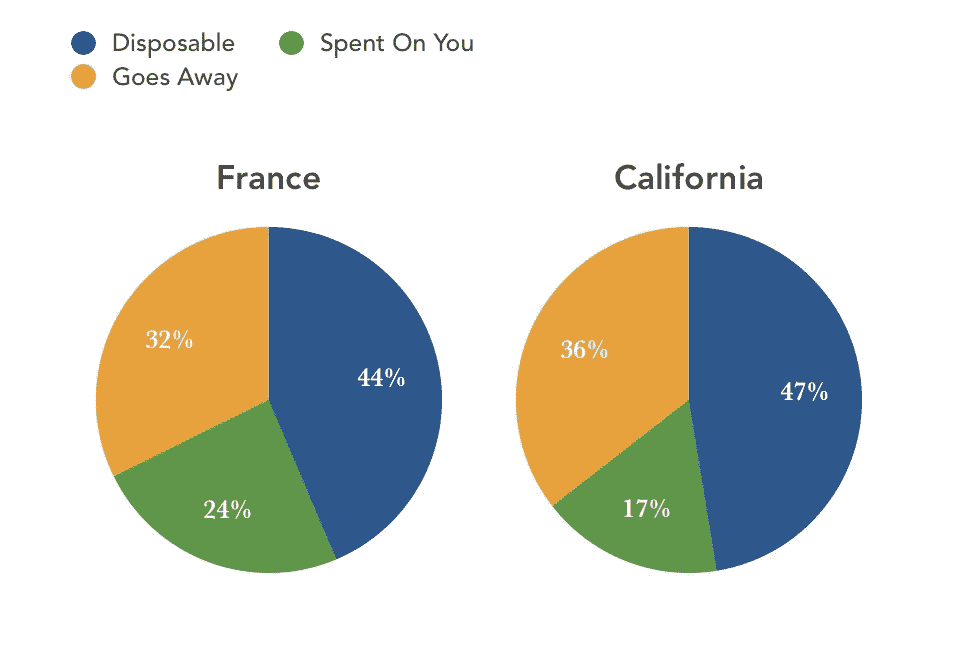

# 美国还是欧洲？—在初创公司工作，哪里能得到更好的待遇？

> 原文：<https://medium.com/hackernoon/leave-silicon-valley-why-did-you-even-move-to-silicon-valley-4f11d7fd04f2>

Communting to work in San Francisco

硅谷和美国是世界科技的黄金国。硅谷的薪资水平、大量繁荣的科技公司以及风险投资生态系统让每个人都相信，这里是在科技行业发展的理想之地。

但是越来越多的公司在世界其他地方成立。亚洲、以色列、欧洲、南美似乎都有自己的科技中心。然而，许多来自这些国家的人仍然想移民到美国，认为他们在那里会生活得更好。

《T4 纽约时报》的[凯文·鲁斯的文章](https://www.nytimes.com/2018/03/04/technology/silicon-valley-midwest.html)呼吁你离开三藩市。但是在美国似乎没有什么地方能比美国更好。

# 在美国工作到底有多划算？

你喜欢旅行中的欧洲。但是你不会真的认为在美国之外支付账单而不挨饿是可能的。

我在欧洲和美国都工作和生活过，我知道这是可能的，所以我比较了两个工程师在每一方会得到什么。

由于欧洲很大，也很多样化，而且有许多不同的立法、价格和工资水平，我选择将加利福尼亚与一个能代表平均水平的国家进行比较。在大多数通常的经济和绩效指标(以下称人均 GDP)中，法国位于欧洲中部:

## 招聘广告显示，做同样的工作，你在法国会少挣 37000 美元。

在法国，一个软件工程师的好职位在€的年薪是 5.4 万英镑(合 6.766 万美元)，而在硅谷，同样的工作一年大概能拿到 10.5 万美元。

但是等等，因为这样比较工资就像直接比较华氏温度和摄氏温度一样，并假设美国热得要命。

要真正比较薪酬，我们必须考虑 4 个因素:

## 1-除了你的工资，公司还在你身上花了多少钱

## 2-你工资的税率

## 3-你交的税有多少回到了你的手中

## 4-你能用你的可支配收入买多少东西

# 1-除了工资之外还有什么

欧洲人付的税要多得多。但是其中的大部分，以及巨大的福利，都是由他们的雇主在他们的工资之外支付的，这已经使法国人的工资高出 60%:

Paid by French employers ON TOP, by law

## €:在法国，一年 54000 英镑意味着在你身上花了 108595 英镑。

在加州，雇主还会在你的工资之外收取额外费用，但金额要少得多:

## 加州一年 105000 美元真的意味着 119662 美元花在你身上。

## 这意味着差距只有 1.1 万美元，而不是 3.7 万美元。

# 2-你工资的税率

税收从来都不是一件容易完全理解的事情，但是对于那个工资范围，在法国，税率是 30%:

## 法国的可支配收入:4.7 万美元

在美国，想出一个对等的标准要复杂得多，因为健康保险有不同的覆盖范围，但没有一个达到法国国家保险的完全免费(包括处方药)水平。

## 美国可支配收入:5.6 万美元

可支配收入的增量下降到 9000 美元，如果你住在加利福尼亚，还需要支付一些医疗费用。

*似乎还是住在加州更好。*

# 3-你收集的钱有多少花在了你身上？

接下来，我将前面表格中的项目分为三类:一次性支出、完全归你所有的支出，以及“消失”的部分。

现在你开始发现你在法国并没有吃亏:

How the company’s total expense is distributed

*   你代表公司的 68%的费用都花在你在法国的身上
*   在加州只有 64%花在你身上。

**如果你把所有因素都考虑在内，差距缩小到加州每年只有 2740 美元。**

但对我来说还不是。与美国不同，欧洲的税收不会资助庞大的军队:它回到人民手中。既没有 20 艘核航母，也没有 3000 枚核武器，也没有破纪录的史上最昂贵的武器计划。

相反，税收为维护道路、人行道、路灯、医疗、教育、公共交通和社会保障提供资金。因此，与美国相比，你几乎每天都能看到你缴纳的每一欧元税款的去向。

# 4-你能用剩下的钱买多少

> “我们仍然少了 27k 美元！我们如何真正获得更好的交易？”

生活费用。

你在大多数咨询报告中发现的生活成本比较的问题是，它们比较的东西没有可比性。例如，他们中的许多人比较了“本地奶酪”或“肉类”等物品的费用，并得出美国的价格低于法国的结论。这完全忽略了一个事实:廉价的法国本地奶酪胜过美味的美国奶酪*廉价的美国本地奶酪看起来和尝起来都像是提炼柴油的副产品*。

然而，尽管产品质量不容易被考虑在内，大多数报告显示，在旧金山生活已经比在巴黎生活贵了 40%。

> 在巴黎，你需要大约 3920 美元(3149€)才能维持和在加州旧金山 5555 美元相同的生活水平(假设你在这两个城市都租房)。

对于可以直接比较的东西，美国实际上要贵 100-200%。在美国，互联网或电话账单会贵 100%-300%，抵押贷款利率会贵 100%，洛杉矶的房租比巴黎贵 80%-100%，旧金山比巴黎贵 100%-150%。

# 明天搬到巴黎，享受欧洲生活方式，薪水比现在增加 40%。

当然，生活方式是个人喜好的问题。但是出于同情，如果你计划从其他地方搬到美国，在你搬家之前考虑所有的因素。

# 更多福利

## 你孩子简历上学士学位旁边的美国大学名字真的值 25 万美元吗？

在欧洲，教育几乎是免费的，相当于法国学士学位的年费可以低于 200 欧元。在私立大学，你可以期望每年支付 3000 到 10000 欧元。儿童保育和初等教育基本上是免费的，甚至有补贴。学校里也没有大规模枪击事件。

还有生活方式。这完全取决于你的个人喜好，但无处不在的公共交通、高速列车和其他基础设施通常被认为是一个优势。

# 我来自欧洲，去美国工作真的没有价值吗？

去吧。去美国呆上 2-3 年。这很难，竞争很激烈，你必须努力工作。当你回来的时候，你会觉得你是从一个更高的联赛下来的，感觉如释重负。

# 我既不会说法语也不会说德语，你想从我这里得到什么？

如果你在科技行业工作，很有可能初创公司也瞄准了美国市场，而且大多数初创公司(如果不是全部的话)都有一个完全讲英语的环境，并且正在寻找有美国经验的人。至于日常生活，那是魅力的一部分。成千上万的人都这样做，你至少和他们一样好。

你只需要*一个迷你，迷你的一对球就可以从美国搬到欧洲*。所以如果你有天赋，就长一个来吧。

# 签证怎么办？

获得在欧洲工作的永久签证比在美国工作容易很多倍。取决于你来自哪里，它可以像拥有一个学士学位和一份工作一样简单。相比之下，多年的等待、美国学位的学费和律师费只是为了获得 H1B 彩票的机会，以获得留在美国的权利。

# → 👋🏻感谢阅读。如果你喜欢它，请‘鼓掌’几次或分享它，以便更多的人可以看到它，我继续写类似的主题。

# [点击这里](http://eepurl.com/cY4zHX)订阅获取我的文章，在这些文章中，我试图对技术相关的话题给出一个直升机视角。

更多关于我的[在这里](http://www.airportworker.com)。你也可以看看我的其他一些热门文章:

*   离开初创公司加入大公司时我学到的 8 件事
*   [AI 自动化经济学有什么可怕的](/@jeancharlesgasche/whats-scary-about-ai-automation-economics-d33ae8881d8b)
*   [加密货币如何最终为市场带来价值](https://hackernoon.com/why-cryptocurrencies-still-dont-bring-value-to-any-market-c3113f3f6056)
*   [为什么没人能阻止埃隆·马斯克让航空业相形见绌](https://hackernoon.com/why-no-one-can-prevent-elon-musk-from-dwarfing-the-airline-industry-now-9fe8a468bebc)
*   [Rails 迁移技巧[指南+代码] —包括备忘单](/into-the-forest/rails-migrations-tricks-guide-code-cheatsheet-included-dca935354f22)
*   [“做不成规模的事情”的坏处](/into-the-forest/why-investing-time-on-our-bootstrap-admin-panel-was-not-a-good-idea-da30cb2bae18)