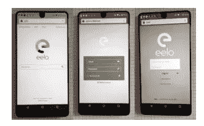
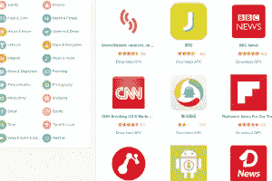
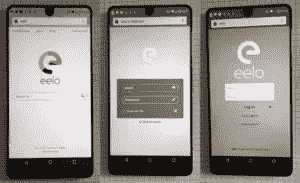
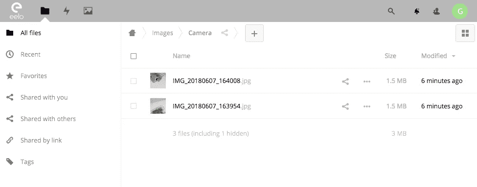
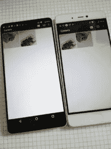

# 离开苹果和谷歌:全球 eelo 发展现状

> 原文：<https://medium.com/hackernoon/leaving-apple-google-a-global-eelo-development-status-1ee11bf80d06>

去年，我决定离开苹果和谷歌:我想把自己从智能手机的两极中解放出来，我想重新控制我的数据隐私，我想保护我的自由。

起初，我想我会放弃 Android，添加一个更好的设计，删除任何谷歌的东西，选择一些符合隐私的网络服务，并将其添加到系统中。

6 个多月之后，我意识到我们正在建设的东西比我预期的要大得多。这一切之所以成为可能，是因为我从世界各地的许多人那里得到了巨大的支持，也是因为不断增长的 eelo 贡献者社区…

*【注意:这是一篇很长的阅读，如果你没有时间可以在本文末尾观看完整的演示视频】*

我们处于低预算模式，但事情进展得相当快。目前主要项目的瓶颈是…我自己！我已经要求许多志愿者坚持下去，因为我没有足够的时间同时管理太多的项目(阅读“[如果我有一个 eelo 联合创始人…](/@gael_duval/if-i-had-an-eelo-co-founder-4c2c1f7cd75)”)。

无论如何，我们计划在八月底发布第一个 eelo 操作系统和一些网络服务作为测试版“MVP”(最小可行产品)。

是时候揭开 eelo 的发展状况了！

**建立团队和社区**

自 2 月初以来，就在 Kickstarter 上的 eelo 众筹活动结束后，我花了很多时间与人交流:eelo 收到了许多人的请求，他们愿意提供一些时间作为志愿者。我需要弄清楚他们真正的动机，他们能花多少时间。对于他们中的一些人，我们讨论补偿。

这是一个长期的过程，我对我们已经开始组建的团队感到非常高兴:他们来自世界各地，非常聪明，非常有才华。

如今，从基础设施到设计，这相当于约 15 人全职参与各种项目。我还和其他人讨论了一些长期的附带项目，这些项目不会集成到 eelo 的第一版中。比如基于人工智能的助手，以及 eelo 令牌功能。

**构建编译场**

智能手机操作系统有很多(真的很多)源代码。当您想要构建它以在真实设备上进行测试时，在快速机器(Core i7 / 32GB RAM / SSD 驱动器等)上编译可能需要 1.5 小时。这是每个受支持设备的情况。目前，我们的目标是 6 种不同的测试设备，我们计划支持几十种。

这意味着我们需要:

*   几台编译机
*   管理源代码和构建的自动化设置

我们决定使用 GitLab(自托管)+ docker 容器。这为我们管理源代码带来了很大的灵活性，并且可以轻松地部署新的编译服务器。

我们开始租用第一台专用服务器，我买了两台翻新的 IBM x3650 M3，我们已经为编译做好了准备。我们现在可以根据需要添加任意多的服务器。我们有一个完整的编译链来持续集成 eelo，包括自动化的每日构建和很快按需定制的构建。

正在开发中的 eelo 操作系统！

我们从一开始就致力于 eelo 的用户界面。因此，我们现在有一个伟大的启动器，它使图标分组和应用程序删除变得直观。

启动器还在图标上提供通知徽章。目前，这些徽章是绿色的，因为我认为通知不应该有压力。

请阅读下面的内容，了解当前 eelo 用户界面的更全面的演示。

**小细节**

eelo 是关于用户的数据隐私和自由的，但是我唯一确定的是，如果没有一个好的用户界面，它不可能成功。

所以我们需要进入小细节，我很高兴我们能够实现这些:

*   我们的日历图标显示当前日期
*   我们的时钟图标显示当前时间！看看下面移动的时钟指针:

**应用…**

默认应用程序的选择已经引起了许多内部和公众的讨论！

我同意将预装应用程序的数量降低到“合理的最低限度”。这将让用户安装他们喜欢的应用程序。

我们讨论的一个问题是关于默认的消息应用程序。我收到了许多关于消息应用的建议。这是一个艰难的选择。

选项包括:

*   没有默认的消息应用程序:这意味着不知道的人会立即安装 WhatsApp messenger 或脸书 messenger，这不是我们想要鼓励的事情！
*   安装一些很棒的信息应用程序，如 Wire 或 DeltaChat(绝对值得一试)…目前，他们缺乏大量用户，这意味着你很可能会发现你的联系人中没有人使用它。
*   put Telegram:我个人喜欢 Telegram，我认为它是最安全的消息应用之一(某些国家对 Telegram 的态度似乎证明了这一点)。而且有很多用户。但这让 Signal 的支持者不高兴。
*   放信号:在用户体验方面不如 Telegram，用户少。但它可能非常安全，而且是完全开源的。而且可以处理短信/短信。

最后，我做了一个简单的决定:将 Telegram 预装为消息应用，将 Signal 预装为默认的 SMS 应用(包括即时消息功能)。

其他默认应用程序的选择也很重要，我担心 AOSP 的默认电子邮件应用程序，因为它完全与谷歌服务集成在一起。

因此，我们决定使用 K9-mail，并致力于其用户界面。它仍然需要一些改进，但它已经比以前更好了。K9-mail 也支持 PGP 邮件加密。

关于默认的网络浏览器，我们选择了 LineageOS 的默认网络浏览器:它又快又灵活，但是我们必须修改它的设置，让它提供一个不同的默认搜索引擎列表。默认情况下，它现在使用我们新的 eelo 元搜索引擎，但用户可以选择配置 Qwant 或 DuckDuckGo。

我们还在评估日历、笔记等默认应用程序

**…和 widgets**

启动器左侧视图可以托管一些小部件。我们已经能够实现的第一个是“最常用的应用程序”，以及一个使用 eelo 在线元搜索引擎的搜索字段(观看下面的视频)。我们正在开发一个天气小工具。

**一个巨大的应用程序库**

eelo 的一大挑战是提供一个独特的地方，让用户可以轻松地下载和安装应用程序，而不必使用用户帐户。

我们从免费的 Android 应用程序和 F-droid(开源)应用程序开始。

我们已经建立了一个关于这些应用程序的大型数据库，该数据库现在每周 7 天每天 24 小时不断更新。

Lots of Android apps

现在，我们仍然需要构建一个 Android 应用程序，它可以连接到我们的数据库，并管理用户的 eelo 操作系统+公共存储库上安装的应用程序。

**操作系统服务**

eelo 操作系统最重要的一个方面是完全不受泄露我们个人数据的谷歌软件的影响。

因此，我们删除了许多应用程序使用的 Google Play 服务，并使用 wifi 网络或 GSM 网络提供一些服务，如地理定位。

我们已经用开源的 microG 组件取代了 Google Play 服务。microG 为 Google Play 服务提供了一个很好的替代方案(尽管它还没有解决所有的功能)。

一个重要的功能是提供即时同步和备份功能。因此，我们正在实施一项“eelo 同步器”服务，用户可以选择使用这项服务将他们的照片、视频和设备设置备份到云中。目前，他们可以使用公共的 OwnCloud/NextCloud 实例，或者自托管的实例。eelo 也将提供一个在线驱动器。

我们也有一个“空中下载”(OTA)机制来升级整个系统。

**网络服务**

就拿最安全、最符合数据隐私要求的智能手机来说吧:如果你使用电子邮件、搜索或从使用你的数据开展业务的在线服务中开车，你仍有可能破坏你的隐私。

因此，我们必须研究这些服务的替代方案。

我们已经有了一个 eelo 电子邮件服务实现，eelo 的支持者很快就可以访问，以及一个驱动服务实现。它在用户界面上仍然缺乏一些一致性，但它正在进步。

挑战是要使它可扩展，我们正在与一些托管合作伙伴进行讨论。

eelo search, webmail, and drive

我想用 eelo 提供的 web 服务之一是一个很好的地图应用程序。OpenStreetMap 工作得很好，但目前，我没有找到一个足够好的移动(和开源)应用程序可以显示 OpenStreetMap 中的地图。

我们可以黑一些应用程序，但这是一个大项目，我现在不想开始。(我欢迎各种想法/建议！)

**当前状态的演示…**

图标分组，取消分组，应用程序删除，启动一些应用程序，做一个搜索…看视频！

我想展示的另一个功能是媒体同步，但作为电影来说有点太复杂了，所以我拍了一些照片:

首先，拍一些可爱的树莓皮的照片:

然后，稍微等一下，你就可以看到图片已经同步到 eelo 驱动器了:

如果你有另一个设备连接到同一个 eelo 驱动帐户，你会看到同样的图片出现:

支持删除，也支持编辑。包括图像、视频、声音在内的多媒体内容是同步的，我们正在备份设备设置。

**在 eelo 的第一个公测“MVP”之前还有什么要做的？**

还有很多工作要做，但这里有一个要实施的主要事项的列表:

*   集成同步服务:它必须作为系统守护进程运行
*   添加一个 eelo indentity 机制，这样用户就不必为每个 eelo 服务(邮件、驱动器……)进行身份验证。我们已经为此建立了一个密钥锁服务器，工作正在进行中
*   定制首次使用向导，特别是包括 eelo 身份部分，并询问用户他们的选择(同步，不同步，…)并在一般设置中保持不变
*   调整 ROM 中的一些默认设置
*   用户界面:改善一些默认应用的外观和感觉，改善设置外观和感觉
*   完成默认应用的选择并集成它们
*   也许整合 XPrivacy
*   完成应用程序存储库和开发人员安装程序应用程序
*   测试！调试！测试！调试！测试！调试！….

**未来几个月的路线图**

经常有人问我“什么时候发布？”

我们的目标没有改变:我们计划在八月底发布第一个 eelo“MVP”测试版软件。然后，我们将开放 eelo 源代码库。这可能会带来更多的贡献者。

eelo 版本预计在 2018 年底或 2019 年初推出。

**最后但同样重要的是:“e 基金会”**

我说过，我希望 eelo 的核心资产被托管到一个非营利组织中。这已经成为现实:“e 基金会”[现在是一个法人实体](https://www.indidea.org/gael/blog/announcing-e-foundation-for-eelo)(并开始通过 eelo 的网站从支持者那里收集捐赠和捐款。

eelo 比以往任何时候都更需要每个人的支持:向朋友、媒体谈论这个项目，做出贡献！

我们现在正在寻找合作伙伴:希望分销 eelo 的智能手机制造商、电信公司、托管公司…

让我们从网络巨头的两极中解放出来，我们的数据就是我们的数据！

—gal(在 Twitter 上关注我/【乳齿象上的 

附言（同 postscript）；警官（police sergeant）

*   最新更新在[https://medium . com/@ gael _ duval/leaving-apple-and-Google-e-is-the-symbol-for-my-data-is-my-data-69629 a 948 FEC](/@gael_duval/leaving-apple-and-google-e-is-the-symbol-for-my-data-is-my-data-69629a948fec)
*   与 eelo 保持联系:[在 eelo.io](https://eelo.io) 登陆页面注册。
*   联系我:gael @ eelo。超正析象管
*   请用**英文**评论；)