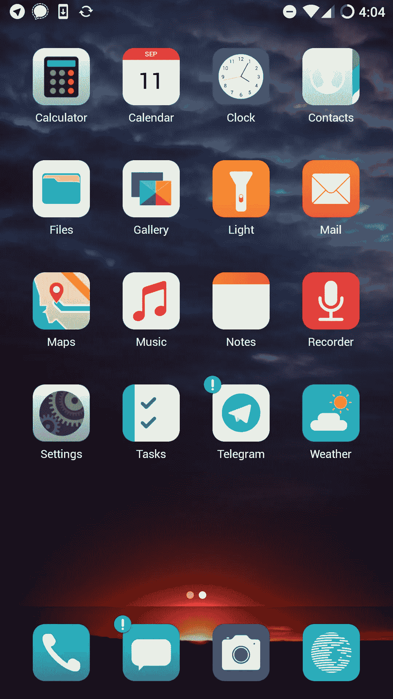
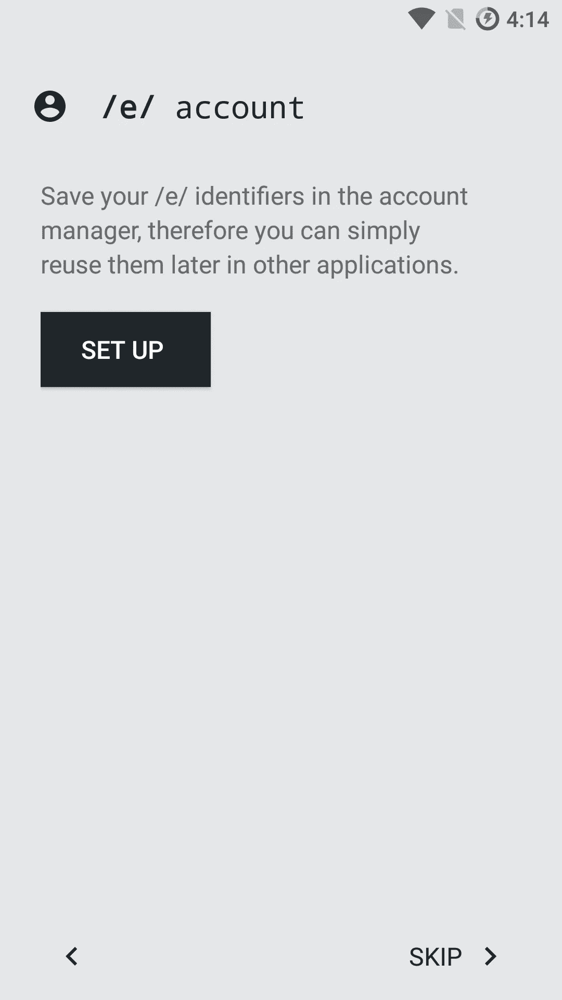
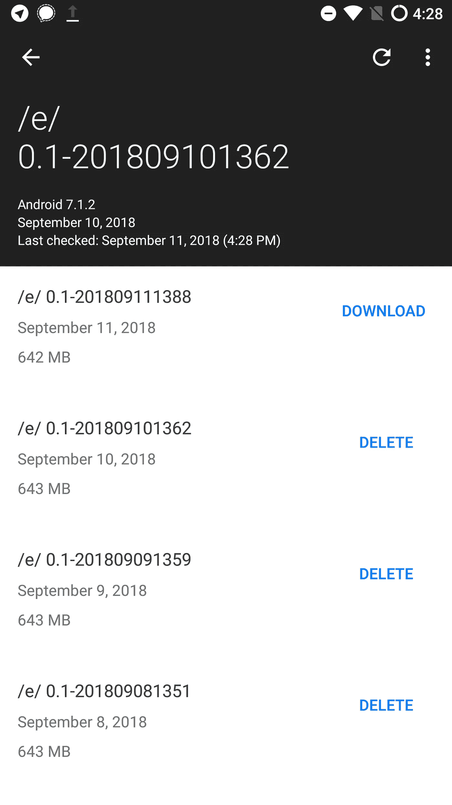
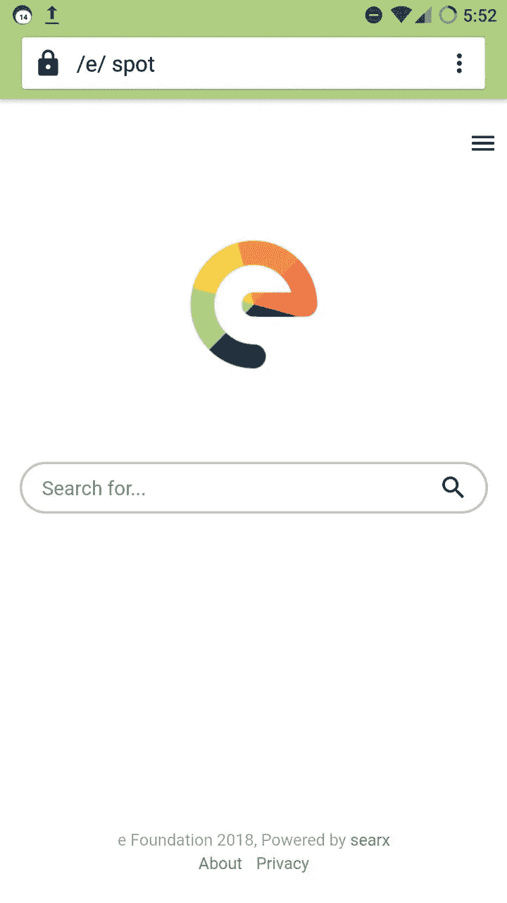
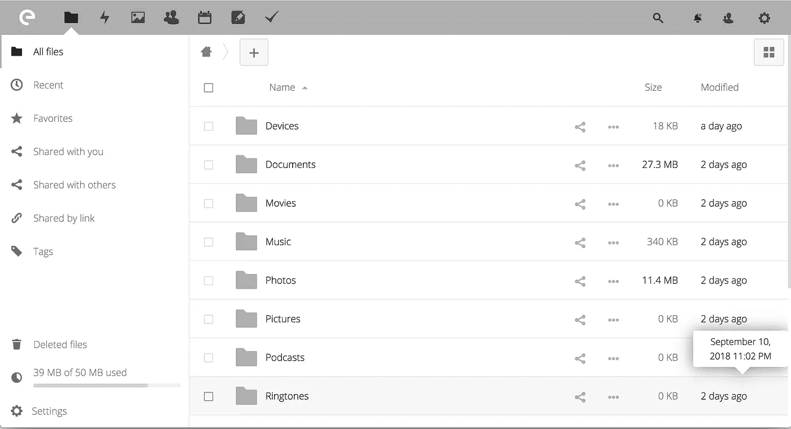
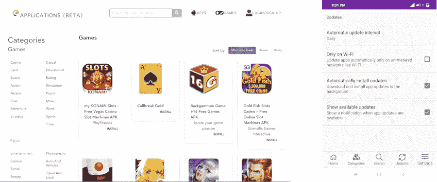

# 离开苹果&谷歌:/e/ first beta 来了！

> 原文：<https://medium.com/hackernoon/leaving-apple-google-e-first-beta-is-here-89e39f492c6f>

不到一年前，我发布了一系列文章“[离开苹果&谷歌……](https://hackernoon.com/leaving-apple-and-google-my-eelo-odyssey-introduction-d22741f990d7)”【[第一部分](https://hackernoon.com/leaving-apple-and-google-my-eelo-odyssey-introduction-d22741f990d7)、[第二部分](https://hackernoon.com/leaving-apple-and-google-my-eelo-odyssey-part2-web-services-4c01bb838279)、[第三部分](https://hackernoon.com/leaving-apple-and-google-my-eelo-odyssey-part2-web-services-4c01bb838279)”，宣布我正计划打造一款智能手机 OS。新操作系统将:

*   从谷歌免费(没有谷歌服务，没有谷歌搜索，没有谷歌 Play 商店等。)
*   更加尊重用户的数据隐私
*   足够吸引人，让父母、孩子和朋友喜欢使用它，即使他们不是技术爱好者或极客

今天，我们发布了第一个测试版，展示了我们为实现最初的愿景所做的工作。叫 [/e/](https://e.foundation) ！

# **谢谢！**

这次发布之所以成为可能，是因为许多人的大力支持，我要特别感谢:

*   所有/e/从一开始的支持者——来自 Kickstarter、Indiegogo 和 Patreon 运动的支持者。没有你们的财政捐助和信任，这一切都不可能实现。
*   所有和我一起工作了 6 个月的优秀开发人员。你一直做得很好，我很自豪能和这样有才华的人一起工作。
*   所有的贡献者:开发人员、翻译人员、内容审查人员…
*   我的亲密团队“朋友顾问”帮助我集中注意力，分享一些想法，并帮助我保持清晰的前景

什么在里面？

最初的计划(正如我们的众筹活动中所描述的)是发布一个 MVP(最小可行产品)，作为一个“去谷歌化”的智能手机操作系统 ROM，从 [LineageOS](https://www.lineageos.org/) (以前的 CyanogenMod)派生而来，具有精心选择的默认应用程序、新的用户界面和几个集成到产品中的专用在线服务。

在我们目前的发展阶段，我们有:

*   Beta 阶段的“/e/”ROM:从 LineageOS 14.1 派生而来，可以安装在几个设备上([阅读列表](https://gitlab.e.foundation/e/wiki/en/wikis/devices-list))。受支持设备的数量将随着时间的推移而增长，这取决于更多的构建服务器和更多可以维护或移植到特定设备的贡献者(欢迎贡献者)。该 ROM 包括默认配置为 Mozilla NLP 的 [microG](https://microg.org/) ，因此即使在 GPS 信号不可用的情况下，用户也可以使用地理定位功能。
*   一个新的用户界面:BlissLauncher 有原始的图标和对小部件的支持(实现了天气小部件)，以及基于屏幕像素密度的自动图标大小调整

BlissLauncher with default apps in /e/

*   一组新的默认应用程序:邮件应用程序是支持 OAuth 的 K9-mail 的分支，短信应用程序是 Signal，聊天应用程序是 Telegram(或者你可以使用 Signal 进行聊天)，以及天气应用程序、笔记应用程序、任务应用程序和地图应用程序(*)。
*   /e/ account manager:用户可以选择对所有服务使用单一/e/ identity (user@e.email)。首次安装时或在“设置”->“帐户”中进行一次登录，所有/e/服务立即可用:邮件、驱动器、日历、备忘录、任务。它还可以跨多种设备使用，并且可以从网络(用于电子邮件和驱动)或 NextCloud 客户端使用。某些设置是按设备同步的；改进仍在继续。

The /e/ account manager

*   OTA(空中下载)/e/系统更新:更新将在每夜版本中提供(注意:这些是开发更新，直到 1.0 版稳定版发布，所以它们可能会中断)

OTA (Over the air) system updates in /e/

*   默认搜索引擎:当然，我们里面没有谷歌，甚至没有必应。实际上，我们现在已经决定使用 Searx 的一个分支，这是一个元搜索引擎。它仍然很慢，但我们认为这将是一个很好的选择，既能带来好的匿名搜索结果。我们还将 Qwant 和 DuckDuckGo 作为附加选项包含在默认 web 浏览器的搜索引擎列表中(目前是 Jelly)。

/e/ spot: our meta search engine

*   服务:除了我们的元搜索引擎，我们还在运行一个/e/ email 服务和一个/e/“云”服务(基于 NextCloud)。它与单个/e/用户身份完全集成。不过，这些都是测试服务，只有“标准”安全性，我们可以根据我们在 e.foundation 收到的捐款，逐步开设免费账户。

/e/ drive, where multimedia contents and device settings are syncing from the /e/ ROM

**接下来会发生什么？**

在操作系统中:

*   我们将添加更多的功能-例如设置从驱动器备份恢复
*   我们将调整/改进应用程序，重点是提高用户界面的简单性和整个操作系统的一致性
*   我们将改变默认的 DNS 参数！目前，谷歌的 DNS IPs 仍在使用，我们认为最好是默认 1.1.1.1 和/或 9.9.9.9，并可能很容易改变他们的能力。但是这比预期的要复杂，简单的解决方案太像 DIY 了，所以现在推迟了。
*   我们将把我们的工作移植到 linegeos 15/Android Oreo。这一过程已经开始，一旦完成，将有助于我们支持更新的设备。欢迎投稿(查 eelo-0.2 分支)！gitlab 链接]

服务:

*   我们将巩固我们的/e/身份，可能使用 OAuth，并在拼图中添加一个在线办公组件
*   我们将提供打包为 Docker 映像的/e/服务，这样用户就可以在自己的服务器上安装该服务，以便自托管邮件、在线存储、日历等。
*   我们将改进我们的元搜索引擎，特别是专注于减少搜索响应时间
*   我们将提供一个/e/应用程序库！尽管做了很多工作，它还没有准备好。我们维护着一个约 60，000 个 Android 应用程序的数据库，每天同步，并建立了一个网站来搜索和下载这些应用程序。我们已经开始开发一个安装程序，我们将把它构建到/e/操作系统中。这将提供更多关于应用程序隐私，追踪器，许可证细节等信息。这应该在未来几周内准备好。在此之前，你可以使用 Yalp Store 和 F-droid 来获取其他应用程序。

Our upcoming /e/ repo website and application installer

*   我们需要一个定制的 TWRP:定制工作已经开始，但还没有准备好

**如何测试/e/？**

**首先**，请理解以下几点:在移动设备上安装新的操作系统可能会 1)导致设备上的所有数据被破坏 2)使其成为不可恢复的砖块。

所以，如果你知道自己在做什么，并且愿意冒这个险，请只闪现你的设备。

/e/ project 及其项目成员否认对使用/e/软件和/或/e/服务的后果承担任何责任。

也就是说，如果您想安装/e/并测试它，最常见的方法如下:

1.  最理想的是获得一个@e.email 帐户！这将有助于测试/e/ identity 服务。我们仍在提供一些测试账户，[请在此阅读如何申请](https://gitlab.e.foundation/e/wiki/en/wikis/create-e-test-account)。
2.  解锁引导程序:这个过程取决于你使用的设备
3.  备份您的数据，以便以后可以还原
4.  安装恢复软件，如 TWRP
5.  在恢复模式下启动，格式化，擦除一些分区
6.  将设备特定的/e/ image 推送到您的设备(通常为“adb push e-image.zip /sdcard/”
7.  将映像安装到您的设备上
8.  重新启动

我们正在为我们支持的设备维护[安装和构建文档注释](https://gitlab.e.foundation/e/wiki/en/wikis/devices-list)。这仅供参考，因为它需要在现实环境中进行校对和检查。你还可以在 lineageos.org 和 XDA 的开发者论坛上找到很多关于构建和更新设备的有用信息。

**如何举报 bug&投稿？**

向我们的 bug 追踪器报告你发现的任何 bug 是很重要的。这可能是硬件的错误、安装的错误、启动程序的错误、/e/ services 的错误…

我们已经开放了我们的 GitLab 源代码库，这是你可以注册和[报告你发现的问题](https://gitlab.e.foundation/e/wiki/en/wikis/issues)的地方，或者是一个专门的项目(如果你知道是哪个项目的话)，或者是一个一般的报告问题部分。

**/e/隐私挑战！**

我们对迄今取得的成就感到非常高兴，但同时，我们知道，要改进这一系统，还有许多工作要做。除了您对调试的贡献之外，我们还想听听您对/e/系统的隐私和安全性的看法。

简而言之:你能找到系统的任何部分或默认应用程序仍在向谷歌泄露数据吗？您对我们如何提高/e/的隐私和安全性有什么建议吗？

请将您的建议发送至 *privacychallenge@e.email*

**接下来的步骤**

我们的下一个重大步骤是:

*   继续向第一个稳定的 v1 /e/系统发展
*   要完成应用程序存储库和安装程序
*   完成 LOS15/Oreo 的端口并添加更多设备
*   改善在线服务
*   为了加强移动操作系统中的安全和隐私功能

我们的目标是在 2019 年初推出稳定的 v1 /e/系统。

**我们要去哪里:全球视野**

当前的移动操作系统世界由苹果和谷歌主导。苹果提供了一个昂贵、专有和封闭的生态系统，对用户的数据使用和隐私没有提供真正的保证。而 Google/Android 的业务依赖于用户在全球范围内的数据收集。

另一方面，at /e/希望建立一个可供选择的移动操作系统，让每个人都能享受使用的乐趣，这个系统更加尊重用户的数据隐私，同时为他们提供真正的选择自由。我们希望成为符合道德的移动操作系统，为公众利益而构建。

我们的项目向前迈出的一大步将是为开发应用程序添加对新的开源 SDK 的支持，这样我们最终可以摆脱对 Android 应用程序生态系统、通知等的依赖。我们希望与来自开源软件世界的合作伙伴一起开发这个软件。

今天，我们发布了第一个测试版，完全符合最初的设想。它可以安装在一系列设备上，因此具有技术知识的人可以开始使用它，调试它，并在需要的地方改进它。

明天我们将与硬件制造商和翻新商合作，以便/e/系统可以预装在手机上。我们当然愿意在这一领域，在世界所有地区进行合作，所以请与我们联系。

最后但并非最不重要的一点是,/e/ mission 不会止步于移动操作系统，因为我们知道个人助理的使用越来越多，并对个人隐私构成了真正的威胁。所以我们想尽快在这个地区开展一个项目。

**关于项目名称的一句话:/e/**

出于我们前面解释过的原因，我们不得不更改项目名称。我们决定采用“/e/”作为“我的数据就是我的数据”符号的文本表示。我们知道这种文本表示对于谈论项目和搜索项目来说并不理想。

我们已经决定推迟对测试版名称的更改。随着 v1 稳定版的推出，我们将为移动系统引入一个易于记忆和采用的新名称。

**现在比以往任何时候都更需要支持这个项目！**

到现在为止，你们都会明白我们的项目是一个多么大的挑战。如果你认同我们的使命，想帮忙，你可以做点什么！

*   作为开发者，你可以[帮助我们改进项目](https://gitlab.e.foundation/) ( [联系我们](https://e.foundation/contact/))
*   作为个人或企业，您可以帮助我们为项目融资，以推动其发展:我们处于超低预算模式，但**提供财务捐助非常重要，我们非常欢迎向“e 基金会”**捐赠 **(您可以获得奖励)。**
*   如果您有一些具有大量 CPU/RAM/磁盘和带宽的备用服务器，您可以将它们借给该项目，这样我们就可以构建更多设备([联系我们](https://e.foundation/contact/))。
*   你也可以谈论我们的项目，展示系统运行，[解释为什么拥有开放和道德的基础设施软件产品对我们的世界如此重要。](https://hackernoon.com/eelo-is-more-than-tech-its-a-societal-project-for-freedom-and-democracy-951ea5c8f162)
*   您可以发布到 e.foundation 网站的链接，向社交媒体和媒体发送关于该项目的消息，发送消息并就用户数据隐私问题向政治家施加温和的压力，以及/e/

谢谢大家的支持，还有**快乐测试**！

—gal/关注我[在 Twitter 上](https://twitter.com/gael_duval) / [在乳齿象上](https://mastodon.social/web/accounts/25068)

(*)关于地图应用:这是/e/中唯一一个(还)没有开源的应用。我们测试过很多地图应用，唯一能和常见的知名地图应用相提并论的 app 是“神奇地球”。我们已经与该应用程序的发行商进行了讨论，虽然他们尚未决定开源，但他们已经向我们提供了一些关于该应用程序隐私行为的文档。我个人的感觉是，如果我们对这个应用程序表现出足够的接受度，它最终会变成开源的。