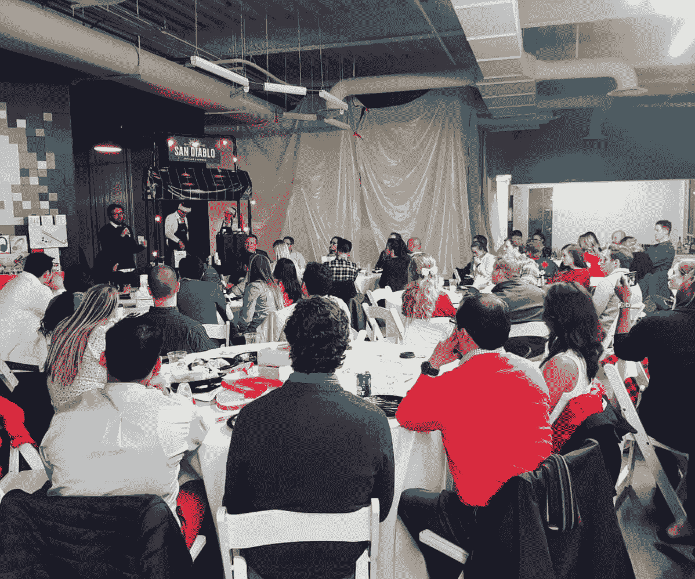
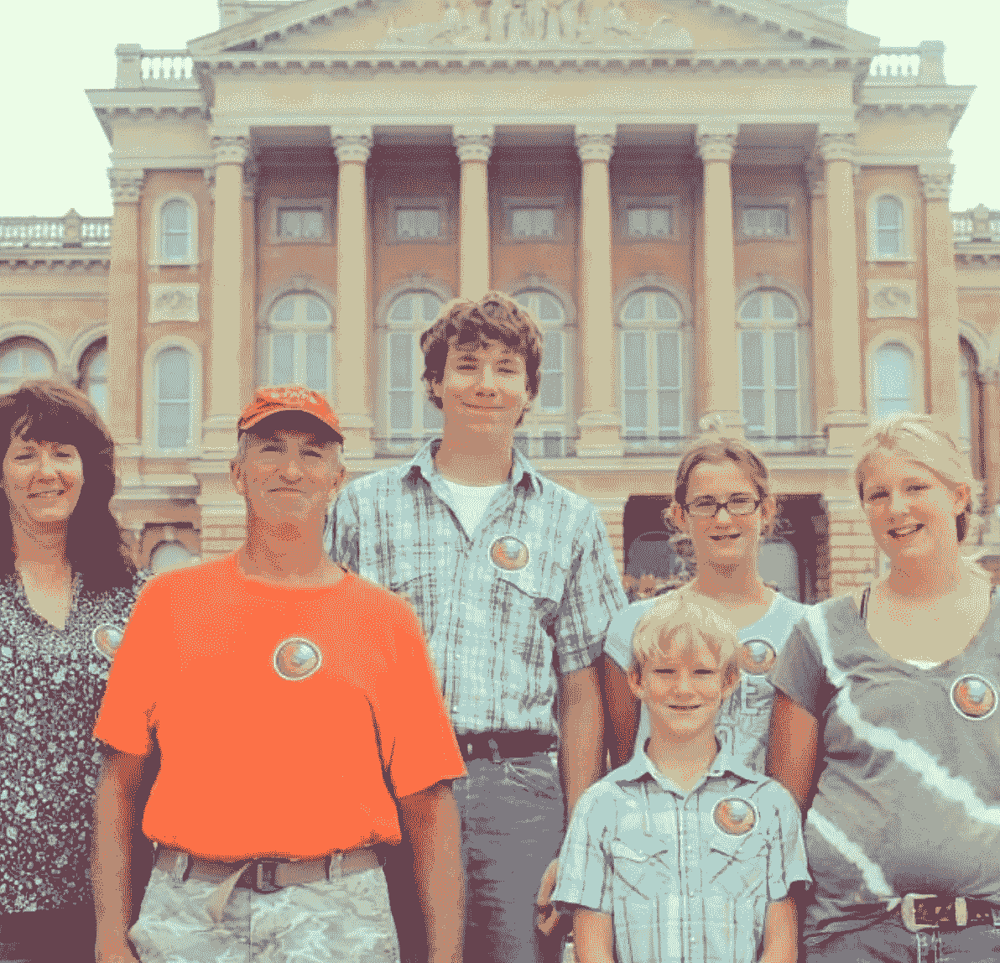
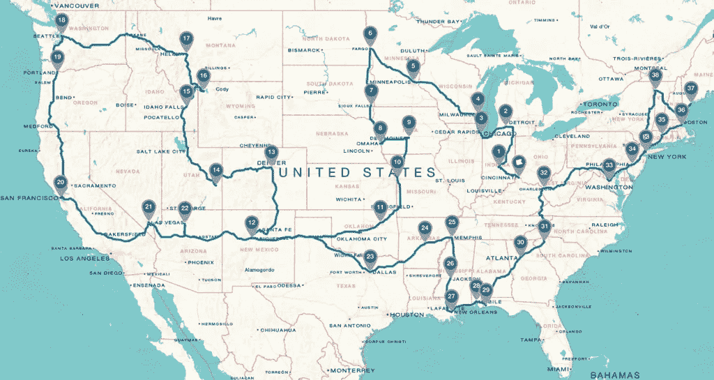
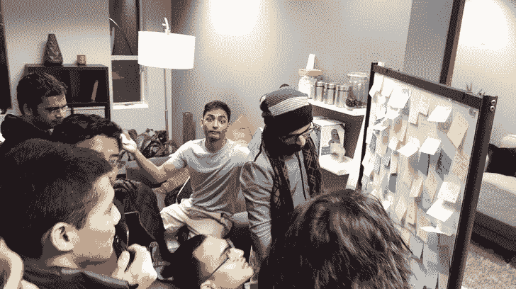
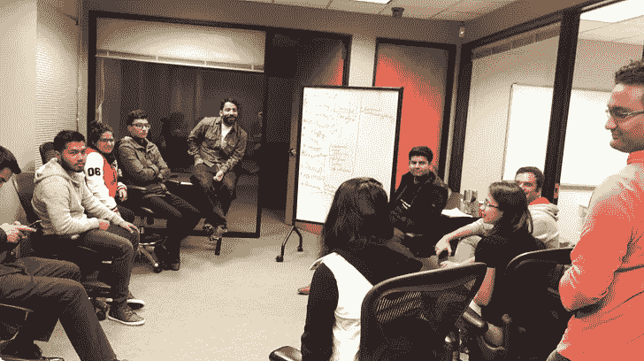
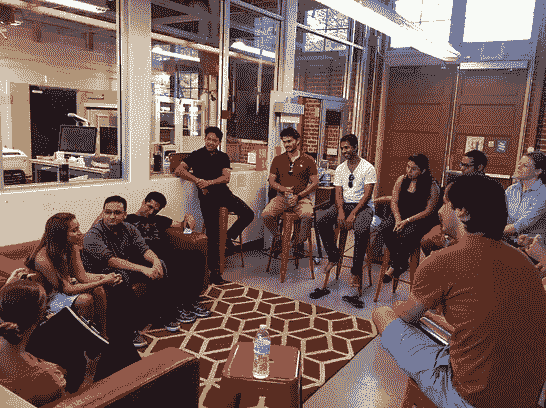
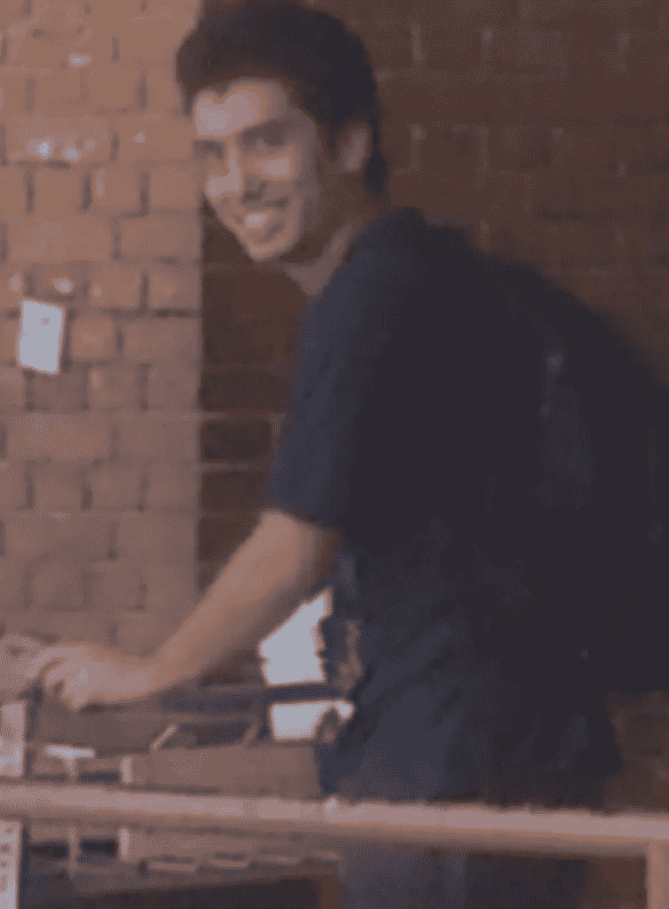
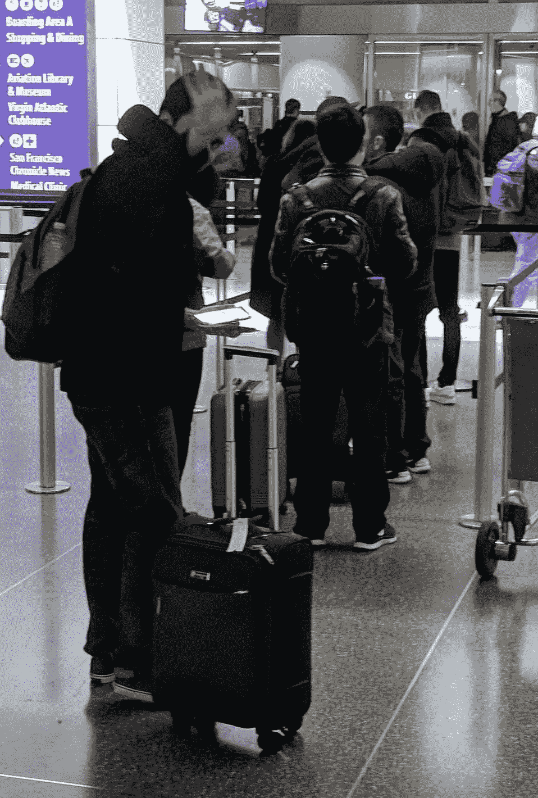

# 离开美国

> 原文：<https://medium.com/hackernoon/leaving-the-united-states-e21206e3dc02>

今天是我在美国的最后一天。

我从没想过我会在这么小的时候说这些话。在过去的四年半时间里，美国是我远离家乡的家。我在这里交了很多知心朋友，我很珍惜和他们在一起的每一刻。

我在这个国家遇到了一些最聪明、最热情、最有爱心和爱心的人。美国在一个全新的层面上教会了我友谊、生活、工作和激情。在过去的几年里，有许多改变生活的事件，帮助我个人成长。

我从一名学生成长为一名追随者，又成为一名领导者，在所有抛给我的事情上挑战自己。通过[赋权](http://digitalnepal.org/) [社区](https://github.com/Code4Nepal/bay-area)[起步](/@prashishh/how-mozdrive-started-af56d4be8a82) [动作](http://web.archive.org/web/20140721163751/http://mozdrive.com:80/)[建设](http://infourminutes.co/) [项目](http://codefornepal.org/2017/06/tech-scholarship/)，我尽我所能为社会做贡献。

我有幸在一家让新兴市场实现无现金化的公司工作，为一个使命是确保互联网保持开放的组织服务，并领导一个改善尼泊尔数字文化的社区。

今天，我将离开这一切，回到尼泊尔。

这可能会让很多人感到惊讶，有些人甚至会说我愚蠢。但是我想分享我的观点，为什么我会有这样的信念，为什么这一切都是有意义的。

# 硅谷和剪辑

当我加入 Clip 时，我认为自己作为一个个体不会在其他任何地方产生更大的影响。我们每天处理的问题都很有挑战性。我们有责任让我们的商人生活得更好，最重要的是，赋予他们权力。

天哪，我们成功了！

Clip 是拉丁美洲顶尖的创业公司之一，它正在推动墨西哥的金融创新。在这个国家的一些地方,“Clip”是一个家喻户晓的名字。

My last Christmas celebration at Clip

当我加入时，这家公司屈指可数，如今我们在三个不同的城市拥有 200 多名员工。

随着公司的成长，我的一部分感觉到我并没有做出我想要的改变。我开始适应我的日常工作。对我来说有点太舒适了。

但是，它帮助我专注于我热爱的其他领域，尤其是回报社区。

# Mozilla 基金会

作为开放网络的大力支持者，我喜欢合作和贡献，让网络成为每个人更好的地方。

后来，为了提高人们对 Mozilla 及其使命的认识，我在 25 天内驱车 11，000 多英里，穿越了美国 40 个州。这是一生只有一次的经历，在 moz drive T2 活动 T3 之后，我感到非常疲惫。

mozdrive campaign route

那次驾车旅行后，我挂靴，开始在不同的组织中寻找不同的角色。

[尼泊尔的代码](http://codefornepal.org/)是完美的匹配。

# 尼泊尔代码

在随机打电话给 Ravi(联合创始人)后，我志愿成为了尼泊尔代码的技术官员。我们聊了几个小时，讨论如何让 C4N 更上一层楼。这是我第一次在一个大组织中担任领导职务。

尼泊尔代码令人兴奋。我们参与了几个项目，包括创建人口普查数据的可视化表示、筹集资金、在地震期间做志愿者等等。

在 C4N 成功了几年后，是时候通过创建地方分会来扩大我们的努力了。这个想法是让一群充满激情的人相信 C4N 的使命，一起做一些有价值的事情。

# 回到硅谷

硅谷是创作第一章的最佳地点。很容易找到那些想以任何身份回报社区的聪明人。

Bay Area C4N meetups

在一年的时间里，我们有了一批活跃的工程师、设计师、数据分析师、记者、生物学家和社会工作者，他们愿意为尼泊尔社区服务。

事情进展得很顺利。

但是，我的一部分认为，如果我离家近一点，我会比在 12，755 公里以外更有用。

# 把区块链带进来

作为一名观众，我已经关注[区块链](https://hackernoon.com/tagged/blockchain)空间很久了。随着我了解的越来越多，越来越明显的是，区块链将继续存在，并拥有我们今天无法想象的巨大潜力。

区块链空间仍处于萌芽阶段，理解它需要时间和精力。从过去的经历中，我明白了跟风从来都不是一个好主意。第一步是了解区块链如何在我们当前的社会和世界中发挥作用。

Andreas Antonopolous 说过一句著名的话，当你开始理解区块链科技的革命性时，你不能不去想它，除此之外什么都不想。

我也感染了同样的病毒。

**我想一头冲进区块链。**

# 你不需要在硅谷

毫无疑问，硅谷是世界上最受欢迎的科技城市。技术创新的速度是其他地方无法比拟的，或者至少我是这么认为的。

当我与更多的人交谈时，很明显，在中国、南韩、日本等亚洲国家，区块链领域的创新比美国更快。没有理由不相信他们，因为世界正变得越来越全球化，硅谷效应正在广泛传播。

不要误会我；我喜欢海湾地区。这里有我最亲密的朋友，也有相当不错的职业人脉。但是，在这个时候，探索亚洲市场的想法实在是太诱人了。

实现我强烈愿望的唯一方法就是收拾行李，去看看硅谷泡沫之外的世界。

为什么不呢？

# ❤+区块链+家

毫无疑问，抛下一切重新开始的想法很吓人，很伤脑筋。但它同时令人兴奋和激动。我一直喜欢挑战，这次将会是不同的水平。

我曾经认真地开始质疑这是否是一个好的决定。但是我已经下定决心了。

我将离我的家人很近，到亚洲主要城市的飞行距离很短，并且有一个巨大的支持朋友圈网络。

一切都开始有意义了，时机也对了！

**地狱耶！**

是时候成为这一切的中心了。

# 下一步是什么？

我把我的路线图分成三个主要部分:

1)探索新兴市场和区块链技术。确定区块链如何解决新兴市场中的现有问题。3)构建。( [#buidl](https://twitter.com/search?q=buidl) )

我不确定时间表会如何，但我个人期待着忙碌、艰辛和在途中解决问题。

生活教会我的一件事就是永远不要处于后悔的状态。我不想在以后的人生中后悔错过了离家更近的机会，也不想错过成为区块链创新中心的机会。

# 展望未来

奇怪的是，我甚至不确定最后是否一切都会好起来，或者我会享受我发现的东西，或者像区块链科技那样的最坏情况。但是，让我兴奋的是，这是朝着正确方向迈出的一步。这将帮助我每天都成为一个更好的自己，让我保持警觉，并帮助我找到如何积极影响世界的方法。

人生苦短，不能坐在后座。

生活就是承担风险，充分利用你的处境。

所以，这里要感谢所有的冒险者，午夜蜡烛燃烧者，感谢他们迈出了信念的一大步，做了你一直想做的事情，朝着你的目标努力。

我从美国签出。回头见，尼泊尔。

明天复工！

Left: 11th Aug, 2013 to US. Right: 1st March 2018 to Nepal.

如果你想谈论区块链的一切或者只是想联系，请发推文给我，地址是[*@ prashish*](https://twitter.com/prashishh/)*或者发电子邮件给我，地址是:namaste[at]prashish[dot]xyz。*