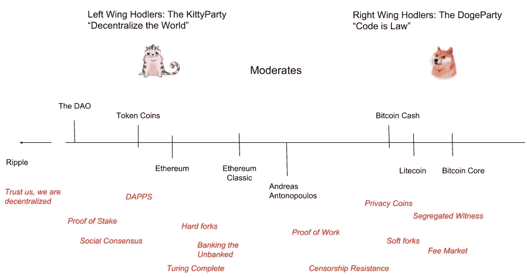

# 霍德勒的左/右政治思想(上)

> 原文：<https://medium.com/hackernoon/left-right-political-ideologies-of-hodlers-part-1-faa71ed689e4>

由于当前美国/西方政治格局的极端两极分化，我一直在思考左翼和右翼政治。自然地，我开始思考加密货币领域的左翼和右翼意识形态，以及这些意识形态在这个领域变得越来越相关。在比特币的早期，争论完全围绕着技术和对易处理的工程问题的有效解决方案。如果有任何意识形态的争论，它们主要是在[霍德勒](https://en.wikipedia.org/wiki/HODL)(相信或至少能看到加密货币的一些价值的人)和 Nocoiners(认为比特币很愚蠢的人)之间。

但如今，密码领域的主要冲突可以被描述为棘手的意识形态冲突。块大小的争论就是一个例子。altcoins vs 比特币，或 altcoins vs altcoins 之间的无数小冲突是另一个例子。在这篇文章中，我将描述我们如何像看待主流政治冲突一样看待这些意识形态冲突。更具体地说，我将描述左右政治光谱的概念如何应用于加密货币领域的人们，由于缺乏更好的术语，我将把加密货币称为“霍德勒”。

心理学家做了许多研究来发现保守派和自由派思维方式的差异。这些研究的一个重要发现是，恐惧的程度，或者恐惧的缺乏，是一个人左倾还是右倾的关键因素。恐惧的存在使人偏向右边，而恐惧的缺乏使人偏向左边。研究表明，保守派(右倾的人)对身体威胁和其他负面刺激更敏感，更关注 T2 的威胁意象，而不是愉快的意象，T4 的杏仁核比自由派更大。学者们创造了“消极偏见”这个短语，用来描述右倾的人对消极刺激更恐惧、更敏感的倾向。相反，你可以用短语“积极偏见”来描述左倾的人不那么害怕的趋势。恐惧的反义词是希望，所以你可以说自由派更有希望，而保守派更恐惧。以下是关于这个问题的一些进一步的概要阅读: [1](https://www.washingtonpost.com/news/inspired-life/wp/2017/11/22/at-yale-we-conducted-an-experiment-to-turn-conservatives-into-liberals-the-results-say-a-lot-about-our-political-divisions/?utm_term=.d86d65e1ae6d) ， [2](https://www.psychologytoday.com/blog/mind-in-the-machine/201612/fear-and-anxiety-drive-conservatives-political-attitudes) 。

如果我们看看加密货币领域的意识形态之争，恐惧和希望是将人们分为左右两派的驱动情绪的假设似乎非常合适。下面，我提出我对右翼霍德勒和左翼霍德勒的定义。

右翼的霍德勒是被对最坏情况的恐惧所驱使的。密码领域最糟糕的情况通常是一个民族国家对区块链发起敌对攻击。这也可能与个人丢失/被盗或代码中不可预见的错误有关，从而导致灾难性的共识失败。因为他们的主要本能是害怕最坏的情况，右翼霍德勒的重点是安全高于一切。对于一个右翼分子来说，实现安全的手段来源于他们对密码规则的严格遵守和稳定的纳什均衡解。在某种意义上，你可以把他们描述为技术官僚，一个过度逻辑化的官僚，受制于技术，而不是政府。一个很好的虚构原型可能是《星际迷航》中的瓦肯人种族。像格雷戈里·马克斯韦尔和彼得·托德这样的人就是右翼霍德勒的一个很好的例子。

左翼的霍德勒夫妇被他们对最好情况的希望所驱使。最好的情况通常是破坏法定货币或在全球市场上大规模采用加密货币。这一场景还包括个人财富的增长、关于平等主义的叙述(即“为没有银行账户的人提供银行服务”)，以及推翻专制政府。因为他们的主要本能是希望最好的情况，他们的重点是创新。左翼人士的创新包括创造利用区块链的新方法，或者发明一些替代的分散共识方法(比如股权证明)。这并不是说一个左翼分子完全不在乎安全，只是说为了达到目的，他们更愿意做出安全上的取舍。这位左翼人士可以被描述为技术福音传播者，在文化上，他们与以史蒂夫·乔布斯(Steve Jobs)和马克·扎克伯格(Mark Zuckerberg)为原型的硅谷初创企业家有许多共同点。维塔利克·布特林(Vitalik Buterin)和罗杰·韦尔(Roger Ver)就是左翼霍德尔的好例子。

这是我做的一个粗略的图表，将不同的加密货币和想法放在加密空间的左右连续体上。为了好玩，我以最新的以太坊收藏品热潮 CryptoKitties 命名了左翼，以战俘忠实迷妹 coin Dogecoin 命名了右翼。该中心由每个人都喜欢的区块链信息的闪亮灯塔，安德烈亚斯安东诺普洛斯主持。请注意，红色的单词是与它们的位置有模糊关联的想法，因此它们的位置不准确(例如，“言论自由”在历史上是主流政治中左倾的概念，但也可以被右翼采纳)。

右翼以比特币为锚，比特币是中本聪创造的最初的区块链。自比特币诞生以来，它的核心原则一直是工作证明(POW ),对我来说，它似乎仍然是一个中间派立场，尽管我已经将比特币描绘成了最右翼。像股权证明这样的流氓想法可能会把 POW 推到右边一点，但由于大多数加密货币都是基于 POW 的，我认为它处于一个合适的位置。

值得注意的是，当比特币最初被创造出来时，左翼和右翼的概念仅限于老练的比特币开发者之间的对话，他们明白如果不在安全或去中心化方面做出让步，区块链的许多问题就无法解决。这个概念在普通大众的意识中并不存在。在那些日子里，普通比特币公众的行为非常像一个经典的左翼原型。“全球数字货币”、“快速点对点交易”、“为无银行账户者提供银行服务”和“低手续费”等乐观口号是左翼创造的，可以被认为是推动比特币早期迅速崛起的原因(左翼比右翼更擅长先令)。

altcoins 的兴起开始了比特币社区分裂成独立的派别。莱特币是第一个出现的重要替代硬币，当它第一次出现时，它被视为一个激进的想法。如今，许多人大多认为它是比特币的克隆(字面意思是 [git](https://git-scm.com/docs/git-clone) )。Ripple 随后出现，并在连续体中划出了一个非常左的位置，完全放弃了工作证明，并提出了一个可疑的主张，即加密分布式共识系统足以用于加密货币。

目前，左翼由以太坊锚定，其与比特币的主要区别在于其相对丰富的功能和图灵完整的脚本语言。虽然以太坊与比特币有许多基本的相似之处，最大的相似之处是工作证明，但其开发者的宏伟计划以及它为解决困难局面而采取的行动(如[道黑客](https://www.coindesk.com/ethereum-executes-blockchain-hard-fork-return-dao-investor-funds/))清楚地表明了它的左翼倾向。他们提议的股权证明肯定会让以太坊更加左倾。如果这种情况发生，我怀疑其他一些加密货币将填补它留下的左/右频谱的巨大空白。

总之，加密货币领域的政治光谱被受希望驱动的左翼和受恐惧驱动的右翼所占据。左翼希望专注于创新，右翼希望专注于安全。你可能要思考的重要家庭作业问题是:A)你会把自己放在秘密政治光谱的什么位置？b)某种加密货币属于什么政治光谱？c)未来的加密左/右格局会是什么样子？

在本文的第 2 部分中，我将进一步阐述成为加密货币领域的左翼/右翼到底意味着什么，并回顾过去的一些例子，这些例子已经产生了巨大的后果。此外，我们可以建立一些关于左翼/右翼政治在未来将如何发展的基本理论，这将有助于我们引导你们所有人登上月球。