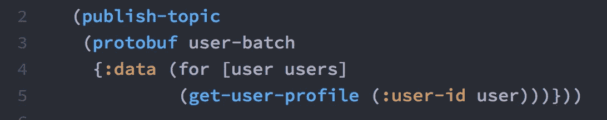
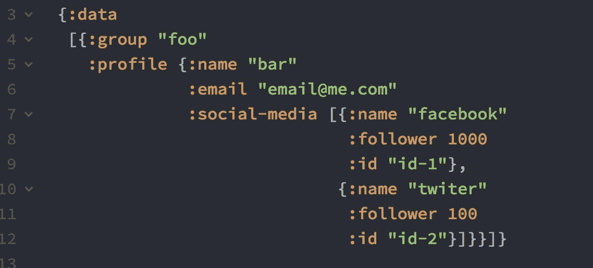
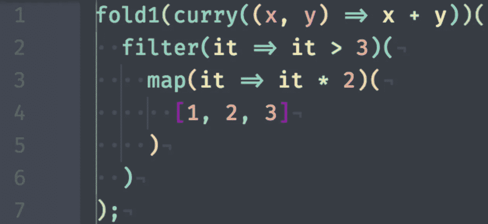

# 帮助您理解 clojure 的 4 个技巧

> 原文：<https://medium.com/hackernoon/lesson-learned-how-to-understand-clojure-6e3f97fe674d>


Clojure 是一种动态的、通用的[编程](https://hackernoon.com/tagged/programming)语言，将脚本语言的易用性和交互式开发与多线程编程的高效且健壮的基础设施相结合。

Clojure 是函数式编程，所有的都是函数你可以看到基本的模式:

(fn 参数-1..
(fn(fn-1(fn-2 param-2–1)param-1–1))

在理解现有的 Clojure 项目时，不要紧张，在我还没有理解 Clojure 代码的时候，这里有四个技巧可以和你分享

1.  **逐个函数读取从最后一个子函数开始到第一个父函数**



因此来自***get-user-profile***的值将由 ***为*** 收集并存储到:data，然后 protobuf 将构建 user-batch，然后***publish-topic***从 protobuf 值

这个技巧将会比从第一个父母开始读，然后到最后一个孩子时更少痛苦

**2。读取嵌套散列图也从键**的最后一个子键开始



如何获得他的 [faceboo](https://hackernoon.com/tagged/facebook) k 账号的关注者:

*   Java 语言(一种计算机语言，尤用于创建网站)

```
Object.getData().getProfile().getSocialMedia().get(0).getFollower()
```

*   Clojure

```
(:follower (first (:social-media (:profile (:data object)))))
```

**3。如果你卡住了什么东西就用 lein repl**

例如，你可能知道在 itellijIDEA 上首次使用 clojure 是最糟糕的，并不能完全让你更快乐

```
1 (let [atc-products 
2      (for [cart carts] (get-product (:product-id cart)))]
3  
**4   (response** **atc-products****)**
5   (println "HERE PRODUCTS" atc-products))console>> HERE PRODUCTS ({:product-id 123 :product-name "Sepatu"} {:product-id 456 :product-name "Sandal"})
```

假设我在第 4 行的**处设置了一个断点，您可能会想在调试器面板中 atc-products 将显示为空，但是在 println 之后，您会在控制台中看到 atc-products 的一些值。**

有了 lein repl，你可以一个圆括号接一个圆括号地执行，甚至可以一个函数接一个函数地执行，如果你有错误，你可以立即修复，然后只需添加:reload

*(需要#【名称空间:作为别名】:reload)*

**4。使用彩虹括号插件**

***帮助你的眼睛捕捉 clojure*** 中的大量括号



[https://github.com/johngeorgewright/atom-rainbow](https://github.com/johngeorgewright/atom-rainbow)同原子

```
apm install johngeorgewright/atom-rainbow
```

谢谢！