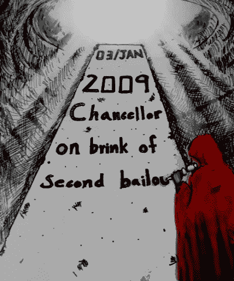
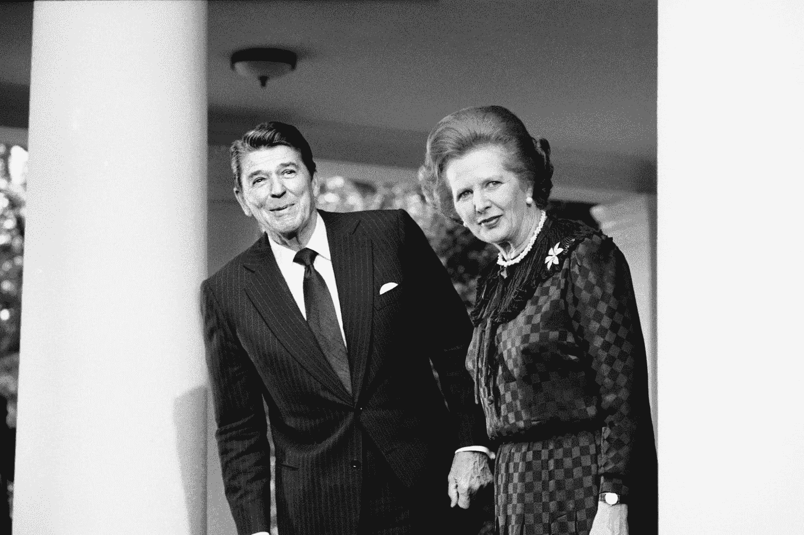
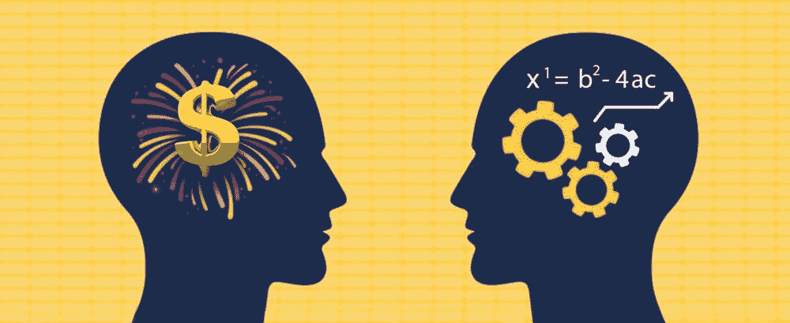
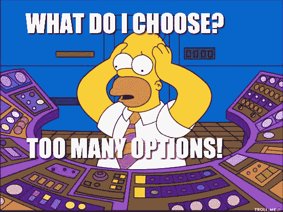

# 2008 年的教训:区块链先驱能避免重蹈覆辙吗？

> 原文：<https://medium.com/hackernoon/lessons-from-2008-can-blockchain-pioneers-avoid-repeating-the-mistakes-of-the-past-edf87364b349>

And so the creator carved unto the block of genesis, a reminder to those who would come after. Art by [John Wu](http://priorart.ca)

# "[财政大臣濒临第二次银行救助](https://www.thetimes.co.uk/article/chancellor-alistair-darling-on-brink-of-second-bailout-for-banks-n9l382mn62h)"

这是刻在第一块石头上的第一句话，是第一个[区块链](https://hackernoon.com/tagged/blockchain)的第一句话。比特币的创造者中本聪没有轻易选择这些词。即使在那时，我想他们也知道“创世纪”的历史意义。即使在那时，他们也知道他们的技术可以从根本上改变我们处理交易的方式。

For Satoshi, “Eat Out from £5” was a close runner up.

在 2008 年金融危机之后，随着政府投入数十亿美元进行“救助”，公众对资本市场的信心进一步下降。到那时，投资者已经很清楚，信用评级不可信，证券交易委员会的规定漏洞百出，大银行横行无忌。救助加深了他们的恐惧，表明即使是美元的价值也不能保证。

区块链就是为了解决这些问题的所谓根源而创建的，它允许我们绕过对银行和交易所等第三方的信任。但就目前情况来看，加密市场可能会重蹈传统资本市场的覆辙。

要想有所不同，有一些关键问题需要解决。但首先，我们必须理解“新自由主义”的概念，以及它在 2008 年金融危机中扮演的角色。

# **新自由主义的幽灵**

新自由主义是一个充满争议的术语，这个术语被如此多的政治目的扭曲和操纵，以至于很难确定它到底意味着什么。

Neoliberalism has taken on a very different meaning in today’s popular culture, due in large part to individuals like Ronald Reagan and Margaret Thatcher.

但在本质上，新自由主义哲学很简单:人们应该尽可能自由地做出自己的选择，只要他们不会让其他人的情况变得更糟。因此，理想的制度是给予他们最大化个人福利的自由。

这种哲学无情地与“经济人”的概念捆绑在一起，这一概念经常与经济学家约翰·斯图尔特·穆勒和亚当·斯密的作品联系在一起。经济人是一个理性的、自利的、一心一意追求效用最大化的主体。熟悉经济学的人会认识到，这一主体是几乎所有经济模型的基础。但是新自由主义哲学的应用已经远远超出了经济学的范畴。例如，CapM(资本资产定价模型)是最常用的资产估值方法之一，它是建立在这样一个假设之上的，即普通投资者是一个理性的代理人，他们持有非常多样化的投资组合，包括市场投资组合和其他无风险投资。

What humans are really like vs. How economists model humans

尽管新自由主义哲学有助于现代经济学的发展，但 2008 年的危机表明了过度依赖这些假设的危险。事实上，崩盘前的几年是资本市场快速放松管制的时期。这种去监管化让金融机构可以自由地将巨额资金投入到不透明的高波动性投资中，包括次级抵押贷款。毕竟，作为“理性代理人”，可以相信投资者知道什么对自己最有利。如果他们想涉足高风险的赌博，那么为什么他们不能被允许呢？无论出现什么问题，市场最终都会自我纠正。

因此，在投机者肆无忌惮的贪婪驱使下，这些资产的价格爆炸式地上涨，超出了一群“理性代理人”所能生产的任何东西。2008 年的金融危机就这样发生了。

# 行为经济学的兴起

行为经济学是心理学和经济学的交叉领域。其核心是，经济学处理的是人类的本来面目，而不是总是理性的代理人。

在行为经济学模型中，人类在“有限理性”的范围内行动。这个相当抽象的想法可以被设想为对决策权的限制。虽然经济人拥有无限的决策权，并被认为拥有他们需要的所有相关信息，以便他们每次都可以考虑所有信息来做出最佳选择，但现实中的人类没有这种奢侈，因为他们必须处理大量的信息和各种时间限制。因此，他们往往在不了解所有相关事实的情况下，利用不完善或不完整的信息采取行动。在一些可怕的情况下，他们甚至可能故意选择忽略相关信息。

I’ve certainly felt like this more than once.

我们从日常经验中知道，这是对人类行为更准确的描述。传统经济学方法使用一系列未经证实的假设来假设人类应该是什么样的，而行为经济学则不同，它认为人类就是人类，人类的理性受到情感、本能和信息不对称等其他因素的限制。

虽然对这些问题的思考增加了更高的复杂性，但它也允许行为经济学模型更好地捕捉记录在经验数据中的人类行为的现实。随着越来越多的关于人类行为的数据通过不断增长的传感器世界收集，行为经济学的相关性只会随之增长。

将行为经济学外推到金融领域已经产生了大量关于投资者行为的有价值的数据，这些数据从根本上动摇了旧的金融模型。在 2011 年的一篇论文中，研究人员发现，与 CapM 等工具中使用的理性代理人相反，他们将个人利润最大化，同时将风险最小化，绝大多数投资者倾向于持有多样化的投资组合，并在未经仔细选择的情况下积极交易。此外，研究发现，真正的投资者尤其容易受到“处置效应”的影响，即他们卖出获利的投资，同时持有亏损的投资。

通过这些研究，我们越来越接近理解为什么有效市场假说经常失败，为什么泡沫形成，以及心理因素如损失厌恶和过度自信如何扭曲市场。通过承认人类的行为不符合我们的旧模式，我们可以挑战这些旧的假设。这反过来将允许我们创建更好的系统来提高市场效率，同时遏制人类最不理性、最具自我破坏性的行为。

# 将这些经验应用于区块链

随着区块链在社会中扮演越来越重要的角色，这项技术的先驱们必须从 2008 年来之不易的教训中吸取教训。是的，技术是强大的，但归根结底，尽管区块链可能会减少我们对可信任的第三方的依赖，但它无法将人类排除在等式之外。因此，它受制于困扰传统金融的许多人类非理性问题。

看看目前的情况，那些过去的错误可能会重复。加密货币市场一直被猖獗的投机所主导。白皮书是故意以晦涩的形式起草的。过于简单的激励结构正在建立，它们是为“理性代理人”而不是为人类设计的。对大多数人来说，区块链的透明度更多的是一种理想，而不是现实。

我经常听到人们谈论，好像区块链会允许某种不受监管、无政府资本主义的自由市场。我认为这是一种天真的观点。要建立一个有效的交易系统，就需要制定相关法规，不仅要防范恶意行为，还要遏制非理性行为。

有了区块链，我们有了一个从零开始建立新体系的难得机会。有了这个机会，我们就有机会把事情做得更好。这项技术肯定会有助于促进 it 发展，但是我们使用的经济模型也将发挥同样重要的作用。通过承认人类的实际行为，而不是依赖过时的假设，我们可以创建更方便用户的交易系统，这对投资者来说更安全，提高交易效率，并增强对资本市场的信心。

# 总结想法

在这一点上，我将把它留给真正的专家来解决如何着手做这件事。但是这里有几个问题可以开始对话。

1.  人类与区块链系统的接触点是什么？在设计这些点时，我们对他们的行为做了哪些假设？
2.  情绪和本能等因素是如何对交易产生负面影响的？有没有办法在区块链制定规则来解决这些问题？
3.  关于区块链的信息如何以一种降低用户学习“成本”的方式传达？
4.  我们如何建设区块链，不仅能识别坏演员，还能识别行为不理性的好演员？我们可以建立什么样的机制来阻止这些人伤害他人/自己？
5.  如果我们有一个激励结构，我们如何构建它才能最好地鼓励好的行为？

# **供您参考**

我目前正在开发一个软件，可以让像我们这样的人像“理性代理人”一样管理他们的投资。Holdbot 是一个自动多样化和重新平衡加密货币持有量的程序，因此人们不必亲自经历这样的麻烦。如果你有兴趣了解更多关于该倡议的信息，可以在[这里](https://www.hodlbot.io/?utm_source=Hackernoon&utm_medium=blog&utm_campaign=Lesson%20from%202008)找到更多信息。