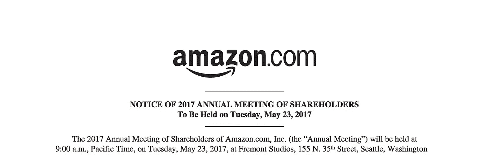

# 亚马逊股东信的教训

> 原文：<https://medium.com/hackernoon/lessons-from-amazons-shareholder-letters-aa868bc549e4>

[Photo Credit, http://phx.corporate-ir.net/](http://phx.corporate-ir.net/phoenix.zhtml?c=97664&p=irol-reportsannual)

杰夫·贝索斯的最新股东信在网上被分享，人们对信中的清晰表达和想法感到惊讶。“第二天是停滞期”，“抵制代理”和其他类似的格言，让你去哇，该死的他是对的。亚马逊正在成为[一家价值万亿美元的公司](http://fortune.com/2017/03/31/amazon-stock-trillion-dollar-company-apple-tesla-google/)，在《时代》杂志的一篇文章中，M.G .西格勒将[描述为一头鲸鱼](https://500ish.com/the-whale-38c3cfa2cc3e)，而在 TechCrunch 的一篇文章中，将[比作商业世界的行星吞噬者。](https://techcrunch.com/2017/05/14/why-amazon-is-eating-the-world/)

一个新手问大师:“我感觉一家计算机公司比其他所有公司都大得多。它像矮子中的巨人一样高出竞争对手。它的任何一个部门都可以组成一个完整的企业。为什么会这样？”

大师回答道:“你为什么问这么愚蠢的问题？那家公司很大，因为它很大。如果只做硬件，没人会买。如果它只做软件，没人会用它。如果它只维护系统，人们会把它当成仆人。但是因为它结合了所有这些东西，人们认为它是神之一！通过不寻求奋斗，它不费力气就征服了。”

我决定问一些愚蠢的问题，并开始钻研从 97 年到 2012 年的股东信，以了解公司的理念和内部运作。他们没有让人失望。以下是我最喜欢的信件部分。

# 【1997 年的教训

*   我们相信衡量我们成功的基本标准是我们长期创造的股东价值。这一价值将是我们扩展和巩固当前市场领导地位的直接结果。我们的市场领导能力越强，我们的经济模式就越强大。市场领先地位可以直接转化为更高的收入、更高的盈利能力、更高的资本流动速度，以及相应更高的投资回报。
*   我们的决定一贯反映了这一重点。我们首先根据最能体现我们市场领导地位的指标来衡量自己:客户和收入增长、客户持续重复购买我们产品的程度，以及我们品牌的实力。我们已经并将继续大力投资，以扩大和利用我们的客户群、品牌和基础设施，从而建立持久的特许经营。
*   “你可以长期、努力或聪明地工作，但在 Amazon.com，你不能三选二”
*   “我们将继续根据长期市场领先地位的考虑，而不是短期盈利能力的考虑或华尔街的短期反应，做出投资决定。”

# 【1998 年的教训

*   “我不断提醒我们的员工要害怕，每天早上醒来都很害怕。不是我们的竞争对手，而是我们的客户。我们的客户成就了我们的事业，他们是我们与之建立关系的人，也是我们欠他们很多的人。我们认为他们对我们忠诚——直到有人向他们提供更好的服务为止”
*   你会佩服这个人吗？如果你想一想你生活中钦佩的人，他们可能是你能够向其学习或作为榜样的人。对我自己来说，我总是努力只和我钦佩的人一起工作，我鼓励这里的人也同样要求严格。人生苦短，没有别的选择。
*   这个人会提高他们加入的团队的平均效率水平吗？我们想要对抗熵。这个标准必须不断提高。我要求人们想象一下 5 年后的公司。在那个时候，我们每个人都应该环顾四周，说:“现在的标准这么高——好家伙，我很高兴我当时考上了！”
*   这个人在哪个方面会成为超级巨星？许多人拥有独特的技能、兴趣和观点，丰富了我们所有人的工作环境。往往是一些甚至与他们的工作无关的事情。这里有一个人是全国拼字比赛冠军(我相信是 1978 年)。我怀疑这对她的日常工作没有帮助，但如果你能偶尔在大厅里用一个快速的挑战抓住她:“拟声词！”

# 【2000 年的教训

*   房地产不遵守摩尔定律

# 2003 年的教训

*   长期思考既是真正所有权的要求，也是真正所有权的结果。业主和租客不一样。我认识一对夫妇，他们把房子租出去，搬进来的那家人把他们的圣诞树钉在硬木地板上，而不是用树架。我想，这是权宜之计，诚然，这些房客特别糟糕，但没有一个房主会如此目光短浅。类似地，许多投资者实际上是短期租户，他们的投资组合周转如此之快，以至于他们实际上只是在租用他们暂时“拥有”的股票。
*   例如，在 1995 年推出[Amazon.com](http://amazon.com/)后不久，我们就授权客户审查产品。虽然现在已经成为 Amazon.com T2 的一种常规做法，但当时我们收到了一些供应商的投诉，主要是想知道我们是否了解我们的业务:“你卖东西是为了赚钱——为什么你会允许负面评论出现在你的网站上？”作为一个焦点小组的一员，我知道由于负面或冷淡的顾客评论，我有时会在 Amazon.com[购物前改变主意。虽然负面评论会在短期内让我们损失一些销售额，但帮助客户做出更好的购买决定最终会让公司受益。](http://amazon.com/)
*   另一个例子是我们的即时订单更新功能，它会提醒你已经购买了特定的商品。顾客过着忙碌的生活，并不总是记得他们是否已经购买了特定的商品，比如一年前购买的 DVD 或 CD。当我们推出即时订单更新时，我们能够通过统计显著性来衡量该功能是否略微降低了销售额。对客户有好处？绝对的。对股东有利？是的，从长远来看

# 2005 年的教训

*   有时，我们很少或没有历史数据来指导我们，主动的实验是不可能的，不切实际的，或者等同于继续进行的决定。尽管数据、分析和数学发挥了作用，但这些决策的主要成分是判断。正如我们的股东所知，我们已经决定年复一年地持续大幅降低客户价格，因为我们的效率和规模使这成为可能。这是一个不能用数学方法做出的非常重要的决定的例子。事实上，当我们降低价格时，我们违背了我们能做的数学，它总是说聪明的举动是提高价格。我们有与价格弹性相关的重要数据。我们可以相当准确地预测，某个百分比的降价将导致某个百分比的销售量增加。除了极少数例外，短期内数量的增加永远不足以弥补价格的下降。然而，我们对弹性的定量理解是短期的。我们可以估计降价在本周和本季度会产生什么影响。但是，我们无法从数字上估计持续降低价格在五年、十年或更长时间内会对我们的业务产生什么影响。我们的判断是，以更低的价格无情地将效率的提高和规模经济回报给客户，这将创造一个良性循环，从长期来看，这将带来更多的自由现金流，从而带来更有价值的 Amazon.com。我们已经对免费超级省钱运输和亚马逊 Prime 做出了类似的判断，这两种方式在短期内都很昂贵，但我们认为在长期内都很重要和有价值。

# 【2007 年的教训

*   我们首先给自己设定了一个公认的大胆目标，那就是在实体书的基础上进行改进。我们没有轻易选择这个目标。任何以大致相同的形式坚持了 500 年并抵制变化的东西都不太可能轻易得到改进。在我们设计过程的开始，我们确定了我们认为是这本书最重要的特点。它消失了。当你看书时，你不会注意到纸张、墨水、胶水和针脚。所有这些都消失了，剩下的是作者的世界。我们知道 Kindle 将不得不退出，就像一本实体书一样，这样读者就可以全神贯注于文字，忘记他们正在用设备阅读。我们也知道，我们不应该试图复制一本书的每一个特点——我们永远无法超越这本书。我们必须增加新的功能——传统书籍永远不可能增加的功能。
*   Amazon.com 的早期提供了一个类比。当时，人们很容易相信网上书店应该具备实体书店的所有特征。我被问了几十次关于一个特别的功能:“你打算怎么做电子书签名？”13 年过去了，我们仍然没有搞清楚那一个！我们没有试图复制实体书店，而是受到它们的启发，努力寻找我们可以在新媒体中做的事情，这些事情在旧媒体中永远做不到。我们没有电子图书签售，同样，我们也不能提供一个舒适的地方喝咖啡和放松。然而，我们可以提供数百万种图书，通过顾客评论帮助购买决策，并提供发现功能，如“购买了该商品的顾客也购买了”只有在新媒体中才能做的有用的事情有一长串。
*   我们人类与我们的工具共同进化。我们改变我们的工具，然后我们的工具改变我们。几千年前发明的书写是一个巨大的工具，我毫不怀疑它极大地改变了我们。500 年前，古腾堡的发明导致了图书成本的巨大变化。实体书开创了一种新的合作和学习方式。最近，网络工具如台式电脑、笔记本电脑、手机和掌上电脑也改变了我们。他们让我们更多地转向吃信息零食，我认为注意力持续时间更短。我珍视我的黑莓手机——我确信它让我更有效率——但我不想在它上面阅读 300 页的文件。我也不想在我的台式电脑或笔记本电脑上阅读长达数百页的东西。正如我在这封信中已经提到的，人们会做更多方便且无摩擦的事情。如果我们的工具使吃信息变得更容易，我们将更多地转向吃信息，而不是长篇阅读。Kindle 是专为长篇阅读设计的。我们希望 Kindle 和它的后继者可以在未来几年里逐渐让我们进入一个注意力持续时间更长的世界，对最近信息零食工具的激增提供一种平衡。我知道我的语气倾向于传教士，我可以向你保证这是发自内心的。这也不是我一个人独有的，而是这里一大群人共有的。我对此很高兴，因为传教士制造了更好的产品。我还会指出，虽然我相信书籍即将得到改进，但亚马逊没有代理人的闲职。会发生，但是如果我们执行不好，就会被别人去做。

# 【2008 年的教训

*   长期思考利用我们现有的能力，让我们做以前想都不敢想的新事情。它支持发明所需要的失败和重复，它解放了我们，让我们在未探索的空间中开拓。寻求即时的满足——或者难以捉摸的承诺——很可能你会发现你前面有一群人。长期导向与客户痴迷相互作用。如果我们能够确定客户的需求，如果我们能够进一步确信这种需求是有意义的和持久的，我们的方法允许我们耐心地工作多年来提供解决方案。从客户需求“向后工作”可以与“技能向前”方法形成对比，在“技能向前”方法中，使用现有的技能和能力来推动业务机会。技能推进法说，“我们真的很擅长 X，我们还能用 X 做什么？”这是一种有用且有益的商业方法。然而，如果只使用它，使用它的公司将永远不会发展新的技能。最终现有的技能将会过时。从客户需求开始逆向工作通常要求我们获得新的能力和锻炼新的肌肉，不管这些最初的步骤会有多么不舒服和尴尬。
*   Kindle 是我们基本方法的一个很好的例子。四年多前，我们开始了一个长期的愿景:每一本书，任何语言，在不到 60 秒的时间内都可以得到。我们设想的客户体验不允许 Kindle 设备和 Kindle 服务之间有任何严格的界限——两者必须无缝融合。[亚马逊](https://hackernoon.com/tagged/amazon)从未设计或制造过硬件设备，但我们没有改变愿景以适应我们现有的技能，而是雇佣了一些有才华的(和传教士！)硬件工程师，并开始学习一种新的制度技能，一种我们需要在[未来](https://hackernoon.com/tagged/future)更好地为读者服务的技能。

# 【2009 年的教训

*   对于 2010 年，我们有 452 个详细的目标，包括所有者、可交付成果和目标完成日期。这些不是我们的团队为自己设定的唯一目标，但它们是我们认为最需要监控的目标。这些目标没有一个是容易的，没有发明，许多目标将无法实现。我们的高级领导团队每年都会对这些目标的状态进行几次评估，并在评估过程中添加、删除和修改目标。
*   回顾我们当前的目标，会发现一些有趣的统计数据:
*   452 个目标中的 360 个将对客户体验产生直接影响。
*   收入这个词用了八次，自由现金流只用了四次。
*   在 452 个目标中，净收入、毛利润和营业利润等术语一次都没有使用。
*   总体而言，这套目标表明了我们的基本方针。从客户开始，逆向工作。倾听客户，但不仅仅是倾听客户——还要代表他们去发明。我们不能向您保证我们会实现今年的所有目标。过去几年我们没有。然而，我们可以向您保证，我们将继续关注客户。我们坚信，从长远来看，这种方法对业主和客户都有好处。

# 【2010 年的教训

*   发明是我们的基因，技术是我们用来发展和改善我们为客户提供的体验的各个方面的基本工具。我们还有很多东西要学，我期待并希望我们能继续享受学习的乐趣。

# 【2011 年的教训

*   发明以多种形式和多种规模出现。最激进、最具变革性的发明往往是那些让他人释放创造力、追求梦想的发明。这是亚马逊网络服务、亚马逊实现和 Kindle 直接出版的很大一部分
*   我之所以强调这些平台的自助服务性质，是因为它很重要，原因我认为有点不明显:即使是善意的看门人也会减缓创新。当一个平台是自助服务时，即使是不可能的想法也可以尝试，因为没有专家看门人准备说“那永远不会工作！”你猜怎么着——这些不太可能的想法中有许多确实可行，而社会是这种多样性的受益者。

# 【2012 年的教训

*   客户驱动的焦点的一个优势——也许有点微妙——是它有助于某种类型的主动性。当我们处于最佳状态时，我们不会等待外部压力。我们在内部推动改进我们的服务，在我们不得不改进之前增加好处和功能。我们降低价格，并在必要时为客户增加价值。我们在必须发明之前就发明了。这些投资的动机是以客户为中心，而不是对竞争的反应。我们认为这种方法赢得了客户的更多信任，并推动了客户体验的快速改善——重要的是——即使是在我们已经处于领先地位的领域。
*   我们建立了自动系统，当我们提供的客户体验不符合我们的标准时，这些系统会寻找机会，然后主动向客户退款。一位行业观察家最近收到了我们发来的一封自动邮件，邮件中写道:“我们注意到，您在观看亚马逊视频点播网站上的以下出租视频时，视频播放效果不佳:《卡萨布兰卡》。很抱歉给您带来不便，我们已经向您退款，金额如下:2.99 美元。我们希望不久能再次见到你。”对主动退款感到惊讶，他最终写下了自己的经历:“亚马逊'注意到我的视频播放效果很差……'因此他们决定给我退款？哇……说说把顾客放在第一位。”
*   当您从亚马逊预购商品时，我们保证在您的订单时间和发布日期当天结束之前，我们为您提供最低价格。“我刚刚收到通知，因为预购价格保护，我的信用卡被退款 5 美元。。。多好的做生意方式啊！非常感谢你公平诚实的交易。”大多数顾客在预购后都很忙，没有时间监控商品的价格，我们的政策是要求顾客联系我们并要求退款。主动去做对我们来说代价更高，但也能带来惊喜、愉悦和信任。
*   自 7 年前推出以来，我们已经降低了 AWS 价格 27 次，增加了企业服务支持增强功能，并创建了创新工具来帮助客户提高效率。AWS Trusted Advisor 监控客户配置，将它们与已知的最佳实践进行比较，然后通知客户哪里有机会提高性能、增强安全性或节省资金。是的，我们积极地告诉客户，他们支付给我们的钱比他们需要的要多。在过去的 90 天里，客户通过值得信赖的顾问节省了数百万美元，而这项服务才刚刚开始。所有这些进步都是在 AWS 成为该领域公认的领导者的背景下取得的——在这种情况下，你可能会担心外部激励可能会失败。另一方面，内部动机——让客户说“哇”的驱动力——保持创新的速度
*   对我来说，试图以贾斯汀时代的方式进行改进未免太聪明了。在一个和我们生活的世界一样快速发展的世界里，这是有风险的。更重要的是，我认为长期思考可以解决问题。主动取悦客户赢得信任，从而从这些客户那里赢得更多业务，即使是在新的业务领域。从长远来看，客户和股东的利益是一致的。
*   我知道我们在前进的道路上会犯错误——有些是我们自己造成的，有些是聪明勤奋的竞争对手造成的。我们对开拓的热情会驱使我们探索狭窄的通道，不可避免地，许多通道会变成死胡同。但是——如果运气好的话——也将会有一些人打开广阔的道路。
*   “从短期来看，市场是一台投票机，但从长期来看，它是一台称重机。”我们不会像庆祝卓越的客户体验那样庆祝股价上涨 10%。当这种情况发生时，我们不会聪明 10%,反之，当股票走势相反时，我们也不会笨 10%。我们希望被重视，我们一直在努力打造一家更重要的公司。

所有的信都以“像往常一样，我附上一份我们 1997 年那封信的原件。我们的方法保持不变，这仍然是第一天”。伟大的公司往往可以用一句话来形容。亚马逊可以用一个词来形容，无情。尝试参观 relentless.com。