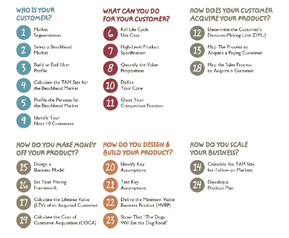

# 自律创业的经验教训

> 原文：<https://medium.com/hackernoon/lessons-from-disciplined-entrepreneurship-9a86a243aebc>

《自律的企业家精神》是我最近读过的最好的书之一。我把这个推荐给每一个对创业或产品管理有丝毫兴趣的人。这本书提供了一个框架，企业家和产品经理在推出新业务和产品时可以遵循。

成为一名企业家需要什么？他们有什么特质？他们生来就有一些特殊的基因使他们与众不同吗？创办一家公司需要哪些步骤？

作者 Bill Aulet 简洁地回答了这些问题，并为踏上旅程的企业家提供了一种系统的方法。

在这篇文章中，我想总结一下从这本书中学到的经验教训。

**创业类型**

创业有两种类型。

1.  **中小企业创业**——这类企业大多迎合当地市场。开创这样的企业不一定要创新。通常，家族管理的企业属于这一类。他们线性增长，一般不需要 VC 的钱。
2.  **创新驱动型企业(IDE)企业家精神**——这些企业迎合全球/地区市场，并以某种创新为基础。他们专注于增长，甚至不惜失去控制。他们通常以赔钱开始，但如果成功，他们将有指数增长。

**什么是创新？**

比尔将创新定义为发明和商业化的产物。

创新=发明*商业化

他说，不指望企业家创造发明，它可以来自其他地方。但是，他们需要有能力将发明商业化。

> 发明是一个重要的组成部分，但是没有发明的商业化，就不能称之为创新。

谷歌基于广告词的广告商业模式最初是由一家名为 Overture 的公司发明的，但谷歌是第一个成功将其商业化的公司。

他列出了一个 24 步流程来创建一个可持续的创新型企业。这 24 个步骤分为六大主题，列举如下

24 step process to start a company

# 谁是你的客户？

首先，发现一个可以通过创意/产品解决的**客户痛点**。客户痛点是一个困扰他们足够多的问题，以至于他们愿意为您的解决方案付费。

从探索多个市场的机会开始，然后缩小到一个单一的滩头市场。

对潜在市场进行初级市场调查。调查结果将帮助你选择一个滩头市场。比尔强调进行初级市场调查的重要性，并说这是无可替代的。他说，如果有市场研究报告，那么进入这个市场就为时已晚。

滩头市场必须在评估目标客户的消费能力、购买产品的意愿、竞争强度、公司能力、可扩展性潜力等之后进行选择。,

**滩头市场**必须被**分割**直到市场满足以下条件:

1.  市场中的客户都购买相似的产品，他们期望产品以相似的方式提供价值
2.  销售周期相似，获取客户的策略也一样
3.  在顾客之间有口碑，或者顾客作为彼此强有力的推荐人

> 创业者在这个阶段常犯的一个错误是对目标客户的定义过于宽泛。迎合广泛的细分市场导致产品平庸，不能满足任何人。取而代之的是**，专注于一个仔细定义的狭窄的客户群，用你的产品在更短的时间内统治这个客户群。**

选择滩头市场后，画出**客户角色**。这应该包括顾客的需求、行为、动机，以及最重要的购买重点。这有助于建立对客户的共同理解，并指导公司做出符合客户利益的商业决策。

下一步是计算滩头市场的**总目标市场(TAM)** 。

TAM 是滩头市场中所有客户产生的年收入(假设您获得 100%的市场份额)。它可以通过将滩头市场的客户总数乘以每个客户的收入来得出。目标是拥有足够大的 TAM，这样你就能获得健康的正现金流。了解 TAM 的复合年增长率(CAGR)很有帮助。

一旦滩头市场有了优质产品，就能产生足够的资金向邻近市场扩张。

# **你能为顾客做些什么？**

为客户构建一个**全生命周期用例**，描述产品如何融入客户的生活。构建完整生命周期用例时需要回答的重要问题有:

1.  客户将如何确定对你产品的需求？
2.  客户如何发现你的产品？
3.  他将如何获得你的产品？
4.  他将如何使用产品、感知价值并获得支持？
5.  他将如何支付产品费用？
6.  他将如何传播产品的知名度？
7.  领养的障碍是什么？

接下来，为你的产品创建一个**高级视觉规范**。这有助于获得对产品的共识，消除任何误解。这绝不是最终版本，它作为团队迭代和改进的基线。通过列出产品的特点及其优点，制作一份总结/小册子。

**量化顾客从你的产品中获得的价值**。价值通常属于更好、更便宜、更快的类别。它可以通过比较现状和目标状态来量化。

> 确保产品的价值主张符合客户的优先购买事项。

此时，你必须联系滩头市场的前 10 名客户，并**验证你所做的假设**，无论是关于购买优先级、需求、价值主张等。,

分析并找出**你如何能够比其他人更好地交付产品/解决方案**。这可能是成本、客户服务、工程、用户体验、销售策略等。，这是你有能力/可以投资的东西，以区别于竞争对手。这是你的护城河，你的核心，不能轻易复制。这是你对抗竞争的最佳选择。然而，这不是你的客户向你购买的原因，它只是帮助你建立一个更好的竞争地位。

**竞争定位**是客户在竞争中如何看待你的产品。在定位图中，你将展示与竞争对手相比，你在满足客户最优先购买事项方面的表现。

> 竞争定位图的轴必须是客户最优先购买的项目。

# **你的客户是如何获得你的产品的？**

为了成功地向客户销售产品，你需要了解谁做出购买决定，谁影响这个决定。

此阶段需要回答的关键问题有:

1.  顾客在决定购买你的产品之前会经历哪些不同的阶段？例子——意识、兴趣、愿望和行动。
2.  每个阶段的主要参与者是谁？
3.  如何接触和影响他们？
4.  客户经历每个阶段需要多长时间？
5.  获取客户的成本是多少？
6.  限制你销售产品并获得报酬的隐藏障碍是什么？

这个阶段包括你走向市场(GTM)的所有活动。

为了提高这一阶段的效率，要专注于滩头市场，不要被目标市场以外的前景分散注意力。这将提高口碑，质量的线索和转化率。

# **你如何从你的产品中赚钱？**

**商业模式**是一个框架，通过它你可以获取你的产品为你的客户创造的价值的一部分。商业模式是关于你计划如何向你的客户收费，而定价是你向他们收费多少。商业模式的选择直接影响你的盈利能力。

在给你的产品定价时，必须考虑以下几点

1.  最好是根据产品创造的价值来给产品定价，而不是根据产品的成本
2.  了解客户的支付意愿
3.  了解客户替代品的价格
4.  不同类型的客户支付不同的价格；技术发烧友愿意支付更高的价格来立即获得产品。早期采用者的价格没有弹性。获得早期多数有助于公司扩大规模，定价策略必须牢记在心进行规划和布局

计算**单位经济**来了解你的企业在滩头市场的盈利能力。

为了做到这一点，你必须估计客户的终身价值(LTV)和获取客户的成本(CAC)。

**LTV** 是用资本成本贴现的每个客户利润的净现值，一般计算五年。超过五年后，资本的复合成本就抵消了利润。计算 LTV 的关键输入是收入、毛利润、留存率和资本成本。

LTV 本身不会透露这项业务的吸引力。它必须与 CAC 一起考虑。SaaS 企业的经验法则是 LTV 与 CAC 的比率为 3:1。

CAC 是贵公司为获得客户而发生的销售和营销费用总额除以获得的新客户数量。这也应该包括你接触那些原来不是你客户的人所产生的费用。如果一部分费用专门用于留住客户，该金额必须从总销售和营销费用中扣除。

通常，在公司的早期阶段，CAC 会高于 LTV，你每获得一个新客户都会赔钱。对于可持续发展的企业，CAC 随着时间的推移逐渐降低，直到大大低于 LTV。

# 你如何设计和制造你的产品？

在你真正开始构建产品之前，列出关键假设并快速设计经验测试来验证它们。这些测试可以通过与几个客户交谈或做一些二级市场调查来完成。

比尔说，精益[初创企业](https://hackernoon.com/tagged/startup)方法中的 [MVP](https://hackernoon.com/tagged/mvp) 定义仅限于特定的产品特性，以测试关于新商业理念的假设。他引入了满足以下条件的**最小可行商业产品** (MVBP) 的概念。

*   客户从产品中获得价值
*   顾客为产品付费
*   产品足够好，可以启动客户反馈循环

MVBP 将所有关键假设结合成一个可以销售的集成产品。

> MVBP 让你测试最重要的假设——客户愿意为你的产品买单。

把 MVBP 带给你的客户，看看他们是否真的使用你的产品并为之付费。衡量采用率、参与度和收入。

一旦你的 MVBP 吸引了你，那么你就要准备一个完整的产品计划，包括最小集合之外的功能。

# 你如何扩展你的业务？

在保持对滩头市场的关注的同时，重要的是要考虑接下来可以占领哪些**市场以及它们的规模有多大**。

一个公司可以通过两种方式扩大规模——通过向同一组客户销售额外的产品，或者通过寻找相同基本产品的相邻目标市场。

虽然向相同客户销售额外产品的第一种方法有助于利用现有投资，但需要考虑的一个关键问题是公司的能力是否适合开发这些产品。

第二种方法是许多初创公司经常采用的，它要求你调整产品功能、定价、营销沟通或包装，但这符合你的能力和专业知识。

识别后续市场后，计算后续市场的 **TAM。这个练习帮助你了解你的产品的长期商业潜力。**

只有赢得滩头市场后，后续市场才会成功。