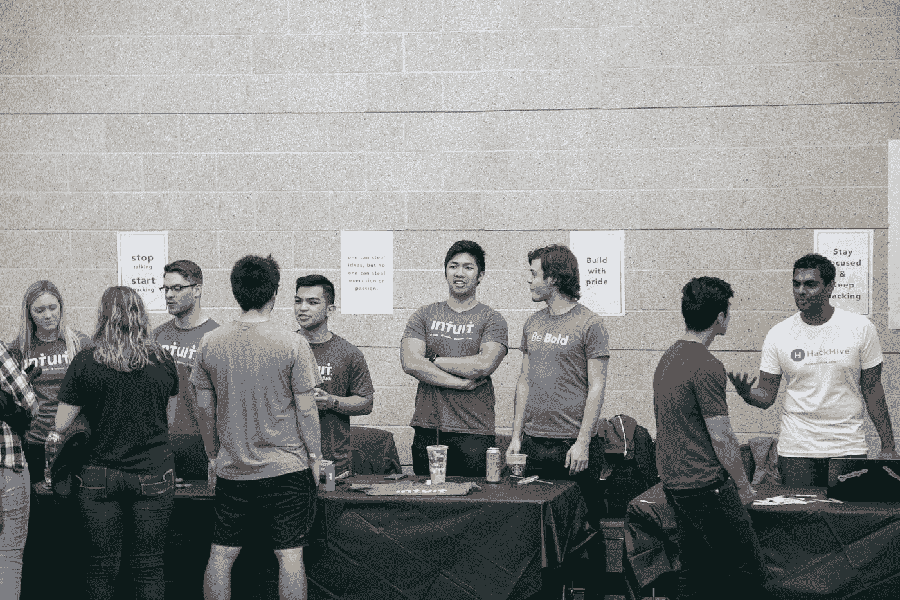

# Intuit 面试失败的教训

> 原文：<https://medium.com/hackernoon/lessons-from-failing-intuits-interview-4cd65f84baa9>

Designed by Katemangostar / Freepik

## 如何进入编码面试，带着新鲜的兴奋离开，继续你的求职。

我从来都不擅长应对压力或被置于尴尬的境地，而参加一次[技术](https://hackernoon.com/tagged/technical) [面试](https://hackernoon.com/tagged/interview)正是如此。怀疑自己的能力是我的第二天性，我更喜欢在使用新技术参加任何黑客马拉松之前先熟悉它们。在申请工作时，我会避开 HackerRank 的初步阶段，不敢接受，担心这会浪费面试官和我自己的时间。

在 Intuit 得到了 SLO 黑客公司提供的有保证的面试机会后，我也遵循了类似的模式，最终我非常害怕，想干脆拒绝这个机会。然而，我的同事说服了我，在送我去紧张地开始面试之前，他们鼓励了我一会儿。

Photo by Janet Fang

第一个阶段是我在过去几个月里一直积极逃避的挑战——一个静态的、不受监控的编码问题。对我的代码进行评分的前景已经让我不寒而栗，导致我花费过多的时间试图美化我的解决方案中大多数人通常会做的元素。

1.  **重命名变量**。过去的这个习惯源于参加黑客马拉松和只为自己编码的结果。当想要测试一个变量时，我会非常随意地给它们命名，最后用“asdf”这样无法描述的废话结束。此刻，我又回到了我的老习惯中，因此在完成这个问题时导致了一定程度的混乱。
2.  **正确确定变量的作用域。特别是在像 Javascript 这样的语言中，我过去常常使用 var 来处理任何事情，而没有任何后果(黑暗时期)，我通常会格外小心，以确保每个变量在需要的地方都是可访问的。**
3.  美化我的评论。当我写下问题的解决方案时，我倾向于在评论中写下我的想法，通常使用文本行话，这最终会产生一个难以理解的注释，如“循环通过循环，并把新的东西切掉或什么的”在我知道我的解决方案有效后，这些注释通常会被清理或删除，但我从来不知道我是否应该在代码中留下我的注释，或者它是否会弄乱代码库。我最后把它们留了下来，用适当的语法进行了更正，希望这能让面试官更容易参考。

因为我还没有完成正式的计算机科学教育，所以诸如我的代码的复杂性之类的方面并没有出现在我的脑海中，但是如果我知道的话，我的经历可能会不同。我主要是通过追求一个挑战来自学的，在这个挑战中，我每天都编码，持续了一年，这意味着我的大部分经验来自于基于项目的背景。尽管我有不足之处，但我通过了第一轮，对此我欣喜若狂。

在这一点上，我的紧张感真的开始发作了。我听说过在面试中当场失去记忆的故事，也记得过去无法回答问题。“技术面试”这个词让我不寒而栗，我急忙做好准备。好像我自己的紧张还不足以阻止我，我期待着在即将到来的周末参加另一场黑客马拉松，这意味着我有大约一天的时间来准备。

# 准备面试

我的一天，自我调节速成课程包括学习和回顾在其他面试中经常涉及的概念。

## 概念

1.  大 O 符号
2.  重新学习数据结构及其应用
3.  关于[黑客排名](https://www.hackerrank.com/)和 [LeetCode](https://leetcode.com/) 的练习题

## 资源

1.  [深度面试指南](https://github.com/kdn251/interviews)
2.  [数据结构](https://medium.freecodecamp.org/10-common-data-structures-explained-with-videos-exercises-aaff6c06fb2b)
3.  [一般信息](https://medium.freecodecamp.org/coding-interviews-for-dummies-5e048933b82b)
4.  [基础 Big-O 审查](https://www.youtube.com/watch?v=__vX2sjlpXU)

第二阶段是通过 Intuit 的招聘伙伴 Karat 进行视频面试。我的面试官非常友好，首先问了一些典型的问题，如我的教育水平，并要求描述我第一阶段答案的一些方面(复杂性，逻辑选择)。然后我们进入了一个相对简单的问题，但是当我被问到这个问题时，我最害怕的事情发生了:我失去了记忆。当我开始抛出随机可能的解决方案时，面试官温柔地不断暗示，最终导致我进一步恐慌，并为我犯的每个错误道歉。面试结束后，我立刻知道我不可能进入下一轮，但我感到一种解脱和悲伤的混合，那就是面试结束了。

Took a L on the interview, but a W on the scenery.

第二天，在去黑客马拉松的巴士上，我收到了通知，我没有被选中进入下一轮。

# 后退一步

在收到我的决定后，我立刻进行了一段时间的反思，分析我做错了什么。虽然我的技术技能可能没有达到标准，但我觉得同时存在心理压力，这可能对我的表现和决策产生了负面影响。

1.  **放松**。尽管在最初的编码挑战中没有人评判我，但我在面试的两轮中都非常紧张。这两个问题都相对容易，但由于我自己的紧张，我无法正确思考，也没有发挥出我的最佳能力。用自己的速度思考，不要因为旁边有另一个人在场而感到有压力。
2.  **要自信。**冒名顶替综合征经常被认为是不确定性的一个非常普遍的来源，在这种情况下，对我来说也是如此。因为我只是一个高中毕业生，在面试一个研究生和本科生都在竞争的职位，所以我一直担心我的知识比不上比我高几年的学生。尽管存在知识差距，但我仍然认为，如果我对自己的能力有信心，我可能已经能够更准确地展示我的能力。
3.  **不要担心结果。你和面试官都是来互相评价的。作为一名受访者，我知道我在和一个直接的同行以及其他几个大学生竞争。如果我没有把时间花在担心结果上，我可能会在这么短的时间内更专注，学到更多东西。参加面试的目的不是为了给你的朋友留下深刻印象，也不是作为一种身份的象征，而是为了找到一家让你感到舒适的公司。**
4.  像朋友一样对待你的面试官。至少，在当下。我绝不声称知道面试官是怎么想的，但我想知道的是，面试官不会让你失望，而只是想知道你在技能和文化方面是否适合他们的公司。同时，你应该弄清楚你是否喜欢在他们的公司工作，像朋友一样评价他们。毕竟，这是一个与现任员工互动的机会，如果你没有被选中，你只需要提高自己，继续前进。

我的经历让我对面试过程有了新的看法，我相信这会提高我未来的表现。

> 特别注意你对面试的看法。

我参加面试时充分考虑到目标是找出我思维中的任何缺陷，但我认为将它视为一个小难题或逻辑挑战会是一个更好的方法。对我思想的心理影响足以引起紧张，如果我以不同的方式处理整个过程，它可能会产生积极的影响。

作为接受这个挑战的结果，我在经历这个过程的同时，也经历了一次情绪的过山车。直面你的恐惧从来都不容易，虽然我没有做到，但我很高兴我抓住了这个机会克服了我对面试的恐惧。在进入这个过程之前，这看起来令人紧张，但是当我反思我如何能做得更好时，我对利用我所学到的再次经历这个过程充满热情。

也许你会想起我的一些经历，但我也有一点远远落后于其他人。虽然我此刻的大部分漫谈可能与我自己的经历和心态高度相关，但我希望它能为你的下一次采访提供一些见解和准备。