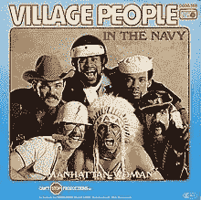
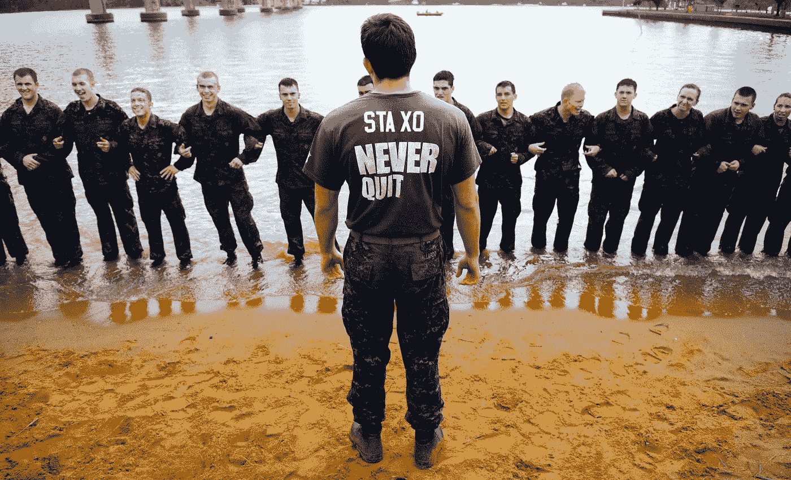
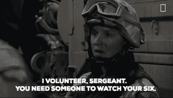
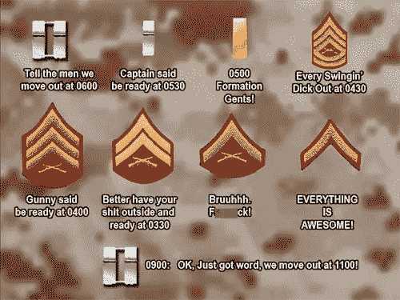
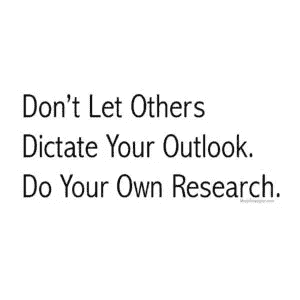
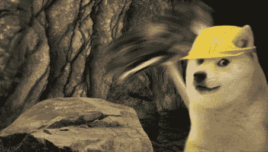
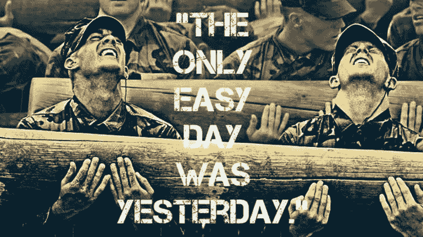
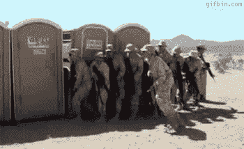

# 军事经验应用于密码交易

> 原文：<https://medium.com/hackernoon/lessons-from-the-military-applied-to-crypto-trading-630c22f5ba58>

你可能知道也可能不知道我现在是美国海军的一员。虽然秘密交易和军事交易可能不一样，但我发现一些经验可以用来帮助 T2 让你成为更成功的交易者。如果你是一名现役或现役军人，你可能会非常熟悉这些说法。不要害怕在日常生活中应用这些知识。如果你还没有上菜，我希望用一些我们的俚语来启发你，希望你能在途中学到一些技巧。

Let’s just get this joke out of the way

**《拥抱吮吸》**

军旅生活不容易，保密工作也不容易。“接受失败”意味着接受事情的本来面目，继续前进。这适用于“趋势是你的朋友”的密码牛市和熊市都可以赚钱。接受熊市的痛苦，要么逢低买入并持有，要么进行保证金交易，要么顺势而为。在熊市中，人们不会停止赚钱。只有更聪明的人才能坚持下去。如果你不确定如何成功扮演熊。别挡路，直到它又变成一头公牛。保护好你的利润/资金，在确认牛市到来之前保持观望。

“Never Quit”

**《遮住你的六点》**

掩护你的六点钟基本上就是“小心你的背后”，因为在你前面是 12 点钟方向，在你后面是 6 点钟方向。你可以在加密和止损中做到这一点。你应该经常使用它们，并确定一个你不愿意跌破的支撑线。不要以市价买进。找到一条支撑线，在上面买入，或者等待确认突破时买入。之后，你可以战略性地设置止损。

This person is your stop-loss Sarge.

**“快点等着”**

在军队中，我们经常被迫赶到一个地点，一个简报，或者其他什么地方，然后被迫等待。虽然你不应该急于交易，但你应该学会如何有效地利用时间，让你的注意力远离图表和交易。一旦你建立了交易和有效的止损，在你最喜欢的应用程序上设置警报，让市场去做它们的事情。如果它接近你的首选卖出或止损，警报会让你知道。出去享受一些东西。[找个爱好](https://www.bustle.com/articles/119942-how-to-find-a-hobby-as-an-adult)。

This is why the Military has “Hurry up and Wait”

运气是准备和机会的结合——德怀特·戴维·艾森豪威尔

这是已故德怀特·戴维·艾森豪威尔的一句名言，在密码中听起来非常真实。你经常听到人们说，“做你自己的研究”，这是一个有效的观点。在你开始交易之前，你需要研究你为什么要这样做，并设定现实的目标。这个我在之前的文章里说过，但是值得再说一遍；如果你不知道*为什么*你刚刚做了那笔交易，你就是在赌博。查看[硬币市场日历](https://coinmarketcal.com/)，看看是否有任何事件会推动你的袋子上涨。记住，“向前看是一个错误。一次只能处理命运之链的一个环节。”正如温斯顿·丘吉尔所说。你应该有一个长期的计划和目标，但不要每天都为此自责。

But let me dictate your outlook this time, with this.

**“我们要么找到一条路，要么创造一条路。”—汉尼拔**

原来你不擅长交易？别担心，你不是唯一一个！很多人不擅长交易，这没关系。如果你不是伟大的日内交易者，那就做一个摇摆交易者。还是不是你的风格？那就投资，逢低买入。了解如何设置主节点。开始[采矿](http://lmgtfy.com/?q=How+to+start+crypto+mining)。想办法带来被动收入。不管怎样，收集密码！

Doge is probably your best bet

“唯一轻松的一天是昨天。”—美国海军海豹突击队队员

你不知道明天会发生什么。当有利润时，确保利润，不要太贪婪。那个小小的声音对你说“但是如果它继续上升呢？”它不是你的朋友。*公开交易的任何利润都不是你的。你也永远不知道$BTC 什么时候会影响你的交易。如果一只[黑天鹅](https://www.investopedia.com/terms/b/blackswan.asp)来袭怎么办？*

**“闻着干净，就是干净。”**

在海军我们打扫卫生。很多。我们听到的一个常见说法是“如果它闻起来干净，它就是干净的”，在消防队长检查我们的空间之前，我们会喷洒空气清新剂或在周围擦一些气味强烈的清洁剂。为什么？因为它给人的感觉是干净的，它影响了心理。密码当然是基于心理学的。在 twitter 上的一次短暂旅行会让你了解到人们的感受。这可以应用到“市场周期心理学”的备忘单上，并可能给你一些关于我们所处位置的见解。心理驱动市场。另一句我个人最喜欢的谚语也很符合这一点:“殴打将持续到士气提高。”简单地说，除非心理状况有所改善，接受现状并重新参与进来，否则殴打将会继续。

If I had a dollar for each time I saw this chart, I wouldn’t need to trade.

我希望你已经对军方的思维方式有了一点了解，并且知道如何将它应用到加密交易中。在不确定的时候尽量保持头脑清醒，尽你最大的能力去计划和研究。有一个可靠的计划和英特尔可以大大有助于在军事和密码交易的情况。

欢迎在 Twitter @ JoshMcGruff 上关注我的帖子和我的反馈。你也可以看看我的第一篇文章，关于我希望在我开始做加密交易时就知道的教训。

你也可以在我们的免费加密交易 Discord 群组——[比特币共济会](https://discord.gg/5KpVGhE)中找到我。

喜欢这个故事吗？学点东西？请我喝杯啤酒表示感谢！
CashApp — $JoshMcGruff

