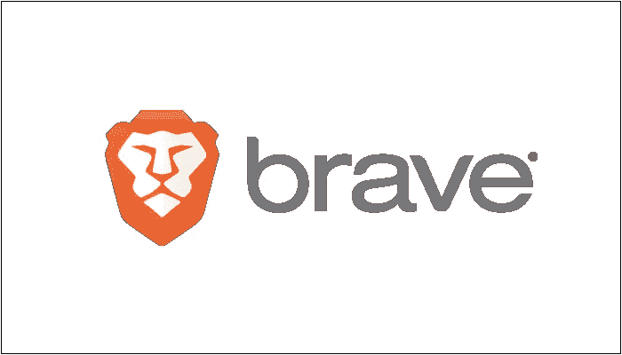
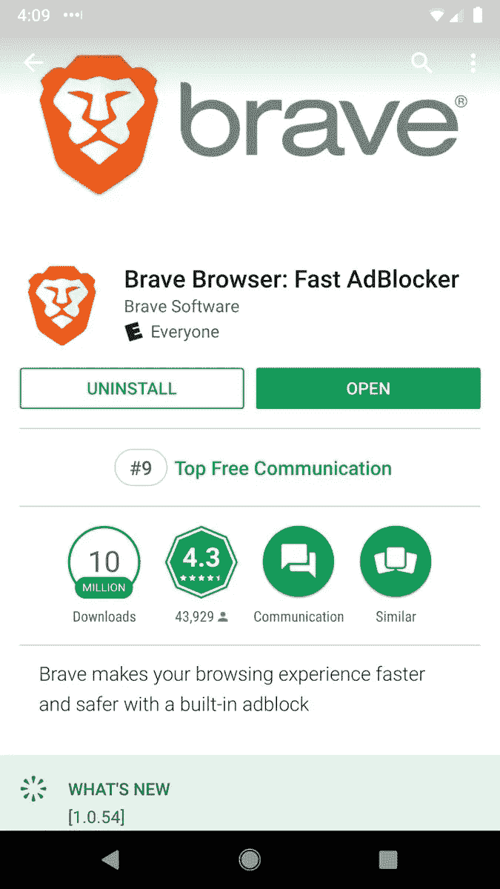
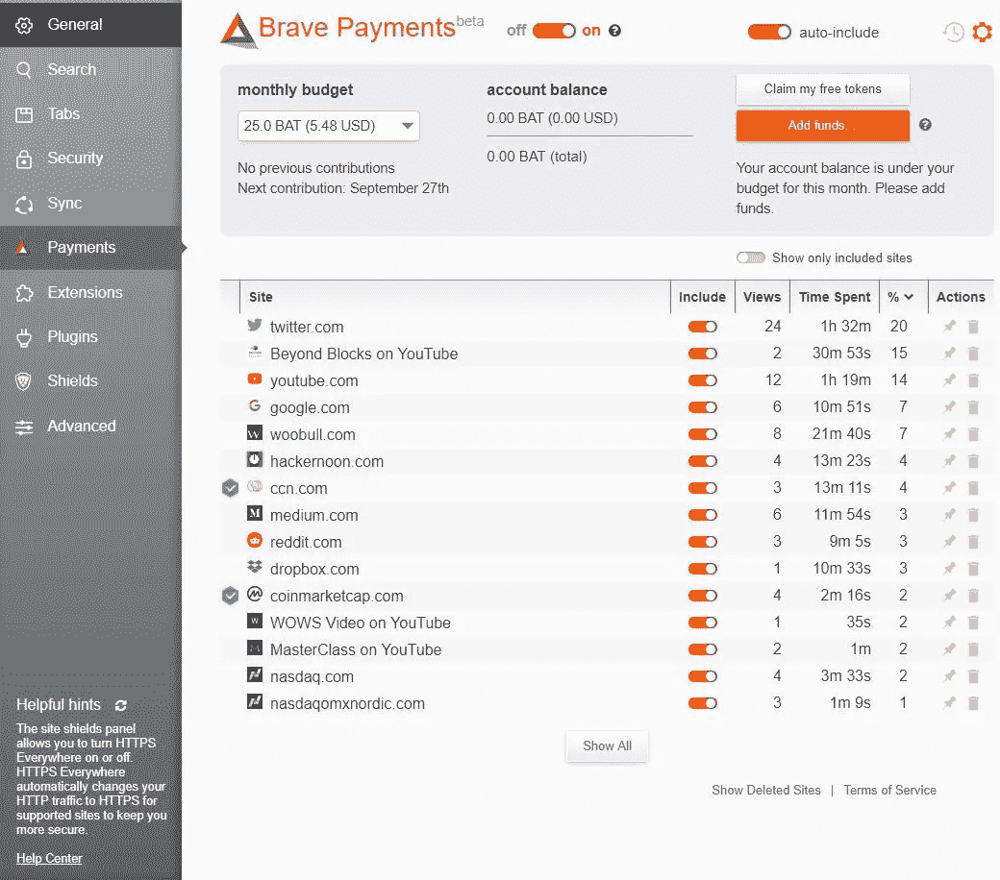

# 从最流行的基于加密的应用程序中吸取教训

> 原文：<https://medium.com/hackernoon/lessons-from-the-most-popular-crypto-based-application-9f926798da29>

大规模收养的力量在这里，但它不是 Dapp。

这些天，每个人都在谈论如何实现加密货币和[区块链](https://hackernoon.com/tagged/blockchain)的大规模采用，但没有多少人做到了。如果我们看看“最受欢迎的”——你很快就会明白为什么它们会出现在引号中——基于区块链的应用程序， [**没有一个拥有超过 500 个每日活跃用户**](https://www.stateofthedapps.com/) 。**这是坚果**。区块链大规模采用的方式。

但是你知道吗，他是对的。我说的他是指乔恩·崔(Jon Choi)他最近做了一个关于区块链在韩国的发展和应用的“低调”的演讲。我看完了这个演讲，尽管区块链不是万灵药的观点并不新鲜，但这种最大限度减少炒作的演讲非常令人耳目一新。想象一下，如果我们所有人都努力工作，开始构建反映我们正在筹集的资金数量的东西，为数百万人提供真正的社会价值，并解决区块链和 crypto 的紧迫问题。

在研究了区块链和加密的经济设计之后，在中国和西方，我发现只有几个基于加密的项目真正与加密的大规模采用目标产生了共鸣。在那个短名单的最上面是:**勇敢**。

所以让我们勇敢一点，看看这到底是怎么回事。经过仔细研究，我认为我们可以从中学到很多东西。

# 解决现实世界的问题

与大多数其他基于区块链和加密的应用不同，这个应用实际上已经成为主流。从外表上看，它就像一个普通的具有广告拦截功能的浏览器，这是它在当前浏览器用户群体中赢得青睐的首要原因。因此，就这一点而言，这是勇敢的得分— [**虽然大多数 DApps 只是为了其加密货币应用**](https://hackernoon.com/why-the-crypto-dream-does-not-work-for-now-f561fc21784) **而变出了功能，但勇敢的浏览器实际上解决了一个问题**。

Javascript 的创造者 Brave Software 的首席执行官在 2016 年的 TED 演讲中，深入浅出地谈到了货币数字广告和在线跟踪业务 的效率低下和不安全。这是一项以用户数据安全和隐私为代价，为谷歌搜索引擎和 Youtube 等公司以及在这两者之间运营的数百名中间人谋生的业务。

勇敢浏览器解决了这个问题。它保护用户数据和用户隐私，并通过减少第三方干扰来确保高效的在线浏览体验。如果它规模化，它 ***就是*** 打算颠覆币网上广告和用户数据收集模式。这是一个十亿美元的生意。

> 你得到的报酬与你解决问题的难度成正比。
> 
> 埃隆·马斯克

现在，勇敢浏览器已经有超过 1000 万的谷歌下载量和超过 300 万的月活跃用户。从这个意义上说，它所解决的问题得到了很好的回报。

这里的教训是:**当你开发一个基于区块链的应用程序时，要解决现实世界中存在的问题，而不是区块链自己制造的自我强化的错误**。

# **利用现有市场**

许多区块链项目一开始就旨在扰乱当前的行业，尽管他们自己也非常清楚，现有的巨头很难被击败，人们需要拼命战斗，才能从这些经验丰富的竞争对手那里赢得一点点市场份额。为什么不从小处着手呢？或者更好的办法是，利用现有的资源，从那里开始？

你可能会认为，Brave browser 直接与谷歌 Chrome 或 Firefox 竞争，而是其独特的功能，这些功能奖励了用户的注意力，出版商将自己定位于社交营销和内容创作领域，类似于 Patreon 和 Twitch 正在做的事情。**有了勇敢浏览器所基于的 BAT token(基本注意力 token)，普通浏览器用户可以直接向自己喜欢的 Youtubers 和 Twitch streamers 发送支付支持，无需任何第三方从中分一杯羹**。

Browser embedded wallet enables users to send microtransactions to publishers directly.

截至 7 月初，Brave browser 已成功将 4，500 个网站和 13，500 个 YouTube 和 Twitch 流媒体迁移到其支付服务，用户总数超过 1.1 亿。

有了这么多旨在降低内容创作者佣金和第三方费用的区块链项目，我们现在需要问一个问题:我们正在集中精力做正确的事情吗？

此处的课程:

1.  大量采用的应用程序使加密货币成为主流，但仅拥有加密货币功能并不能做到这一点。
2.  把钱花在嘴上，光是扰乱是没用的目标。

许多加密货币都有巨大的市值，但很少有人能够用坚实的用户采用和问题解决来证明这种繁荣。Brave 始于 2017 年，自那以来，市场经历了几次大起大落，但每次，不管公众对区块链和加密的看法如何变化，它的受欢迎程度和实际使用量都在增加。尽管许多加密货币的市值更高，但很少有像 Brave 这样获得主流认可的。这是解决一个现实世界问题的回报。如果你的产品制作得足够好，就会被采用。Brave 的案例造就了一个行业领袖，我认为我们都应该向他学习。我希望这个微型案例研究能给我们许多人带来希望，并指引我们继续前进的方向。要有信念！

*注意:以上观点不作为财务建议，我也没有任何与勇敢软件或 BAT 平台相关的既得利益。这些观点纯属我个人观点。*

~~~~~~~~~~~~~~~~~~~~~~~~~~~~~~~~~~~~~~~~

我是谁？

我叫张军成，我去了美国两年，具体来说是在肯塔基州，学习计算机科学，于 2017 年退学。现在我完全进入了区块链和加密领域。去年年底，我和我的合伙人创建了一个名为 HN 区块链的区块链社区，现在它是中国最大的区块链社区之一，我们为多个区块链项目管理社区，如 Popchain 和 Ulord。【https://www.linkedin.com/company/hunan-blockchain-alliance/】请随时查看我们的链接页面:

随时和我联系 [**推特**](https://twitter.com/jc_zhang_)**:****@ JC _ Zhang _**

~~~~~~~~~~~~~~~~~~~~~~~~~~~~~~~~~~~~~~~~

如果你喜欢这篇文章，请点击拍手按钮，越多越好，并推荐给其他人，并检查我以前的故事。谢谢大家！

 [## 使中国成为世界上最大的区块链市场

### 尽管中国是世界上审查最严格的加密货币地区，但它已经产生了各种各样的“大牌”

hackernoon.com](https://hackernoon.com/state-of-decay-and-opportunity-a-constructive-approach-to-blockchain-development-in-china-a83f3513a58f)  [## 为什么加密梦想暂时不起作用。

### 我想写这篇文章已经很久了。有两件事阻碍了我…

hackernoon.com](https://hackernoon.com/why-the-crypto-dream-does-not-work-for-now-f561fc21784)