# 经验教训:使用 Webpack 和 React 进行代码拆分

> 原文：<https://medium.com/hackernoon/lessons-learned-code-splitting-with-webpack-and-react-f012a989113>

*注:本文写于* ***懒*** *和* ***悬疑*** *上映之前。我将很快重写它，但记住一些例子可以改进！*

毫无疑问，网络性能非常重要。我们的应用和网站应该快速加载，以保持用户的注意力，让他们参与进来，并提供积极的体验。

然而，开发通常是在连接到强大网络的高于平均水平的机器上完成的。然而，并非所有用户都通过强大的设备或强信号访问网络。

我们想要实现的是不让用户认为我们的应用程序正在加载。即使我们不能立刻满足他的所有需求，我们也想给他必要的反馈，让他参与进来。为了确保我们的 web 应用程序是高性能的，我们需要为最坏的情况编程，而不是最好的情况。

*有个 TL；如果你只想要要点和学到的教训，你可以在文章的最后找到博士。*

# **JavaScript 的成本**

当我们谈论性能时，我们需要考虑两个成本。第一个是将代码发送到用户浏览器的成本。我们发送的文件越小，用户的浏览器接收文件的速度就越快。

第二个成本是浏览器需要解析和执行我们发送给他的 JavaScript 的动作。本质上，我们希望一个块一个块地发送少量的 JavaScript 代码，并确保我们发送的所有内容都用于避免将浏览器的资源花费在将**而不是**执行的代码上。

# 懒惰的概念

当我们谈论性能时，我们需要首先理解懒惰这两个概念。

首先，如果我们不做某件事，我们就不会在这件事上浪费资源。这意味着我们不需要在那些对用户的产品体验没有好处的流程上浪费时间和内存。

第二个概念是，如果我们可以以后做某事，我们就永远不想现在做。也就是说，如果我们可以推迟向浏览器发送特定的资源，我们应该总是这样做。

本文中的例子将基于我使用 **React** 和 **Webpack** 的经验，但它们也可以应用于其他技术。

# **代码拆分**

代码分割是一种技术，通过这种技术，我们既可以解决加载 JavaScript 的成本，同时又可以遵从懒惰的概念。

当我开始从事 web 开发时，将所有代码放在一个文件中，然后缩小，这是将 JavaScript 交付给用户的最佳方式。然而，随着应用程序规模的增长，我们的代码规模也急剧增加。

我们需要向用户发送越来越多的代码，当我们追求性能时，发送一个包含整个应用程序的巨大包并不理想。

这种技术背后的思想是在任何给定的时间只给用户他所需要的。如果他打开一个特定的页面，他只需要该页面的代码，而不是整个应用程序。

但是在传统方法中，我们给他发送一大堆 JavaScript，然后需要由浏览器解析和执行，即使最终用户在打开应用程序时实际上只使用了一小部分代码。

通过使用更小的包，我们可以更加懒散地**发送最少的包，以确保用户获得积极的体验，而不会走神去想他是否关掉了烤箱。一旦他使用了应用程序，我们就可以在后台预加载其他包。**

# ****未使用的代码****

**你可以实际看到从 Chrome 开发工具发送过来的**未使用代码**的数量。一旦你打开它们，按下`Cmd + Shift + P`并输入`coverage`。从下拉列表中选择第一个选项，然后点击重新加载图标。**

**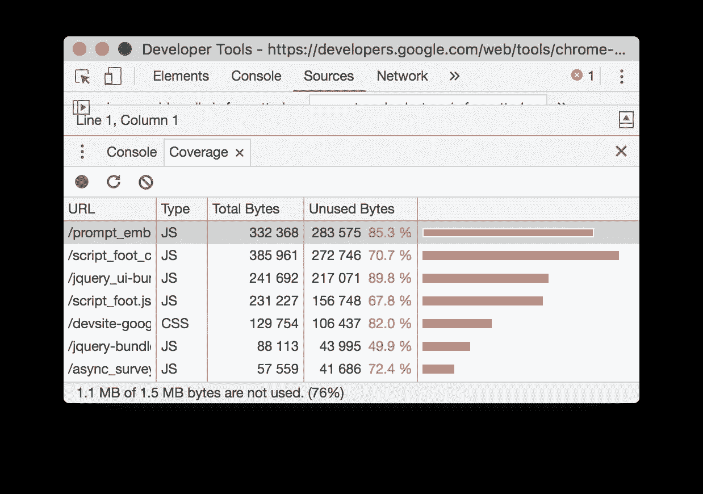**

**这将显示我们已经加载的所有脚本，以及在特定页面上没有使用的代码量。即使没有运行，这段 JavaScript 代码仍然会被**解析和评估**，这需要时间。**

# ****动态导入****

**我们向 Webpack 发出信号，告诉它我们想把什么拆分成一个单独的包的方法是使用动态导入。`import`关键字可以被用作一个函数，它获取我们希望被分割成一个独立包的模块的路径，并返回一个承诺。**

**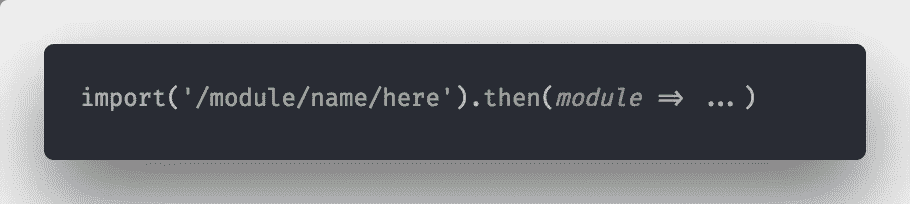**

**当模块被加载并且承诺被解析时，我们可以访问它导出的内容。需要注意的是，如果你的模块有一个**默认**导出，你需要从`module`对象获取`default`属性来访问它。**

**在 React 的上下文中，我们将要拆分的模块将是不同的组件。为此，我们可以使用 **React Loadable** 。它让我们可以访问一个**高阶组件**来进行动态导入。**

**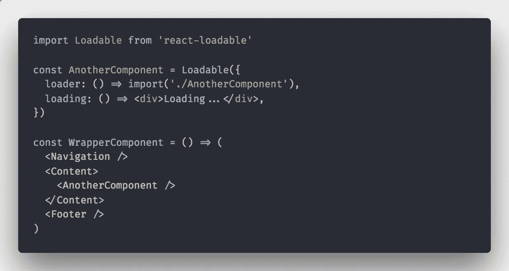**

**这里需要注意的是，像 **React Loadable** 或者 **Loadable Components** 这样的库，只是给我们提供了一个**高阶组件**，让动态导入感觉更优雅。引擎盖背后的魔法都是由 **Webpack** 完成的。**

**此外，请记住 **React 17** 将给生态系统带来一些变化，可能会让我们不需要使用这样的包装器组件。**

# **路由级代码拆分**

**代码拆分中最常见的范例之一是在**路由级别**拆分组件。这将为我们留下每个顶级路由的单独包。**

**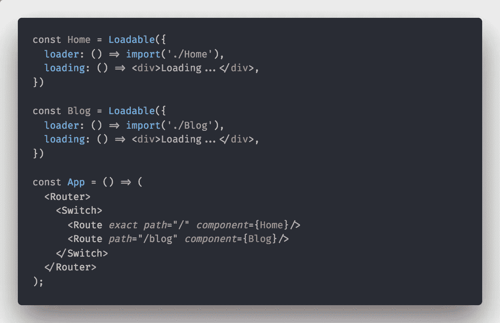**

**我们在这里得到的改进是，用户只需为他访问的页面加载**和**资源。**

**虽然这是将代码库分割成更小块的一种很好的方式，但通常最大的性能损失来自单个库或组件。**

**文档生成库可能非常大。我见过一些可以进入 **2mb** 范围的。因此，即使我们已经将不同的路径分成单独的组件，当用户想要访问导出页面时，他将需要处理大量的 JavaScript。**

**有很多方法可以优雅地处理这种情况。我们将在本文的稍后部分研究如何在用户的浏览器空闲时在背景中加载这样的信息。**

# ****动态导入路线****

**由于 import 可以作为一个函数，自然的思路是我们将能够传递变量给它，并动态地请求不同的块。**

**虽然这不完全是错的，但也不完全是对的。块必须在构建时创建，所以当 Webpack 看到我们在导入路径中使用了一个变量时，它会先做一些准备工作。**

**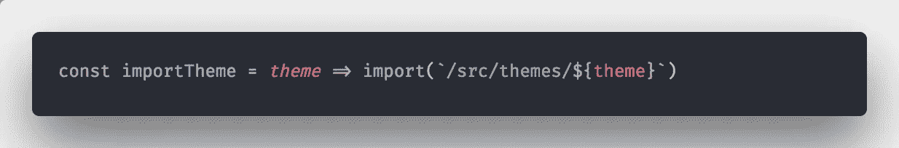**

**每当我们做这样的事情时，Webpack 将进入`themes`文件夹，并为那里的每个文件**创建一个单独的**块**。因此，无论我们向它请求什么，都已经有一个同名的包可供我们使用。****

# ****命名捆绑包****

**Webpack 通过给每个块一个 id 来跟踪块。因此，当您获取一个动态加载的包时，您很可能会在开发人员工具中看到一个名称类似于`1.bundle.js`的文件。**

**然而，通过使用 Webpack 的**神奇注释**并对**配置**做一点小小的改变，我们可以给不同的块起一个更具描述性的名字。**

**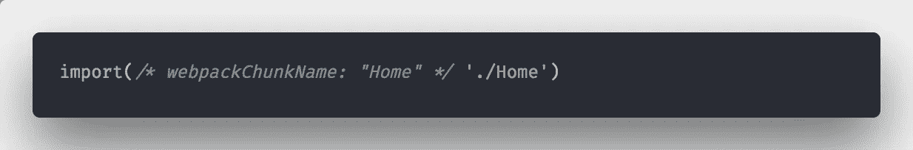**

**公平地说，我不太喜欢神奇的评论，但我认为这是*最清晰的处理命名的方式。你可以在 **React Loadable** 中使用神奇的注释，但是为了清楚起见，我只留下了`import`语句。***

**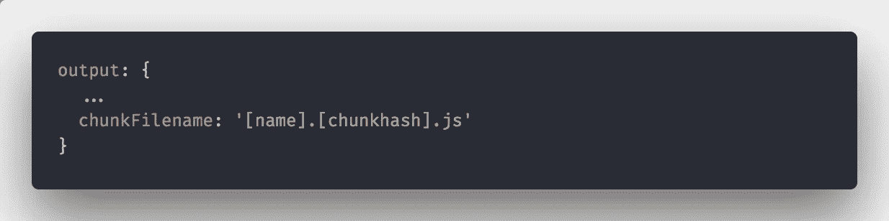**

**在 Webpack 配置中添加这一行将指示它使用您指定的名称，并添加一个用于缓存目的的块散列。**

# ****预加载和预取****

**除了代码分割之外，预加载和预取是我们可以用来进一步提高性能的两种技术。**

**在进入另一个概念的技术细节和实现之前，我们首先需要理解为什么我们需要它。**

**在本文的前面，我们讨论了当一些组件使用昂贵的库时，组件级拆分的重要性。然而，当用户按下按钮时加载块仍然不理想，因为它可能导致空内容的闪烁或在我们需要的内容呈现之前 UI 的短暂冻结。**

**每当我们确信用户将需要某个特定的包时，我们可以在明确需要之前使用预加载或预取来提取它。这也是通过 Webpack magic comment 实现的。**

**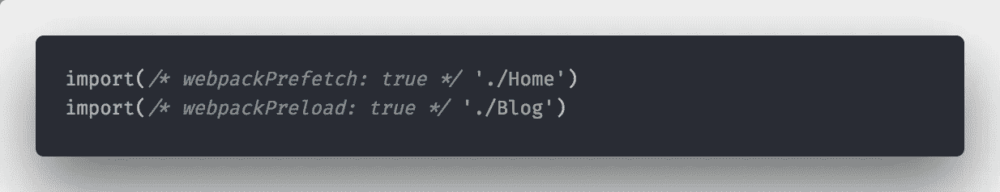**

**两者有什么区别，什么时候用一个比另一个好？虽然预加载和预取都会在实际需要之前获取数据块，但它们的重要性不同。**

****预加载的**块将以更高的优先级与其父块并行加载。只有当你确信用户**会**立即**与它们交互**时，才标记要预加载的块。这可以是下拉列表或选项卡的内容。**

****预取的**块优先级较低，将在浏览器空闲时加载。换句话说，标记要预取的块，如果用户**可能**在某个时候需要它们。这可能是他最有可能访问的下一页。他不会马上提出要求，但你希望他提出要求时，它就在那里。**

****React Loadable** 为组件提供静态方法`preload`。它让您可以手动控制何时获取组件的包。当我们想要懒惰时，这是非常有用的。**

**我们可以等到完全确定用户需要一个昂贵的功能来预加载它。**

**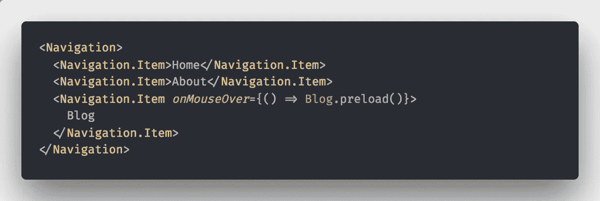**

# **更多关于魔术的评论**

**Webpack 配置我们正在加载的程序块的方式是通过所谓的**魔法注释**。老实说，除了我们到目前为止看到的那些基本的，我真的没有用过更多的。然而，很高兴知道我们没有被限制，如果我们需要的话，我们有更多的选择。**

**`webpackMode`注释用于告诉 Webpack 如何解析给定的块。默认情况下，所有块都以`lazy`模式加载。这意味着将为他们创建一个单独的块。**

**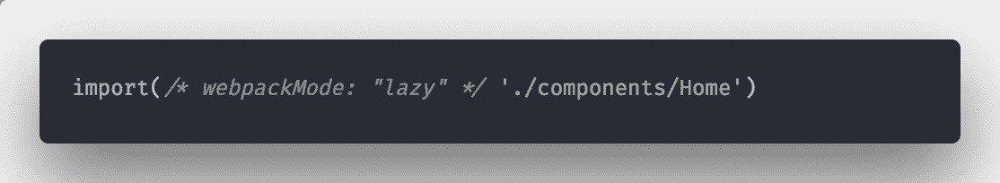**

**其他选项有`lazy-once`、`eager`和`weak`。总而言之，我没有用过它们，所以我不能对它们发表评论。到目前为止，我遇到的问题都可以用默认的`lazy`模式解决。你可以在 Webpack 的[文档](https://webpack.js.org/api/module-methods/#import-)中阅读更多内容。**

**大多数情况下，您会希望指定一个块名，并将该块标记为要预取或预加载。谢天谢地，我们可以根据需要使用多个，用**逗号**分隔它们。**

**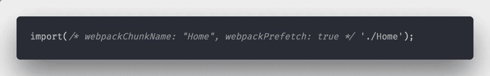**

# **分析**

**除非有我们可以**测量**的东西，否则我们无法真正谈论性能。为了知道哪里需要改进，我们需要一些洞察力。在代码分割的上下文中，我们需要知道**我们的包有多大**以及它们里面到底有什么**。****

****还有 [**Webpack 捆绑包分析器**](https://github.com/webpack-contrib/webpack-bundle-analyzer) 是你最大的朋友。它为您提供了应用程序块的可视化表示，因此您可以看到每个块中的内容。****

********

****你可以看到每个模块占用了多少空间以及它被放在哪个块中。这也是找到不需要的代码的好方法。例如，如果你看到你已经添加了整个 **lodash** 库，你可能应该检查你的代码，只提取你需要的函数。****

# ****未来的考虑和 HTTP/2****

****当谈到性能改进时，我坚信代码分割是能给你带来最大好处的技术。****

****在采用这些概念时，一个常见的担忧是它们是否经得起未来的考验。换句话说，代码拆分不再适用，留给您整个代码库来修改的可能性有多大。****

****这是一个值得考虑的问题，要记住，直到最近，最好的做法是将所有内容捆绑在一个文件中。然而，我认为如果你的团队计划跟上技术的发展，引入代码分割是最好的决定之一。****

****有了 HTTP/2，一次发送多个文件将不再是问题。将所有内容捆绑在一起的主要原因是为了避免发送多个请求。****

****接下来，通过使用 **HTTP/2 Push** ，我们将能够一次发送多个文件，而不会有任何额外的开销。****

# ******TL；博士******

*   ****为了确保我们的应用程序是高性能的，我们需要为最坏的情况编程。****
*   ****就性能而言，以懒惰的方式装载东西是一种美德****
*   ****代码拆分可以用最小的努力给我们带来最大的收益。当项目开始增长时，将它引入我们的团队将为团队将来的可伸缩性做好准备。****
*   ****当我们想要确保用户预先拥有他需要的一切时，我们可以利用预取和预加载。****
*   ****分析你的包，以最少的未使用代码为目标，删除不必要添加的库。****
*   ****代码分割是未来的证明。****

# ****时事通讯****

****嘿，我正在经营一个小的时事通讯，在里面我分享关于软件开发的随机想法、思考和见解。没有教程，没有广告。只是一些我发现值得思考的事情每隔几周就会发送到你的收件箱。如果这听起来对你有吸引力，你可以在这里订阅。****

# ****鼓掌并分享****

****如果这篇文章的内容对你有帮助，我会很感激你按住鼓掌按钮一会儿。这样，它将触及并帮助更多的人。与可能会觉得有用的朋友和同事分享，并将任何反馈发送给我！****