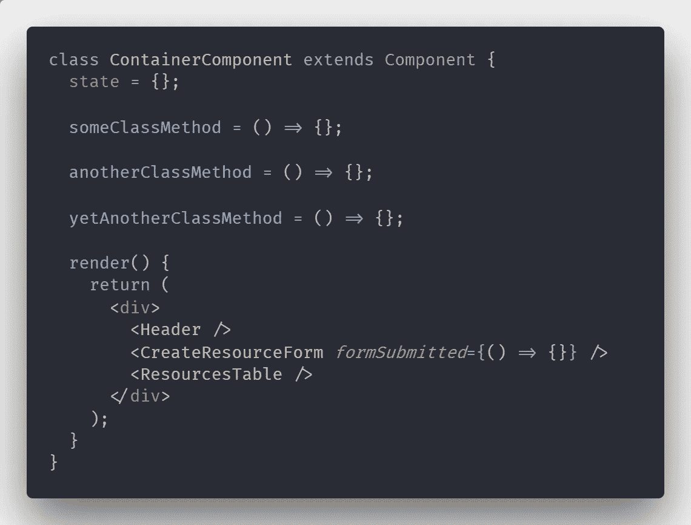
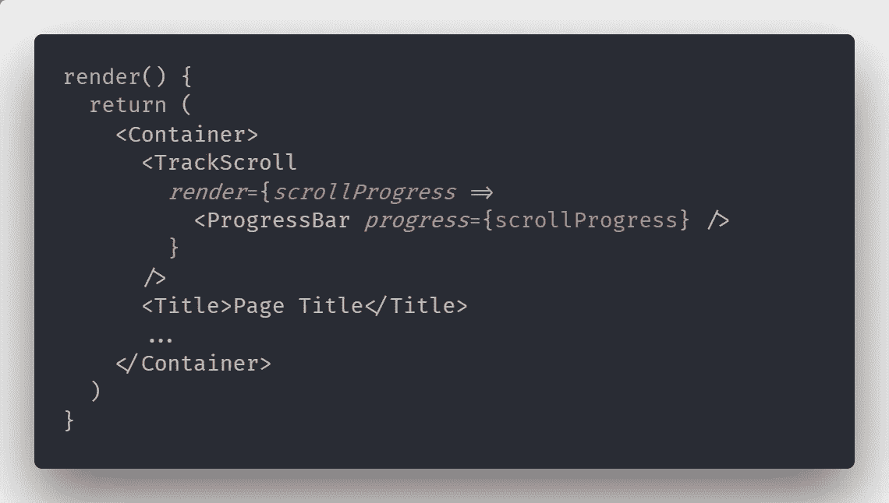

# 经验教训:常见的反应代码气味以及如何避免它们

> 原文：<https://medium.com/hackernoon/lessons-learned-common-react-code-smells-and-how-to-avoid-them-f253eb9696a4>

Photo by Artem Bali from Pexels

代码气味是代码的某些模式和特征，它可能预示或在将来产生更大的问题。换句话说，就是质量有问题的代码。

这里的关键词是**有问题的**。将某些东西识别为代码气味并不意味着应该立即修复它或者它是一个问题——只是意味着应该调查它。这并不意味着某段代码写得不好，只是说它应该被更仔细地检查。

组织、团队和不同的开发人员对特定的模式和习惯有自己的理解。归根结底，某项技术**对你是否有效。**

我在这篇文章中要传达的观点是，为了避免将来出现问题，检查**特定模式**是值得的。但在此之前，让我们先澄清一些术语。

*有个 TL；如果你只想要要点和学到的教训，你可以在文章的最后找到博士。*

# 代码气味与反模式

一个**反模式**是说给定问题的解决方案不够好的外交方式。找到一个反模式意味着我们已经在代码库中发现了一个应该尽快重构的**问题**。

**代码气味**意味着一个设计模式*可能会被*误用或者有机会实现更好的东西。它们更像是一种可能性，而不是事实。

# 重构

当我们发现一点代码味道或者代码中需要改进的地方时，我们称之为“重构 T21”。因为在这篇文章中，我们会多次提到这个词，所以我们需要澄清它的确切含义。

重构是在不改变代码功能的情况下修改代码设计的过程。用更简单的话来说——我们改变了代码的结构，但是我们没有改变它的行为。

但是我们如何在不改变行为的情况下改变它呢？如果我们需要重构一个组件以获得更少的道具，或者将它拆分成多个更小的组件，这算不算行为改变？

是的，改变组件的属性*将会*改变我们调用它的方式。然而，我们的目标是在我们完成**重构**之后，让应用程序以同样的方式工作。如果一个组件负责显示一个过滤器列表，我们把它分成多个组件，我们*仍然*需要在应用程序中有一个过滤器的工作列表。

# 臃肿的部件

在 React 奠定面向组件前端开发的基础之前，我们曾经模仿服务器端语言中使用的 **MVC** 模型。根据框架的不同，曾经有一个包含标记的 HTML **模板**和一个负责为视图提供所需数据的**控制器**文件。

当这种实践转移到 React 应用程序时，它会导致一个主组件的创建。这些组件可以长达 1000 行代码，包含大量的逻辑和标记。

组件达到膨胀状态有不同的方式。遵循拥有页面组件这一过时的想法是其中之一。另一个原因可能是过于在意智能/非智能组件的想法。有时候，在类中插入另一个方法比重构代码更容易。

最终结果是一样的。我们最终得到一个巨大的组件，它充当业务逻辑和商店连接的起点。

*上面的代码片段只是作为一个模糊的例子，一个实际的主组件可以处理一千行或更多的代码。*

## 如何避免？

从技术上讲，我们可以在一个**单一 React 组件**中编写整个应用程序，并在其 render 方法中编写所有标记。当然，我们不喜欢它，因为维护这样的东西是不可能的。同样的逻辑可以应用于在单个组件中编写整个页面的逻辑。

如果你陷入了需要**重构**这样一个组件的境地，你别无选择，只能卷起袖子开始工作。你越早开始从它身上切下来，它就会变得越好。然而，如果你正在做一个新项目，有两种方法可以避免这个问题——良好的计划和自律。

**在**开始在页面上工作之前，**在一张纸上画出**草图，并用矩形标出你的组件。考虑页面不同部分之间可能的交互。根据复杂程度，考虑在页面的不同部分使用多个容器，并使用**页面**组件让它们相互通信。

当我们需要按照我们制定的计划行事时，自律就出现了。虽然偏离蓝图*可能*很吸引人，但为此付出的代价是不可避免的，而且利息很高。从长远来看，花半个小时做正确的事情可以节省几天的重构时间。

当您开始将组件从主页面中分离出来时，您将会看到只与页面的特定部分相关的逻辑。像这样提取几个部分会让容器变得更精简。

# 重复逻辑

谈到重复性，我遵循一个简单的规则。我记不清在哪里读到的了，但是它说如果你需要第三次复制某个东西，那么需要**提取**。

如果只有**一个其他**事件，我给自己一个自由通行证，但是一旦它们变成三个，那么就到了**重构**的时候了。

拥有重复的代码是令人不快的，因为每次你需要做出改变时，你都必须对你的代码库进行一次旅行。无论是业务逻辑还是一些标记，提取它*将*保持我们的理智。

## 如何避免？

在许多组件中结束的逻辑调用一个 [**高阶组件**](https://reactjs.org/docs/higher-order-components.html) 或一个使用 [**渲染属性**](https://reactjs.org/docs/render-props.html) 的组件。最近，我越来越倾向于后者，因为我发现更容易理解它到底公开了什么数据。除了一些非常特殊的情况，任何你可以用一个构建的东西都可以用另一个来构建，所以这更多的是一个你觉得舒服的问题。

这里我们需要谈的是*而不是* **过度工程化**和**过度复杂化**的问题。如果很多地方都需要某个业务逻辑，那么将它转移到一个 *utils.js* 文件中也是很好的。一旦你需要将它与标记或某些特定行为联系起来，那么就可以提升它并使用我们上面提到的模式。

# 支柱钻井

拿[聪明和愚蠢的概念(表象和容器)](/@dan_abramov/smart-and-dumb-components-7ca2f9a7c7d0)组件太多心会导致容器臃肿，但它*会*导致臭名昭著的**道具钻**也一样。

道具钻孔是指穿过道具**多层**组件，以到达需要这些道具的特定组件。由于父节点*不能*将道具直接传递给它的一个孙节点，所以它在向下传递的过程中需要通过其他组件。

问题是，所有这些其他组件实际上不会使用这个道具，它们只会将它传递到更低的级别。这导致代码库中不必要的**信息**和**更紧密耦合**的暴露。更改数据的结构或道具的名称需要在多个地方进行修改。

由于**名称冲突**或者为了**清晰**而重命名组件中的道具是很常见的事情。在支柱钻井链中重复这样做只会让我们感到困惑和沮丧。

## 如何避免？

如果你正在开发一个小的应用程序，而 prop drilling 开始成为你的一个问题，那么使用 [**上下文 API**](https://reactjs.org/docs/context.html) 可能是你最好的解决方案。从 React 16.3 开始，我们可以访问新的和改进的 API，允许我们在深层组件层次结构中共享数据。

如果状态管理和道具演练开始失控，那么在堆栈中添加一个像 [**Redux**](https://redux.js.org/basics/usagewithreact) 或 [**MobX**](https://mobx.js.org/getting-started.html) 这样的库应该可以缓解这个问题。当然，这些都伴随着不可忽视的学习曲线，所以要避免任何仓促的决定。

如果你已经在使用这样的库，考虑添加更多的容器组件。如果您需要一个组件来获取一半的存储，并将其传递给表示性组件，那么可能是时候将层次结构分散一点了。

由于 Context 和我提到的库都有很好的文档，所以在这里没有必要增加一个例子。

# 渲染方法之外的 JSX

我个人感到困惑的是，在一个类组件的**实例方法**中生成了 **JSX** 。查看 render 方法的**返回值**，我们应该能够很好地理解这个组件打印的内容。然而，通过在其他方法中生成标记，我们将很快需要**在组件代码中上下跳动**来理解它所呈现的内容。

如果我们需要将一些标记提取到它自己的方法中，那么这意味着我们希望以某种方式将**关注点**分开。然而，通过使用这种技术，我们将组件进一步绑定到标记上。由于该方法很可能使用状态或道具中的一些东西，我们将增加耦合的级别。

## 如何避免？

如果你发现需要把一些 JSX 移到一个实例方法中，我建议把它移到一个单独的组件中。在 OOP 语言中，将一些功能放在一个单独的方法中的想法意味着为了**可重用性**或逻辑目的，需要将它**抽象**。在 React 的上下文中，上述思想的等价物是将一些逻辑提取到它自己的组件中。

这里的反方论点是，通过在 JSX 中添加一个组件而不是一个方法调用，我们仍然不能确切地掌握它做了什么。虽然这是真的，但我们将清楚地看到组件被接受的属性，这是对其功能的强烈暗示。至少我们会知道它需要什么数据，调用什么回调。

# 深压痕

当我们编写**深度嵌套的**标记时，我们牺牲了可读性，强迫自己记住我们在代码中的位置。嵌套的 **if** 语句、连锁的**三元**操作、**循环**或深度 **JSX** 标记是导致缩进增加的常见原因。虽然不一定是坏的或有问题的，但是使用深度嵌套的代码经常会让我们迷失在文件中的实际位置。

公平地说，无论我使用什么语言或框架，这都是我试图避免的事情。在我看来，简单的线性代码更容易理解，也更悦目。

## 如何避免？

如果我们想降低嵌套层次，我们可以通过增加抽象层次来实现。

我们可以采取的第一种方法是将嵌套的功能提取到一个单独的组件中。我的推理是缩进越高，标记对于 **UI** 的特定部分就越具体。如果我们需要提供关于页面某一部分的详细信息，那么我们应该把它放在一个单独的文件中，让它在那里呼吸。

类方法内部的缩进量也会增加得很快。代码风格的改变可以很容易地缓解这个问题。只需删除不必要的 **else** 语句，并用 **async/await** 拉平长承诺链，就能产生巨大的影响。

# 缺乏明确的标准

JavaScript 生态系统是动态的。不同的社区成员持有不同的观点，他们倾向于坚持自己的观点。

通常，开发人员带着不同的编码风格和习惯加入团队。虽然多样性有时会带来更好的解决方案，但这些文化冲突通常会导致代码质量低下。不同的**范例**、**编码风格**和**格式**偏好使得我们的代码库看起来像是科幻电影**中的大都市。**

这通常对开发人员来说是最大的压力，因为我们将不得不根据我们目前正在开发的应用程序的部分来改变思维模式。不坚持特定的编码标准和最佳实践会导致沮丧、紧张和不必要的时间花在讨论分号是否必要上。

## 如何避免？

无论你是一个小型 web 应用程序的单独开发者还是一个更大团队的一部分，坚持一套实践*将对你的**生产力**和**代码质量**产生最大的影响。重要的是要明白没有一个代码标准会让团队中的每个人都满意。随便挑个东西，然后跟着它走。*

[**更漂亮**](https://github.com/prettier/prettier) 是一个优秀的代码格式化工具，你可以在你的编辑器中运行或者作为一个提交钩子。它没有给你太多的配置选项，这实际上是好的——更少的事情要争。它也可以与样式指南一起使用，如 [**标准样式**](https://standardjs.com/) 或 AirBnB 使用的样式指南。

# TL；速度三角形定位法(dead reckoning)

*   代码气味不是确定的问题。它们是一种建议，表示某事可以做得更好。
*   必要时提高抽象级别可以使组件代码更加清晰。
*   不要达到重构负担太重的状态。代码需要定期修改——经常重构。
*   糟糕的编码风格和实践有时会导致比我们误用的设计模式更多的问题。

# 时事通讯

嘿，我正在经营一个小的时事通讯，在里面我分享关于软件开发的随机想法、思考和见解。没有教程，没有广告。只是一些我发现值得思考的事情每隔几周就会发送到你的收件箱。如果这听起来对你有吸引力，你可以在这里订阅**。**

# **鼓掌并分享**

**如果这篇文章的内容对你有帮助，我会很感激你按住鼓掌按钮一会儿。这样，它将触及并帮助更多的人。与可能会觉得有用的朋友和同事分享，并将任何反馈发送给我！**