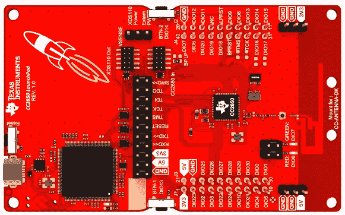
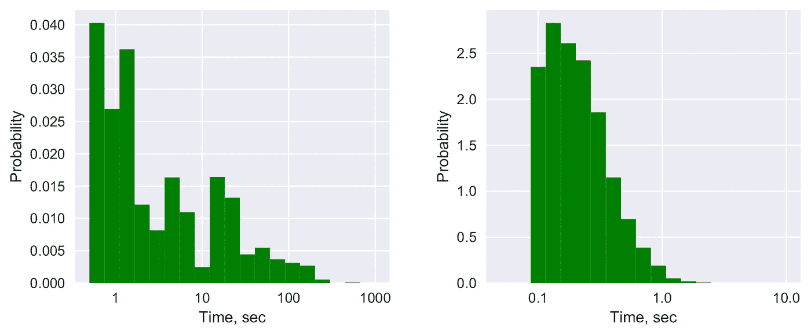

# 在物联网设备上评估 IOTA 的经验教训

> 原文：<https://medium.com/hackernoon/lessons-learned-from-evaluating-iota-on-internet-of-things-devices-a44575e606de>

关于 [IOTA](https://hackernoon.com/tagged/iota) 公开可用的定量结果很少。基于这一事实，我们在两台不同的物联网设备和两台现代桌面和服务器计算机上试验了 IOTA。我们发现，尽管理论上 Tangle 具有可扩展性，但实际的 IOTA 协议具有相对较高的能耗。相对于许多物联网设备的有限能力，工作证明和交易签名操作在计算上很复杂，并且在能量有限/电池供电的设备上可能不切实际。

*注:本文使用了研究论文* [*分布式账本技术和物联网:可行性研究*](http://user.it.uu.se/~atiel485/iota-iot-2018.pdf) *的结果，该论文在第一届区块链支持的网络传感器系统(BlockSys)研讨会上发表。*

# 背景

如果你正在阅读这篇文章，你可能知道 [IOTA 是一种加密货币](https://www.iota.org/)，旨在适用于物联网应用。2018 年夏天，我开始意识到，尽管大肆宣传，但没有关于 IOTA 运营能耗的公开数据，也没有关于 IOTA 在物联网设备上的可行性的公开研究。同时，IOTA 安全假设需要大量活跃的物联网设备。所以，“它在物联网设备上真的有效吗？”是应该多问的关键问题。

IOTA 中的分类帐由大量分发的工作证明形式保护。分类帐的状态由所谓的全节点维护。物联网设备被设想为光节点；他们需要连接到完整的节点，创建和签署事务，并以分布式方式计算工作证明。IOTA 的设计依赖于*数量上的安全性* —这种想法认为，由于物联网设备的数量庞大，物联网设备的计算能力超过恶意参与者可能实际获得的任何计算资源。

加密货币 IOTA 的当前状态达不到这一愿景——交易也由集中式协调器节点来验证。如果 IOTA 想要过渡到完全分散的操作，它需要移除协调器组件。这里的关键问题是“仅靠工作证明就能保证网络安全吗？”。更具体地说，“物联网设备能否提供足够的分布式工作证明来抵御集中式攻击？”

# 物联网设备和工作证明

物联网设备具有广泛的功能。这些设备中的一些与典型的台式 PC 一样强大(甚至更强大)。然而，他们是例外。愿景指出“预计到 2025 年，联网设备的数量将达到 750 亿台。”思科承诺到 2020 年[超过 500 亿台联网设备](https://www.huffingtonpost.com/entry/cisco-enterprises-are-leading-the-internet-of-things_us_59a41fcee4b0a62d0987b0c6)，爱立信:[到 2022 年](https://www.ericsson.com/en/press-releases/2016/11/5g-subscriptions-to-reach-half-a-billion-in-2022-ericsson-mobility-report)超过 180 亿台物联网设备。然而，**其中绝大多数将是低功耗设备**。例如，当前运行的低功耗嵌入式微控制器的数量比 Raspberry Pi 级物联网设备的数量多几个数量级。

**数十亿台互联设备将全部计算能力贡献给 IOTA 的工作验证计算是极不可能的。**

# 标称与可用计算能力

许多物联网设备依靠电池运行，或者电源有限。这些设备不能一直使用它们名义上的计算资源，所以它们通常执行某种任务循环。如果以 1%的占空比运行，标称计算能力为*x*的设备只有 0.01 倍*的可用计算能力。一千个占空比为 0.1%的器件的可用计算能力仅相当于一个占空比为 100%的等效器件。更具体地说，单个服务器本身的功能是普通物联网设备的 1000 倍，可以有效地产生与 100 万个工作占空比为 0.1%的“普通”物联网设备一样多的工作验证计算。*

这些物联网设备的限制因素不是它们标称的计算能力；这是他们所需的电池寿命。重要的不是每秒几百万次的运算，而是这些运算所需的能量。

不依赖电池的物联网设备呢？即使这些设备通常也不像服务器和采矿场那样容易和廉价地获得能源。后两者受益于规模经济，而物联网设备通常高度分布在空间中，没有附近的电源，也没有针对工作验证计算进行优化的 CPU。

# 实验装置

我们观察了两种不同功率等级的两种物联网设备，并将它们与两台现代计算机进行了比较:

*   德州仪器 CC2650 LaunchPad (48 MHz，单核，只有 20 kB 的 RAM 和 128 kB 的程序存储器)
*   树莓 Pi 型号 3 (1200 MHz，4 核)
*   英特尔酷睿 i7–6700 台式机(3400 MHz，8 核)
*   采用 Nvidia Quadro K620 的英特尔至强 E5–2623 服务器(3000 MHz，16 核)。

Texas Instruments CC2650 LaunchPad

在如此多样化的设备上测量能耗是一件不简单的事情。此外，直接测量平台消耗的能量还包括它们的外围组件，这对于本文并不重要——我们主要对 CPU 消耗的能量感兴趣。因此，我们采用的方法是测量执行 IOTA 操作所需的 CPU 时间，然后将时间推断为能耗。

# 工作证明所需的时间和精力

Time required to complete a single PoW operation on Raspberry Pi Model 3, Intel Core i7 desktop computer, and a Nvidia Quadro GPU. The green bars show average results, the small black bars — standard deviation. Log scale on y axis.

我们使用 IOTA 基金会([https://github.com/iotaledger/ccurl](https://github.com/iotaledger/ccurl))的 CCurl 实现。它是用 C 实现的；然而，它仍然太重，无法在 TI LaunchPad 上运行——核心算法使用了太多的 RAM。我们在剩下的三个平台上执行它。

结果显示了以秒为单位的所需时间(左边的图表)；将其外推至能源，我们得到树莓 Pi 的 54.9 焦耳，酷睿 i7 的 233.2 焦耳，以及 Nvidia GPU 的 93.5 焦耳。

TI LauchPad 的计算能力比 Raspberry Pi 低 10-100 倍，具体取决于具体的工作负载。即使 PoW 代码可以在 TI LauchPad 上运行，计算单个交易的 PoW 也需要一个小时左右。这些设备也可能在最多一天或几周内耗尽电池，这取决于电池的容量(分别为 100 mAh 至 2700 mAh)。

Raspberry Pi 本身能够执行一些 PoW，但它每天只能执行 1000 个事务的 PoW，假设它为该任务花费 100%的 CPU 资源——因此，很明显，它也不能作为主要的 PoW 中心。

酷睿 i7 服务器仅比 Pi 快 20 倍左右，因此，20 个 Pi 的网络在理论上可以匹配单核酷睿 i7 服务器的计算能力。尽管如此，圆周率的能源消耗还是会高出几倍。

还要注意，历史上 IOTA 缠结经常在第一次尝试中未能确认有效的事务，需要用户“重新附加”它们，在某些情况下需要多次。每个“重新附加”操作都需要为每个重新附加的事务提供一份全新的工作证明。

# 外包工作证明

还有一个潜在的好处:IOTA 协议允许将工作证明计算外包到外部设备上。该功能允许通过物联网设备和专用服务器之间的协作来改进系统设计。前者有动力去做工作证明，后者有计算资源和能量来进行有效的计算。然而，该方案只有在以下情况下才有效:

1.  物联网设备可以有效地用作 IOTA 钱包，即可以创建和签署 IOTA 交易。
2.  物联网设备和工作证明设备之间的通信开销较低。

A light-weight architecture where the PoW computation is outsourced to an IoT proxy node.

# 交易签名和无线通信所需的时间和精力

Time required to sign a single transaction on Texas Instruments CC2650, Raspberry Pi Model 3, Intel Core i7 desktop computer, and Intel Xeon server. The green bars show average results, the small black bars — standard deviation. Log scale on y axis.

我们使用了 [IOTA Ledger Nano S](https://github.com/IOTA-Ledger/blue-app-iota) wallet 到[conti-NG](http://contiki-ng.org/)操作系统的一个端口(参见[https://github . com/atiselsts/conti-NG/tree/IOTA/examples/IOTA/value-transaction](https://github.com/atiselsts/contiki-ng/tree/iota/examples/iota/value-transaction))。继续进行的移植只保留了必要的算法，以适应 TI LaunchPad 有限的 RAM 和环境。

结果(左边)显示，在 TI LaunchPad 上平均签一单交易需要 7.7 秒，在这个平台上消耗 74 mJ(毫焦耳)。相比之下，它在 Raspberry Pi 上需要大约 82 兆焦耳，在 Core i7 服务器上需要 28 兆焦耳，在老一代 Xeon 服务器上需要 31 兆焦耳。

相比之下，使用 TI LaunchPad (BLE 和 IEEE 802.15.4)上可用的几种低功率无线协议之一，只需要几个 mJ 就可以传输签名的交易。可以通过仅将事务的必要部分传输到代理设备来进一步优化，然后代理设备填充 IOTA 事务的数据结构的其余字段。

Distribution of time required to perform a single Proof-of-Work operation (left graph) and a single signing operation (right graph). Results on Raspberry Pi Model 3\. Log scale on x axis. The distributions show high variability for both operations,

PoW 和事务签名都有很大的时间差异(见上图)，使得难以量化完成 IOTA 操作所需的最小能量预算。

这一切意味着什么？我们在论文中得出结论:

> 鉴于能源使用结果，很明显，在电池供电的设备上，如果没有硬件加速的加密技术，PoW 和交易签名都是不切实际的。更强大的设备如 Raspberry Pi 能够完成这两种操作，但即时事务超出了它们的资源范围。

总的来说，IOTA 感觉不像是为轻量级物联网应用而设计的。可以通过用更有效的东西来部分替换 IOTA 参考协议来优化通信开销，但是即使实现钱包功能(即，能够创建和签署交易)在计算上也是昂贵的，并且可能需要许多秒来完成。考虑具有小电池(比如 100 mAh)的物联网设备，该设备每分钟产生一个 IOTA“包”，或者具有两个签名事务，或者具有两个签名消息片段的单个签名事务。这样的设备在电池耗尽之前将持续不到 6 天——这是在不切实际的假设下，即除了签署 IOTA 交易之外，它不做任何其他事情！

# 讨论

对于 IOTA 不适合大多数物联网设备的说法，有两种潜在的反对意见。

**反对意见 1。*IOTA 哈希函数可以进行硬件加速，这些加速器可能会在物联网设备上变得司空见惯。***

尚不清楚这一发展是否会显著改变总计算能力的平衡。如果由于某种经济激励，Keccak (SHA-3)加速在物联网设备上变得司空见惯，那么同样的经济激励也可能适用于服务器。因此，下一代服务器和下一代物联网设备都能够以更低的能耗更快地供电，从而保持整体平衡不变。这种反对充其量降低了论点的确定性，但并没有反驳它。

**反对意见 2。*当前设备的结果不具有代表性；下一代物联网设备的 CPU 可能能够进行比当前数量级更多的计算操作。***

这不太可能对电池寿命产生很大影响，除非我们找到以更节能的方式进行计算的新技术(除了在硬件中实现算法，这一点上文已经讨论过)。

相反，从电池供电设备到能量收集设备的大规模过渡目前正在进行中。只有极少量的能量可以在物联网设备上以实用的方式积累(这些设备大多位于室内，大多成本低，大多体积小)。从周围环境(如 WiFi 信号、振动、热耦合等)获取能量的设备。)通常比由电池供电的设备具有更有限的能量预算。

综上所述，节能需求是物联网的基本要素之一；没有明显的方法可以绕过它。至少在近期[未来](https://hackernoon.com/tagged/future)，大多数物联网设备都将受困于低能源预算，因此它们的计算能力将仍然有限。因此，在物联网设备上运行任何种类的电源都是值得怀疑的。