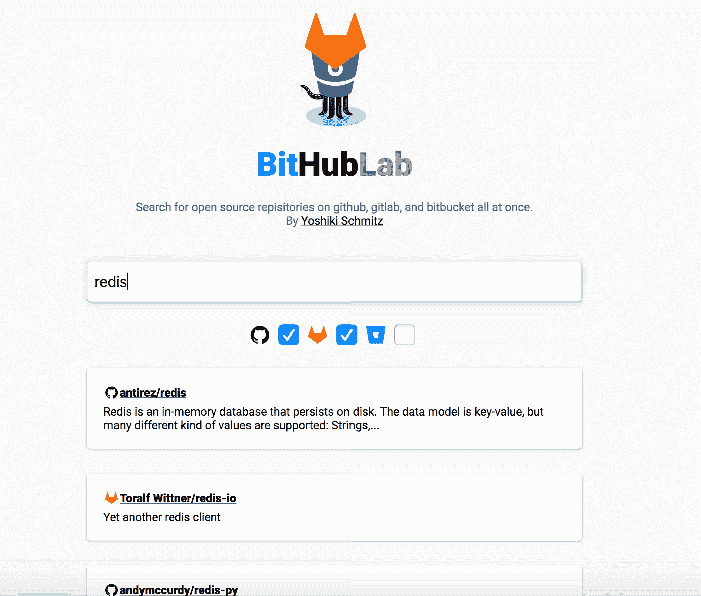
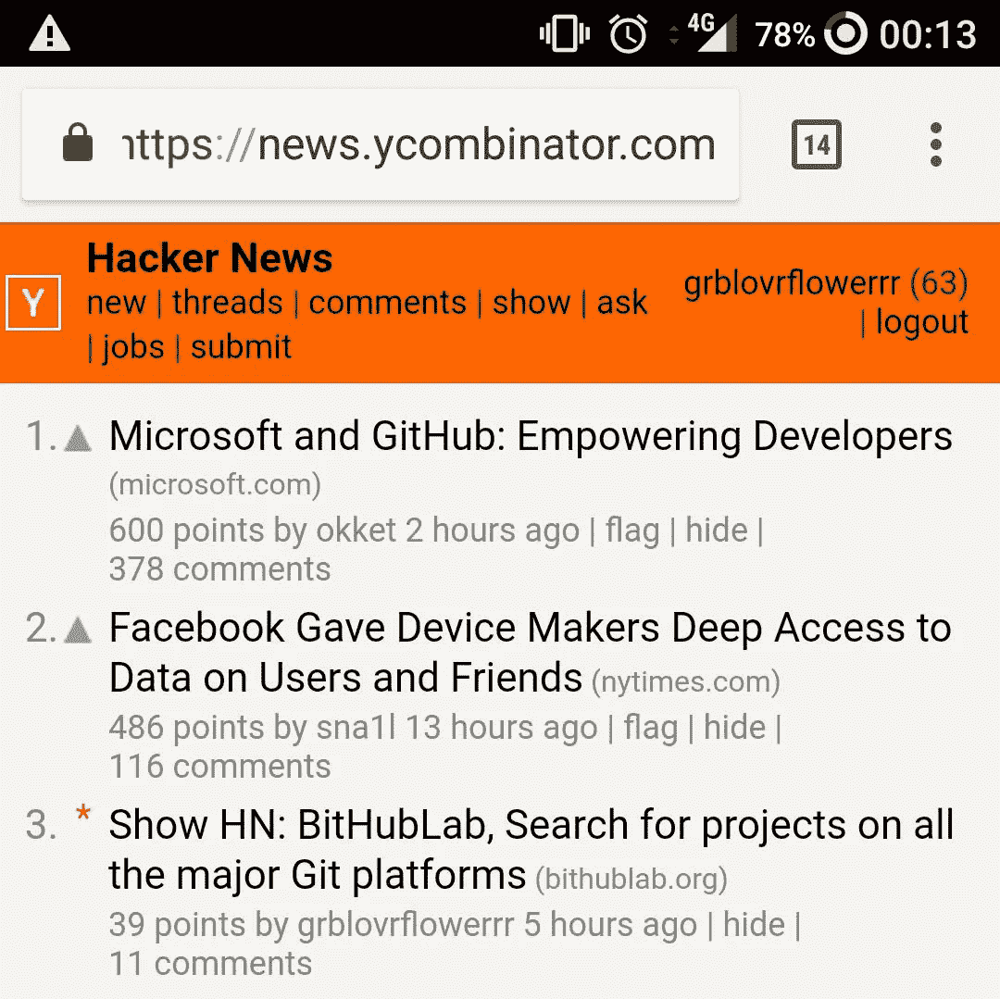
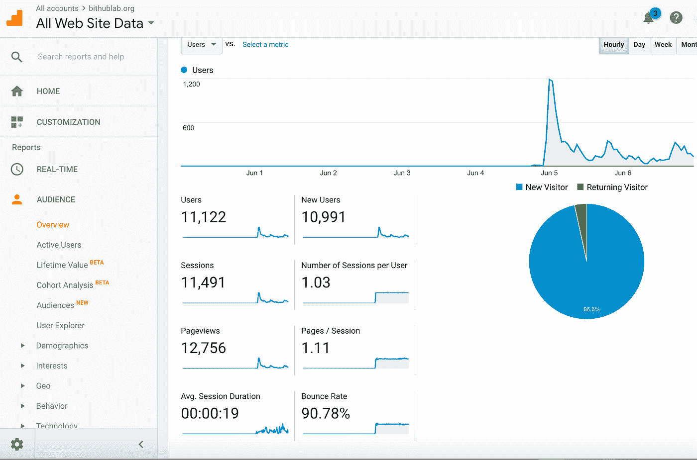
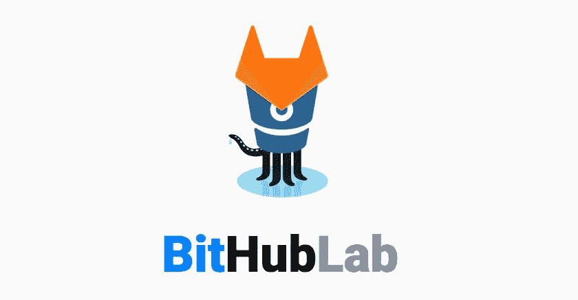

# 让 Bithublab 登上黑客新闻头版的经验教训

> 原文：<https://medium.com/hackernoon/lessons-learned-from-getting-bithublab-to-the-front-page-of-hacker-news-1bc3fa7074dd>

本周早些时候，我创建了 [Bithublab](https://bithublab.org) ，这是一个在 3 个最流行的 git 托管服务上搜索开源 git 库的地方:Github、Gitlab 和 Bitbucket。我产生这个想法是因为微软收购 Github 的消息，促使许多用户转移到 Gitlab，这让我产生了这样的想法:

*   每当我寻找一个软件库或软件包来使用或参考时，我首先去 Github 并使用他们的搜索功能，数百万其他开发人员也是如此。
*   如果有大量的人迁移到 Gitlab，那么现在我必须在两个地方搜索！
*   为了让生活更容易，应该有一个地方，我可以搜索所有的回复。

那天晚上晚些时候，我拼凑了一个非常基本的工作 MVP，它只是抓取每个网站的搜索页面，并将结果聚集在一个地方:

太平洋时间凌晨 3 点左右，我把它贴在了《黑客新闻》上，几个小时后，它上了头版。在巅峰时期，我在第二名的位置上呆了几个小时，得到了 316 分和 46 条评论，刚好在微软关于 Github 收购的更重要的新闻稿之后！

我总共有来自 124 个国家的 **11K 次独立访问**，产生了 12K 的页面浏览量。Twitter 上的活动也相当不错，带来了 1586 次访问，一名用户分享 bithublab 的推文获得了 461 次赞和 253 次转发。

总的来说，48 小时内 11K 的访问量对于一个真正的互联网企业来说并不是一个疯狂的流量，但对于一个下午的项目来说，我认为这已经不错了。这些是我从登上《HN》头版学到的经验。我认为这些适用于任何副业，不管你认为它会有多受欢迎:

## 倾向于行动

如果你想出了一个主意，把一些基本的东西扔在一起，然后把它运出去！这需要大约 4 个小时的编码和大约 1 个小时的部署。如果我仔细思考了所有可能的 UX 含义，或者试图通过抓取世界上所有的 git 库来创建一个真正的搜索引擎，我就不会完成这件事。相反，我只是使用现有的 API，并在前端集成结果。它甚至没有分页。不优雅，但它表达了这个想法。

我认为对于那些时间紧张的人来说，这是一个相当令人鼓舞的想法。即使你有一份全职工作和很多承诺，如果你能在一周内抽出几个小时，你就能做出一些可能让很多人高兴的事情。

## 工作迅速，对新闻敏感

回应新闻是有时间敏感性的，所以动作要快。几天后，没有人会谈论 Github 的收购，集体注意力将被其他新闻/争议占据。我也不是唯一一个利用这一宣布的人，例如 Gitlab 迅速组织了一场名为 [#movingtogitlab 的营销活动。](https://about.gitlab.com/2018/06/03/movingtogitlab/)作为一个推论，在每一个重大的[技术](https://hackernoon.com/tagged/technology)公告/争议的背后，很可能有一些未出生的病毒现象准备吸引一些集体的注意力，所以当你的竞争对手或主要行业参与者搅动社交媒体时，要保持警惕并创造性地思考。

## 让它有趣

奇思妙想大卖。很多人评论了我为 Bithublab 设计的有趣的 logo。事实上，我只是在所有社交媒体网站上发布后才添加的，但我认为这是我登上首页的重要原因。我猜这属于品牌，但最好不要想太多。

## 把它变漂亮

另一方面，确保它看起来不错。我花了大约 10 分钟在 CSS 上，给它一个更好的字体，添加阴影，对齐等等。我认为这对推销这个想法很有帮助。

## 规划你的 CTA

弄清楚你如何能从曝光中获益，并确保你已经做好了实现它的准备。例如，作为一个经常创建像 Bithublab 这样的兼职项目的人，最好是在我的 Twitter 个人资料上获得电子邮件注册或更多关注者。然而，我最初链接到了[我的个人网站](https://yschmitz.com)，它确实链接到了我的 Twitter，但是我发现关注者的转化率很低。回想起来，我会添加一个电子邮件表单。当有疑问时，我认为最好收集电子邮件。

## 准备好交通

确保你能应付交通。例如，过早优化不是坏事。总的来说，12K 的页面浏览量并不算多，但是如果我为了权宜之计做了一些非常错误的事情，比如部署一个大约 5 美元/米的 DO droplet，就会出现一些峰值，这可能会导致问题。我的后端服务(基本上是 bitbucket 和 gitlab APIs 的代理)在 [Google](https://hackernoon.com/tagged/google) app engine 上，它以最少的配置进行了很好的扩展，在没有任何干预的情况下从 2 个实例扩展到 6 个实例。至少设置好 Cloudflare，这样您就可以从他们的缓存层中获益。

感谢阅读！如果你想知道我的下一个副业项目何时启动，[在 Twitter 上关注我](https://twitter.com/yoshikischmitz)或者注册我的[产品发布邮件列表](http://eepurl.com/dxqkwD)。