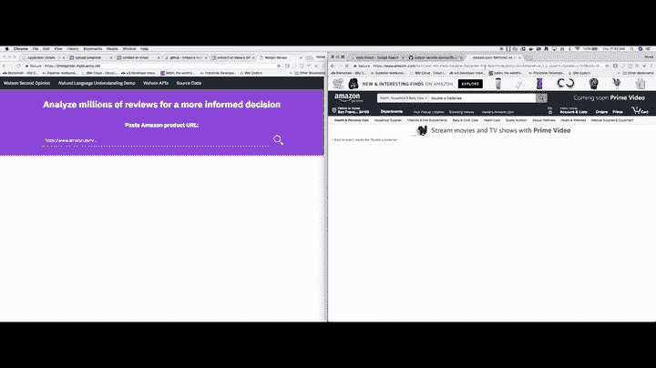
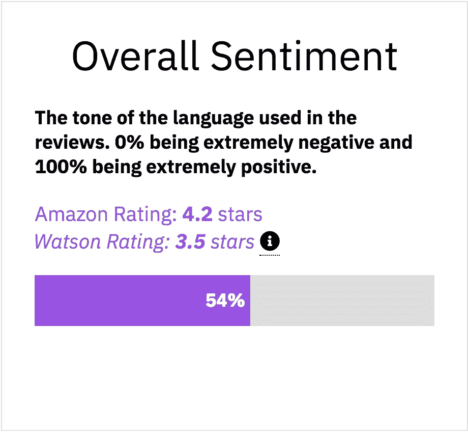

# 从我的第一个(半)生产应用程序中获得的经验

> 原文：<https://medium.com/hackernoon/lessons-learned-from-my-first-semi-production-application-4463eb656a1d>

所以是的。我知道。有一段时间了(我上一篇博客是在 4 月 17 日)。我对此很不高兴。

> 人们问我，“你停止写博客了吗？”“不！我一直在做不同的事情。”我告诉他们。

但是现在，比以往任何时候都更是反思的好时机。那么，就这么办吧。让我和你们分享一下过去几个月我在 IBM 的[所做的工作。](https://hackernoon.com/tagged/ibm)

所以我不会用无聊的日常细节来烦你，但是我做过的最令人兴奋的项目是最近在这里发布的[代码模式](https://developer.ibm.com/code/patterns/analyze-product-reviews-and-generate-a-shopping-guide/)*。*

**

*A quick demo of my code pattern. Try it out yourself [here](https://2ndopinion.mybluemix.net/).*

# *代码模式？*

*嗯，那么*码型*？那是什么？好吧，让我给你解释一下。IBM 是一家大型科技公司(美国第六大私人雇主，只是客观地看一下)。IBM 有一个非常大的产品目录。我做了一点研究，仅 IBM 云目录就有 170 多种产品。这还不包括我们的硬件(存储/大型机)。因此，如果我用 11 个词来描述什么是*代码模式*，它们将是:*

> *利用 IBM 技术解决复杂编程问题的指南。*

*您可能会想，*好吧，如果我不想使用 IBM 技术呢？*嗯，那也行！有很多代码模式不一定关注 IBM [技术](https://hackernoon.com/tagged/technology)，而是简单地使用 IBM Cloud 作为一种部署方式。[这个](https://github.com/IBM/ios-mapkit-indoor-map?cm_sp=Developer-_-create-dynamic-indoor-map-ios-_-Get-%20the-code)重点是 iOS 的 MapKit。好了，现在你知道什么是代码模式了，你为什么要关心呢？*

**

# *为什么是代码模式？*

*代码模式在学习一项新技术或寻找应用创意的灵感时很有用。已经有这么多很棒的解决方案，所以只需寻找你最喜欢的技术领域，然后寻找一些现有的解决方案并试用该应用程序，这是了解特定技术更多信息的好方法。不仅如此，你还可以找到代码的 Github repo，做贡献，和开发者交流等等。*

# *沃森第二意见*

*例如，我的应用程序[https://2ndopinion.mybluemix.net/](https://2ndopinion.mybluemix.net/)利用[沃森自然语言理解](https://www.ibm.com/watson/developercloud/natural-language-understanding/api/v1/)让用户更好地理解亚马逊上某个产品的评论。这款应用的理念是，我们许多在线购物者都将评论作为决定购买产品的一种方式。如果评论是假的或不准确的怎么办？第二意见试图通过使用[人工智能](https://en.wikipedia.org/wiki/Artificial_intelligence)来揭示评论中所用语言的细微差别，从而改进用户选择的 1-5 星评级系统。例如，如果用户给产品打了 5 星，但在给了 5 星评价后实际上抱怨了产品的某些部分，Watson 可以理解这一点，并给它一个低于 5 星的评级。沃森只是简单地从评论中吸收文本，并对其进行处理。它不关心用户给产品的星级。之后，它输出一个从(负一到正一)-1–1 的评分(称为情绪得分)。然后，该应用程序将-1–1 分数映射到一个百分比，-1 表示 0%，1 表示 100%。这是你在下面看到的紫色条形图。最后，该应用程序将百分比映射到 1-5 的范围内。这是你在下面看到的**沃森评级**。最终,“第二意见”为用户提供了一种将人工智能评分与亚马逊使用的 5 星评分进行对比的方式。*

**

*In this instance, you can see that the Overall Sentiment is 54%, (slightly positive), which maps to 3.5 stars. This means that although the reviewers selected high star ratings, the language they used in their reviews was more negative than the amount of stars they picked.*

# *我从进入(半)生产的第一个项目中学到了什么*

*我从未从事过已经投入生产的代码，代码模式是我将代码推向生产的最接近的方式。虽然我不会真的认为代码模式是“产品化的”,但是它是在正确的轨道上。如果有更多的人力和时间，它肯定可以投入生产。让我来概括一下我从这个项目中学到的关键点。*

**

*Too much complexity results in anxiety and frustration.*

1.  ***保持需求简单**。不知何故，这一课花了我一年多的时间来学习——例如，几周前在一个不同的代码模式上工作时，在会议期间，我非常兴奋地接受了越来越多的复杂性。一直以来，我们甚至没有一个 API 可以真正有效地执行所有需要的功能。而且，我们项目的时间非常紧迫。我们只有大约一个月的时间从想法到生产代码。我喜欢用[最小可行产品](https://en.wikipedia.org/wiki/Minimum_viable_product)范式来解释这一点。开发 **one** 功能，该功能将提供应用程序 80%的功能，并不断简化，直到你有了可用的东西。最初，在我的沃森第二意见应用程序中，我们收集了该产品的所有评论(有些产品有 10，000 多条评论),并将其输入沃森 NLU。那只是普通的老一套花了太多时间。当然，结果更准确一些，但是让用户盯着旋转器看 10 多秒的额外计算时间是不值得的。现在，我只是从评论中抽取一个样本(只有 200 条)。当然，也许我们得不到准确的结果，但是性能和没有 bug 确实是值得的。此外，由于代码模式的范围是提供一个解决方案的路径，而不是完全解决问题，这个想法对于这个项目的范围是有意义的。*
2.  ***DevOps 辛苦了。**设置 CI/CD 和部署管道需要时间。我遇到了我的应用程序依赖的一些包的安全问题，这些问题花了几天时间才解决——我在 StackOverflow 上发布了我的解决方案[,并且已经能够帮助其他开发人员解决这个问题，但是我从来没有想到一些我甚至没有安装的包会引入一个花了几天时间才解决的错误。仅仅让应用程序在本地按预期工作，真的只是这场战斗的一小部分。](https://stackoverflow.com/questions/50053991/github-potential-security-vulnerability-error-for-hoek-node-module/50770060#50770060)*
3.  *不要害怕重新开始。在项目期间，代码多次变得如此复杂，以至于我们回避了我们要解决的真正问题——如何使用人工智能来增强用户在亚马逊上的购物决策。不仅如此，新代码还打破了旧代码。这并没有解决问题。我最终所做的是抓取所有的后端逻辑，重新开始，并且只编写了项目第一遍中使用的大约 30%的代码。这个项目更容易管理，更有趣，而且错误更少。*

**

*Write things down.*

***4。做完之后再反思。**找出哪些有效，哪些无效。在完成第二个意见模式之后，我开始着手另一个代码模式，我还没有准备好继续前进。学习和理解提高您的编码能力所需的过程的一个很好的方法是对您的项目进行反思。简单地思考什么可行，什么不可行，这与写或写关键要点是不同的。就像想做某事不同于告诉别人你正在做某事一样，把事情写下来也是一样。**写博客让你有责任感。考虑到这一点，我觉得已经准备好开始我的下一个代码模式了。***

> *感谢阅读。我知道我的博客已经过时了。但是只有一种方法可以把事情做好——那就是做事。所以我在这里，写下我的想法，并向世界开放。回到正轨，如果你愿意的话。如果你喜欢这个，按住那个👏🏼按钮，如果你没有，评论并告诉我，它吸，我想知道任何一种方式！Horea 星巴克出来了。*